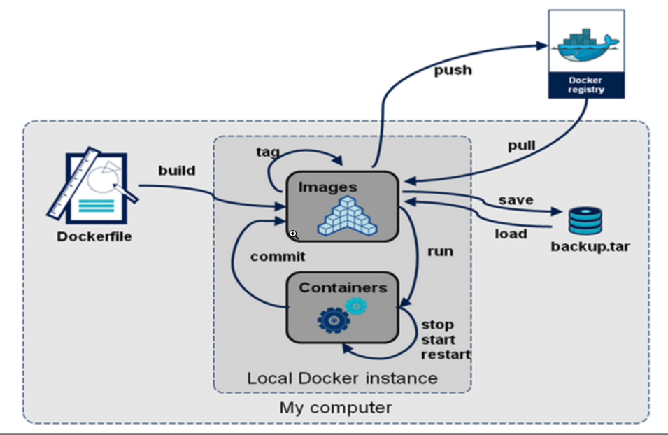
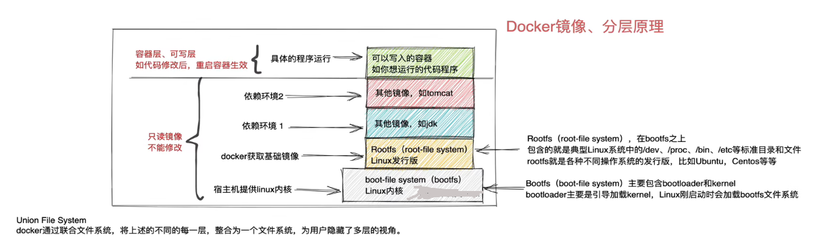

# Docker 

Docker 基于 Golang 开发，基于 Linux 内核的 Cgroups、NameSpace，以及 Union FS 等技术，`对进程进行封装隔离，属于 OS 层面的虚拟化技术`

由于隔离的进行独立于宿主及和其他隔离的进程，也被称为`容器`

Docker 被定义为`开源的容器引擎`,可以方便地对容器进行管理(eg：对镜像打包封装，引入 Docker Registry 对镜像统一管理)

`利用 Docker 可以实现开发、测试、生产环境的部署一致性`

## 容器 VS 虚拟机

- 传统虚拟机

虚拟机是*虚拟出一套硬件*，在其上运行一个完成的 OS,例如用 KVM,执行系统镜像，然后装系统，最终再在该系统上运行所需的 APP

KVM 创建虚拟机时，指定较少的 CPU,内存，硬盘等资源，虚拟机性能较低

 

- 容器

容器内的 APP 直接运行在宿主机的内核上，容器内没有自己的内核，也没有对硬件进行虚拟，因此容器比虚拟机更轻巧

 

### 容器对比虚拟机的优势

1. 容器能够提供宿主机的性能，而 KVM 虚拟机是分配宿主机硬件资源，性能较弱
2. 启动 KVM 虚拟机，需要一个完整的开机流程。而启动一个容器只需要 1S
3. KVM 需要 CPU 的虚拟化支持，而容器不需要


## Docker 引擎

Docker Engine 是 C/S 架构

 

Docker的组成如下：

 

## Docker 核心组件

- image 镜像，构造容器(APP 运行需要的环境，会打包为镜像文件)
- Container 容器
- Dockerhub 镜像仓库，保存镜像文件，提供上传，下载镜像
- Dockerfile 脚本文件，将需要部署项目的操作，写为 Dockerfile(脚本)，且 Dockerfile 还能构建出镜像文件

### images

镜像是一个只读模板，用于创建容器，也可以通过 Dockerfile 描述镜像的内容

镜像的概念类似于 OOP 中的 class,从一个基类开始(基础镜像 Base Image)

构建容器的过程，就是运行镜像、生成容器实例

### Dockerfile

Docker 精细那个的描述文件是 Dockerfile，包含了如下的命令

- FROM 定义基础镜像
- MAINTAINER 作者
- RUN 运行 Linux 命令
- ADD 添加文件/目录
- ENV 环境变量
- CMD 运行进程

### 创建容器的过程

1. 获取镜像，如 `docker pull centos`,从镜像仓库拉取
2. 使用镜像创建容器
3. 分配文件系统，挂载一个读写层，在读写层加载镜像 
4. 分配网络/网桥接口，创建一个网络接口，让容器和宿主机通信
5. 容器获取 IP 地址
6. 执行容器命令 eg：/bin/bash
7. 反馈容器启动结果


## Docker 生命周期

Docker 的核心要素：`image`，`container`

 


 


## Docker 镜像原理

- 一个完整的 Linux OS 应该是什么样子？
    * 具有内核，能提 OS 的基本功能(和硬件交互，eg:磁盘读写，网络管理...)
    * 某个发行版，作用是提供软件功能，eg: apt,yum...

因此，Linux 内核+某个发行版，组成了一个系统。那么是否有一个办法，可以灵活的替换发行版？达到使用不同系统的目的(`使用宿主机的内核，发行版自由替换`)。

ps:`一个完整的 Docker 镜像可以创建出 docker 容器的运行`(eg: 一个 centos TAG:latest 的镜像文件，我们本地 pull 来的是 centOS 这个发行版。`这个镜像是不包含 Linux 内核的)`

docker 的架构，`镜像就是一个 发行版 的作用`，需要准备好一个 Linux 内核，然后`上层使用不同的发行版，这样就可以自己的使用各种版本系统，兼容多种环境`

Docker 实现了这个功能，技术手段就是 `docker images`

### 用 docker 切换不同发行版

用 docker 切换不同发行版，内核使用的都是*宿主机的内核* 

```sh
#先查看本地的镜像
> sudo docker images
REPOSITORY   TAG       IMAGE ID       CREATED         SIZE
nginx        latest    448a08f1d2f9   6 days ago      142MB
redis        latest    116cad43b6af   6 days ago      117MB
ubuntu       latest    6b7dfa7e8fdb   5 months ago    77.8MB
centos       latest    5d0da3dc9764   20 months ago   231MB

#切换到 centOS 镜像下
> sudo docker run -it 5d0da3dc9764 bash
[root@7596e4a12dad /]#
#参数解释 -i 交互式
#         -t 打开 Terminal
#         bash 运行 bash

#查看容器内的发行版本
[root@7596e4a12dad /]# cat /etc/redhat-release
CentOS Linux release 8.4.2105
[root@7596e4a12dad /]# ls
bin  etc   lib    lost+found  mnt  proc  run   srv  tmp  var
dev  home  lib64  media       opt  root  sbin  sys  usr
#退出容器内的发行版
[root@7596e4a12dad /]# exit
exit
>
> whoami
qinghuo

#切换至其他镜像同理
> sudo docker images
[sudo] password for qinghuo:
REPOSITORY   TAG       IMAGE ID       CREATED         SIZE
nginx        latest    448a08f1d2f9   6 days ago      142MB
redis        latest    116cad43b6af   6 days ago      117MB
ubuntu       latest    6b7dfa7e8fdb   5 months ago    77.8MB
centos       latest    5d0da3dc9764   20 months ago   231MB
> sudo docker run -it 6b7dfa7e8fdb bash
root@d6e22e830baa:/# 
#查看发行版
root@d6e22e830baa:/# cat /etc/lsb-release
DISTRIB_ID=Ubuntu
DISTRIB_RELEASE=22.04
DISTRIB_CODENAME=jammy
DISTRIB_DESCRIPTION="Ubuntu 22.04.1 LTS"
root@d6e22e830baa:/#

#切换到 openSUSE
> sudo docker images
REPOSITORY   TAG       IMAGE ID       CREATED         SIZE
nginx        latest    448a08f1d2f9   6 days ago      142MB
redis        latest    116cad43b6af   6 days ago      117MB
ubuntu       latest    6b7dfa7e8fdb   5 months ago    77.8MB
centos       latest    5d0da3dc9764   20 months ago   231MB
opensuse     latest    efc0e91c4ab2   4 years ago     110MB
> sudo docker run -it efc0e91c4ab2 bash
93452314d55e:/ # cat /etc/SuSE-release
openSUSE 42.3 (x86_64)
VERSION = 42.3
CODENAME = Malachite
# /etc/SuSE-release is deprecated and will be removed in the future, use /etc/os-release instead
93452314d55e:/ #
```

### Docker 镜像 分层原理

 

通过上图，可以得知如下：

1. 当通过一个 image 启动容器时，docker 会在该 image 最顶层，`添加一个读写文件系统作为容器，然后运行该容器`
2. docker 镜像本质是基于 UnionFS 管理的分层文件系统
3. 由于 docker 镜像只有 rootfs 和 其他镜像层，`共用宿主机的 linux 内核(bootfs)`，因此很小
4. 想成功运行 nginx 的镜像文件，依赖于 *父镜像(上一层)和基础镜像(发行版)* ，所以下载的 nginx镜像有一百多M

### Docker 镜像 分层原理2

如果我们想要自定义一个 MySql 5.6 的镜像，要怎么做？

1. 获取基础镜像，选择一个发行版(ubuntu,centos)
2. 在选中的发行版中安装 MySql 5.6

最后导出镜像，可以命令为 MySql:5.6 镜像文件

上面的描述中，可以看出这是一层一层添加的，此处 Docker 的层级概念就出现了。`底层是 centOS 镜像，上层是 MySql 镜像，centOS 镜像属于父镜像`

通过下面命令行中的内容，我们会明白为什么 Docker 内的一个 nginx 会有一百多 M 这个大

```sh
#事先运行一个 docker 内的 nginx
# docker ps 是查看运行中的容器
>  sudo docker ps
CONTAINER ID   IMAGE     COMMAND                  CREATED         STATUS         PORTS                               NAMES
16ccd806b7f8   nginx     "/docker-entrypoint.…"   4 minutes ago   Up 4 minutes   0.0.0.0:80->80/tcp, :::80->80/tcp   unruffled_poincare

# 通过 docker exec 命令进入正在运行的 nginx 内，查看其运行在什么发行版上
# 此处的 16c16ccd806b7f8c 是上面 docker ps 给出的 ID
> sudo docker exec -it 16ccd806b7f8 bash
# nginx 运行在 Debian 之上
root@16ccd806b7f8:/# cat /etc/os-release
PRETTY_NAME="Debian GNU/Linux 11 (bullseye)"
NAME="Debian GNU/Linux"
VERSION_ID="11"
VERSION="11 (bullseye)"
VERSION_CODENAME=bullseye
ID=debian
HOME_URL="https://www.debian.org/"
SUPPORT_URL="https://www.debian.org/support"
BUG_REPORT_URL="https://bugs.debian.org/"
root@16ccd806b7f8:/#
```
### Docker 问什么要分层镜像？

镜像分层的一大好处就是*资源共享*，eg：多个镜像都来自同一个 base 镜像，那么在 docker host 只需存储一份 base 镜像即可 

内存里里也只需加载一份 host,即可为多个容器服务

即使多个容器共享昂一个 base 镜像，某个容器修改了base 镜像的内容，eg：修改 //etc/ 下的配置文件，其他容器的 /etc/ 下的内容却不会被修改，`修改动作只限制在单个容器内，这就是容器的写入时复制特性(Copy on Write)`


#### 可写的容器层

*当容器启动后，一个新的可写层被加载到镜像的顶部*，这一层通常称为`容器层`，`容器层`以下统称`镜像层`

 

所有对容器的修改动作，只会发生在`容器层`内，只有 `容器层可写`，`镜像层是只读的`

| 文件操作   |  说明    |
|:---------------: | :---------------: |
|  添加文件  | 在容器中创建文件时，新文件被添加到容器层   |
|  读取文件  | 在容器中读取文件时，Docker 会`从上往下依次在各镜像层中查找该文件`，<cr></cr>一旦找到，立即将其`复制到容器层，然后打开并读入内存`   |
|  修改文件  | 在容器中修改*已存在*文件时，Docker 会从上往下依次在各镜像层中查找该文件，<cr></cr>一旦找到，立即将其复制到容器层，然后修改   |
|  删除文件  | 在容器中删除文件时，Docker 会从上往下依次在各镜像层中查找该文件，<cr></cr>一旦找到，h会在容器中`记录下此次的删除操作`(只是记录删除操作)|

只有当`需要修改时才复制一份数据`，这种特性称为 Copy-on-Write。容器层保存的是镜像变化的部分，不会对镜像本身进行任何修改

这也解释了为何镜像可以被多个容器共享：容器层记录对镜像的修改，所有镜像层都只读，不会被修改

### Docker 镜像的内容

1. Docker 镜像代表一个容器的文件系统内容
2. 镜像层级技术属于 `联合文件系统`
3. 容器是一个动态的环境、每一层镜像里的文件都属于静态内容
    * dockerfile 内的 ENV、VOLUME、CMD 等内容都会落实到容器环境里


