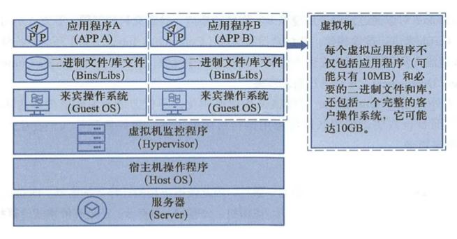
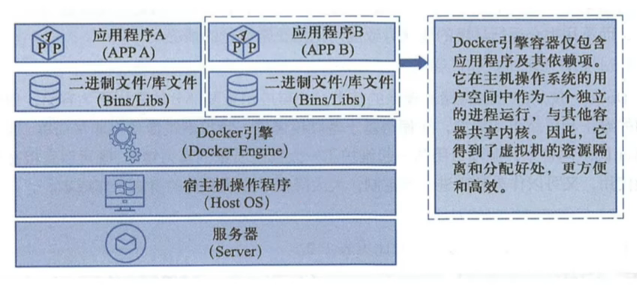
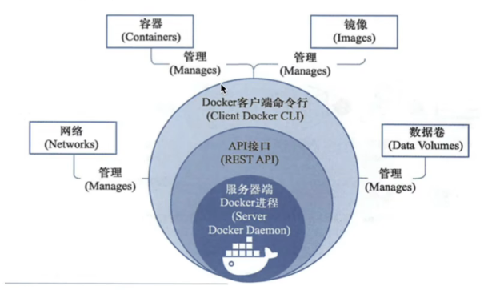
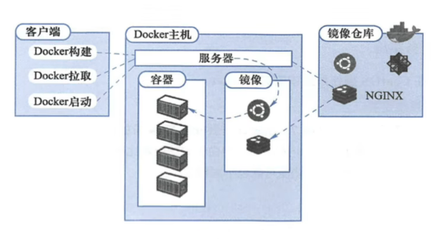

# Docker 

Docker 基于 Golang 开发，基于 Linux 内核的 Cgroups、NameSpace，以及 Union FS 等技术，`对进程进行封装隔离，属于 OS 层面的虚拟化技术`

由于隔离的进行独立于宿主及和其他隔离的进程，也被称为`容器`

Docker 被定义为`开源的容器引擎`,可以方便地对容器进行管理(eg：对镜像打包封装，引入 Docker Registry 对镜像统一管理)

`利用 Docker 可以实现开发、测试、生产环境的部署一致性`

## 容器 VS 虚拟机

- 传统虚拟机

虚拟机是*虚拟出一套硬件*，在其上运行一个完成的 OS,例如用 KVM,执行系统镜像，然后装系统，最终再在该系统上运行所需的 APP

KVM 创建虚拟机时，指定较少的 CPU,内存，硬盘等资源，虚拟机性能较低

 

- 容器

容器内的 APP 直接运行在宿主机的内核上，容器内没有自己的内核，也没有对硬件进行虚拟，因此容器比虚拟机更轻巧

 

### 容器对比虚拟机的优势

1. 容器能够提供宿主机的性能，而 KVM 虚拟机是分配宿主机硬件资源，性能较弱
2. 启动 KVM 虚拟机，需要一个完整的开机流程。而启动一个容器只需要 1S
3. KVM 需要 CPU 的虚拟化支持，而容器不需要


## Docker 引擎

Docker Engine 是 C/S 架构

 

Docker的组成如下：

 

## Docker 核心组件

- image 镜像，构造容器(APP 运行需要的环境，会打包为镜像文件)
- Container 容器
- Dockerhub 镜像仓库，保存镜像文件，提供上传，下载镜像
- Dockerfile 脚本文件，将需要部署项目的操作，写为 Dockerfile(脚本)，且 Dockerfile 还能构建出镜像文件

### images

镜像是一个只读模板，用于创建容器，也可以通过 Dockerfile 描述镜像的内容

镜像的概念类似于 OOP 中的 class,从一个基类开始(基础镜像 Base Image)

构建容器的过程，就是运行镜像、生成容器实例

### Dockerfile

Docker 精细那个的描述文件是 Dockerfile，包含了如下的命令

- FROM 定义基础镜像
- MAINTAINER 作者
- RUN 运行 Linux 命令
- ADD 添加文件/目录
- ENV 环境变量
- CMD 运行进程

### 创建容器的过程

1. 获取镜像，如 `docker pull centos`,从镜像仓库拉取
2. 使用镜像创建容器
3. 分配文件系统，挂载一个读写层，在读写层加载镜像 
4. 分配网络/网桥接口，创建一个网络接口，让容器和宿主机通信
5. 容器获取 IP 地址
6. 执行容器命令 eg：/bin/bash
7. 反馈容器启动结果


## docker 命令

- 搜索 dockerhub 仓库

```sh
> sudo docker search nginx
NAME                                              DESCRIPTION                                     STARS     OFFICIAL   AUTOMATED
nginx                                             Official build of Nginx.                        18481     [OK]       
unit                                              Official build of NGINX Unit: a polyglot app…   0         [OK]       
bitnami/nginx                                     Bitnami nginx Docker Image                      162                  [OK]
bitnami/nginx-ingress-controller                  Bitnami Docker Image for NGINX Ingress Contr…   25                   [OK]
ubuntu/nginx                                      Nginx, a high-performance reverse proxy & we…   89                   
kasmweb/nginx                                     An Nginx image based off nginx:alpine and in…   6                    
rancher/nginx-ingress-controller                                                                  11                   
...
```

- 查看本地镜像列表

```sh
> sudo docker image ls
REPOSITORY   TAG       IMAGE ID   CREATED   SIZE
nginx        latest    448a08f1d2f9   5 days ago   142MB
```

- 删除本地镜像

```sh
> sudo docker rmi ${image ID}
```

- 下载镜像

```sh
> sudo docker pull nginx
#下载默认 tag 的 nginx
Using default tag: latest
#从仓库下载最新版
latest: Pulling from library/nginx
#多文件下载
9e3ea8720c6d: Pull complete 
bf36b6466679: Pull complete 
15a97cf85bb8: Pull complete 
9c2d6be5a61d: Pull complete 
6b7e4a5c7c7a: Pull complete 
8db4caa19df8: Pull complete 
#哈希校验
Digest: sha256:480868e8c8c797794257e2abd88d0f9a8809b2fe956cbfbc05dcc0bca1f7cd43
#下载状态
Status: Downloaded newer image for nginx:latest
docker.io/library/nginx:lates
```

- 运行镜像

```sh
# -d 后台运行容器
# -p 80:80 端口映射。格式为： 宿主机端口：容器内端口
#          访问宿主机的80端口，等于访问容器内的80端口  
#运行结果如下，返回了一个 容器ID
> sudo docker run -d -p 80:80 nginx
cf60b9c990d74e29351c9630e8c12ef49dfce003990724ff75893410133e4039
```

- 查看容器是否在运行

```sh
> sudo docker ps
CONTAINER ID   IMAGE     COMMAND                  CREATED         STATUS         PORTS                               NAMES
cf60b9c990d7   nginx     "/docker-entrypoint.…"   2 minutes ago   Up 2 minutes   0.0.0.0:80->80/tcp, :::80->80/tcp   beautiful_poitras
```

- 停止运行中的容器(会返回容器 ID)

```sh
> sudo docker ps  #先查看停止容器的 ID
CONTAINER ID   IMAGE     COMMAND                  CREATED          STATUS          PORTS                               NAMES
cf60b9c990d7   nginx     "/docker-entrypoint.…"   50 minutes ago   Up 50 minutes   0.0.0.0:80->80/tcp, :::80->80/tcp   beautiful_poitras

#docker stop ContainerID 停止运行中的容器
> sudo docker stop cf60b9c990d7
cf60b9c990d7

> sudo docker ps  #再次查看该 ID 代表的容器,已停止
CONTAINER ID   IMAGE     COMMAND   CREATED   STATUS    PORTS     NAMES
```

- 启动暂停的容器

```sh
> sudo docker start cf60b9c990d7
cf60b9c990d7
```


