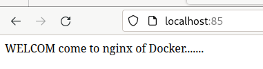

# DockerFile 镜像定制

- 定制 docker 镜像的两种方式：
    * 手动修改容器内容，导出新的镜像
    * 基于 DockerFile 自行编写指令，基于指令流程创建镜像

## dockerfile 指令

| 指令   | 含义    |
| :---------------: | :---------------: |
| FROM   | 指定基础镜像   |
| MAINTAINER   | 指定维护者信息，可省略   |
| RUN   |  在需要执行的命令前添加即可   |
| ADD   |  COPY 宿主机文件至容器内，会自动解压   |
| WORKDIR   | 设置当前工作目录   |
| VOLUME   | 设置卷，挂载主机目录   |
| EXPOSE   | 指定对外的端口   |
| CMD   | 指定容器启动后要做的事情   |

- DockerFile 其他指令：
    * COPY -> 复制文件,但仅复制，*不具备 ADD 指令的自动解压* 
    * ENV -> 设置环境变量
    * ENTRYPOINT -> 容器启动后执行的命令

### COPY 语法

```sh
COPY 指令从宿主机复制文件/目录 到心得一层镜像内; eg:
COPY *.js /home/

#支持多个文件，语法要满足 Golang 的 filepath.Match
COPY hello* /tmp/cc?.txt. /home/

#COPY 指令能保留源文件的元数据，如权限、访问时间等
```

### ADD 语法

```sh
特性和 COPY 相似，不过多了一些功能
当源文件是一个 URL,此时 docker 引擎会下载该连接，放入目录路径，且权限默认600,
若这不是期望结果，可增加一层 RUN 指令调整

源文件是一个 URL,且是一个压缩包，不会自动加压，需单独用 RUN 指令解压

源文件是一个压缩文件，且是 gzip,bzip2,xz,tar 情况，ADD 指令会自动解压缩该文件到目标路径
```

### CMD 语法

```sh
语法： CMD ["参数1","参数2"]
在指定了 entrypoint 指令后，用 CMD 指定具体的参数

docker 不是虚拟机，容器本质是一个进程。既然是进程，那么在成启动需要指定某些参数，这就是 CMD 指令的作用

eg：centos 镜像默认的 CMD 是 /bin/bash, 直接 docker run -it centos 会直接进入 bash 解释器
也可以启动容器的时候，指定参数：docker run -it centos cat /etc/os-release

CMD 运行 shell 命令，也会被转为 shell 形式

eg: CMD echo $PATH
会被转为
    CMD ["sh","-c","echo $PATH"]
```

### 容器内运行程序，CMD的补充

> docker 不是虚拟机的概念，虚拟机内的程序运行，基本上都是在*后台运行*，利用 *systemctl* 运行，但是`容器内没有后台进程的概念，必须在前台运行`  

`容器就是为了主进程而存在的。主进程如果退出了，容器也就失去意义，会自动退出`

如何写 dockerfile 实现 nginx 的启动?

```sh
CMD systemctl start nginx
#错误写法，容器会立即退出
#因为 systemctl start nginx 是希望以守护进程的形式启动 nginx，
#且 CMD 指令会转化为  CMD ["sh","-c","systemctl start nginx"]
# 这样的命令主进程是 sh 解释器，执行后立即结束了，因此容器也就退出了

#正确做法如下
CMD ["nginx","-g","daemon off;"]
```

### ENTRYPOINT 和 CMD

- ENTRYPOINT 和 RUN 指令一样，有两种格式
    * exec
    * shell

ENTRYPOINT 的作用和 CMD 一样，都是在指定容器启动程序以及参数

当指定了 ENTRYPOINT 之后，CMD 指令的语义就有了变化。是`把 CMD 的内容当作参数传递给 ENTRYPOINT 指令`

```sh
#准备一个 dockerfile
FROM centos:7.8.2003
RUN rpm --rebuilddb && yum install epel-release -y
RUN rpm --rebuilddb && yum install curl -y
CMD ["curl",'-s',"http://ipinfo.io/ip"]

#用法如下
docker run my_centos curl -s http://ipinfo.io/ip

docker run my_centos

#构建镜像
docker build .

#查看结果
... #前面的输出信息省略，成后后会有下面最后依据
Successfully build 镜像ID

#为构建好的镜像改名
docker tag 镜像ID centos-curl

#运行镜像，生成容器记录(没有前台记运行，因此立即挂了)
docker run centos-curl

#上述运行可以成功，但如果想再添加一个参数给 curl 呢？
docker run centos_curl -I  # -I 参数打印请求头
#会 ERROR,因为此处的 -I 参数覆盖了 curl 命令

#那么如何避免这种问题呢？
#只需要修改 dockerfile 的最后一行即可
#最后一行修改如下
ENTRYPOINT ["curl",'-s',"http://ipinfo.io/ip"] #之后从新构建镜像即可
```

### ARG 和 ENV 指令

- ARG 和 ENV 都是用来`设置环境变量`的，区别在于
    * `ENV 无论是在构建时，还是容器运行，定义的变量都可以使用`
    * `ARG 只用于构建镜像需要设置的变量，容器运行时就消失了`

```sh
ENV hello="echo 'hello, I am Env'"
ENV password="admin123"
后续所有操作，通过 $hello 就可以获取变量的值，同 shell 脚本，方便 ADD、COPY、EXPOSE等
```

### VOLUME 语法

容器在运行时,应该保证在`存储层不写入任何数据`。`运行在容器内产生的数据，推荐：写入到宿主机上，进行尼姑维护`

```sh
VOLUME /data
#将容器内的 /data 文件夹，在容器运行时，该目录自动挂载为匿名卷
#任何向该目录写入数据的曹族，都不会被容器记录，保证容器的存储层无状态理念

#Dockerfile
FROM centos
MAINTAINER qh
VOLUME ["/data1","/data2"]

#该容器运行时，data1 和 data2 目录自动和宿主机的目录组好映射
docker build .

#运行该镜像
docker run 镜像ID

#docker inspect 命令查看挂载点 Mounts,Volumes(在输出的JSON内)
```

1. 容器数据挂载的方式，通过 DockerFile，指定 VOLUME 目录
2. 通过 `docker run -v 参数`，直接设置需要映射挂载的目录

### EXPOSE 语法

EXPOSE 指定容器运行时对外提供的端口服务。帮助使用该镜像的人，快速理解该容器的一个端口业务

```sh
docker post 容器
docker run -p 宿主机端口：容器端口
docker run -P #随机分配宿主机端口：容器内端口
```

### WORKDIR 语法

在 dockerfile 中，目录的切换，更改工作目录

```sh
WORKDIR /opt
```

### USER 语法

USER 用于改变环境，切换用户

```sh
USER root #使用 root 用户
USER alex #使用 alex 用户
```

## dockerfile 练习

首先创建一个 Dockerfile,向 nginx 默认的页面重定向自己的欢迎词，然后 docker build

```sh
> cat Dockerfile
FROM nginx
RUN echo '<meta charset=utf8> WELCOM come to nginx of Docker.......' > /usr/share/nginx/html/index.html
> sudo docker build .
[sudo] password for qinghuo:
DEPRECATED: The legacy builder is deprecated and will be removed in a future release.
            Install the buildx component to build images with BuildKit:
            https://docs.docker.com/go/buildx/

Sending build context to Docker daemon  211.1MB
Step 1/2 : FROM nginx
 ---> 448a08f1d2f9
Step 2/2 : RUN echo '<meta charset=utf8> WELCOM come to nginx of Docker.......' > /usr/share/nginx/html/index.html
 ---> Running in 8ed964ba1369
Removing intermediate container 8ed964ba1369
 ---> 05109b03ae02
Successfully built 05109b03ae02
#可以看到，我们构建的自己的镜像默认是 没有名字、没有 TAG 的
> sudo docker images
REPOSITORY                            TAG        IMAGE ID       CREATED              SIZE
<none>                                <none>     05109b03ae02   About a minute ago   142MB
myemai_163/centos-7.8.2003-hello.py   latest     a73851dbf982   2 hours ago          203MB
nginx                                 latest     448a08f1d2f9   8 days ago           142MB
redis                                 latest     116cad43b6af   8 days ago           117MB
ubuntu                                latest     6b7dfa7e8fdb   5 months ago         77.8MB
centos                                latest     5d0da3dc9764   20 months ago        231MB
centos                                7.8.2003   afb6fca791e0   3 years ago          203MB
opensuse                              latest     efc0e91c4ab2   4 years ago          110MB
```

### 修改构建出的，无名字、无 TAG 的镜像名

```sh
> sudo docker tag  05109b03ae02  my_nginx
#名字已经改好
> sudo docker images
REPOSITORY                            TAG        IMAGE ID       CREATED         SIZE
my_nginx                              latest     05109b03ae02   3 minutes ago   142MB
myemai_163/centos-7.8.2003-hello.py   latest     a73851dbf982   2 hours ago     203MB
nginx                                 latest     448a08f1d2f9   8 days ago      142MB
redis                                 latest     116cad43b6af   8 days ago      117MB
ubuntu                                latest     6b7dfa7e8fdb   5 months ago    77.8MB
centos                                latest     5d0da3dc9764   20 months ago   231MB
centos                                7.8.2003   afb6fca791e0   3 years ago     203MB
opensuse                              latest     efc0e91c4ab2   4 years ago     110MB
```

### 运行自己构建的镜像

```sh
> sudo docker run -d -p 85:80 my_nginx
55d7736f9036cfaa9a1838312218f7a281c840b34eb02f3b935619fe4bd5041e
> sudo docker ps -a
CONTAINER ID   IMAGE      COMMAND                  CREATED         STATUS         PORTS                               NAMES
55d7736f9036   my_nginx   "/docker-entrypoint.…"   5 seconds ago   Up 4 seconds   0.0.0.0:85->80/tcp, :::85->80/tcp   dazzling_jemison
> sudo docker ps
CONTAINER ID   IMAGE      COMMAND                  CREATED         STATUS         PORTS                               NAMES
55d7736f9036   my_nginx   "/docker-entrypoint.…"   8 seconds ago   Up 6 seconds   0.0.0.0:85->80/tcp, :::85->80/tcp   dazzling_jemison
```

可以正常访问

 


## DockerFile 部署网站

本节内容未曾验证

1. 宿主机环境下， 准备一个目录，准备好 dockerfile 和 网站代码

```
```sh
> cat web_site.py
#coding:utf8
from flask import Flask
app = Flask(__name__)
@app.route('/hello')
def hello():
    return "Hello from docker~~"
if __name__ == "__main__":
    app.run(host='0.0.0.0',port=8081) # 0.0.0.0 为绑定所有网卡
```

2. 编写 dockerfile 

```sh
> cat Dockerfile
FROM centos:7.8.2003
RUN curl -o /etc/yum/repos.d/CentOS-Base.repo https://mirrors.aliyun.com/repo/Centos-7.repo;
RUN curl -o /etc/yum/repos.d/epel,repo https://mirrors.aliyun.com/repo/epel-7.repo;
RUN yum makecache fast;
RUN yum install python3-devel python3-pip -y
RUN pip3 install -i https://pypi.douban.com/simple flask
COPY web_site.py /opt
WORKDIR /opt
EXPOSE 8080
CMD ["python3","web_site.py"]
```

3. 构建镜像

```sh
#--no-cache 不使用缓存，重新开始构建(特指之前因依赖等问题构建了一半后失败的情况)
#-t 参数用来给构建好的镜像 起名字和 TAG
> docker build --no-cache -t 'mytest163/my_flask_web' .
```

4. 运行构建成功的镜像

```sh
docker run -d --name my_flask_web_001 -p 90:8080 mytest163/my_flask_web
#成功后会返回 容器ID
#可用 docker ps 指令查看容器运行情况
```

5. 访问网站

浏览器输入 ip:90/hello 即可

### 修改在容器内运行的服务

以上面的 my_flask_web 为例，若需要修改网站显示内容，应该怎么做？

这里记录进入容器内修改，再重启容器的样例

1. 首先进入正在运行服务的容器内

```sh
docker exec -it 容器ID bash
```

2. 修改容器内的服务

可用 vi、vim 等编辑器修改容器内的文件(此时强制刷新浏览器看不到更改)，然后 exit 退出容器

3. 重启容器即可看到更改后的内容

```sh
docker restart 容器ID
```


