## 网络层

主要任务是把```分组```从源端传到目的端，为分组交换网上的不同主机提供通信服务。网络层传输的单位是```数据报```(数据报可以拆分为分组)

网络层功能：
```
路由选择与分组转发(最佳路径)
异构网络互联(手机和电脑)
拥塞控制
    若所有节点都来不及接收分组，而要丢弃大量分组的花，网络就处于 拥塞
    状态，因此就要采取一定措施，缓解这种拥塞
```

- 数据交换方式：
    * 电路交换
    * 报文交换
    * 分组交换
        - 数据报交换
        - 虚电路交换

- 传输单元名词

| OSI | 相应名词  |
|  :----:  | :----:  |
| 应用层 | 报文 |
| 传输层 | 报文段 |
| 网络层 | IP数据报，分组 |
| 链路层 | 帧 |
| 物理层 | 比特流 |

- TCP/IP协议栈


#### 电路交换

```
以电话拨号为例
建立连接(呼叫/电路建立) -> 通信 -> 释放连接(拆除电路)
电路交换的特点是 独占资源
优点：
    通信时延小，有序传输，没有冲突，实时性强
缺点：
    建立连接时间长，线路独占，使用效率低，灵活性差，无差错控制能力
```

#### 报文交换

```
报文：源应用发送的信息整体
优点：
    无需建立连接，存储转发-动态分配线路，线路可靠性较高，线路利用率较高
    多目标服务
缺点：
    有存储转发时延，报文大小不定-需要网络节点有较大缓存空间
```

#### 分组交换

```
分组：把大的数据块分割为小的数据块
优点：
    无需建立连接，存储转发-动态分配线路，线路可靠性较高，线路利用率较高
    相对于报文交换，存储管理更容易
缺点：
    有存储转发时延，需要传输额外的信息量，乱序到目的主机时，需要对分组排序重传
```

- 三种数据交换方式比较
- 报文交换和分组交换都采用存储转发
- 传送数据量大，且传送时间远大于呼叫时，选择*电路交换*。电路交换传输时延最小
- 从信道利用率看，*报文交换*和*分组交换*优于```电路交换```，其中分组交换时延更小

#### 数据报&虚电路

```
数据报方式为网络层提供 无连接服务
无连接服务：
    不事先为分组的传输确定传输路径，每个分组独立确定传输路径，不同分组
    传输路径可能不同。
虚电路方式为网络层提供 连接服务
连接服务：
    首先为分组的传输确定传输路径(建立连接)，然后沿该路径(连接)传输系列
    分组，系列分组传输路径相同，传输结束后拆除连接
```
- 数据报(因特网在用)
     * *每个分组携带源和目的地址*
    * *路由器根据分组的目的地址转发分组*:基于路由协议/算法构建*转发表*
        - 检索转发表，每个分组独立选路
- 虚电路
- 虚电路将数据阿波方式和电路交换方式结合

     一条源主机到目的主机类似于电路的路径(逻辑连接)，路径上所有节点都要维持这条虚电路的建立，都要维持一张虚电路表，每一项记录了一个打开的虚电路的信息

每个分组携带```虚电路号```，而非目的地址。源主机发送“呼叫请求”分组并收到“呼叫应答”分组后才算建立连接

#### 路由算法的分类

- 静态路由算法(非自适应路由算法)
    * 管理员手工配置路由信息
    * 简单，可靠，在负荷稳定，拓扑变化不大的网络中运行效果好
    * 广泛用于高度安全性的军事网络和小型商业网络
    * 其路由更新慢，不适用大型网络
- 动态路由算法(自适应路由算法)
    * 路由器彼此间交换信息，按照路由算法优化出路由表项
    * 路由更新快，适用大型网络，及时相应链路费用或网络拓扑变化
    * 算法复杂，增加网络负担
- 动态路由算法：
    * 全局性 链路状态路由算法 OSPF协议
        - 所有路由器掌握完整的网络拓扑和链路费用信息
    * 分散性 距离向量路由算法 RIP
        - 路由器只掌握物理相连的邻居及链路费用

#### 分层次的路由选择协议

为什么路由选择协议要分层次？

1.因特网规模很大

2.许多单位不想让外界知道自己的路由选择协议，但还需要连入因特网

自治系统(AS): 在单一的技术管理下的一组路由器，而这些路由器适用一种AS内部的路由选择协议和共同的度量以确定分组在该AS内的路由，同时还适用一种AS之间的路由协议以确定在AS之间的路由

一个AS内的所有网络都属于一个行政单位来管辖，一个自治系统的所有路由器在本自治系统内都必须连通

- 路由选择协议
    * 内部网关协议IGP
        - 一个AS内使用的 (RIP,OSPF)
    * 外部网关协议 EGP
        - AS之间使用的 BGP

#### RIP协议

RIP协是一种分布式的基于```距离向量```的路由选择协议，是因特网的协议标准，最大优点是简单。

RIP协议要求网络中的每一个路由器都维护```从它自己到其他每一个目的网络的唯一最佳距离记录```（即一组距离）

距离：通常为”跳数“,即从源端口到目的端口所经过的路由器个数，经过一个路由器跳数+1。特别的，从一路由器到直接连接的网络距离为1.RIP允许一条路由最多只能包含15个路由器，因此距离为```16表示网络不可可达```

RIP协议只适用于```小互联网```

- RIP协议和谁交换，多久交换一次？交换什么？
1. 仅和```相邻路由器```交换信息
2. 路由器交换的信息是```自己的路由表```
3.```每30秒``交换一次路由信息，然后路由器根据新信息更新路由表。若超过180s没受到邻居路由器的通告，则判定邻居没了，并更新自己路由表

路由器刚开始工作时，只知道直接连接的网络的距离(距离为1)，接着每一个路由器也只和数据非常有限的相邻路由器交换并更新路由信息

经过若干次更新后，所有路由器最终都会知道到达本自治系统任何一个网络的最短距离和下一跳路由器的地址，即```收敛```

#### OSPF协议

开放最短路径优先OSPF协议：‘开放’标明OSPF协议不受某一厂商控制，而是*公开发表*的。‘最短路径优先’是因为使用了Dijkstra提出的*最短路径算法SPF*

OSPF最主要的特征就是使用分布式的```链路状态协议```

OSPF和谁交换？

使用洪泛法向自治系统内```所有路由器```发送信息，即路由器通过输出端口向所有相邻的路由器发送信息，而每一个相邻路由器又再次将此信息发往其所有相邻的路由器(```广播```)

交换什么？

发送的信息就是与本路由器```相邻的所有路由器的链路状态```(本路由器和哪些路由器相邻，以及该链路的度量/代价--费用，距离，时延，带宽等)

多久交换？

只有当```链路状态发生变化时```，路由器才向所有路由器洪泛发送此消息

最后，所有路由器都能建立一个```链路状态数据库```，即```全网拓扑图```

#### BGP协议

和谁交换？

与其他AS的相邻BGP发言人交换信息

交换什么？

交换的网络可达性的信息，即要到达某个网络所要经过的一系列AS

多久交换？

发生变化时更新有变化的部分

- 三种路由协议对比
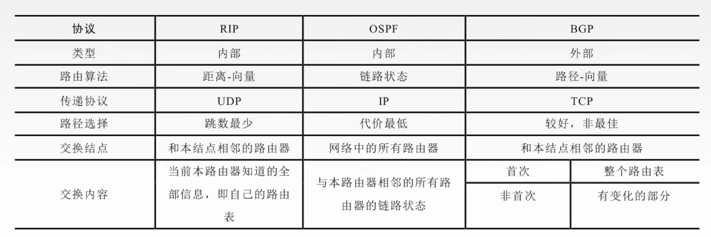

- 特殊IP地址
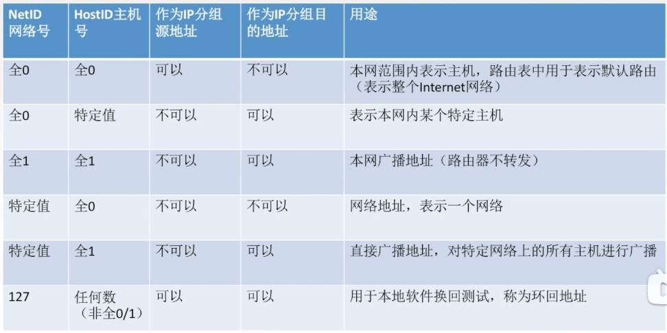
- 私有IP地址
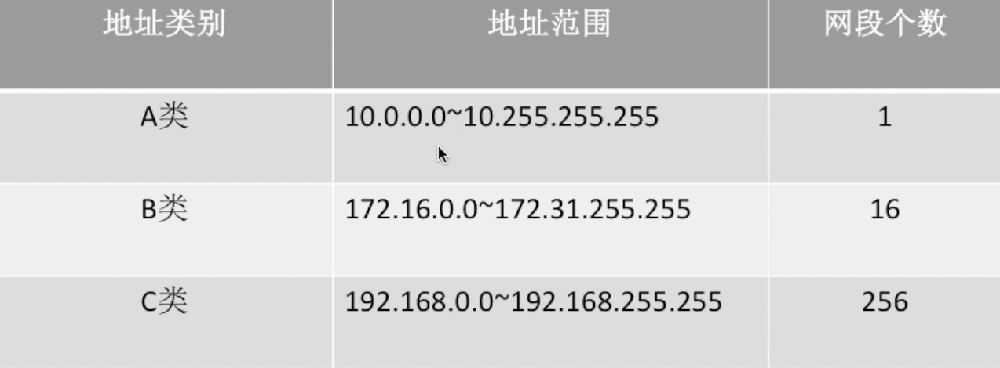

## 网络地址转换NAT

网络地址转换NAT(Network Address Translation):在```专用网```连接到```因特网```的路由器上安装NAT软件，安装了NAT软件的路由器叫*NAT路由器*，它至少有一个有效的```外部全球IP地址```

- NAT转换表
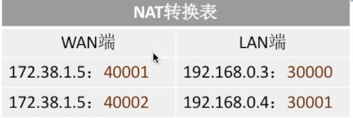
LAN端下的私有IP连接因特网时，会通过NAT路由器进行IP和端口的替换，如上图所示

## 子网划分


#### 子网掩码

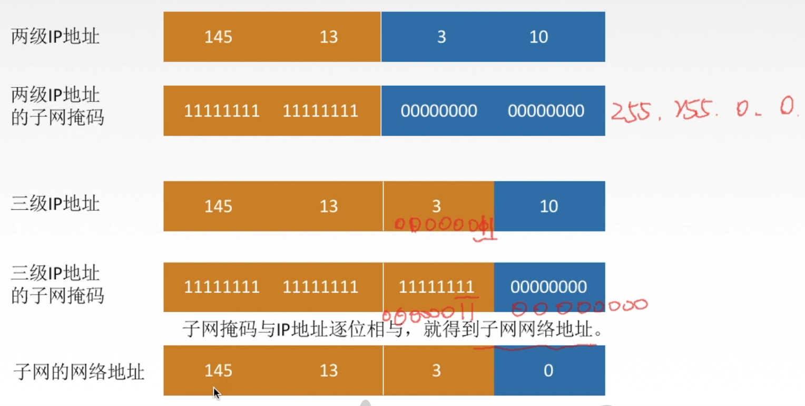

- 子网掩码习题

- 首先将IP和子网掩码进行与运算
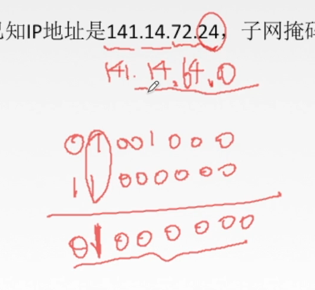

- 为了快速计算IP，可以熟读下表(10进制和2进制的转转)
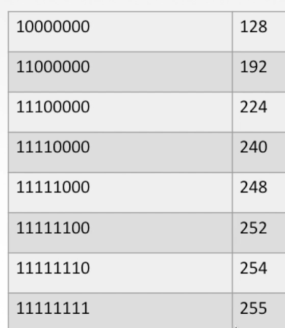
- 上述子网掩码问题的结果是141.141.64.0,求下图中的结果

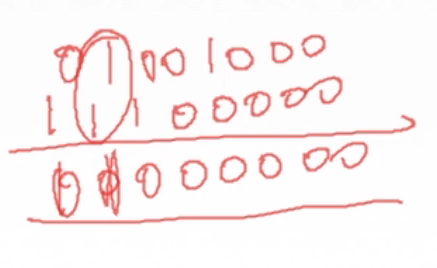
- 最终结果IP地址仍为141.14.64.0

- 路由器转发分组的算法：
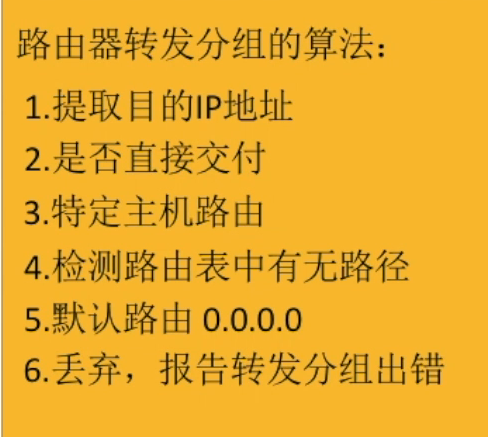

## 无分类编制CIDR
- 无分类域间路由选择CIDR：
    * 消除了传统的A类，B类，C类地址及划分子网的概念


- CIDR记法：
    * IP地址后加 / ,然后写上网络前缀(任意长度)的位数

    * 融合子网地址与子网掩码，方便子网划分
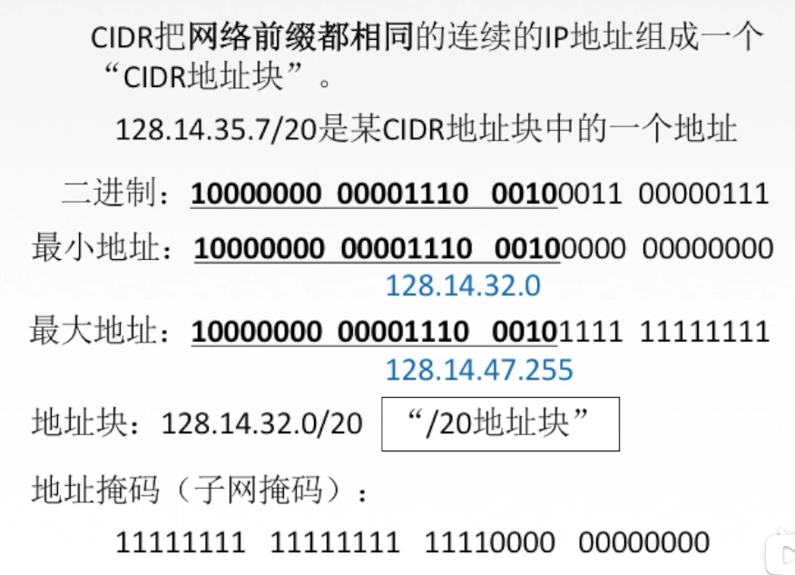

#### 构成超网

- 将多个子网聚合成一个较大的子网，叫做*构成超网*，或*路由聚合*
    * 方法：将网络前缀缩短

#### ARP协议

- 发送数据的过程
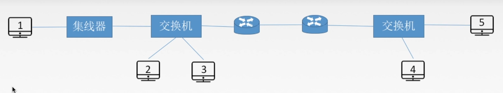

- ARP协议：
    * 完成主机或路由器IP地址到MAC地址的映射(解决下一跳走哪里的问题)
    * 由于在实际网络的链路上传送数据帧时，最终必须使用MAC地址
    * ARP协议是自动进行的
ARP协议使用过程：

检查*ARP高速缓存*，有对应表项则写入MAC帧，没有则用目的MAC地址为FF-FF-FF-FF-FF-FF的帧封装并```广播ARP请求分组```，*同一局域网中*所有主机都能收到该请求。目的主机收到请求后会向源主机```单播一个ARP相应分组```，源主机受到后将此映射```写入ARP缓存```（10-20min更新一次）

- ARP协议4种典型情况
    * 主机A发送给*本网络*上的主机B：用ARP找到主机B的硬件地址
    * 主机A发送给*另一网络*上的主机B：用ARP找到本网络上一个路由器(网关)的硬件地址
    * 路由器发给*本网络*的主机A:用ARP找到主机A的硬件地址
    * 路由器发给*另一网络*的主机B：用ARP找到本网络上的一个路由器的硬件地址

#### DHCP协议

动态主机配置协议DHCP是```应用层```协议，使用```客户/服务器```方式，客户端和服务端通过```广播```方式进行交互，基于```UDP```。

DNCP提供```即插即用```联网的机制，主机可以从服务器动态获取IP地址，子网掩码，默认网关，DNS服务器名称与IP地址，允许```地址重用```，支持```移动用户加入网络```，支持```在用地址续租```

DHCP工作流程
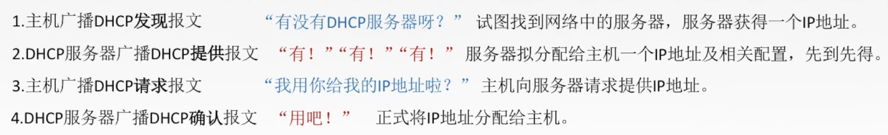

#### ICMP协议

- ICMP协议的应用
    * ping 测试两个主机之间的连通性，使用了ICMP回送请求和回答报文
    * tranceroute 跟踪一个分组从源点到终点的路径，使用*了ICMP时间超过差错报告报文*

#### IPv6

- IPv6地址表示形式

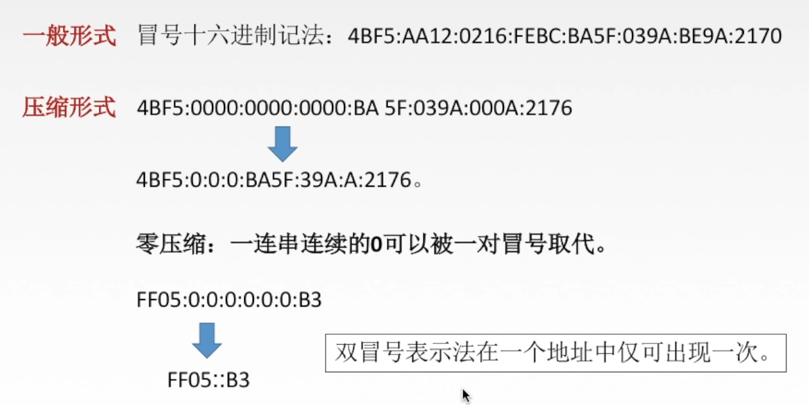

- IPv4向IPv6过度的策略
    * 双栈协议
    * 隧道技术
- 双站协议：
指在一台设备上```同时启用IPv4协议栈和IPv6协议栈```。此时，这台设备技能和IPv4网络通信，又能和IPv6网络通信。如果这台设备是一个```路由器```，那么这台路由器的不同接口上，分别配置了IPv4地址和IPv6地址，并很可能分别连接了IPv4网络和IPv6网络。如果这台设备是一个```计算机```，那么它将同时拥有IPv4地址和IPv6地址，并具备同时处理这两个协议地址的功能

- 隧道技术
通过使用互联网络的基础设施在网络之间传递数据的方式。使用隧道传递的数据(或负载)可以是不同协议的数据帧或包。隧道协议将其他协议的数据帧或包```重新封装```，然后通过隧道发送

#### IP数据报的三种传输方式

- 单播

单播用于发送数据包到单个目的地，且每发送一份单播报文都使用一个单播IP地址作为目的地址。是一种```点对点```传输方式

- 广播

广播是指发送数据包到统一广播域或子网内的所有设备的一种数据传输方式，是一种```点对多点```传输方式

- 组播(多播)

当网络中的某些用户需要特定数据时，组播数据发送者仅发送一次数据，借助组播路由协议为组播数据包建立组播分发树，被传递的数据到达距离用户端尽可能近的节点后才开始复制和分发，是一种```点对多点```传输方式

组播提高了数据传送效率。减少了主干网出现拥塞的可能性。组播组种的主机可以是在同一个物理网络，也可以来自不同的物理网络(如果有```组播路由器```的支持)

#### IP组播地址

IP组播地址让源设备能够将分组发送给一组设备。属于多播组的设备将被分配```一个组播组IP地址```(*一群共同需求主机的相同标识```)

组播地址范围是244.0.0.0～239.255.255.255(D类地址),一个D类地址标识一个组播组。只能用作分组的```目标地址```。源地址总是为*单播地址*

1. 组播数据报是*尽最大努力交付*,不提供可靠交付，应用于UDP
2. 对组播数据报不产生ICMP差错报文
3. 并非所有D类地址都可以作为组播地址

- 硬件组播

同单播地址一样，组播IP地址也需要相应的组播MAC地址在本地网络中实际传送帧。组播MAC地址以16进制值01-00-5E大头，余下的6个16进制位是根据IP组播组地址的最后23位转换得到的

TCP/IP协议使用的以太网多播地址的范围是：*01-00-5E-00-00-00*到*01-00-5E-7F-FF-FF*

收到多播数据报的主机，还要在IP层利用软件进行过滤，把不是本主机要接受的数据报丢弃

## 移动IP

移动IP即使是移动节点(计算机/服务器等)以```固定的网络IP地址```，实现跨越不同网段的```漫游```功能，保证了基于网络IP的网络权限在漫游过程中不发生任何改变

- 相关术语
- 移动结点
    * 具有永久IP地址的移动设备
- 归属代理(本地代理)
    * 一个移动节点拥有的就*居所*成为```归属网络```，在归属网络中代表移动节点执行移动管理功能的实体叫做归属代理
- 外部代理(外地代理)
    * 在*外部网络*中帮助移动节点完成移动管理功能的实体成为外部代理
- 永久地址(归属地址/主地址)
    * 移动站点在归属网络中的原始地址
- 转交地址(辅地址)
    * 移动站点在外部网络使用的临时地址

## 路由器

路由器是一种具有多个输入端口和多个输出端口的专用计算机，其任务是转发分组

路由器内部结构图
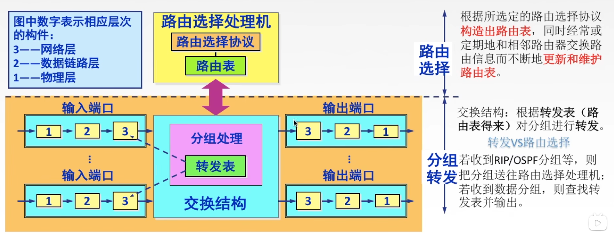

- 路由器输入端口


- 路由器输出端口
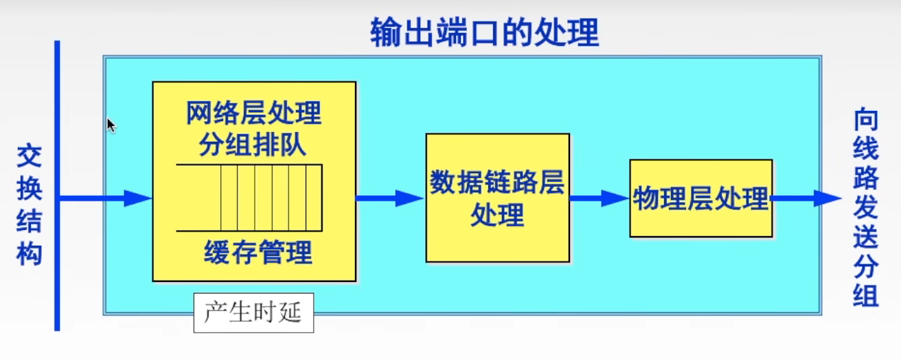
若路由器处理分组的速率干部上分组进入队列的速率，则队列的存储空间最终必定减少到零，这就使后面再进入队列的分组由于没有存储空间而只能被丢弃

```路由器中的输入或输出队列产生溢出是造成分组丢失的重要原因```

- 三层设备的区别

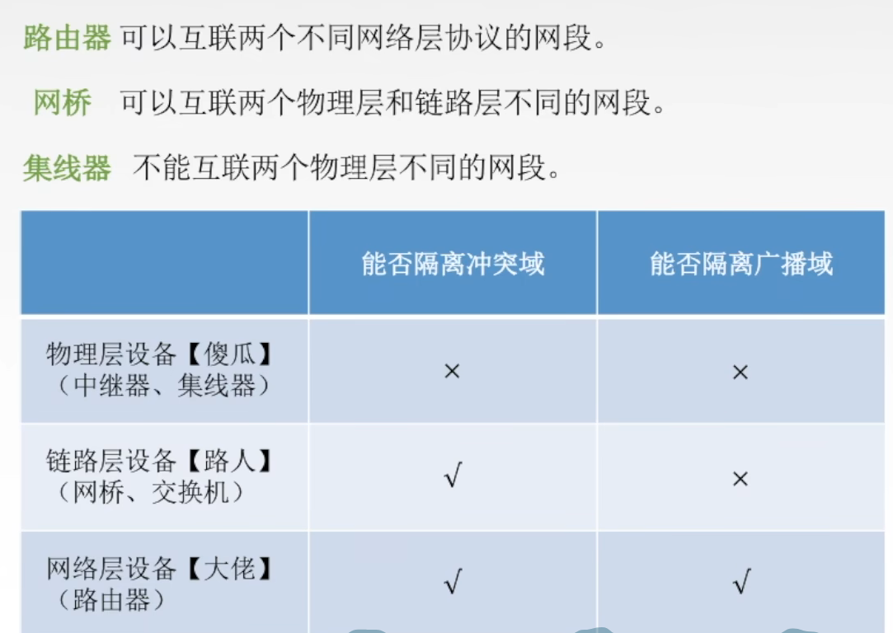

- 路由表与路由转发

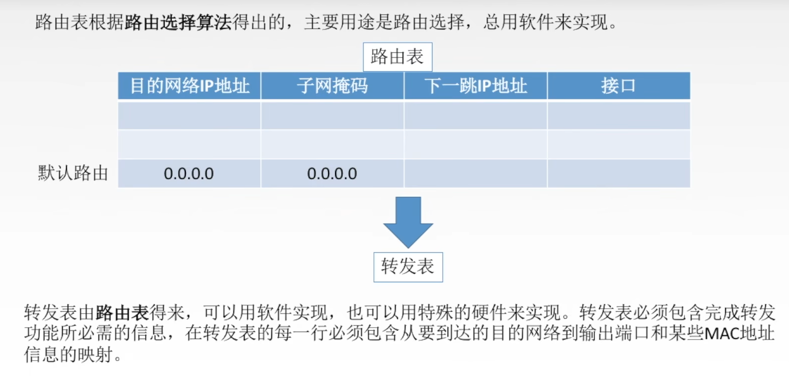


