## 操作系统的概念

操作系统(Operating System,OS)是指控制和管理整个计算机系统的硬件和软件资源，并合理地组织调度计算机的工作和资源的分配，以提供给用户和其他软件方便的接口和环境，它是计算机系统中最基本的```系统软件```

进程是一个程序的执行过程。执行前```需要将该程序放到内存中```，才能被CPU处理

#### 操作系统的特征

- 操作系统的特征包括4个
    * 并发，共享，虚拟和异步
    * 其中并发和共享是最基本的特征，二者互为存在条件


###### 并发

```并发```：指两个或多个事件在同一时间间隔内发生。这些时间```宏观上是同时发生```的，但```微观上是交替发生```的。

```并行```：指两个或多个事件在同一时刻同时发生

```操作系统的并发性```：指计算机系统中同时存在着多个运行中的程序

一个单核处理器(CPU)同一时刻只能执行一个程序，因此OS会负责协调多个程序交替执行(这些程序微观上是交替执行的，但宏观上看起来就像在同时执行)

事实上，操作系统就是伴随‘多到程序技术’出现的。因此，```操作系统和程序并发是一起诞生的```

###### 共享

```共享```即资源共享，指OS中的资源可供内存中多个并发执行的进程共同使用

- 两种共享方式：
    * 互斥共享方式
        - 系统中的某些资源，虽然可以提供给多个进程使用，但```一个时间段内只允许一个进程访问该资源```
    * 同时共享方式
        - 系统中的某些资源，```允许一个时间段内由多个进程‘同时’对他们进行访问

所谓‘同时’往往是宏观上，而在微观上，这些进程可能是交替地对该资源进行访问的(即及时共享)

```并发性```指OS中同时存在着多个运行着的程序

```共享性```指OS中的资源可供内存中多个并发执行的进程共同使用

如果失去并发性，则系统中只有一个程序正在运行，则共享性失去存在意义

如果失去共享性，则QQ和微信不能同时访问硬盘资源，就无法实现同时发送文件，也就无法并发

###### 虚拟

```虚拟```指把一个物理上的实体变为若干个逻辑上的对应物。物理实体(前者)是实际存在的，而逻辑上对应物(后者)是用户感受到的

- 虚拟技术：
    * 空分复用技术(如虚拟存储器技术)
    * 时分复用技术(如虚拟处理器)

如果失去了并发性，则一个时间段内系统中只需要运行一道程序，那么就失去了实现虚拟性的意义了，因此```没有并发性，就谈不上虚拟性```

###### 异步

```异步```指在多道程序环境下，允许多个程序并发执行，但由于资源有限，进程的执行不是一贯到底的，而是走走停停，以不可预知的速度向前推进，这就是进程的异步性

如果失去了并发性，则系统只能串行地处理各个进程，每个进程的执行会一贯到底，```只有系统拥有并发性，才可能导致异步性```

## OS运行机制和体系结构

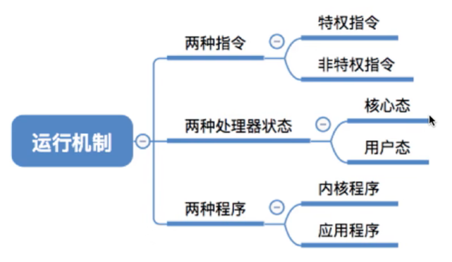

```内核```是计算机配置的底层```软件```，是操作系统最基本，最核心的部分

实现操作系统内核功能的程序就是```内核程序```

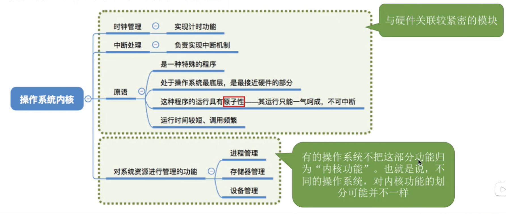

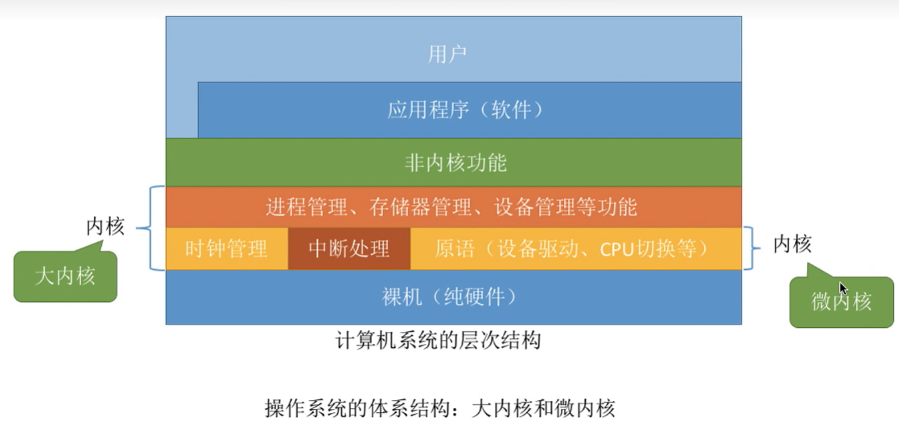

#### 中断

```本质：发生中断```就意味着```需要操作系统介入，开展管理工作```

1. 当中断发生时，CPU立即进入```核心态```
2. 当中断发生后，当前运行的进程暂停运行，并由操作系统内核对中断进行处理
3. 对于不同的中断信号，会进行不同的处理

发生了中断，就意味着需要操作系统介入，开展管理工作。由于操作系统的管理工作(比如进程切换、分配IO设备等)需要使用特权指令，因此CPU要从用户态转为核心态。```中断```可以使CPU从```用户态切换为核心态，使操作系统获得计算机的控制权```。有了中断，才能实现多道程序并发执行。

用户态 -> 核心态 是通过```中断```实现的。并且```中断```是```唯一```途径

和心态 -> 用户态 是通过```执行一个特权指令```，将程序状态字(PSW)的标志位设置为‘用户态’

- 中断的分类：
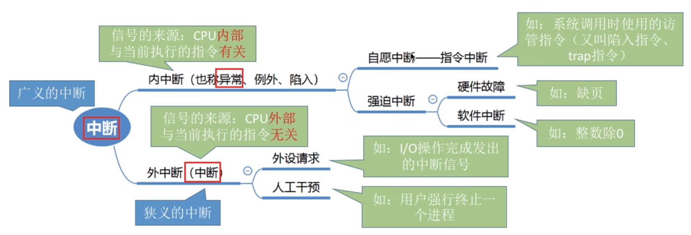
- 另一种中断的分类：
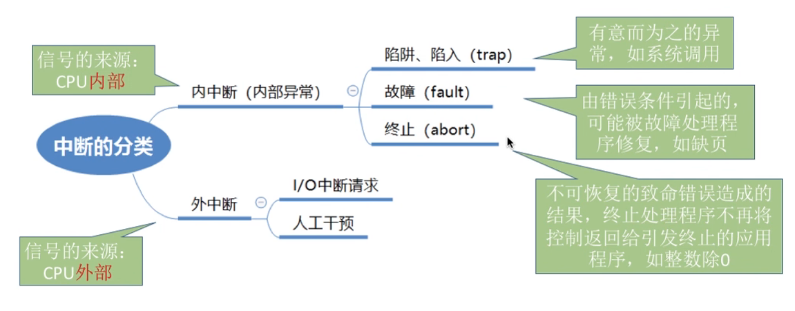

- 外中断的处理过程
1. 执行完每个指令后，CPU都会检查当前是否有外部中断信号
2. 如果检测到外部中断信号，则需要保护被中断进程的CPU环境(如程序状态字PSW、程序计数器PC,各种通用寄存器)
3. 根据中断信号类型转入相应的中断处理程序
4. 恢复原进程的CPU环境并退出中断，返回原进程继续往下执行

#### 系统调用

OS作为用户和计算机硬件之间的接口，需要向上提供一些简单易用的服务。主要包括命令接口和程序接口。其中，程序接口由一组```系统调用```组成

*系统调用*是OS提供给应用程序使用的接口，可以理解为一种可供应用程序调用的特殊函数，应用程序可以发出系统调用请求来获得操作系统的服务

系统调用的作用：

APP通过```系统调用```请求OS的服务。系统中的各种共享资源都由操作系统统一掌管，因此在用户程序中，凡是与资源有关的操作(如存储分配、IO操作、文件管理等)，都必须通过系统调用的方式向操作系统提出服务请求，由操作系统代为完成。这样```可以保证系统的稳定性和安全性```，防止用户进行非法操作


系统调用相关处理涉及到对系统资源的管理、对进程的控制，这些功能需要执行一些```特权指令```才能完成，因此```系统调用的相关处理```需要在```核心态```下进行

系统调用与库函数的区别？

不涉及系统调用的库函数：如*取绝对值*的函数

涉及系统调用的库函数：如*创建一个新文件*的函数

## 进程

系统为每个运行的程序配置一个数据结构，成为进程控制快(PCB),用来描述进程的各种信息(如程序代码存放位置)

进程的定义

```程序段、数据段、PCB```三部分组成了```进程实体(进程映像)```。一般情况下，我们把进程实体简称为进程，录入，所谓创建进程，实质上是创建进程实体中的PCB。而撤销进程，实质上是撤销进程实体中的PCB

1. 进程是程序的一次```执行过程```
2. 进程是一个程序及其数据在处理机上顺序执行时所```发生的活动```
3. 进程是具有独立功能的程序在数据集合上```运行的过程```，它是系统进行资源分配和调度的一个独立单位

引入进程实体的概念后，可以把进程定义为：```进程```是进程实体的```运行过程```，是系统进行```资源分配```和```调度```的一个独立单位

严格来说，进程实体和进程不同，进程实体是```静态的```，而进程是```动态的```

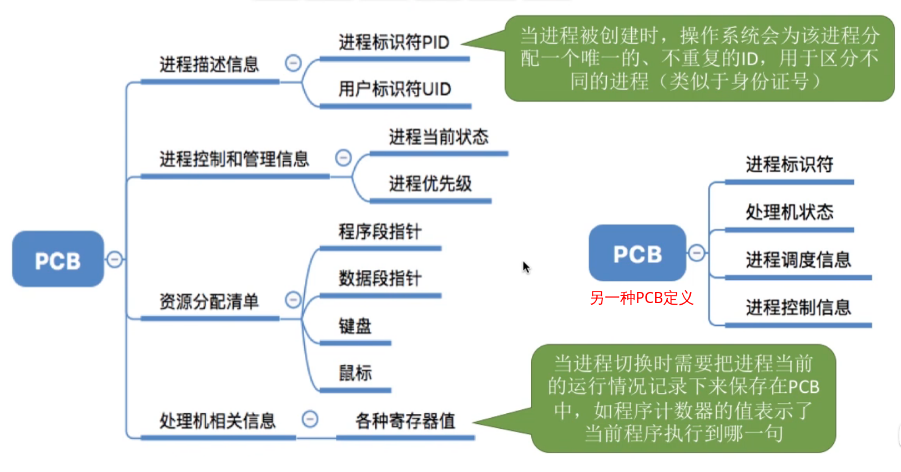
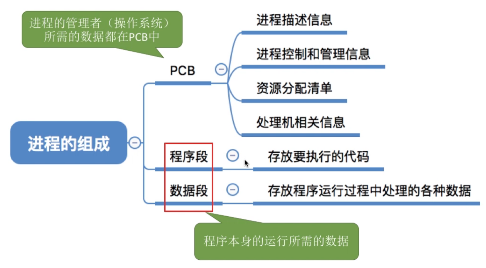

进程的组织：

在一个系统中，通常有数十、数百甚至数千个PCB。为了能对他们加以有效的管理，应该用适当的方式将这些PCB组织起来

note：进程的```组成```讨论的是一个```进程内部```由哪些部分构成的问题，而进程的```组织```讨论的是```多个进程之间```的组织方式问题


连接方式：

索引方式：
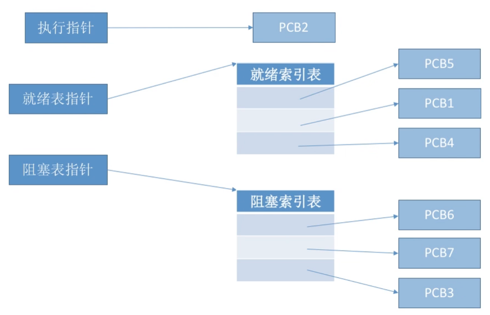

进程的特征

进程和程序是两个截然不同的概念，相比于程序，进程拥有一下特征：

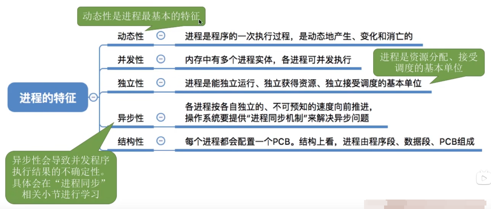


## 进程的状态

进程是程序的一次执行。在这个执行过程中，有时进程帧保在被CPU处理，有时又需要等待CPU服务，可见进程的状态是会有各种变化。为了方便地对各个进程的管理，OS需要将进程合理地划分为几种状态

- 进程的3种状态
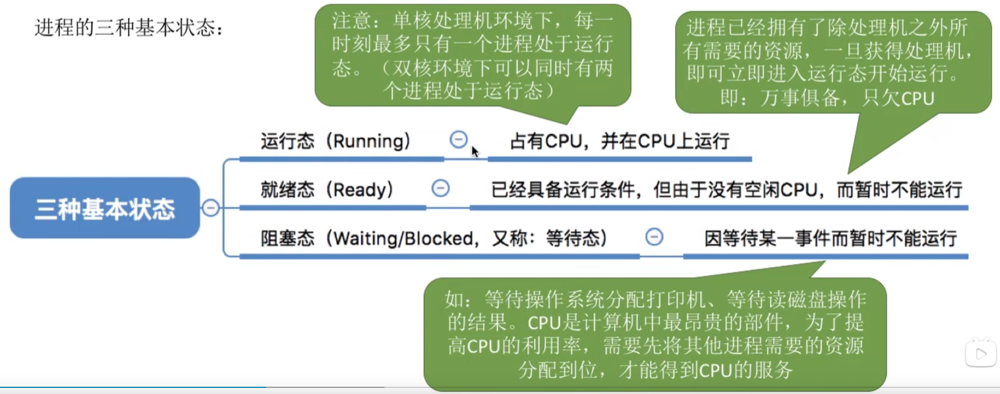

- 进程的另外两种状态

- 进程状态的转换
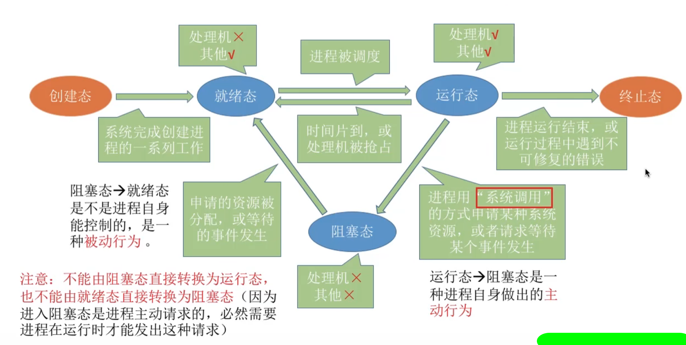

#### 进程控制

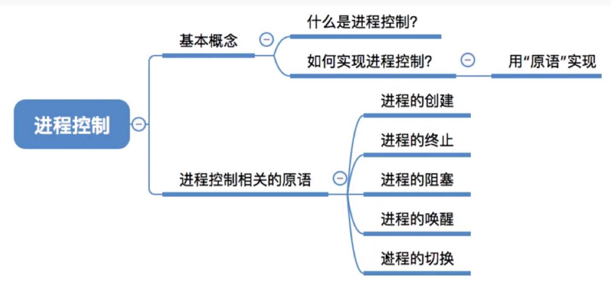

进程控制的主要功能是对系统中的所有进程实施有效的管理，它具有创建新进程，撤销已有进程，实现进程状态转换等功能

- 如何实现进程控制？

用```原语```实现进程控制。原语的特点是执行期间```不允许中断```，只能一气呵成。

这种不可被中断的操作即```原子操作```。原语采用```关中断```指令和```开中断```指令实现

```关/开中断指令```的权限非常大，是只允许在```核心态```下执行的```特权指令```

- 进程控制相关的原语

进程控制会导致进程状态的更换。无论哪个原语，要做的只有三类事情
1. 更新PCB中的信息(如修改进程状态标志，将运行环境保存到PCB,从PCB恢复运行环境)
    * 所有的进程控制原语一定都会修改进程状态标志
    * 剥夺当前运行进程的CPU使用权必然需要保存其运行环境
    * 某进程开始运行前必须恢复其运行环境
2. 将PCB插入合适的队列
3. 分配/回收资源

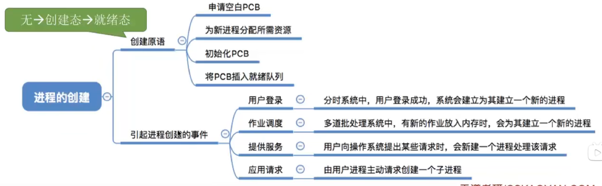
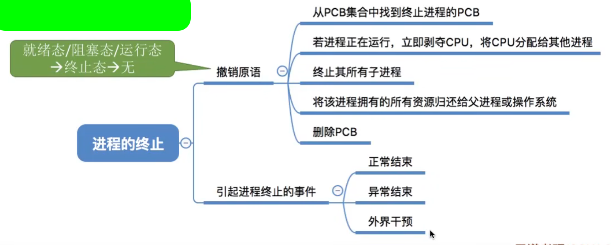
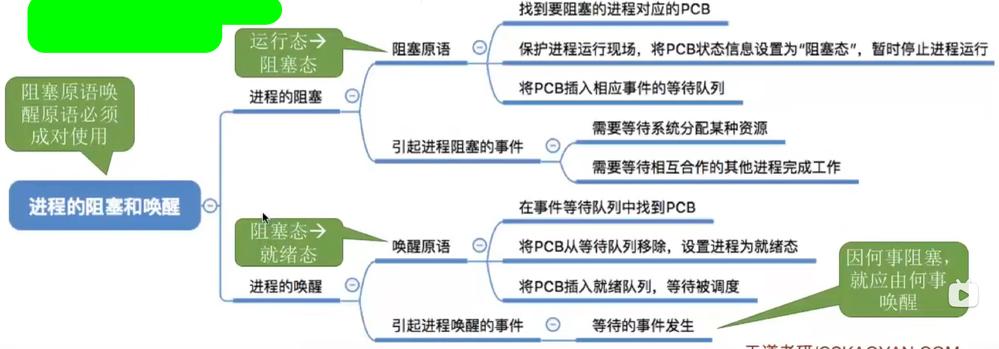
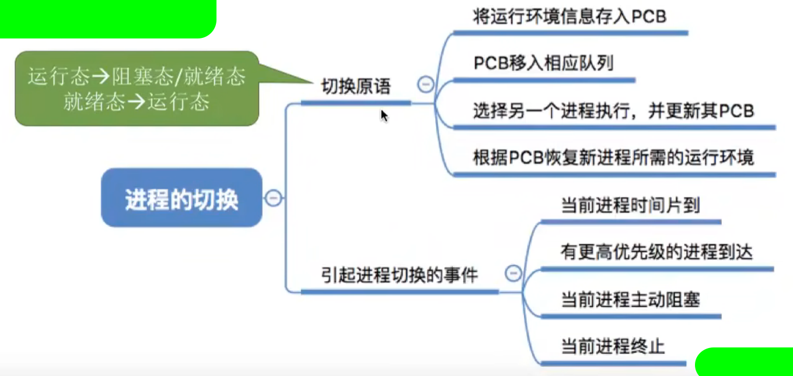

## 进程通信

进程通信指进程之间的信息交换。进程是分配系统资源的单位(包括内存地址空间)，因此```各进程```拥有的```内存地址空间相互独立```

为了保证安全，```一个进程不能直接访问另一个进程的地址空间```。但是进程之间的信息交换又是必须实现的。为了保证进程间的安全通信，操作系统提供了一些方法

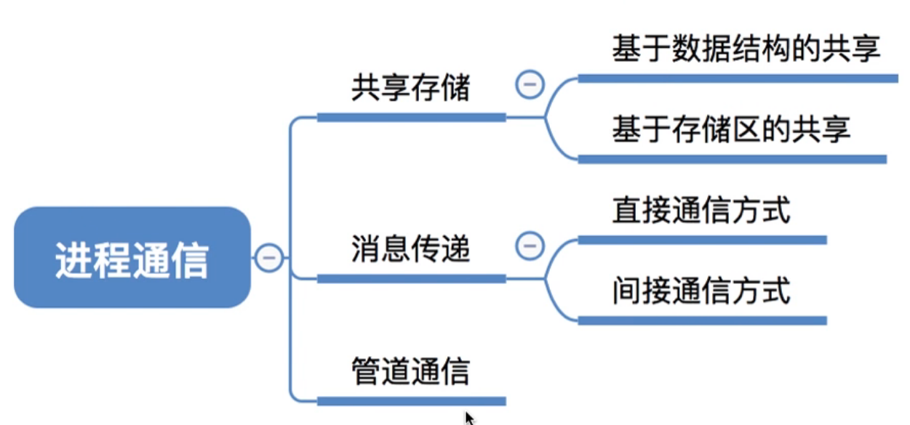

#### 进程通信-共享存储

两个进程对共享空间的```访问```必须是```互斥```的(互斥访问通OS提供的工具实现)。操作系统只负责提供共享空间和同步互斥工具(如P、V操作)

```基于数据结构```的共享：比如共享空间里只能放一个长度为10的数组。这种共享方式速度慢、限制多，是一种```低级通信```的方式

```基于存储区```的共享：在内存中划出一块共享存储区，数据的形式、存放位置都由进程控制，而不是OS，。相比之下，这种共享方式速度更快，是一种```高级通信```方式

#### 管道通信

*管道*指用于连接读写进程的一个共享文件，有名pipe文件。其实就是在内存中开辟一个大小固定的缓冲区

1. 管道只能采用```半双工通信```，某一时间段内只能实现单向的传输。如果要实现```双向同时通信```，则```需要设置两个管道```
2. 各进程要```互斥```地访问管道
3. 数据以字符流的形式写入管道，当```管道写满```时，```写进程```的write()系统调用将被```阻塞```，等待读进程将数据取走。当读进程将数据全部取走后，```管道变空```，此时```读进程```的read()系统调用将被```阻塞```
4. 如果```没写满```，```就不允许读```。如果```没读空，就不允许写```
5. 数据一旦被读出，就从管道中被抛弃，这就意味着```读进程最多只能有一个```，否则可能会有读错数据的情况


#### 消息传递

进程间的数据交换以```格式化的消息(Message)```为单位。进程通过操作系统提供的*发送消息/接收消息*两个```原语```进行数据交换

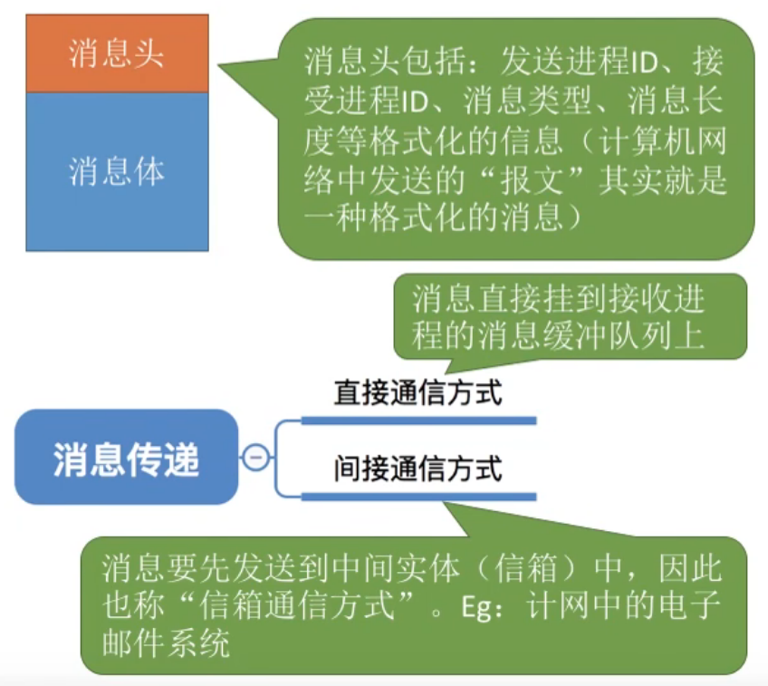


