## 文件

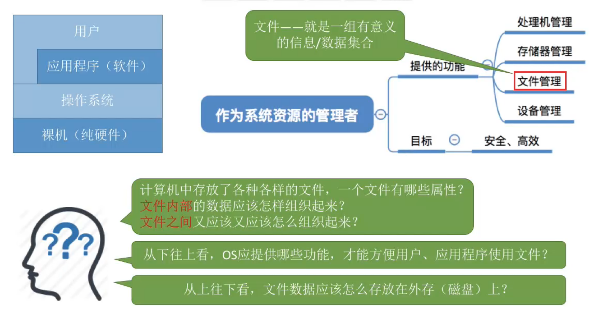

***

一个文件包含的属性：

```
文件名
    由创建文件的用户决定文件名，主要是为了方便用户找到文件
    同一目录下不允许有重名文件
标识符
    一个系统内的各文件标识符唯一，对用户来说毫无可读性，
    因此标识符只是OS用于区分哥哥文件的一种内部名称
类型
    指明文件的类型
位置
    文件存放的路径(让用户使用)
    在外存中的地址（OS使用，对用户不可见）
大小
    指明文件的大小
创建时间、上次修改时间
文件所有者信息
保护信息
    对文件进行保护的访问,控制信息
```

***

文件内部的数据怎样组织起来？

```无结构文件```如txt文件(由一些二进制或字符流组成，又称*流式文件*)

```有结构文件```如数据库表(由一组相似的记录组成，又称*记录式文件*),*记录*是一组相关数据项的集合，*数据项*是文件系统中最基本的数据单位

***

OS应该向上提供哪些功能？


可用几个基本操作完成更复杂的操作，如：*复制文件*：先创建一个新的空文件，再把源文件读入内存，再将内存中的数据写入新文件中

*** 

从上往下看，文件应该如何存放在外存？

与内存一样，外存也是由一个个存储单元组成，每个存储单元可以存储一定量的数据(如1B)。每个存储单元对应一个物理地址

类似于内存分为一个个*内存块*，外存会分为一个个“块/磁盘块/物理块”。每个磁盘块的大小是相等的，每块一般包含2的整数幂个地址(如，一块包含2**10个地址，即1KB)。同样类似的是，文件的逻辑地址也可以分为(逻辑块号，块内地址)，OS同样需要将逻辑地址转换为外存的物理地址(物理块号，块内地址)的形式。块内地址的位数取决于磁盘的大小

OS以*块*为单位为文件分配存储空间，因此即使一个文件大小只有10B,但它依然需要占用1KB的磁盘块。外存中的数据读入内存时同样以块为单位

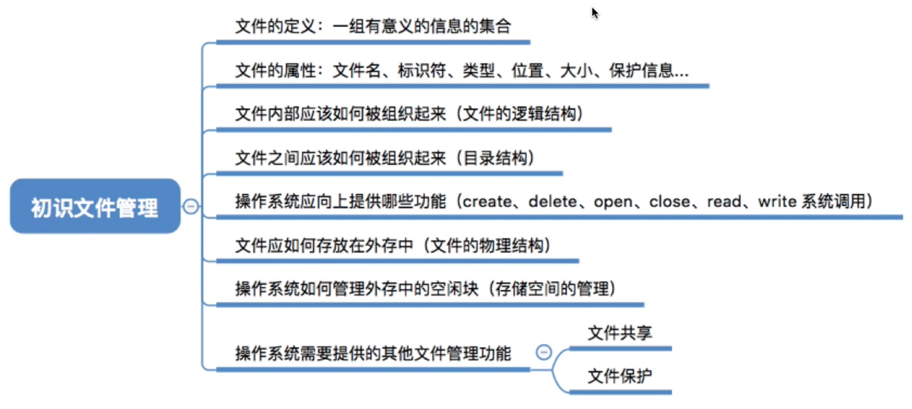


## 文件的结构


类似于数据结构的*逻辑结构*和*物理结构*，如“线性表”就是一种逻辑结构，在用户看来，线性表就是一组有先后关系的元素序列

“线性表”这种逻辑结构可以用不同的物理结构实现，如：顺序表/链表。顺序表的各个元素在逻辑上相邻，物理上也相邻。而链表的各个元素在物理上可以是不相邻的。因此，顺序表可以实现*随即访问*，而”链表“无法实现随即访问

可见，算法的具体实现与逻辑结构、物理结构都有关(文件也一样，文件操作的具体实现与文件的逻辑结构、物理结构都有关)

***

有结构文件

由一组相似的记录组成，又称```记录式文件```。每条记录由若干个数据项组成。如：数据库表文件。一般来说，每条记录有一个数据项可作为```关键字```。根据各条记录的长度(占用的存储空间)是否相等，又可以分为```定长记录```和```可变长记录```两种


***

顺序文件

```顺序文件```：文件中的记录一个接一个地顺序排列(逻辑上),记录可以是```定长```的或```可变长```的。这个记录在物理上可以```顺序存储```或```链式存储```

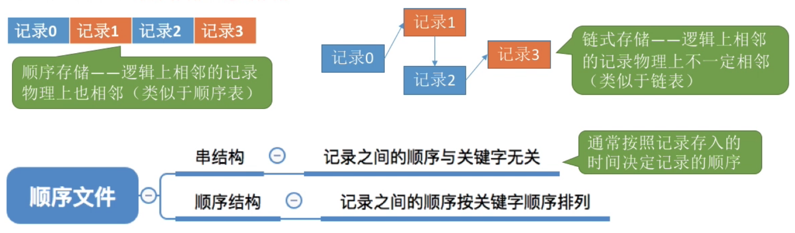
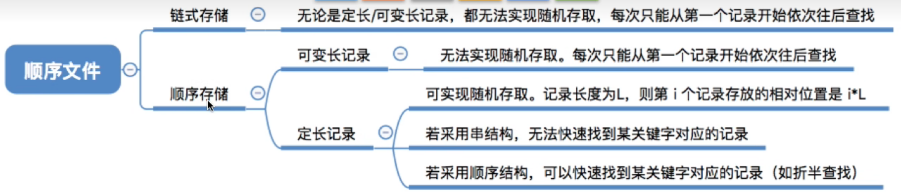

***

索引文件

对于可变长记录文件爱你，要找到第i个记录，必须先顺序查找前i-1个记录，但很多应用场景中又必须使用可变长记录。如何解决这个问题？

可以建立一张索引表以加快文件检索速度。每条记录对应一个索引项。文件中的这些记录在物理上可以离散地存放。

```索引表```本身是```定长记录的顺序文件```。因此可以快速找到第i个记录对应的索引项

可将关键字作为索引号内容，若按关键字顺序排列，则还可以支持按照关键字折半查找。

每当要增加/删除一个记录时，需要对索引表进行修改。由于索引文件有很快的检索速度，因此```主要用于对信息处理的及时性要求比较高的场合```

***

索引顺序文件

索引文件的缺点：每个记录对应一个索引表项，因此索引表可能会很大。比如：文件的每个记录平均只占8B,而每个索引表项占32个字节，那么索引表都要比文件内容本身大4倍，这样对存储空间的利用率就太低了

```索引顺序文件```是索引文件和顺序文件思想的结合。索引顺序文件中，同样会为文件建立一张索引表，但不同的是：并不是每个记录对应一个索引表项，而是```一组记录对应一个索引表项```

例如：学生记录按照学生姓名的开头字母进行分组。每个分组就是一个顺序文件，分组内的记录不需要按关键字排序

***

多级索引顺序文件

为了进一步提高检索效率，可以为顺序文件```建立多级索引表```。

例如：对于一个含10**6个记录的文件，可先为该文件建立一张低级索引表，每100个记录为彝族，故低级索引表中共10000个表项(即10000个定长记录)，再把这10000个定长记录分组每，每组100个，为其建立顶级索引表，故顶级索引表中共100个表项

此时，检索一个记录平均需要查找50+50+50 = 150次

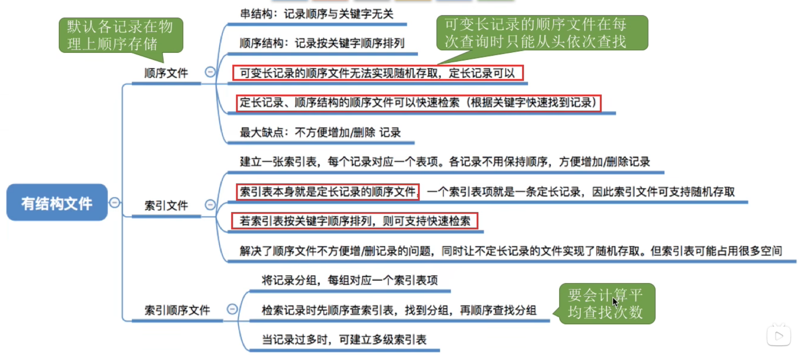

## 文件目录

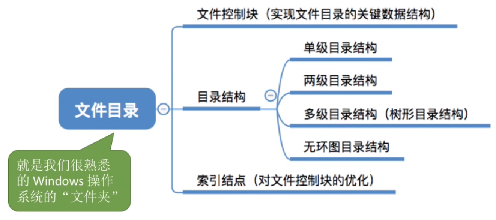

***

文件控制快
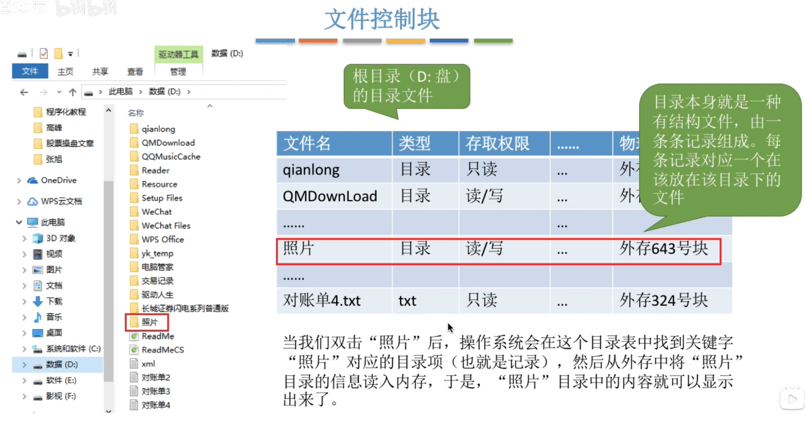
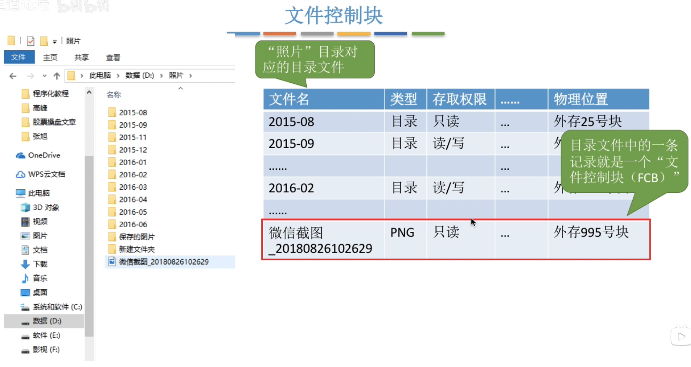

FCB的有序集合称为*文件目录*，一个FCB就是一个文件```目录项```

FCB中包含了文件的```基本信息```(文件名、物理地址、逻辑地址、物理结构等)，存取控制信息(是否可读/可写、禁止访问的用户名单等)，使用信息(如文件的建立时间、修改时间等)

```最重要```，```最基本的```还是```文件名、文件存放的物理地址```

需要对目录进行的操作：

```
搜索
    当用户要使用一个文件时，系统要根据文件名搜索目录，找到该文件对应的目录项
创建文件
    创建一个新文件时，需要在其所属的目录中增加一个目录项
删除文件
    当删除一个文件时，需要在目录中删除对应的目录项
显示目录
    用户可以请求显示目录的内容，如显示该目录中的所有文件及相应属性
修改目录
    某些文件属性保存在目录中，因此这些属性变化时需要修改相应的目录项
    如：文件重命名
```

***

单级目录结构

早期OS不支持多极目录，整个系统中只建立一张目录表，每个文件占一个目录项

单级目录实现了*按名存取*，但是```不允许文件重名```

在创建一个文件时，需要先检查目录表中有没有重名文件，确定不重名后才能允许建立文件，并将新文件对应的目录项插入到目录表中

显然，单级目录结构不适用于多用户OS

***

两级目录结构

早期的多用户OS,采用两级目录结构。分为```主文件目录```(Master File Directory,MFD)和```用户文件目录```(User File DIrectory,UFD)

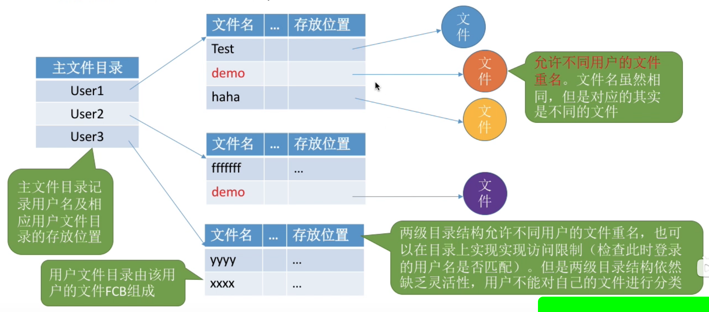

***

多极目录结构

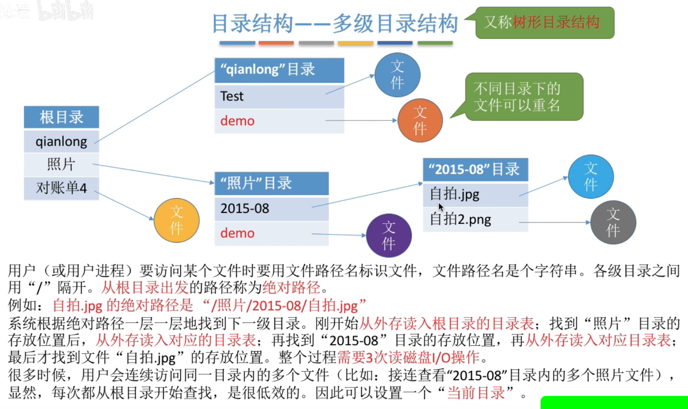

当前目录：例如：此时已经打开了”照片“的目录文件，也就是说，这张目录表已调入内存，那么可以把它设置为*当前目录*。当用户想要访问某个文件时，可以使用```从当前目录出发```的```相对路径```

引入```当前目录```和```相对路径```后，磁盘的IO次数减少了。这就提升了访问文件的效率

```树形目录结构```可以很方便地对文件进行分类，层次结构清洗，也能够更有效地进行文件的管理和保护。但是，树形结构```不便于实现文件的共享```。为此，提出了```无环图目录结构```

***

无环图目录结构

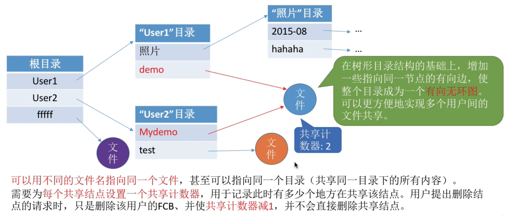
只有共享计数器减为0时，才能删除节点

NOTE：共享文件不同于复制文件。在```共享文件中，由于各用户指向的是同一个文件，因此只要其中一个用户修改了文件数据，那么所有用户都可以看到文件数据的变化```

***

索引节点(FCB的改进)

其实在查找各级目录的过程中只需要用到*文件名*这个信息，只有文件名匹配时，才需要读出文件的其他信息。

将除了文件名之外的文件描述信息都放入```索引节点```

假设一个FCB是64B,磁盘块的大小为1KB。，则每个盘块中只能存放16个FCB.若一个文件目录中共有640个目录项，则共需要占用640/16 = 40个盘块。因此按照某文件名检索该目录，平均需要查询320个目录项，```平均需要启动磁盘20次(每次磁盘IO读入一块)```

若使用```索引节点机制```，文件名占14B,索引节点指针站2B,则每个盘块可存放64个目录项，那么按文件名检索目录平均只需要读入320 / 62 = 5个磁盘块。显然，这```将大大提升文件检索速度```

当找到文件名对应的目录项时，才需要将索引节点调入内存，索引节点中记录了文件的各种信息，包括文件在外存中的存放位置，根据*存放位置*即可找到文件

存放```在外存中```的索引节点称为```磁盘索引节点```，当索引节点```放入内存```后称为```内存索引节点```。

相比之下```内存索引节点中需要增加一些信息```，比如：文件是否被修改、此时有几个进程正在访问该文件等


## 文件的物理结构


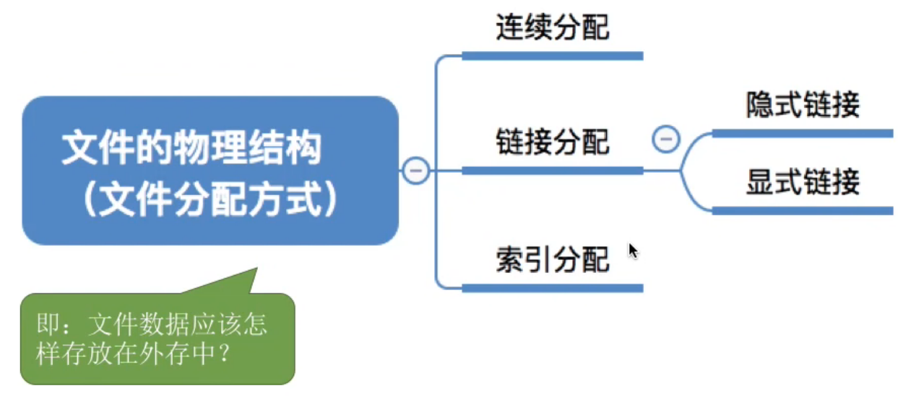

***

补充知识

类似于内存分页，磁盘中的存储单元也会被分为一个个”块/磁盘块/物理块“。很多OS中，```磁盘块的大小与内存块、页面的大小相同```

内存与磁盘之间的数据交换(即读写操作、磁盘IO)都是以*块*为单位进行的。即每次读入一块，或每次写出一块

在内存管理中，进程的逻辑地址空间被分为一个一个页面。同样的，在外存管理中，为了方便对文件数据的管理，```文件的逻辑地址空间也被分为了一个一个的文件块```。于是文件的逻辑地址可以表示为```(逻辑块号，块内地址)```的形式

若块的大小是1KB,则1MB大小的文件可以被分为1K个块

OS为文件分配存储空间都是以块为单位的

用户通过逻辑地址来操作自己的文件，操作系统要负责实现从逻辑地址到物理地址的映射

***

文件分配方式--连续分配

```连续分配```方式要求```每个文件在磁盘上占有一组连续的块```

用户通过逻辑地址操作自己的文件，OS如何实现从逻辑地址到物理地址的映射？

(逻辑块号，块内地址) -> (物理块号，块内地址)。只需要转换块号就行，块内地址保持不变

用户给出要访问的逻辑块号，OS找到该文件对应的目录项(FCB)。```物理块号 = 起始块号 + 逻辑块号```。当然，还需要检查用户提供的逻辑块号是否合法(逻辑块号 >= 长度 就不合法)

可以直接算出逻辑块号对应的物理块号，因此```连续分配支持顺序访问和直接访问(随机访问)```

读取某个磁盘块时，需要移动磁头。访问的两个磁盘块相隔越远，移动磁头所需时间越长

```连续分配的文件在顺序读写时速度最快```

连续分配的缺点

```
物理上采用连续分配的文件不方便扩展
存储空间利用率低，会产生难以利用的磁盘碎片
    (可以用紧凑来处理碎片，但是需要耗费很大的时间代价)
```

***

文件分配方式--链接分配

```链接分配```采取离散分配的方式，可以为文件分配离散的磁盘块。分为```隐式链接```和```显式链接```两种

隐式链接

目录中记录了问i按存放的起始块号和结束块号。当然，也可以增加一个字段来表示文件的长度

除了文件的最后一个磁盘块之外，每个磁盘块中都会保存指向下一个盘块的指针，这些指针对用户是透明的

用户给出要访问的逻辑块号i,OS找到该文件对应的目录项(PCB)。从目录项中找到起始块号(即0号块)，将0号逻辑块读入内存，由此知道1号逻辑块存放的物理块号， 于是读入1号逻辑块，再找到2号逻辑块的存放位置。。。依次类推。因此，读入i号逻辑块，总共需要i+1次磁盘IO

缺点：采用```链式分配(隐式链接)```方式的文件，```只支持顺序访问，不支持随机访问```，查找效率低。另外，指向下一个盘块的指针也需要耗费少量的存储空间

优点：方便文件拓展，不会有碎片问题，外存利用率高

***

显式链接

```显式链接```--把用于链接文件各物理块的指针显式地存放在一张表中，即```文件分配表(FAT,File Allocation Table)```.一个磁盘只会建立一张文件分配表。开机时文件分配表放入内存，并```常驻内存```

优点：方便文件拓展，不会有碎片问题，外存利用率高，并```支持随机访问```。相比于隐式链接来说，```地址转换时不需要访问磁盘，因此文件的访问效率更高```

缺点：文件分配表需要占用一定的存储空间

***

文件分配方式--索引分配

```索引分配```允许文件离散地分配在各个磁盘块中，系统会```为每个文件建立一张索引表```，索引表中```记录了文件的各个逻辑块对应的物理块```(索引表的功能类似于内存管理中的页表--建立逻辑页面到物理页面之间的映射关系)。索引表存放的磁盘块称为```索引块```。文件数据存放的磁盘块称为```数据块```

若文件太大，索引表项太多，可以采用以下三种方法解决

```链接方案```：如果索引表太大，一个索引块装不下，那么可以就爱那个多个索引块链接起来存放。```缺点```：若文件很大，索引表很长，就需要将很多个索引块链接起来。想要找到i号索引块，必须先依次读入0～i-1号索引块，这就导致磁盘IO次数过多，查找效率低下

```多层索引```：建立多层索引(*原理类似于多极页表*)。使用第一层索引块指向第二层的索引块。还可根据文件大小的要求再建立第三层、第四层索引块。采用K层索引结构，且```顶级索引表未调入内存```，则访问一个数据块只需要K+1次读磁盘操作。```缺点```：即使是小文件，访问一个数据块依然需要K+1次读磁盘

```混合索引```：多种索引分配方式的结合。例如：一个文件的顶级索引表中，既包含```直接地址索引```(直接指向数据块),又包含一个```一级间接索引```(指向单层索引表)、还包含```两级间接索引```(指向两层索引表)。```优点```：对于小文件来说，访问一个数据块所需要的读磁盘次数更少

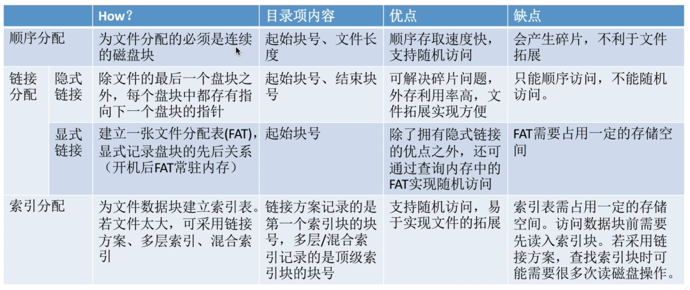

## 文件存储空间管理


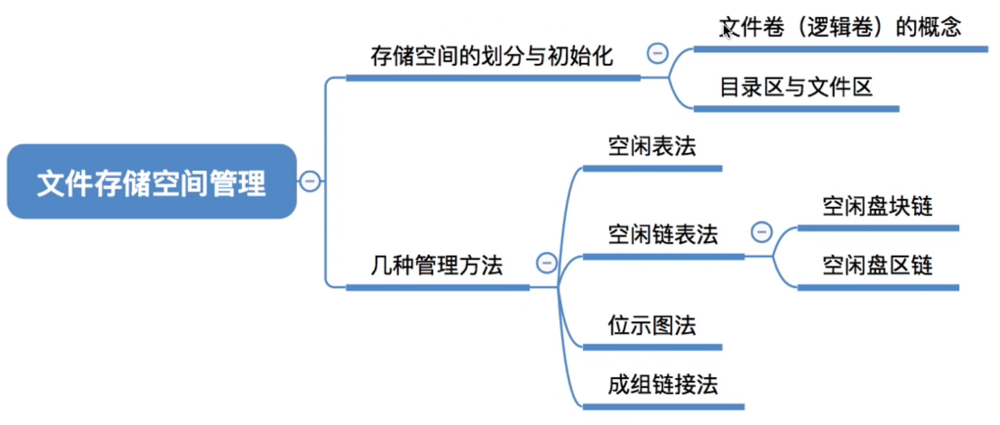

***

存储空间的划分与初始化
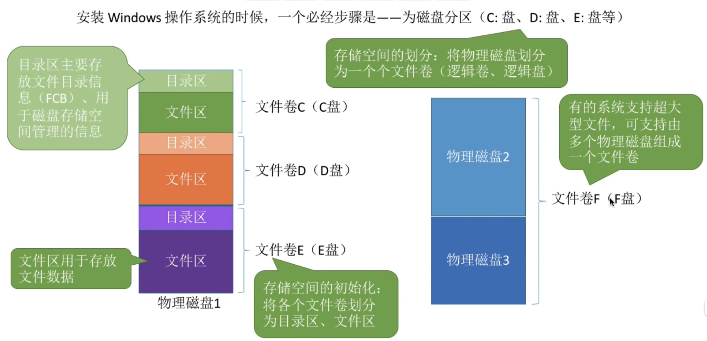
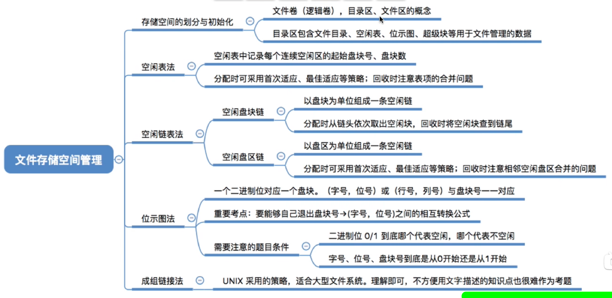

## 文件基本操作


***

创建文件

在Windows中创建文件，图形化交互进程在背后调用了```create系统调用```，进行create系统调用时，需要提供几个主要参数

1. 所需的外存空间大小(如：一个盘块，即1KB)
2. 文件存放路径(D:/Demo)
3. 文件名(Windows下默认为”新建文本本档.txt“)

OS在处理create系统调用时，主要做了两件事：

1. ```在外存中找到文件所需的空间```(结合上面的空闲链表法、位示图、成组链接法等噶u能力策略，找到空间空间)
2. 根据文件存放路径的信息找到该目录对应的目录文件(如D:/Demo)，在目录中```创建该文件对应的目录项```。目录项中包含了文件名、文件在外存中的存放位置等信息

***

删除文件

进行Delete系统调用，需要提供的几个参数：

1. 文件存放路径(D:/Demo)
2. 文件名(test.txt)

OS在处理Delete系统调用时，主要做了几件事：

1. 根据文件存放路径找到相应的目录文件，从目录中```找到文件名对应的目录项```
2. 根据该目录项记录的文件在外存的存放位置、文件大小等信息，```回收文件占用的磁盘块```。(回收磁盘块时，根据空闲表法、空闲链表法、位图法等管理策略的不同，需要做不同的处理)
3. 从目录表中```删除文件对应的目录项```

***

打开文件

很多OS中，在对文件进行操作之前，要求用户先使用open系统调用*打开文件*，需要提供的几个主要参数：

1. 文件存放路径(D:/Demo)
2. 文件名(test.txt)
3. 要对文件的操作类型(如：r 只读，rw 读写)

OS在处理open系统调用时，主要做了几件事：

1. 根据文件存放路径找到相应的目录文件，从目录中```找到文件名对应的目录项```，并检查该用户是否有指定的操作权限
2. ```将目录项复制到内存中的”打开文件表“中```。并将对应表目的编号返回给用户。之后```用户使用打开文件表的编号来知名要操作的文件```

之后用户进程再操作文件就```不需要每次都重新查目录了```，这样可以加快文件的访问速度

```打开文件表```有两张，一张是OS管理的，另一张是进程管理的。其中OS管理的打开文件表中，有一个```打开计数器```的字段，其作用如下

在Windows中，如果尝试删除某个txt,如果此时该文件已被某个*记事本进程*打开，则系统会提示*暂时无法删除该文件*。其实系统在背后做的事就是先检查了系统打开文件表，确认此时是否有进程正在使用该文件

***

关闭文件

进程使用完文件后，要*关闭文件*

OS在处理Close系统调用时，主要做了几件事：

1. 将进程的打开文件表相应表项删除
2. 回收分配给该文件的内存空间等资源
3. 系统打开文件表的打开计数器count-1,若count=0,则删除对应表项

***

读文件

进程使用read系统调用，需要指明哪个文件(在支持*打开文件*操作的系统中，秩序i要提供文件在打开文件表中的索引号即可),还需要知名要读入多少数据(如：读入1KB)、指明读入的数据要放在内存中的什么位置

OS在处理read系统调用时，会从读指针指向的外存中，将用户指定大小的数据读入用户指定的内存区域中

***

写文件

进程使用write系统调用完成写操作，需要指明是哪个文件(在支持*打开文件*操作的系统中，只需要提供文件在打开文件表中的索引号即可)，还需要指明要写多少数据(如：写1KB)、写回外存的数据要放在内存中的什么位置

OS在处理write系统调用时，会从用户指定的内存区域中，将指定大小的数据写回写指针指向的外存

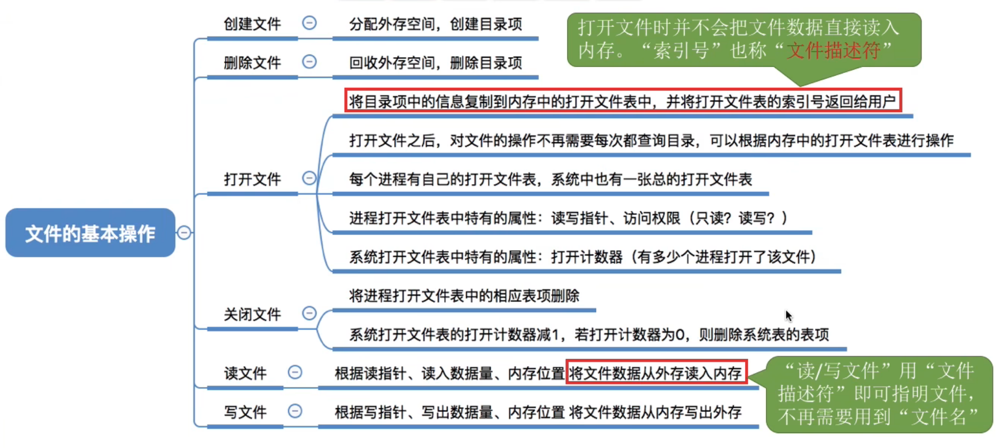

## 文件共享

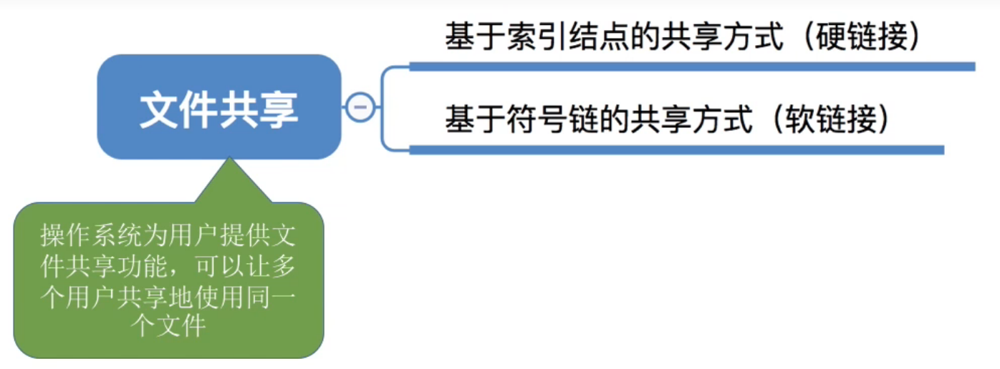
note：多个用户共享一个文件，意味着系统中只有*一份*文件数据。并且只要某个用户修改了该文件的数据，其他用户也可以看到文件数据的变化

如果是多个用户都*复制*了同一个文件，那么系统中会有*好几份*文件数据。其中一个用户修改了自己的那份文件数据，对其他用户的文件数据并没有影响

***

基于索引节点的共享方式（硬链接）

知识回顾：索引节点，是一种文件目录瘦身策略。由于检索文件时只需要用到文件名，因此可以将除了文件名之外的其他信息放到索引节点中。这样目录项就只需要包含文件名、索引节点指针

***

基于符号链的共享方式（软链接）

略

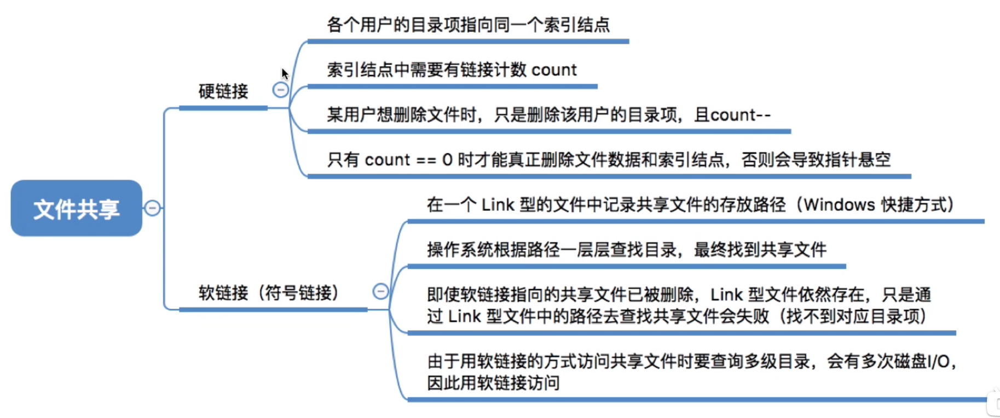

## 文件保护

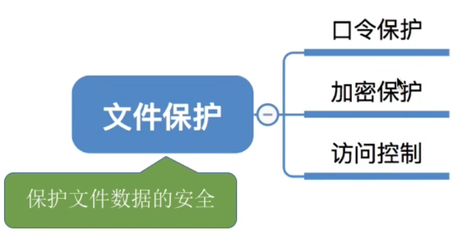

口令保护

为文件设置一个*口令*(如abc123)，用户请求访问该文件时必须提供*口令*

口令一般存放在文件对应的FCB或索引节点中。用户访问文件前需要先输入*口令*，OS会将用户提供的口令与PCB中存储的口令进行对比，如果正确，则允许该用户访问文件

优点：保存口令的空间开销不多，验证口令的时间开销也很小

缺点：正确的*口令*存放在系统内部，不够安全

***

加密保护

使用某个*密码*对文件进行加密，在访问文件时需要提供正确的*密码*才能对文件进行正确的解密。

优点：保密性强，不需要在系统中存储*密码*

缺点：编码/译码，或者说加密/解密要花费一定时间

***

访问控制

在每个文件的FCB(或索引节点)中增加一个```访问控制表```(Access-Control List,ACL),该表记录了各个用户可以对该文件执行哪些操作

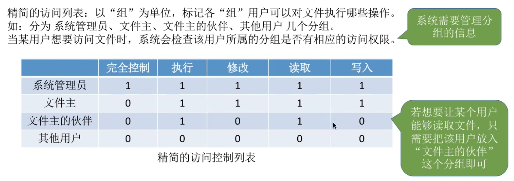
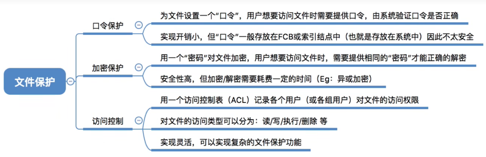
NOTE:如果对某个目录进行了访问权限的控制，那也要对目录下的所有文件进行相同的访问权限控制

## 文件系统的层次结构

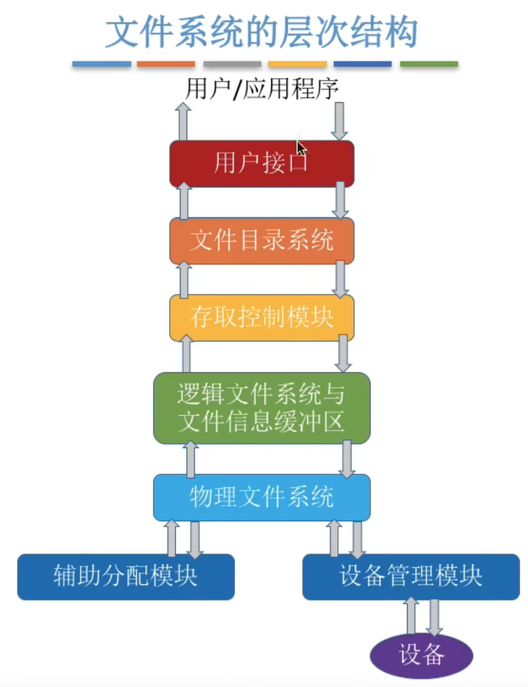

- 用户接口

文件系统需要向上层的用户提供一些简单易用的功能接口。这层就是用于处理用户发出的系统调用请求(Read,Write,Open,Close等系统调用)

- 文件目录系统

用户是通过文件路径来访问文件的，因此这一层需要根据用户给出的文件路径找到相应的FCB或索引节点。所有和目录、目录项相关的管理工作都在本层完成，如：管理活跃的文件目录表、管理打开文件表等

- 存取控制模块

为了保证文件数据的安全，还需要验证用户是否有访问权限。这一扯个主要完成了文件保护相关功能

- 逻辑文件系统与文件信息缓冲区

用户知名想要访问文件记录号，这一层需要将记录好转换为对应的逻辑地址

- 物理文件系统

这一层需要把上一层提供的文件逻辑地址转换为实际的物理地址

- 辅助分配模块

负责文件存储空间的管理，即负责分配和回收存储空间

- 设备管理模块

直接与硬件交互，负责和硬件直接相关的一些管理工作。如：分配设备、非配设备缓冲区、磁盘调度、启动设备、释放设备等。


## 磁盘的结构

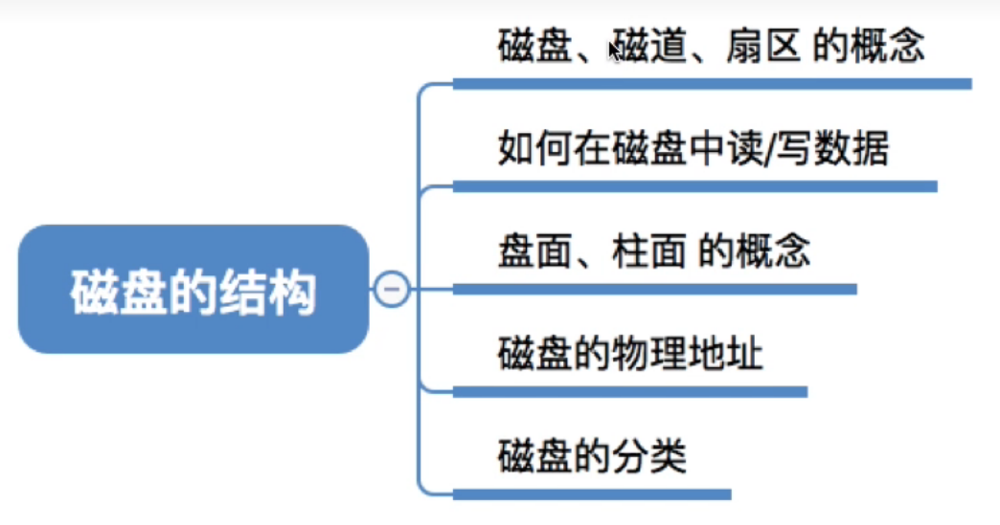

- 磁盘、磁道、扇区
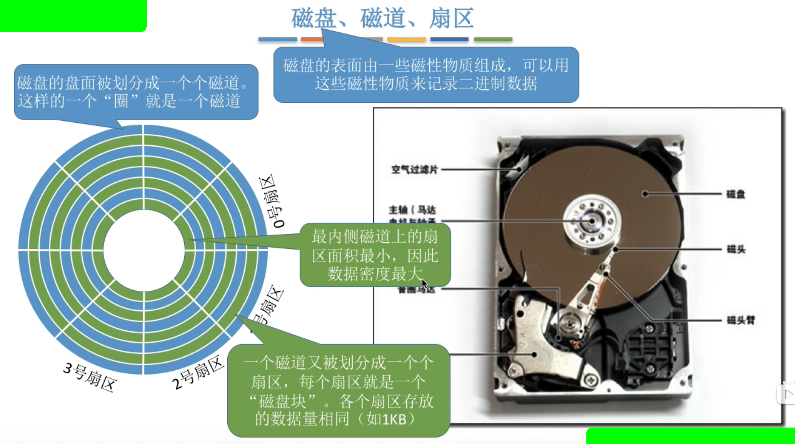

- 磁盘的物理地址
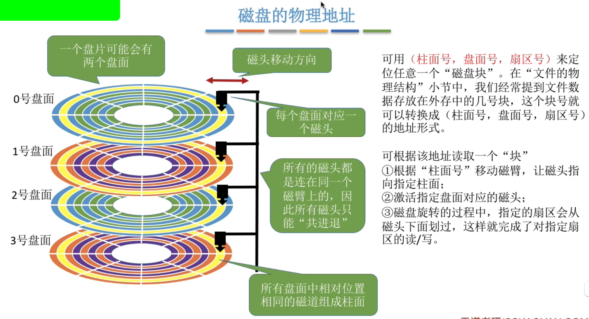

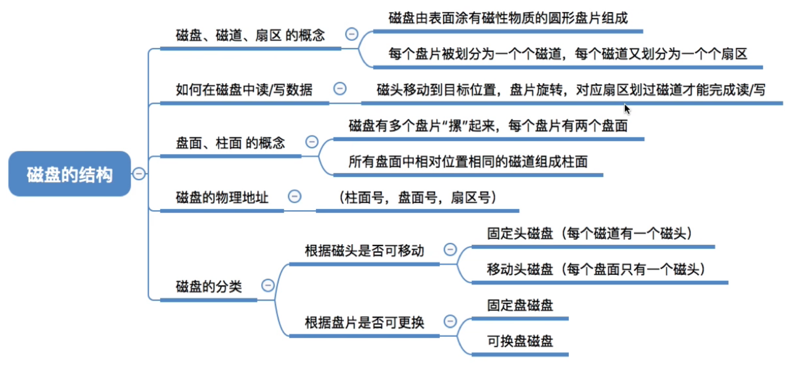

## 磁盘调度算法

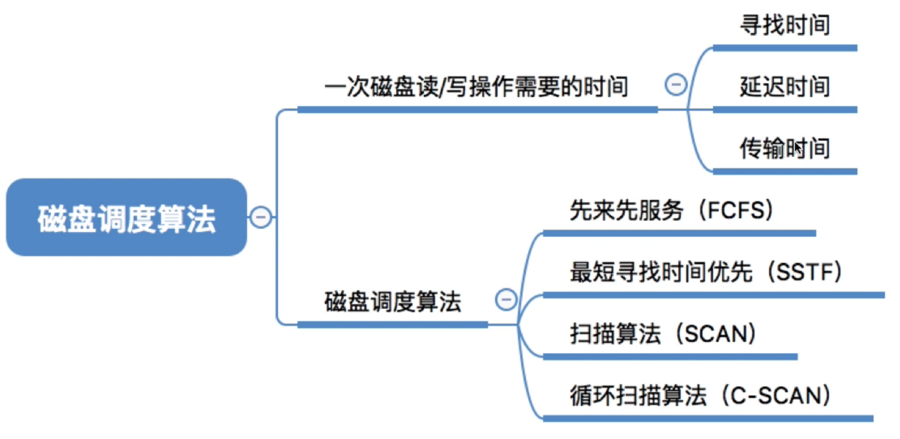

- 一次磁盘读写时间

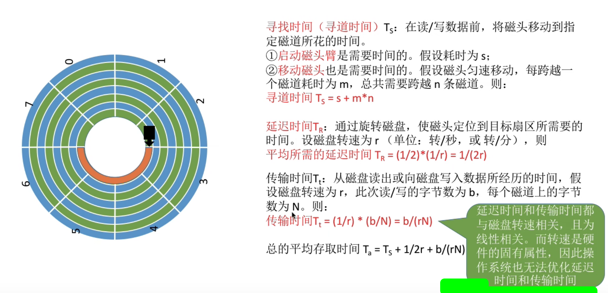

***

- 先来先服务算法(FCFS)

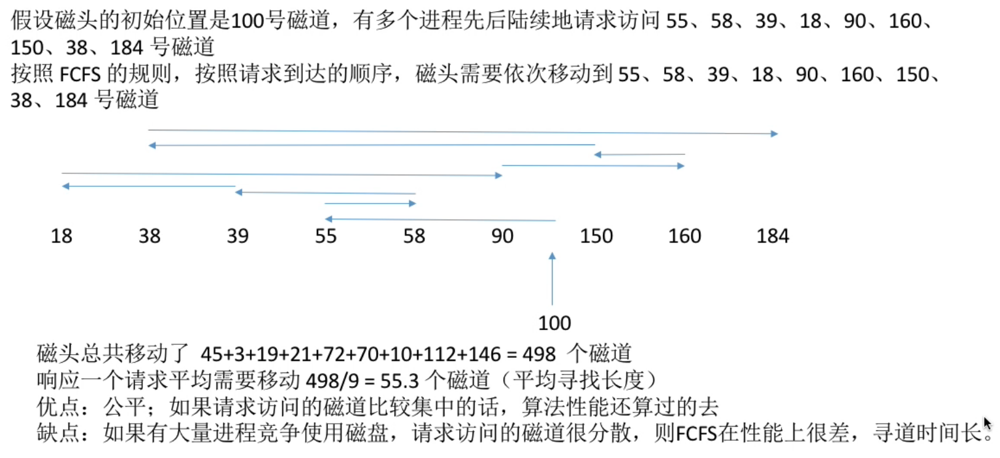

- 最短寻找时间优先(SSTF)
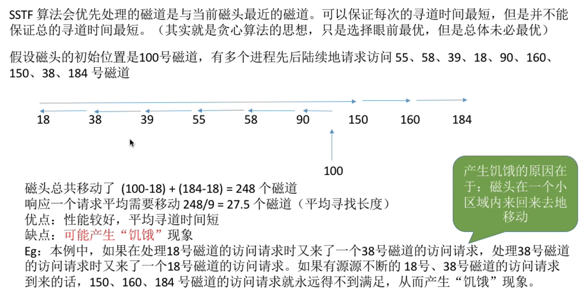

- 扫描算法(SACN)

SSTF算法会产生饥饿的原因在于：磁头有可能在一个小区域内来回移动。为了防止这个问题，可以规定，```只有磁头移动到最外侧磁道的时候才能往内移动，移动到最内侧磁道的时候才能往外移动```。这就是```扫描算法(SACN)```的思想。由于磁头移动的方式很像电梯，因此也叫```电梯算法```

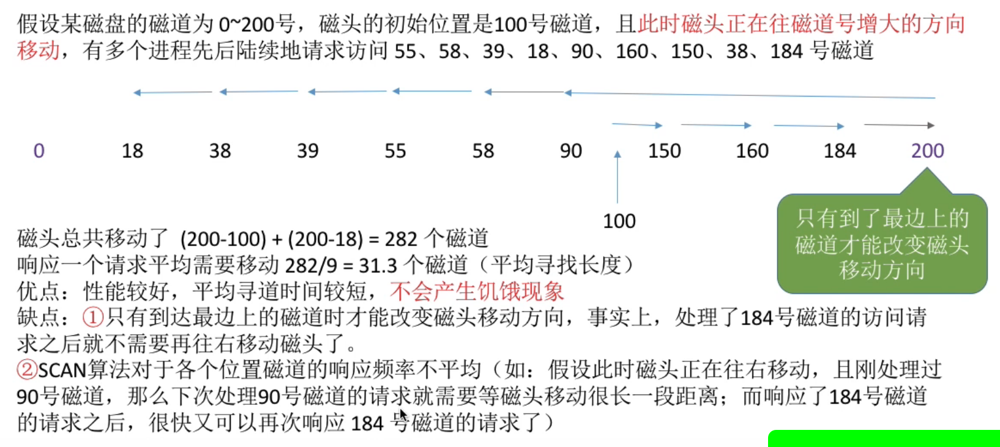

- LOOK调度算法

```扫描算法(SCAN)```中，只有到达最边上的磁道时才能改变磁头移动方向，事实上，处理了194号磁道的访问请求之后就不需要再往右移动磁头了。```LOOK调度算法```就是为了解决这个问题，```如果在磁头移动方向上已经没有别的请求，就可以立即改变磁头移动方向```。(边移动边观察，因此叫LOOK)

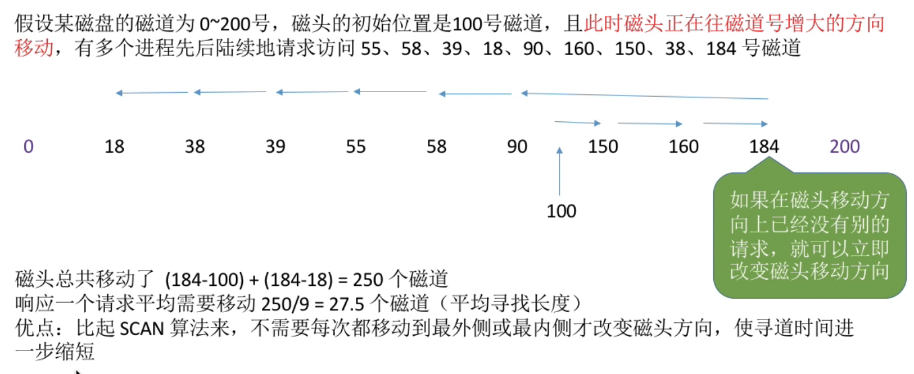

- 循环扫描算法(C-SCAN)

SCAN算法对于各个位置磁道的相应频率不平均，而C-SCAN算法就是为了解决这个问题。规定只有磁头朝某个特定方向移动时才能处理磁道访问请求，而```返回时直接快速移动至起始端而不处理任何请求```

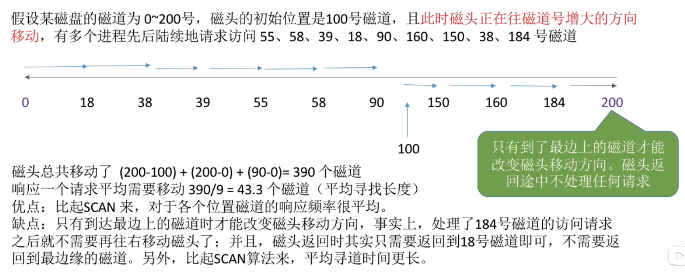

- C-LOOK调度算法
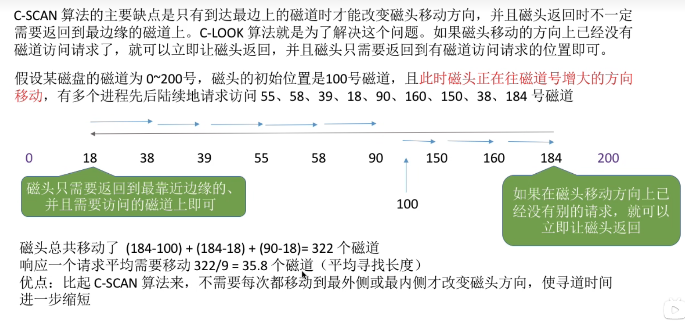


## 减少磁盘延迟时间


磁头读入一个扇区数据后需要一小段时间处理，如果逻辑上相邻的扇区在物理上也相邻，则读入几个连续的逻辑山区，可能需要很长的*延迟时间*

***

- 减少延迟时间的方法：交替编号

若采用交替编号的策略，即让逻辑上相邻的扇区在物理上有一定的间隔，可以使读取连续的逻辑扇区所需要的延迟时间更小

***

- 磁盘地址结构的设计

为什么磁盘的物理地址是(柱面号，盘面号，扇区号)。而不是(盘面号，柱面号，扇区号)

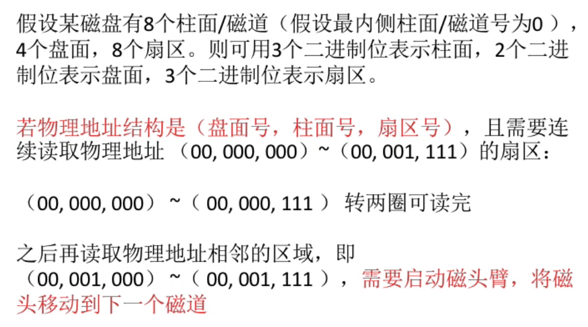


读取地址连续的磁盘块时，采用(柱面号，盘面号，扇区号)的地址结构可以减少磁头移动消耗的时间

***

- 减少延迟时间的方法：错位命名

若相邻的盘面相对位置相同处扇区编号相同,读取完磁盘块(000,00,111)之后，需要暂短的时间处理，而盘面又在不停地转动，因此当(000,01,000)第一次划过1号盘面的磁头下方时，并不能读取数据，只能再等该扇区再次划过磁头

采用错位命名法，因此读取完磁盘块(000,00,111)之后，还有一段时间处理，当(000,01,000)第一次划过1号盘面的磁头下方时，就可以直接读取数据。从而减少了延迟时间

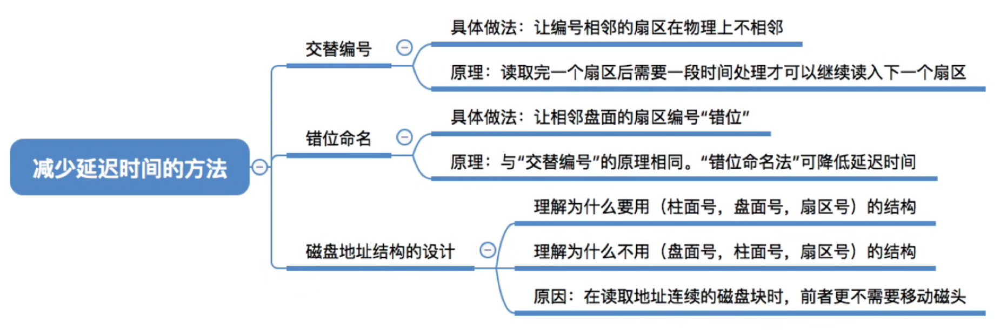

## 磁盘管理


- 磁盘初始化

Step1：进行```低级格式化```(物理格式化)，将磁盘的各个磁道```划分扇区```。一个扇区通常可分为头、数据区域(如512B大小)、尾三个部分组成。管理扇区所需要的各种数据结构一般存放在头、尾两个部分，包括扇区校验码(如奇偶校验、CRC循环冗余校验码等，校验码用户校验扇区中的数据是否发生错误)

Step2:将磁盘分区，每个分区由若干柱面组成(即分为我们熟悉的C盘、D盘)

Step3：进行```逻辑格式化```，创建文件系统。包括创建文件系统的根目录、初始化存储空间管理所用的数据结构(如 位示图、空闲分区表)

***

- 引导块

计算机开机时需要进行一系列初始化的工作，这些初始化工作是通过执行```初始化程序(自举程序)```完成的

初始化程序可以放在ROM(只读存储器)中。ROM中的数据在出厂时就写入了，并且```以后不能再修改```，ROM一般是出厂时就集成在主板上的

万一需要更新自举程序，将会很不方便，因为ROM中的数据无法更改,解决如下：

ROM中之存放很小的*自举装入程序*，开机时计算机先运行*自举装入程序*，通过执行该程序就可找到引导块，并将完整的*自举程序*读入内存，完成初始化

完整的自举程序放在磁盘的启动块(即引导块/启动分区)上，启动块位于磁盘的固定位置。拥有启动分区的磁盘称为```启动磁盘```或```系统磁盘(C盘)```

***

- 坏块管理

坏了、无法使用的扇区就是坏块，这属于硬件故障，OS无法修复。

对于简单的磁盘，可以在逻辑格式化时(建立文件系统时)对整个磁盘进行坏块检查，标明哪些扇区是坏扇区，比如：在FAT表上标明(在这种方式中，```坏块对OS不透明```)

对于复杂的磁盘，磁盘控制器(磁盘设备内部的一个硬件部件)会维护一个坏块链表。在磁盘出场前进行低级格式化(物理格式化)时就将坏块链进行初始化。会保留一些*备用扇区*，用于替换坏块。这种方案称为```扇区备用```。且这种处理方式中，```坏块对OS透明```

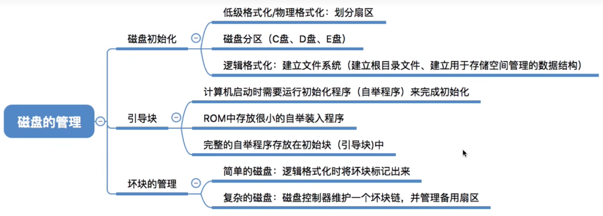


