## 内存

程序执行前```需要先放到内存中才能被CPU处理```


```相对地址```又称```逻辑地址```，```绝对地址```又称```物理地址```

***

装入的三种方式(用3种不同方式完成```逻辑地址到物理地址的转换```)
1. 绝对装入
2. 静态重定位
3. 动态重定位

绝对装入：在编译时，如果知道程序将放在内存中的哪个位置，编译程序将产生绝对地址的目标代码。装入程序按照装入模块中的地址，将程序和数据装入内存

程序中使用的绝对地址，可在编译或会汇编时给出，也可由程序员直接赋予。通常都是编译或汇编时再转换为绝对地址

绝对装入```只适用于单道程序环境```

***

静态重定位

```静态重定位```：又称```可重定位装入```。编译、链接后的装入模块的地址都是从0开始的，指令中使用的地址、数据存放的地址都是相对于起始地址而言的逻辑地址。可根据内存的当前情况，将装入模块装入到内存的适当位置。装入时对地址进行*重定位*，将逻辑地址变换为物理地址(地址变换实在装入时一次完成的)

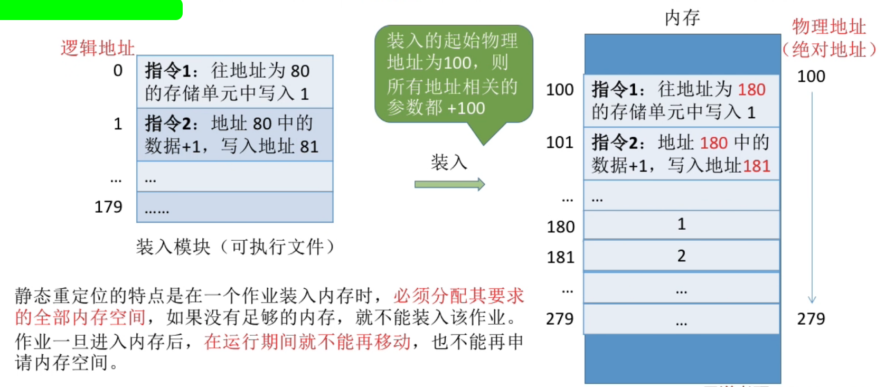

***

动态重定位

```动态重定位```：又称```动态运行时装入```。编译、链接后的装入模块的地址都是从0开始的。装入程序把装入模块装入内存后，并不会立即把逻辑地址转换为物理地址，而是```把地址转换推迟到程序真正要执行时才进行```。因此装入内存后所有的地址依然是逻辑地址。这种方式需要一个```重定位寄存器```的支持

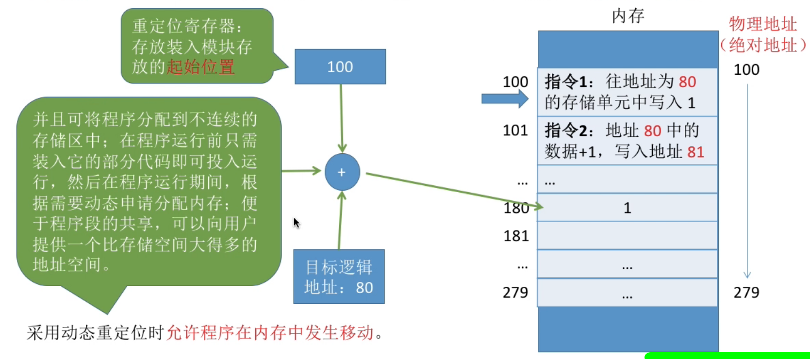

***

进程运行的基本原理

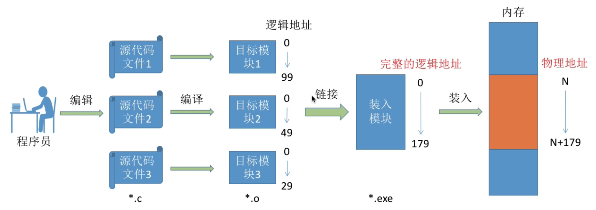

编译：由编译程序将用户源代码编译成若干个目标模块(编译就是把高级语言```翻译为机器语言```)

链接：由链接程序将编译后形成的一组目标模块，以及所需库函数链接在一起，形成一个完整的装入模块

装入(装载):由装入程序将装入模块装入内存运行

***

链接的三种方式

1. 静态链接：在程序运行之前，先将各目标模块及他们所需的库函数链接成一个完整的可执行文件(装入模块)，之后不再拆开
2. 装入时动态链接：将各目标模块装入内存时，边装入边链接的链接方式
3. 运行时动态链接：在程序执行中需要该目标模块时，才对它进行链接。其优点是便于修改和更新，便于实现对目标模块的共享

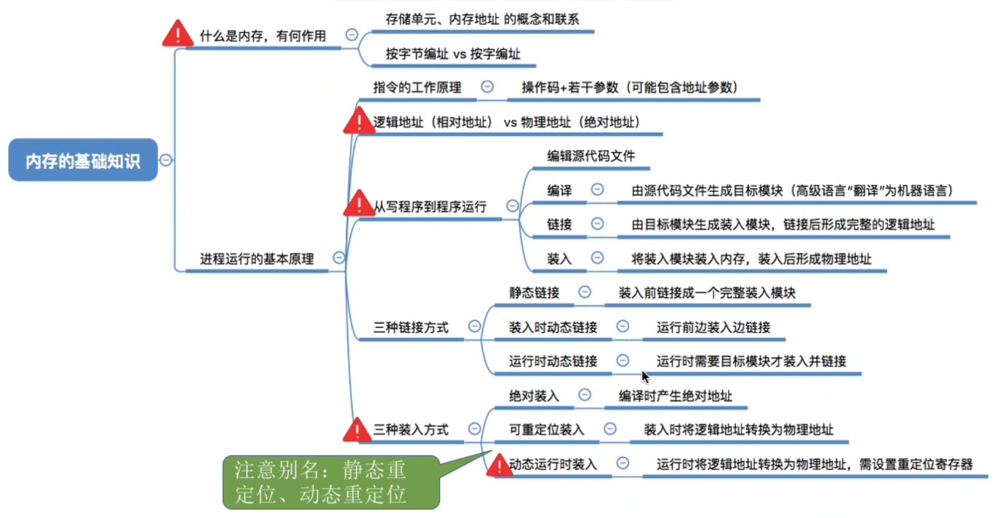

## 内存管理

操作系统作为系统资源的管理者，当然也需要对内存进行管理，要管理什么？

- 操作系统要怎么记录哪些内存区域已经被分配出去了，哪些又还空闲？
- 很多位置都可以放，应该放在哪里？
- 当进程运行结束后，如何将进程占用的内存空间回收？

1. 操作系统负责```内存空间的分配与回收```
2. 操作系统需要提供某种技术从逻辑上```对内存空间进行扩充```
3. 操作系统需要提供```地址转换功能```，负责程序的逻辑地址与物理地址的转换
4. 操作系统需要提供```内存保护```功能。保证各进程在各自存储空间内运行，互不干扰

#### 内存保护

假设此刻内存中有2各进程，进程1的落地址空间为0～179,实际物理地址空间为100～279

内存保护可采取两种方法：

1. 在CPU中```设置一对上、下限寄存器```，存放进程的上、下限地址。进程的指令要访问某个地址时，CPU检查是否越界

2. 采用```重定位寄存器```(又称基址寄存器)和```界地址寄存器```(又称限长寄存器)进行越界检查。重定位寄存器中存放的是进程的```起始物理地址```。界地址寄存器中存放的是进程的```最大逻辑地址```


#### 覆盖与交换

覆盖技术

早期的计算机内存很小，比如IBM推出的第一台PC机最大只支持1MB大小的内存。因此经常出现内存不够的情况

后来人们引入了```覆盖技术```，用来```解决程序大小超过物理内存总和的问题```

覆盖技术的思想：将```程序分为多个段```(多个模块)。常用的段常驻内存，不常用的段在需要时调入内存

内存中分为```一个固定区```和```若干个覆盖区```。需要常驻内存的段放在```固定区```,```调入后就不再调出```(除非运行结束)。不常用的段放在```覆盖区```，```需要用到时调入内存，用不到时调出内存```

***

交换技术

交换(对换)技术的设计思想：内存空间紧张时，系统将内存中某些进程暂时```换出```外存，把外存中某些已具备与西宁条件的进程```换入```内存(进程在内存与磁盘间动态调度)

```中级调度(内存调度)```，就是要决定将哪个处于挂起状态的进程重新调入内存

暂时换出外存等待的进程状态为```挂起状态(挂起态，suspend)```。挂起态又可以进一步细分为```就绪挂起、阻塞挂起```两种状态（进程七状态模型）

- 应该在外存的什么位置保存被换出的进程？

具有对换功能的OS中，通常把外存分为```文件区```和```对换区```两部分。

```文件区```主要用于存放文件，```主要追求存储空间的利用率```，因此对文件区空间的管理```采用离散分配方式```。

```对换区```空间只占外存的小部分，```被换出的进程数据就存放在对换区```。由于对换的速度直接影响到系统的整体速度，因此对换区空间的管理```主要追求换入换出速度```，因此通常对换区```采用连续分配方式```。总之，```对换区的IO速度比文件区的更快```

- 什么时候应该交换？

交换通常在许多进程运行且内存吃紧时进行，而系统负荷降低就暂停。

例如：在发现许多进程运行时经常发生缺页，说明内存紧张，此时可以换出一些进程，如果缺页率明显下降，就可以暂停换出

- 应该换出哪些进程？

可以优先换出阻塞进程，可换出优先级低的进程，为了放置优先级低的进程在被调入内存后很快又被换出，有的系统还会考虑进程在内存的驻留时间

```NOTE：PCB会常驻内存```，不会被换出外存

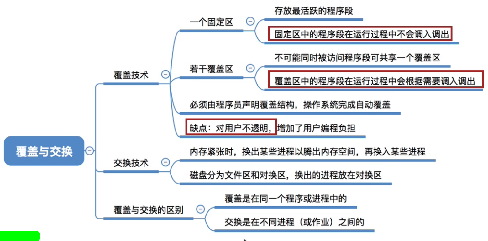

#### 连续分配管理

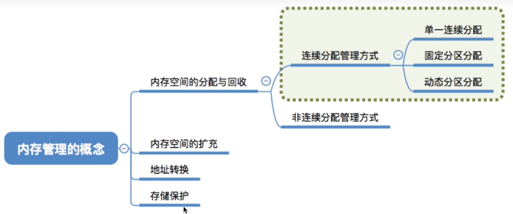

```连续分配```：指为用户进程分配的必须是一个```连续的内存空间```

***

单一连续分配

在单一连续分配方式中，内存被分为```系统区```和```用户区```。系统取通常位于内存的低地址部分，用于存放OS相关数据，用户区用于存放用户进程相关数据

内存中```只能有一道用户程序```,用户程序独占整个用户区空间。

优点：实现简单，```无外部碎片```。可以采用覆盖技术扩充内存，不一定需要采取内存保护

缺点：只能用于但用户、单任务的OS中，有```内部碎片```，存储器利用率极低

***

固定分区分配

20世纪60年代出现了支持多道程序的系统，为了能在内存中装入多道程序，且这些程序之间又不会相互干扰，于是将整个```用户空间```划分为```若干个固定大小的分区```，在```每个分区中只装入一道作业```，这样就形成了最早的、最简单的一种可运行躲到程序的内存管理方式

- 固定分区分配
    * 分区大小相等
    * 分区大小不等

分区大小相等：缺乏灵活性，但是很```适合用于用一台计算机控制多个相同对象的场合```

分区大小不等：增加了灵活性，可以满足不同大小的进程需求。根据常在系统中运行的作业大小情况 进行划分

OS需要建立一个数据结构--```分区说明表```，来实现各个分区的分配与回收。每个表项对应一个分区，通常按分区大小排列。每个表项包括对应分区的```大小、起始地址、状态(是否已分配```)

当某用户程序要装入内存时，由OS内核程序根据用户程序大小检索该表，从中找到一个能满足大小的、未分配的分区，将之分配给该程序，然后修改状态为*已分配*

优点：实现简单，无外部碎片

缺点：当用户程序太大时，可能所有的分区都不能满足需求，此时不得不采用覆盖技术来解决，但这又会降低性能。```会产生内部碎片```，内存利用率低

***

动态分区分配

```动态分区分配```又称为```可变分区分配```。这种分配方式```不会预先划分内存分区```，而是在进程装入内存时，```根据进程的大小动态地建立分区```，并使分区的大小正好适合进程的需要。因此系统分区的大小和数目是可变的

动态分区分配```没有内部碎片```，但是有```外部碎片```

```内部碎片```：分配给某进程的内存区域中，如果有些部分没有用哈桑

```外部碎片```：指内存中的某些空闲分区由于太小而难以利用

如果内存中空闲空间的总和本来可以满足某进程的要求，但由于进程需要的是一整块连续的内存空间，因此这些*碎片*不能满足进程的需求

可以通过```紧凑(拼凑，Compaction)技术来解决外部碎片

- 系统要使用什么样的数据结构记录村内的使用情况？

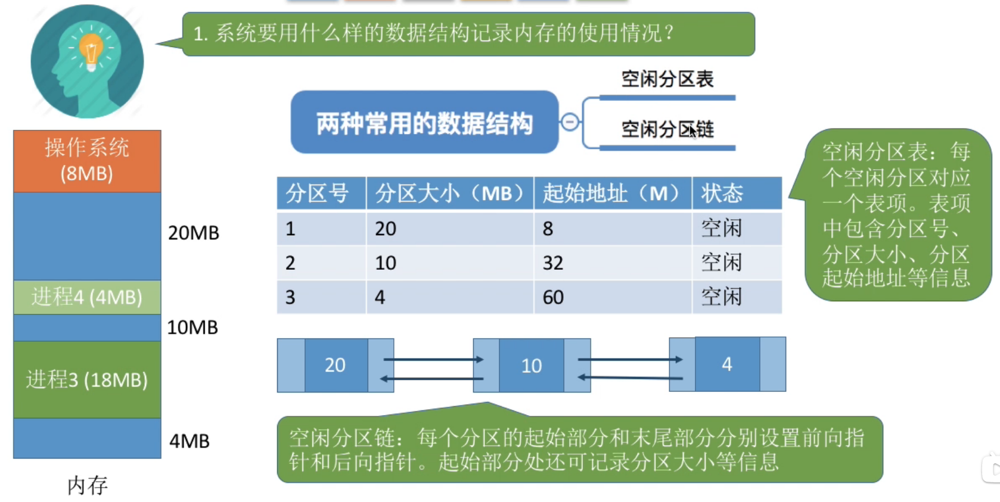

- 当很多个空闲分区都能满足需求时，应该选择哪个分区进行分配？

把一个新作业装入内存时，需按照一定的```动态分区分配算法```，从空闲分区表(或空闲分区链)中选出一个分区分配给该作业。后面有4中分配方式


- 如何进行分区的分配与回收操作？

略


#### 动态分区分配

```动态分区分配算法```：在动态分区分配方式中，当很多个空闲分区都能满足需求时，应该选择哪个分区进行分配？


首次适应算法

算法思想：每次都从低地址开始查找，找到第一个能满足大小的空闲分区。

如何实现：```空闲分区以地址递增的次序排列```。每次分配内存时顺序查找```空闲分区链```(或空闲分区表)，找到大小能满足要求的第一个空闲分区

***

最佳适应算法

算法思想：由于动态分区分配是一种连续分配方式，为各进程分配的空间必须是连续的一整区域。因此为了保证当*大进程*到来时能有连续的大片空间，可以尽可能多地留下大片的空闲区，即，有限使用更小的空闲区。

如何实现：空闲分区```按容量底层次序链接```。每次分配内存时顺序查找```空闲分区链```(或空闲分区表)，找到大小能满足要求的第一个空闲分区

缺点：每次都选最小的分区进行分配，会留下越来越多的，很小的，难以利用的内存块。因此这种这种方法会产生很多的外部碎片

***

最坏适应算法又称```最大适应算法```(Largest Fit)

算法思想：为了解决最佳适应算法的问题--即留下太多难以利用的小碎片，可以在每次分配时优先使用最大的连续空闲区，这样分配后剩余的空闲区就不会太小，更方便使用。

如何实现：空闲分区```按容量递减次序链接```。每次分配内存时顺序查找```空闲分区链```(或空闲分区表)，找到大小能满足要求的第一个空闲分区

缺点：每次都选最大的分区进行分配，虽然可以让分配后留下的空闲区更大，更可用，但这种方法会导致较大的连续空闲区被迅速用完。如果之后有*大进程*到达，就没有内存分区可用了

***

邻近适应算法

算法思想：首次适应算法每次都从链头开始查找。这可能会导致低地址部分出现很多小的空闲分区，而每次分配查找时，都要经过这些分区，因此也增加了查找的开销。如果每次都从赏赐查找结束的位置开始检索，就能解决上述问题

如何实现：空闲分区以地址递增的顺序排列(可排成一个循环链表)。每次分配内存时```从上次查找结束的位置开始```查找```空闲分区链```(或空闲分区表)，找到大小能满足要求的第一个空闲分区

首次适应算法每次都要从头查找，每次都需要检索低地址的小分区。但是这种规则也决定了当低地址部分有更小的分区可以满足需求时，会更有可能用到低地址部分的小分区，也会更有可能把高地址部分的大分区保留下来(最佳适应算法的优点)

邻近适应算法的规则可能会导致无论低地址、高地址部分的空闲分区都有相同的概率被使用，也就导致了高地址部分的大分区更可能被使用，划分为小分区，最后导致无大分区可用(最大适应算法的缺点)

综合来看，```四种算法中，首次适应算法的效果反而更好```


## 分页存储

基本概念：

连续分配方式的缺点：

1. 固定分区分配：缺乏灵活性，会产生大量的内部碎片，内存的利用率很低
2. 动态分区分配：会产生很多外部碎片，虽然可以用*紧凑*技术来处理，但是*紧凑*的时间代价很高

如果允许将一个进程分散地装入到许多不喜爱你桂林的分区中，便可充分地利用内存，而无需再进行*紧凑*

基于这一思想，产生了*非连续分配方式*，或称为*离散分配方式*

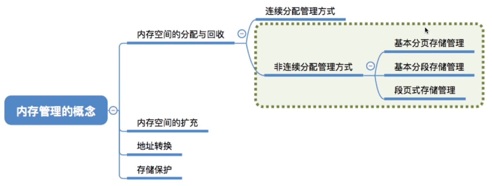

```连续分配```：为用户进程分配的必须是一个```连续的内存空间```
```非连续分配```：为用户进程分配的可以是一些```分散的内存空间```

***

把*固定分区分配*改造为*非连续分配版本*


将内存空间分为一个个```大小相等的分区```(比如：每个分区4KB)，每个分区就是一个```页框```，或称```页帧```、```内存块```、```物理块```。每个页框有一个编号，即```页框号```(或内称内存块号、页帧号、物理块号)，页框号```从0开始```

将用户进程的地址空间也分为```与页框大小相等```的一个个区域，称为```页```或```页面```。每个页面也有一个编号，即```页号```，页号也是```从0开始```。(note：进程的最后一个页面可能没有一个页框那么大。因此，```页框不能太大，否则可能产生过大的内存碎片```)

OS```以页框为单位为各个进程分配```内存空间。进程的每个页面分别放入一个页框中。也就是说，进程的```页面```与内存的```页框```有```一一对应```的关系

各个页面必须连续存放，也不惜按先后顺序来，可以放到不相邻的各个页框中

***

如何实现地址的转换？

进程在内存中```连续存放时```，OS是通过重定位寄存器(存放装入模块存放的*起始位置*)来实现逻辑地址到物理地址的转换的

思想：模块在内存中的```起始地址``` + 目标内存单元相对于起始位置的```偏移量```


```
页号 = 逻辑地址 / 页面长度(取出发的 整数 部分)
页号 = 80 / 50 = 1

页内偏移量 = 逻辑地址 % 页面长度 (取除法的 余数 部分)
页内偏移量 = 80 % 50 = 30
页面 在内存中的起始位置：
    OS需要用某种数据结构记录进程各个页面的起始位置
1号页在内存中存放的 起始位置 450

为了方便计算页号、页内偏移量，页面大小一般设置为 2的整数幂
```


***

上面图片可以算出逻辑地址对应的页号，逻辑地址在页面内的偏移量，但还无法知道该页号对应```页面在内存中的起始地址```

为了能知道进程的每个页面在内存中存放的位置，OS要```为每个进程建立一张页表```

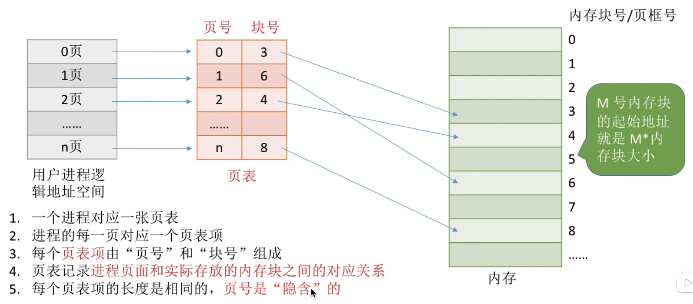

为什么每个页表项的长度是相同的，页号是*隐含*的？

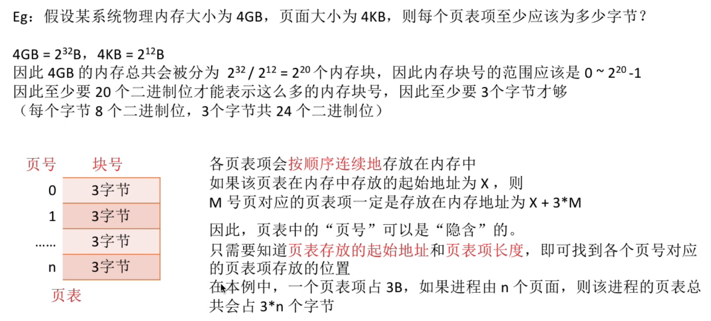


#### 基本地址变换机构

基本地址变换机构可以借助进程的页表将逻辑地址转换为物理地址

通常会在系统中设置一个```页表寄存器```(PTR),存放```页表在内存中的起始地址F```和```页表长度M```。进程未执行时，页表的始址 和 页表长度 ```放在进程控制块PCB```中，当进程被调度时，OS内科会把他们放到页表寄存器中

NOTE：```页面大小是2的整数幂```

设页面大小为L,逻辑地址A到物理地址E的变换过程如下

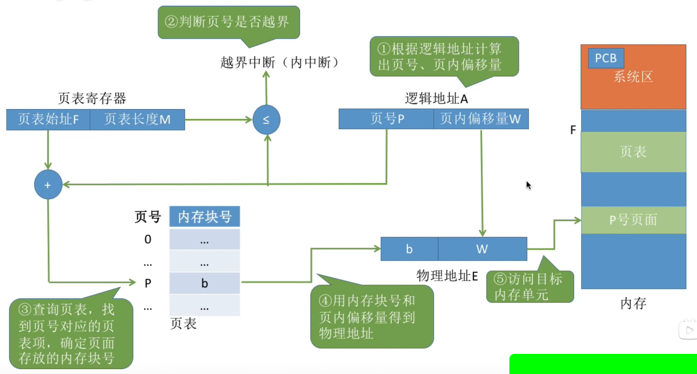

```
1.计算页号P和页内偏移量W(如果用十进制，则P=A/L,W=A%L;但是在计算机运行时，逻辑
    地址结构是固定不便的，因此计算机硬件可以更快得到二进制表示的页号，页内偏移量)

2.比较页号P和页表长度M,若P>=M,则产生越界中断，否则继续执行。(note：页号是从0开始的，
    而页表长度至少是1,因此 P =   时也会越界)

3. 页表中页号P对应的 页表项地址 = 页表起始地址F + 页号P * 页表项长度，取出该页表项
    内容b,即为内存块号。(注意区分 页表项长度、页表长度、页面大小的区别。)
    (页表长度指 这个页表中共有几个页表项，即总共有几个页; 
    页表项长度指每个页表项占多大的存储空间
    页面大小指一个页面占多大的存储空间)

4.计算E = B * L + W,用得到的物理地址E去访存。
    (如果内存块号、页内偏移量使用二进制表示的，那么将二者拼接起来就是最终的物理地址)
```

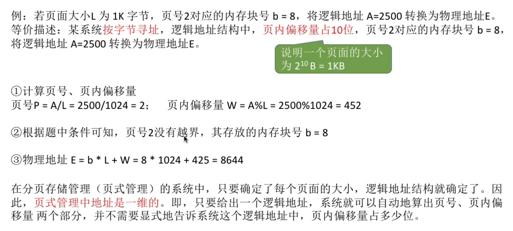

***

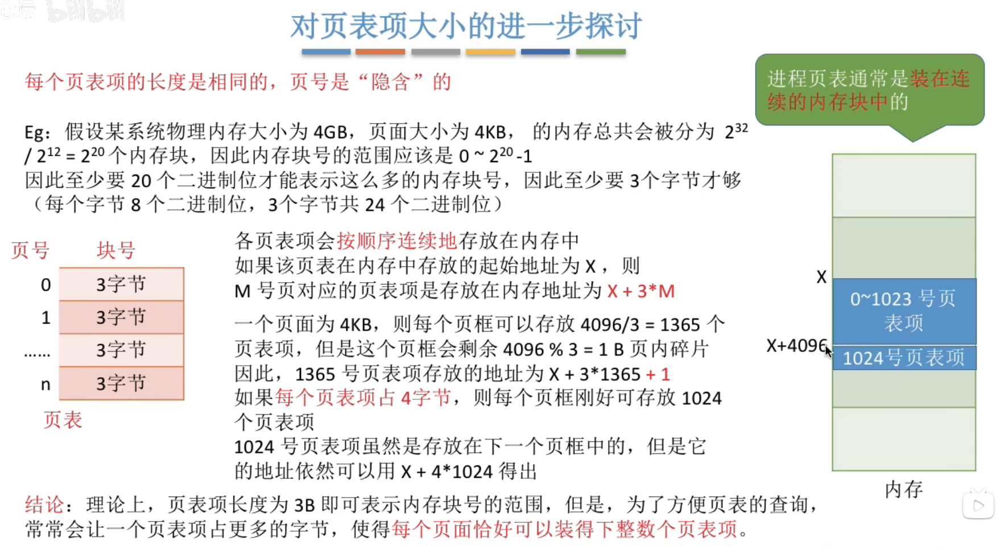


#### 具有快表的地址变换机构


局部性原理：

```时间局部性```：如果执行了程序中的某条指令，那么不久后这条指令很可能再次执行，如果某个数据被访问过，不久之后该数据很可能再次被访问(大量循环的情况下)

```空间局部性```：一旦程序访问了某个存储单元，在不久之后，其附近的存储单元也很有可能被访问(因为很多数据在内存中都是连续存放的)

前面的```基本地址变换机构```中，每次访问一个逻辑地址，都需要```查询内存中的页表```。由于局部性原理，```可能连续很多次查到的都是同一个页表项```。既然如此，能否利用这个特性减少访问页表的次数呢？

***

```快表```，又称```联想寄存器```(TLB),是一种```访问速度比内存快很多```的高速缓冲存储器，用来存放当前访问的若干页表项，以加速地址变换的过程。与此对应，内存中的页表常称为```慢表```

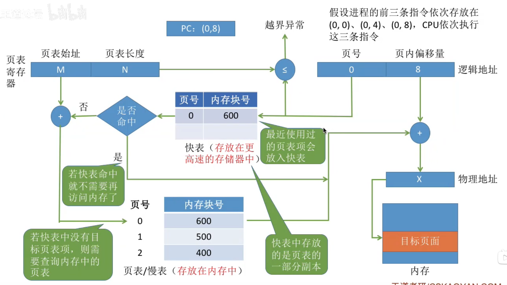

引入快表后，地址的变换过程

1. CPU给出逻辑地址，由某个硬件算出页号、页内偏移量，将页号与快表中的所有页号进行比较
2. 如果找到匹配的页号，说明要访问的页表项在快表中有副本，则直接从中去除该页对应的内存块号，再将内存块号与页内偏移量拼接形成物理地址，最后```访问```该物理地址对应的```内存单元```。因此，若```快表命中```，则访问某个逻辑地址仅需```一次访存```即可
3. 若没有匹配的页号，则需要```访问内存中的页表(慢表)```，找到对应页表项，得到页面存放的内存块号，再将内存块号与页内偏移量拼接形成物理地址，最后，```访问```该物理地址对应的```内存单元```。因此，若```快表未命中```,则访问某个逻辑地址需要```两次访问```(note：在找到页表项后，应同时将其存入快表，以便后面可能的再次访问。若快表已满，则必须按照一定的算法对旧的页表项进行替换)

由于查询快表的速度比查询页表的速度快很多，因此只要快表命中，就可以节省很多时间。因为局部性原理，一般来说快表的命中率可以达到90%以上


#### 两级页表

 

单级页表存在的问题

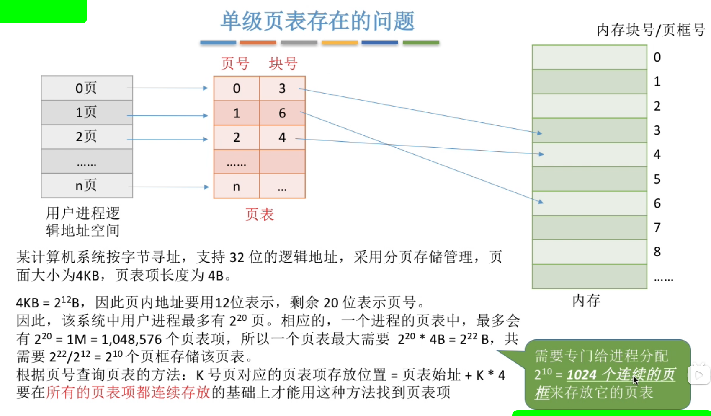 

1. 页表必须连续存放，因此当页表很大时，需要占用很多个连续的页框
2. 根据局部性原理克制，很多时候，```进程在一段时间内只需要访问某几个页面就可以正常运行```。因此```没有必要让整个页表都常驻内存```

***

解决单级页表的第一个问题--页表要连续存放

可将常常的页表进行分组，使每个内存块刚好放入一个分组(比如上个例子中，页面大小4KB,每个页表项4B,每个页面可存放1K个页表项，因此每1K个连续的页表项为彝族，每组刚好站一个内存块，再将各组离散的放到各个内存块中)

另外，要为离散分配的页表再建立一张页表，成为```页目录表```，或```外城页表```，```顶层页表```

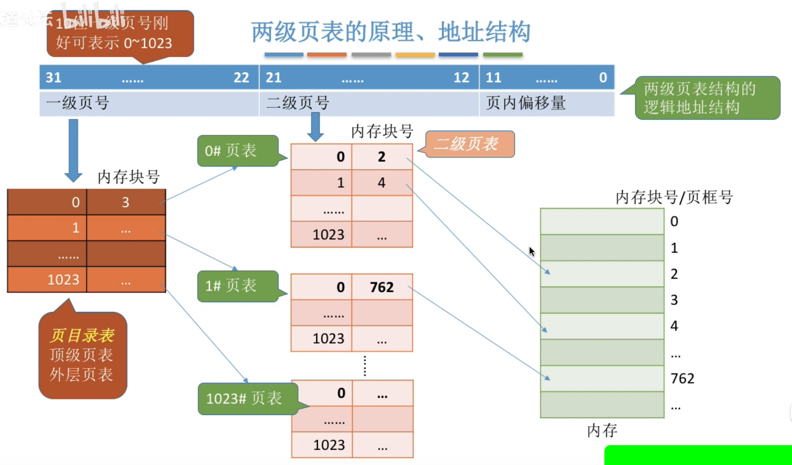 
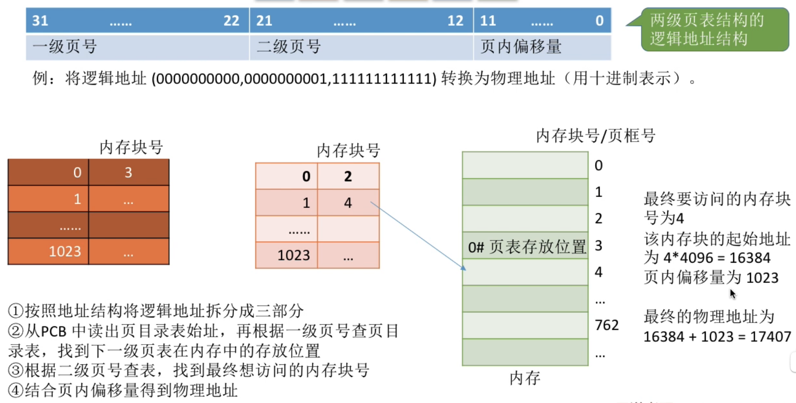 

***

解决单级页表的第二个问题--无需让整个页表常驻内存
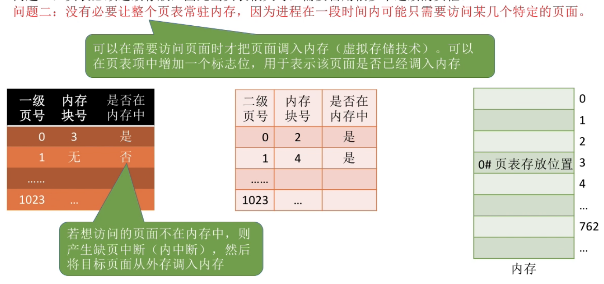 

***

两级页表注意事项：

若采用多极页表机制，则```各级页表的大小不能超过一个页面```
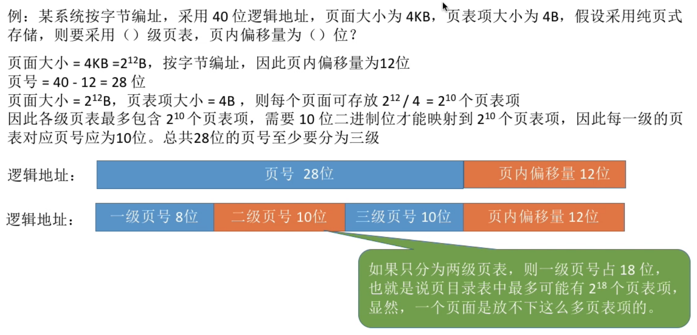 

- 两级页表的```访存次数```分析(假设没有快表机构)
    * 第一次访存：访问内存中的页目录表
    * 第二次访存：访问内存中的二级页表
    * 第三次访存：访问目标内存单元

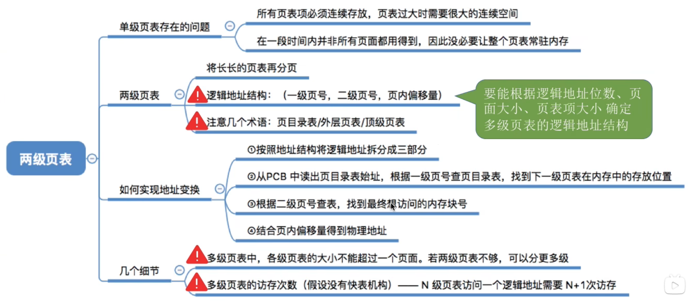 

#### 基本分段存储管理

 

分段

进程的地址空间：按照程序```自身的逻辑```关系```划分为若干个段```,每个段都有一个段名(在低级语言中，程序员使用段名来编程)，```每段都从0开始编址```

内存分配规则：以段为单位进行分配，```每个段在内存中占据连续空间```，但```各段之间可以不相邻```

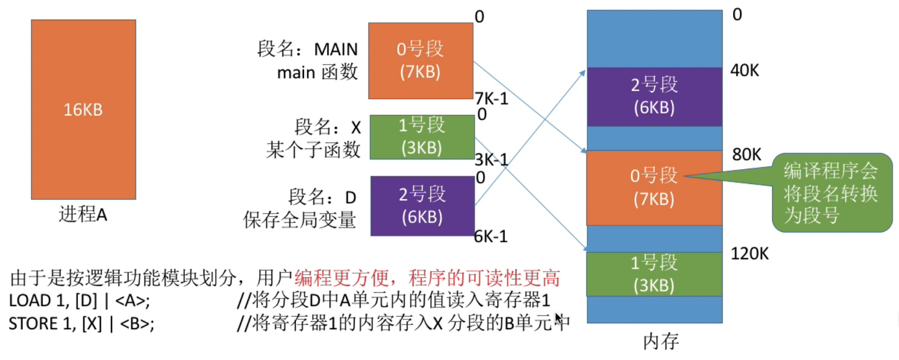 
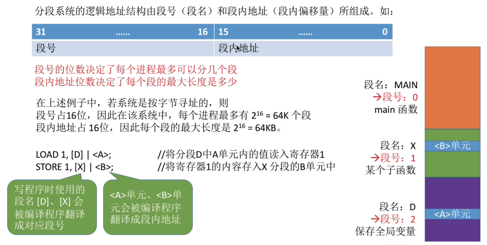 

***

程序分为多个段，各段离散地装入内存，为了保证程序能正常运行，就必须能从物理内存中找到各个逻辑段的存放位置。为此，需要为每个进程建立一张段映射表，简称```段表```

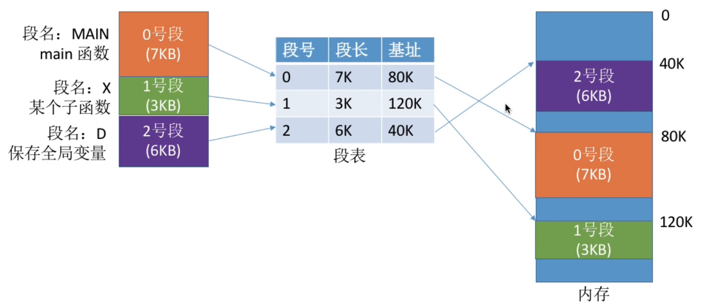 

每个段对应一个段表项，其中记录了该段在内存中的```起始位置```(又称*基址*)和段的长度

```各个段表项的长度是相同的```。例如：某系统按字节殉职，采用分段存储管理，逻辑地址结构为(段号16,段内地址16位)，因此用16位即可表示最大段长。物理内存大小为4GB(可用32位表示整个物理内存地址空间)。因此，可以让每个段表项站 16 + 32 = 48位，即6B.由于段表项长度相同，因此```段号是可以隐含的，不占存储空间```。若段表存放的起始地址为M,则K号段对应的段表项存放的地址为M + K * 6

***

分段、分页管理的对比

```页```是```信息的物理单位```。分页的主要目的是为了实现离散分配，提高内存利用率。分页仅仅是系统管理上的需要，完全是系统行为，```对用户是不可见的```

```段```是```信息的逻辑单位```。分段的主要目的是更好的满足用户需求。一个段通常包含着一组属于一个逻辑模块的信息。```分段对用户是可见的```，用户编程时需要显式地给出段名

页的大小固定且由系统决定。段的长度缺不固定，决定于用户编写的程序

```分页```的用户进程```地址空间是一维的```，程序员只需给出一个记忆符即可表示一个地址

```分段```的用户进程```地址空间是二维的```，程序员在标识一个地址时，既要给出段名，也要给出段内地址

```分段```比*分页*```更容易实现信息的共享和保护```

不能被修改的代码称为```纯代码```或```可重入代码```(不属于临界资源)，这样的代码是可以共享的。可修改的代码是不能共享的(比如一个代码段中有很多变量，各进程并发地同时访问可能造成数据不一致)

访问一个逻辑地址需要几次访存？

```分页(单级页表)```：第一次访存--查内存中的页表，第二次访存--访问目标内存单元。总共```两次访问```

```分段```：第一次访存--查内存中的段表，第二次访存--访问目标内存单元。总共```两次访存```

与分页系统类似，分段系统也```可以引入快表机构```，将近期访问过的段表项放到快表中，这样```可以少一次访问```，加快地址变换速度

 

#### 段页式管理方式

 

分页、分段的优缺点分析

 

段页式管理 = 分段 + 分页

将进程按逻辑模块分段，再将各段分页(如每个页面4KB)，再将内存空间分为大小相同的内存块/页框/页帧/物理块。进程前将各页面分别装入各内存块中

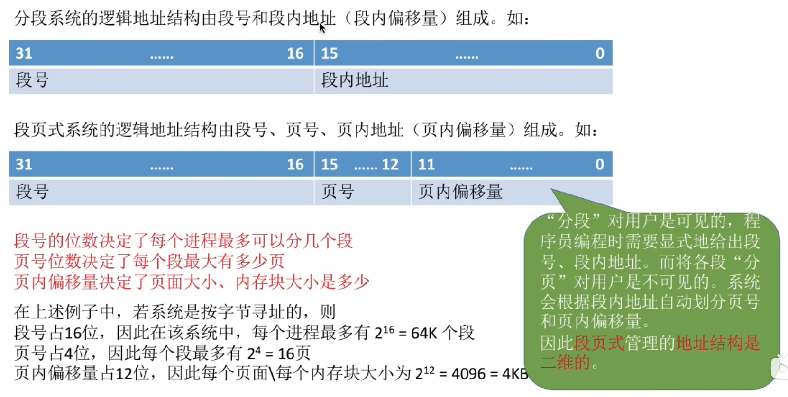 
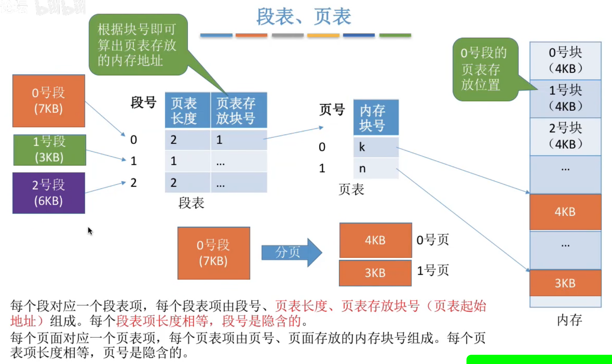 

 

## 虚拟内存


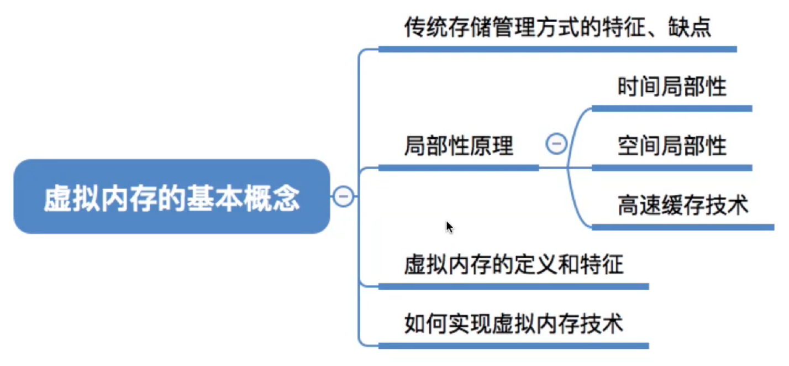

传统存储管理方式的特征、缺点


一次性：```作业必须一次性全部装入内存后才能开始运行```。这会造成两个问题：1-作业很大时，不能全部装入内存，导致```大作业无法运行```。2-当大量作业要求运行时，由于内存无法容纳所有作业， 因此只有少量作业能运行，导致```多道程序并发度下降```

```驻留性```：一旦作业被装入内存，就```会一直驻留在内存```，直到作业运行结束。事实上，在一个时间段内，只需要访问作业的一小部分数据即可正常运行，这就导致了内存中会驻留大量的、暂时用不到的数据，浪费了内存资源

*** 

局部性原理的应用--高速缓冲技术

思想：将近期会频繁访问的数据放到更高速的存储器中，暂时用不到的数据放在更低俗的存储器中

基于局部性原理，在程序装入时，可以将程序中```很快会用到的部分装入内存，暂时用不到的部分留在外存```，就可以让程序开始执行

在程序执行过程中，当所访问的```信息不再内存时```，由```OS负责将所需信息从外存调入内存```，然后继续执行程序

若内存空间不够，由```OS负责```将内存中```暂时用不到的信息换出到外存```

在OS的管理下，在用户看来似乎有一个比实际内存大的多的内存，这就是```虚拟内存```

虚拟内存是OS虚拟性的一个体现，实际的物理内存大小不变，只是在逻辑上进行了扩充


- 虚拟内存有以下3个主要特征：
1. 多次性：无需在作业运行时一次性全部装入内存，而是允许被分成多次调入内存
2. 对换性：在作业运行时无需一直常驻内存，而是允许在作业运行过程中，将作业换入、换出
3. 虚拟性：从逻辑上扩充了内存的容量，使用户看到的内存容量，远大于实际的容量

***

如何实现虚拟内存？

虚拟内存技术，允许一个作业分多次调入内存。如果采用连续分配方式，会不方便实现。因此，虚拟内存的实现需要建立在```离散分配```的内存管理方式基础上


#### 请求分页管理方式

```请求分页```存储管理与```基本分页```存储管理的主要区别：

在程序执行过程中，当```所访问的信息不再内存时，由OS负责将所需信息从外存调入内存```(OS要提供请求调页功能，将缺失页面从外存调入内存),然后继续执行程序

若内存空间不够，由OS负责```将内存中暂时用不到的信息换出到外存```(OS要提供页面置换的功能，将暂时用不到的页面换出外存)


***
页表机制：

与基本分页管理相比，请求分页管理中，为了实现*请求调页*，OS需要知道每个页面是否已经调入内存，如果还没调入，那么也需要知道该页面在外存中存放的位置

当内存空间不够时，要实现*页面置换*，OS需要通过某些指标来决定到底换出哪个页面，有的页面没有被修改过，就不用再浪费时间写回外存。有的页面修改过，就需要将外存中的就数据覆盖，因此，OS也需要记录各个页面是否被修改的信息


***

缺页中断机构

在请求分页系统中，每当要访问的```页面不再内存```时，便产生一个```缺页中断```，然后由OS的缺页```中断处理程序处理中断```

此时```缺页的进程阻塞```，放入阻塞队列，调页```完成后再将其唤醒```，放回就绪队列

如果内存中```有空闲块```，则为进程```分配一个空闲块```，将所缺页面装入该块，并修改页表中响应的页表项。

如果内存中```没有空闲块```，则```由页面置换算法选择一个页面淘汰```，若该页面在内存期间```被修改过```，则要将其```写回外存```。未修改过的页面不用写回外存

***

```缺页中断```是因为当前执行的指令想要访问的目标页面未调入内存而产生的，因此属于```内中断```

```一条指令```在执行期间，```可能产生多次缺页中断```。(如copy A to B,即将逻辑地址A中的数据复制到逻辑地址B,而A、B属于不同的页面，则有可能产生两次中断)

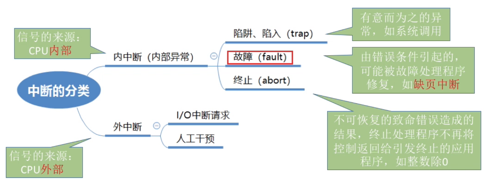

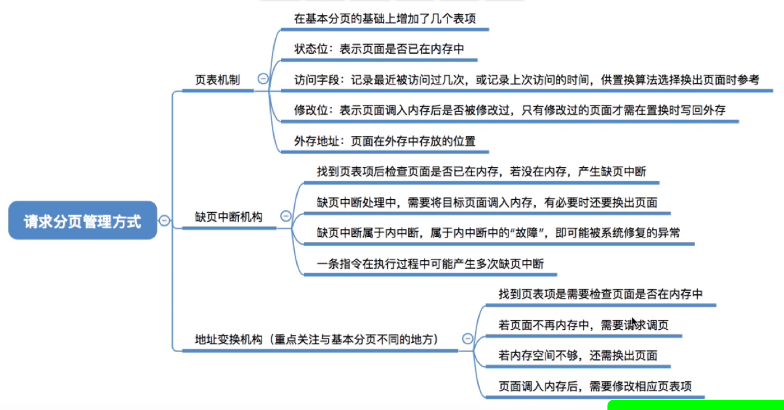

#### 页面置换算法

在程序执行过程中，当所```访问的信息不在内存时，由OS负责将所需信息从外存调入内存```，然后继续执行程序

若内存空间不够，由OS负责```将内存中暂时用不到的信息换出到外存```(用页面置换算法决定该换出哪个页面)

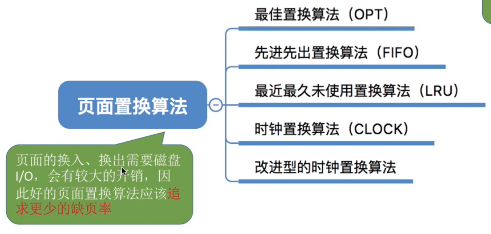

***

最佳置换算法(OPT)

最佳置换算法(OPT,Optimal):每次选择```淘汰的页面```将是```以后永不使用```，或者```在最长时间内不再被访问的页面```，这样可以保证最低的缺页率

最佳置换算法可以保证最低的缺页率，但实际上，只有在进程执行的过程中才能知道接下来会访问到的是哪个页面。OS无法提前预判页面访问序列。因此，```最佳置换算法是无法实现的```

***

先进先出置换算法(FIFO)

先进先出置换算法(FIFO):每次选择```淘汰的页面```是```最早进入内存的页面```

实现方法：把调入内存的页面根据调入的先后顺序排成一个队列，需要换出页面时选择队头页面即可。队列的最大擦痕能够读取决于系统为进程分配了多少个内存块

```
使用先进先出算法，当系统为某进程分配了 四个内存块时，缺页次数为 10次
    当系统为某进程分配了 三个内存块时，缺页次数为 9次
当为进程分配的物理块增大时，缺页次数不减反增的异常现象称为 Belady异常

只有FIFO算法会产生Belady异常。另外，FIFO算法虽然实现简单，但是该算法与进程实际运行时的规律不适应，因为先进入页面也有可能经常被访问，因此，算法性能差
```

***

最近最久未使用置换算法(LRU)

最近最久未使用置换算法(LRU,Least Recently Used):每次```淘汰的页面```是```最近最久未使用的页面```

实现方法：赋予每个页面对应的页表项中，用```访问字段记录该页面自上次被访问以来所经历的时间t```。当需要淘汰一个页面时，选择现有页面中t值最大的，即最近最久未使用的页面

该算法的实现需要专门的硬件支持，虽然算法```性能好```，但是```实现困难，开销大```
***

时钟置换算法(CLOCK)

最佳置换算法性能最好，但是无法实现，先进先出置换算法实现简单，但算法性能差，最近最久未使用置换算法性能好，是最接近OPT算法性能的，但是实现起来需要专门的硬件支持，算法开销大。

```时钟置换算法```是一种性能和开销较均衡的算法，又称```CLOCK算法```，或```最近未使用算法```(NRU, Not Recently Used)

```简单的CLOCK算法```实现方法：为每个页面设置一个```访问位```，再将内存中的页面都通过链接指针```链接成一个循环队列```。当某页被访问时，其访问位置为1。当需要淘汰一个页面时，只需检查页的访问位。如果是0,就选择该页换出，如果是1,则将其置为0,暂不换出，继续检查下一个页面，若第一轮扫描中所有页面都是1,则将这些页面的访问位一次置为0后，再进行第二轮扫描(第二轮扫描中一定会有访问位为0的页面，因此简单的CLOCK算法选择一个淘汰页面最多会经过两轮扫描)

***

改进型的时钟置换算法

```简单的时钟置换算法```仅考虑到一个页面最近是否被访问过。事实上，如果被淘汰的页面没有被修改过，就不需要执行IO操作协会外存。```只有被淘汰的页面被修改过时，才需要写回外存```

因此，除了考虑一个页面最近有没有被访问过之外，OS还应考虑页面有没有被修改过。```在其他条件都相同时，应优先淘汰没有修改过的页面```，避免IO操作。

修改位=0,表示页面没有被修改过，修改为=1,表示页面被修改过

为方便讨论，用(访问位， 修改位) 的形式表示各页面状态。如(1,1)表示一个页面近期被访问过，且被修改过


#### 页面分配策略


```驻留集```：指请求分页存储管理中给进程分配的物理块的集合

在采用了虚拟存储技术的系统中，驻留集大小一般小于进程的总大小。若驻留集太小，会导致缺页频繁，系统要花大量的时间来处理缺页，实际用于进程推进的时间很小;驻留集台大，又会导致躲到车位嗯需并发度下降，资源利用率降低。所以因该选择一个合适的驻留集大小

```固定分配```：OS为每个进程分配彝族固定数据的物理块，在进程运行期间不再改变。即，```驻留集大小不变```

```可变分配```：先为每个进程分配一定数据的物理块，在进程运行期间，可根据情况做适当的增加或减少。即```驻留集大小可变```

```局部置换```：发生缺页时只能选进程自己的物理块进行置换

```全局置换```：可以将OS保留的空闲物理块分配给缺页进程，也可以将别的进程持有的物理块置换到外存，再分配给缺页进程

***

```固定分配局部置换```：系统为每个进程分配一定数量的物理块，在整个运行期间都不改变。若进程在运行中发生缺页，则之嗯嗯从该进程在内存中的页面中选出一页换出，然后再调入需要的页面。这种策略的缺点是：很难在刚开始就确定应为每个进程分配多少个物理块才算合理。(采用这种策略的系统可以根据进程大小、优先级、或是根据程序员给出的参数来确定为一个进程分配的内存块数)

```可变分配全局置换```：刚开始会为每个进程分配一定数量的物理块。OS会保持一个空闲物理块队列。当某进程发生缺页时，从空闲物理块中去除一块分配给该进程。若已无空闲物理块，则可选择一个```未锁定```的页面换出外存，再将该物理块分配给缺页的进行。采用这种策略时，```只要某进程发生缺页，都将获得新的物理块```，仅当空闲物理块用完时，系统才选择一个未锁定的页面调出。被选择调出的页可能是系统中任何一个进程中的页，因此这个```被选中的进程拥有的物理块会减少，缺页率会增加```

```可变分配局部置换```：刚开始会为每个进程分配一定数量的物理块。当某进程发生缺页时，只允许从该进程自己的物理块中选出一个进行换出外存。如果进程在运行中频繁地缺页，系统会为该进程多分配几个物理块，直至该进程缺页率趋势适当程度。反之，如果进程在运行中缺页率特别低，则可适当减少分配给该进程的物理块

可变分配```全局```置换：只要缺页就给分配新的物理块
可变分配```局部```置换：要根据发生```缺页的频率```来动态地增加或减少进程的物理块

***

何时调入页面？

预调页策略：根据局部性原理，一次调入若干个相邻的页面可能比一次调入一个页面更高效。但如果提前调入的页面中大多数都没被访问过，则又是低效的。因此可以预测不久之后可能访问到的页面，将他们预先调入内存，但目前预测成功率只有50%左右。故这种策略```主要用于进程的首次调入```，由程序员指出应该先调入哪些部分

请求调页策略：进程```在运行期间发现缺页时才将所却页面调入内存```。由这种策略调入的页面一定会被访问到，但由于每次只能调入一页，而每次调页都要磁盘IO操作，因此IO开销较大

***

从何处调入页面

系统拥有足够的对换区空间：页面的调入、调出都是在内存与对换区之间进行，这样可以保证页面的调入、调出速度很快。在进程运行前，需将进程相关的数据从文件去复制到对换区

系统缺少足够的对换区空间：凡是不会被修改的数据都直接从文件区调入，由于这些页面不会被修改，因此换出时不必写会磁盘，下次需要时再从文件去调入即可。对于可能被修改的部分，换出时需协会磁盘对换区，瑕疵需要时再从对换区调入

UNIX方式：运行之前进程右端的数据全部放在文件去，故未使用过的页面，都可从文件区调入。若被使用过的页面需要换出，则协会对换区，下次需要时从对换区调入

***

抖动（颠簸）现象

刚刚换出的页面马上又要换入内存，刚刚换入的页面马上又要换出外存，这种频繁的页面调度行为称为```抖动```，或```颠簸```。产生抖动的```主要原因```是进程频繁访问的页面数目高于可用的物理块数(分配给进程的物理块不够)

为进程分配的物理块太少，会使进程发生抖动现象。为进程分配的物理块太多，又会降低系统整体的并发度，降低某些资源的利用率

```驻留集```：请求分页存储管理中给进程分配的内存块的集合

```工作集```：在某段时间间隔里，进程实际访问页面的集合

OS会根据*窗口尺寸*来算出工作及

```工作集大小```可能小于窗口尺寸，实际应用中，OS可以统计进程的工作集大小，根据工作集大小给进程分配若干内存块。如：窗口尺寸为5,经过一段时间的检测发现某进程的工作集最大为3,那么一般来说，```驻留集大小不能小于工作集大小，否则进程运行过程中将频繁缺页```

拓展：基于局部性原理可知，进程在一段时间内访问的页面与不久之后会访问的页面是有相关性的。因此，可以根据进程近期访问的页面集合(工作集)来设计一种页面置换算法--选择一个不再工作集中的页面进行淘汰


