## 线程

为什么要有线程？

有的进程可能需要*同时*做很多事，而传统的进程只能串行地执行一系列程序。为此，引入了*线程*，来增加并发度，可以把线程理解为*轻量级线程*

```线程```是一个```基本的CPU执行单元```，也是```程序执行流的最小单位```。引入线程后，不仅是进程之间可以并发，进程内的```各线程之间```也可以```并发```，从而进一步```提升了系统的并发度```，使得一个进程内也可以并发处理各种任务(如QQ视频，文字聊天，传文件等)

引入线程后，```进程```只作为```出CPU之外的系统资源的分配单元```(如打印机、内存地址空间等都是分配给进程的)

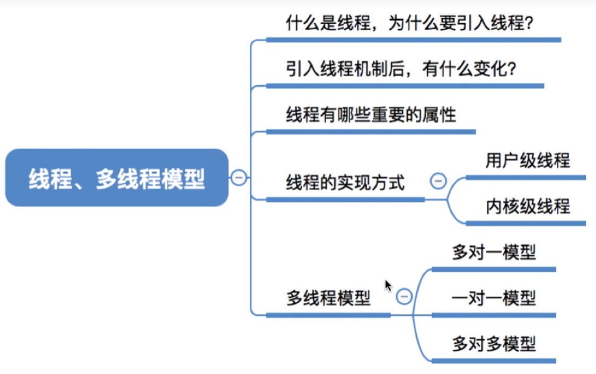

#### 引入线程机制后，带来的变化

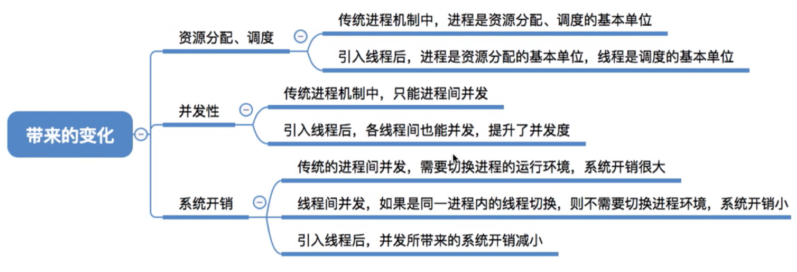

#### 线程的属性


#### 线程的实现方式

用户级线程(User Level Thread,ULT)

用户级线程由APP通过```线程库```实现。所有的```线程管理工作```都由APP负责(包括线程切换)

用户级线程中，```线程切换```可以在```用户态下即可完成```，无需OS干预。在用户看来，是有多个线程。但是在OS kernel看来，并意识不到线程的存在(用户极线程对用户不透明，对OS透明)

内核极线程(Kernel Level Thread, KLT)

内核级```线程的管理工作```由OS kernel完成。线程调度、切换等工作都由内核负责，因此```内核级线程的切换```必须在```核心态```下才能完成

在同时支持用户级线程和内核级线程的系统中，可采用二者组合的方式：将n个用户级线程映射到m个内核级线程上(n >= m)

OS只*看得见*内核级线程，因此只有```内核级线程才是处理机分配的单位```

#### 多线程

在同时支持用户级线程和内核极线程的系统中，由几个用户级线程映射到几个内核级线程的问题引出了*多线程模型*的问题

```多对一```模型：多个用户级线程映射到一个内核级线程。每个用户进程只对应一个内核极线程

*优点*：用户级线程的切换在用户空间即可完成，不需要切换到核心态，线程管理的系统开销小，效率高

*缺点*：当一个用户级线程被阻塞后，整个进程都会被阻塞，并发度不高。多个线程不可在多和处理机上并行运行

*** 

```一对一```模型：一个用户级线程映射到一个内核极线程。每个用户进程有与用户级线程同数量的内核极线程

*优点*：当一个线程被阻塞后，其他线程还可以继续执行，并发能力强。多线程可在多核处理机上并行执行

*缺点*：一个用户进程会占用多个内核极线程，线程切换由操作系统内核完成，需要切换到核心态，因此线程管理的成本高，开销大
***
```多对多```模型：n用户级线程映射到m个内核极线程(n >= m)。每个用户进程对应m个内核极线程

克服了多对一模型并发度不高的缺点，又克服了一对一模型中一个用户进程占用太多内核极线程，开销太大的缺点

## 处理机调度

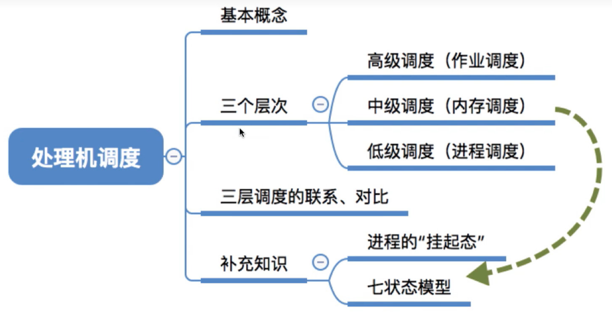

当有一堆任务要处理，但由于资源有限，这些事情无法同时处理。这就需要确定```某种规则```来```决定```处理这些任务的```顺序```，这就是*调度*研究的问题

在多道程序系统中，进程的数量往往是多于处理机的个数的，这样不可能同时并行地处理各个进程。```处理机调度```，就是从就绪队列中```按照一定的算法选择一个进程```并```将处理机分配给他```运行，以实现进程的并发执行

#### 高级调度

由于内存空间有限，有时无法将用户提交的作业全部放入内存，因此就需要确定某种规则来决定将作业调入内存的顺序。

```高级调度(作业调度)```。按照一定的原则从外存上处于后备队列的作业中选择一个(或多个)作业，给他们分配内存等必要资源，并```建立相应的进程(建立PCB)```，以使它(们)```获得竞争处理机的权力```

高级调度是外存与内存之间的调度。每个作业只调入一次，调出一次。```作业调入时会建立相应的PCB,作业调出时才撤销PCB```。高级调度主要是指调入的问题，因为只有调入的时机需要OS来确定，但调出的时机必然是作业运行结束才调出

#### 中级调度

引入虚拟存储技术后，可将暂时不能运行的进程调至外存等待。等它重新具备了运行条件且内存有空闲爱你时，再重新调入内存。这么做的目的是为了```提高内存利用率```和```系统吞吐量```

暂时调到外存等待的进程状态为```挂起状态```。指的注意的是，PCB并不会一起调到外存，而是```会常驻内存```。PCB中记录进程数据在外存中的存放位置，进程状态等信息，OS通过内存中的PCB来保持对各个进程的监控、管理。被挂起的进程PCB会被放到```挂起队列```中

```中级调度(内存调度)```，就是要决定将哪个处于挂起状态的进程重新调入内存。一个进程可能会被多次调出、调入内存，因此```中级调度```发生的``频率```要高于```高级调度```

***

暂时调到外存等待的进程状态为```挂起状态(挂起态，suspend)```

挂起态又可以细分为```就绪挂起```，```阻塞挂起```两种状态

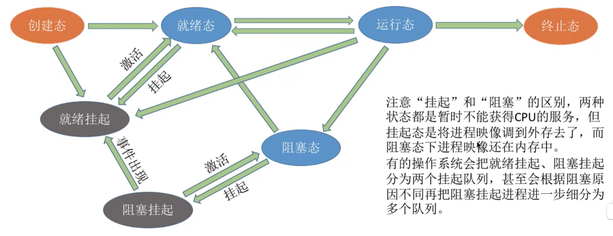

#### 低级调度

```低级调度(进程调度)```，其主要任务是按照某种方法和策略从就绪队列中取出一个进程，将处理机分配给它

进程调度是OS中```最基本的一种调度```，在一般的OS中都必须配置进程调度。进程调度的```频率很高```，一般几十毫秒一次

***

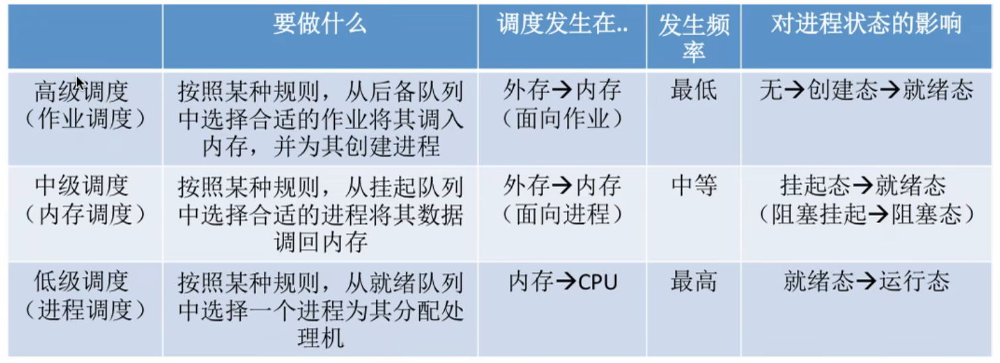

## 进程调度

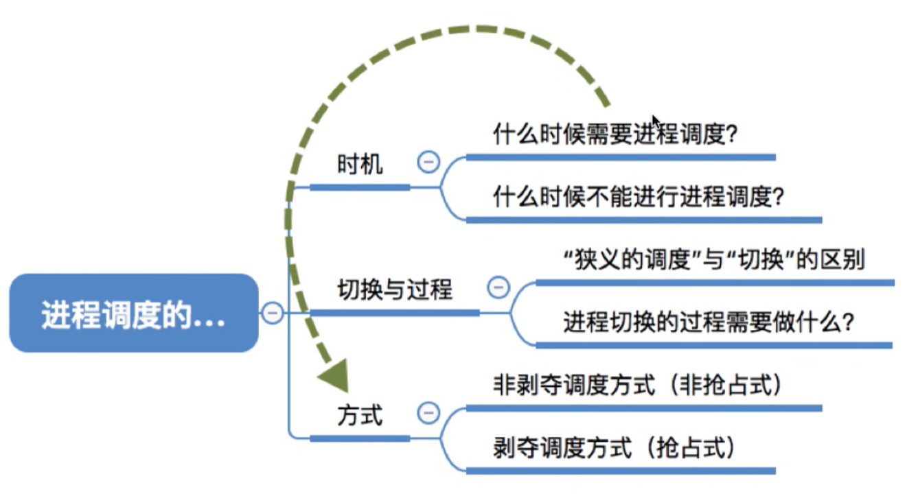

进程调度的时机

```进程调度(低级调度)```，就是按照某种算法从就绪队列中选择一个进程为其分配处理机


***

进程在```OS kernel程序临界区```中```不能```进行调度与切换

*临界资源```：一个时间段内只允许一个进程使用的资源。各进程需要```互斥地```访问临界资源

*临界区*：访问临界资源的那段代码

```内核程序临界区```一般是用来访问```某种内核数据结构```的，比如进程的就绪队列(由各就绪进程的PCB组成)

#### 进程调度的方式

```非剥夺调度方式```，又称```非抢占方式```。即，只允许进程主动放弃处理机。在运行过程中即便有更紧迫的任务到达，当前进程依然会继续使用处理机，知道该进程终止或主动要求进入阻塞态

```非剥夺调度方式```实现简单，系统开销小但无法及时处理紧急任务，适合早期的批处理系统

```剥夺调度方式```，又称```抢占方式```。当一个进程正在处理机上执行时，如果有一个更重要或更紧迫的进程需要使用处理机，则立即暂停正在执行的进程，将处理机分配给更重要紧迫的那个进程。

```剥夺调度方式```可以优先处理更紧急的进程，也可实现让各进程按时间片轮流执行的功能(通过时钟中断)。适合分时OS,实时OS

#### 进程的切换与过程

“狭义的进程调度”与“进程切换”的区别：

```狭义的进程调度```指从就绪队列中```选中一个要运行的进程```。(这个进程可以是刚刚被暂停执行的进程，也可能是```另一个进程```，后一种情况就需要```进程切换```)

```进程切换```指一个进程让出处理机，由另一个进程占用处理机的过程

```广义的进程调度```包含了选择一个进程和进程切换两个步骤

***

进程切换的过程主要完成了：
1. 对原来运行进程各种数据的保存
2. 对新的进程各种数据的恢复(如程序计数器、程序状态字、各种数据寄存器等处理机现场信息,这些信息一般保存在进程控制块-PCB)

note：```进程切换是有代价的```，因此如果```过于频繁的```进行进程```调度、切换```，必然使得整个```系统的效率降低```，使系统大部分时间都花在了进程切换上，而真正用于执行进程的时间减少


## 调度算法的评价

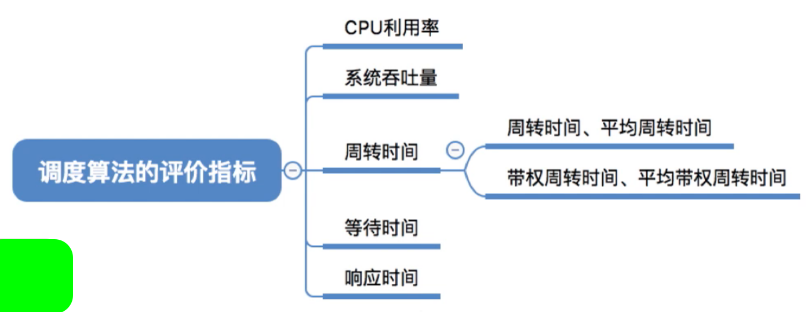

#### CPU利用率

由于早期的CPU造价昂贵，因此人们会```希望让CPU尽可能多的工作```

```CPU利用率```：指CPU*忙碌*的时间占总时间的比例

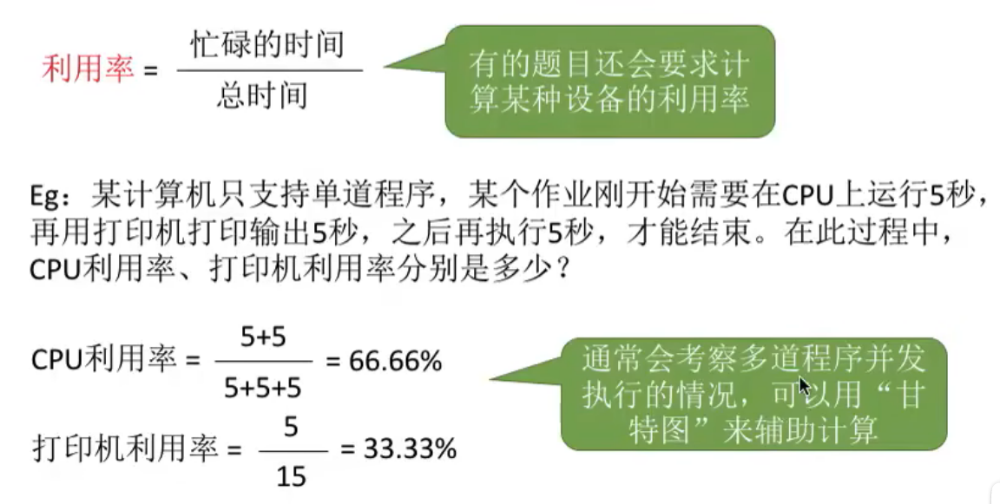


#### 系统吞吐量

对计算机来说，希望能用尽可能少的时间处理完尽可能多的作业

```系统吞吐量```：单位时间内完成作业的数量

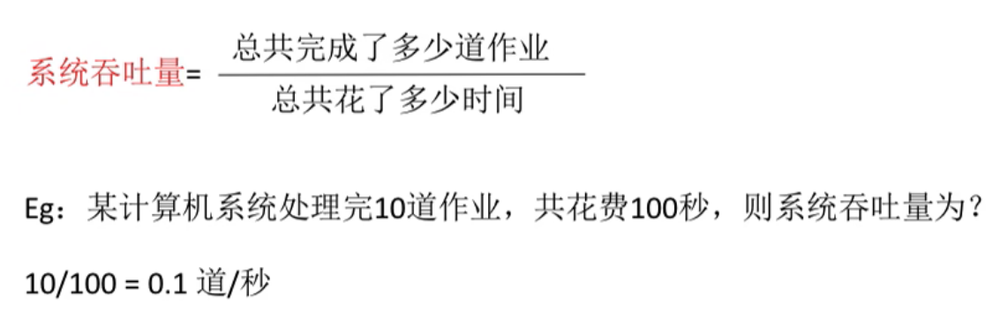


#### 周转时间

对于计算机的用户来说，他很关心自己的作业从提交到完成花了多少时间

```周转时间```，指从```作业被提交给系统开始```，到```作业完成为止```的这段时间间隔

它包括四个部分：作业在外存后备队列上等待作业调度(高级调度)的时间、进程在就绪队列上等待进程调度(低级调度)的时间、进程在CPU上执行的时间、进程等待I/O操作完成的时间。后三项在一个作业的整个处理过程中，可能发生多次


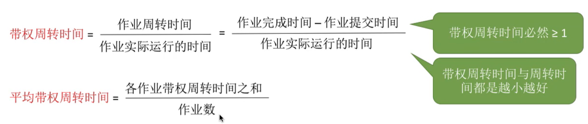

对于周转时间相同的两个作业，实际运行时间长的作业在相同时间内被服务的时间更多，带权周转时间更小，用户满意度更高

对于实际运行时间相同的两个作业，周转时间段的带权周转时间更小，用户满意度更高

#### 等待时间

计算机的用户希望自己的作业尽可能少的等待处理机

```等待时间```，指进程/作业```处于等待处理机状态时间之和```，等待时间越长，用户满意度越低。

对于```进程```来说，等待时间就是指进程建立后```等待被服务的时间之和```，在等待IO完成的期间其实进程也是在被服务的，所以不计入等待时间

对于```作业```来说,不仅要考虑```建立进程后的等待时间```，```还要加上作业在外存后备队列中等待的时间```。

一个作业总共需要被CPU服务多久，被IO设备服务多久一般是确定不便的，因此调度算法其实知会影响作业/进程的等待时间。当然，与前面指标类似，也有*平均等待时间*来评价整体性能

#### 响应时间

对于计算机用户来说，会希望自己的提交的请求(比如通过键盘输入了一个调试命令)尽早地开始被系统服务、回应

```响应时间```，指从用户```提交请求```到```首次产生响应```所用的时间

## 调度算法


#### 先来先服务

先来先服务(First Come First Serve, FCFS)

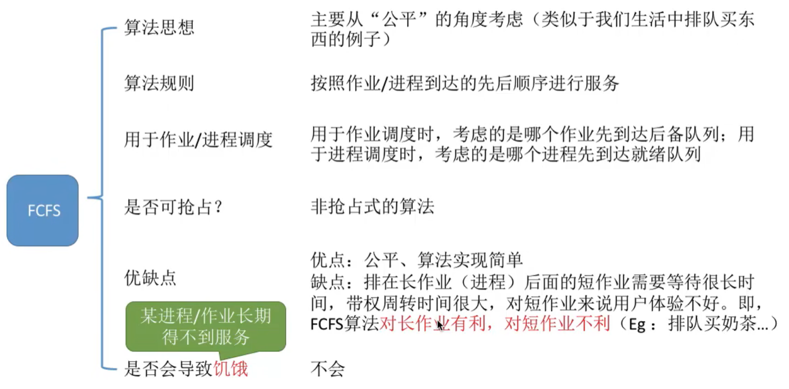
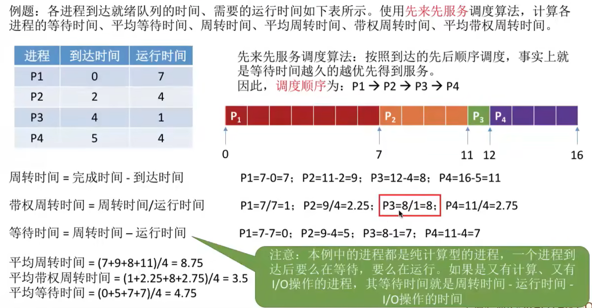

#### 短作业优先

短作业优先(Shortest Job First, SJF)

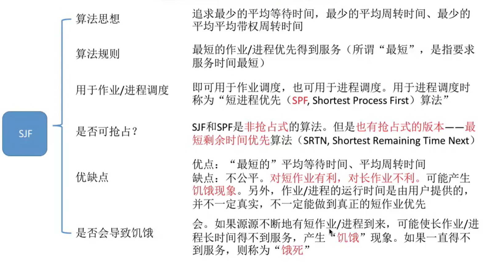
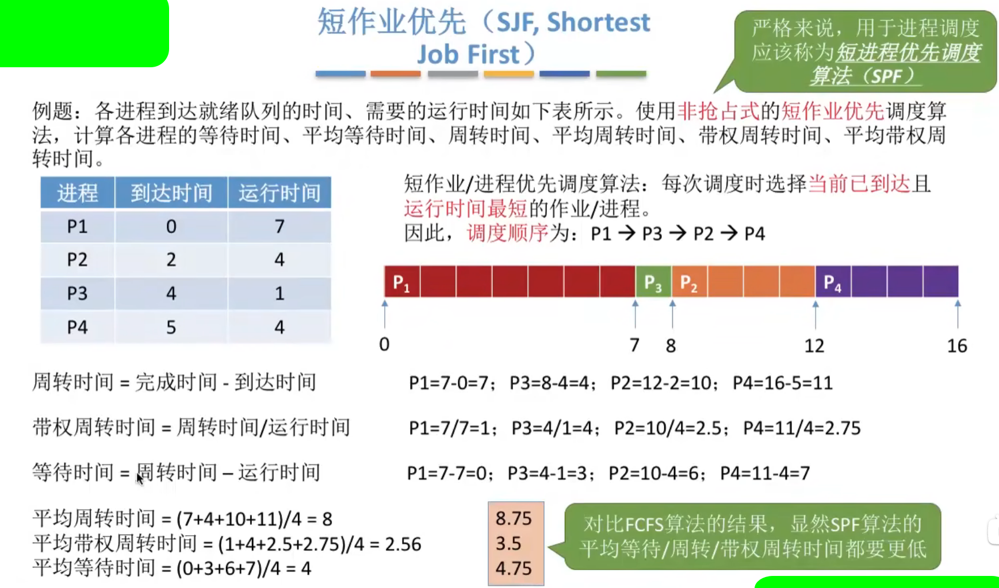
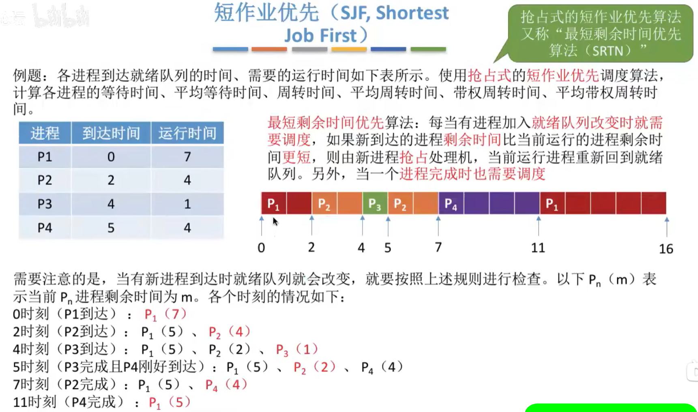


#### 高响应比优先

高响应比优先(Hightest Response Ratio Next,HRRN)

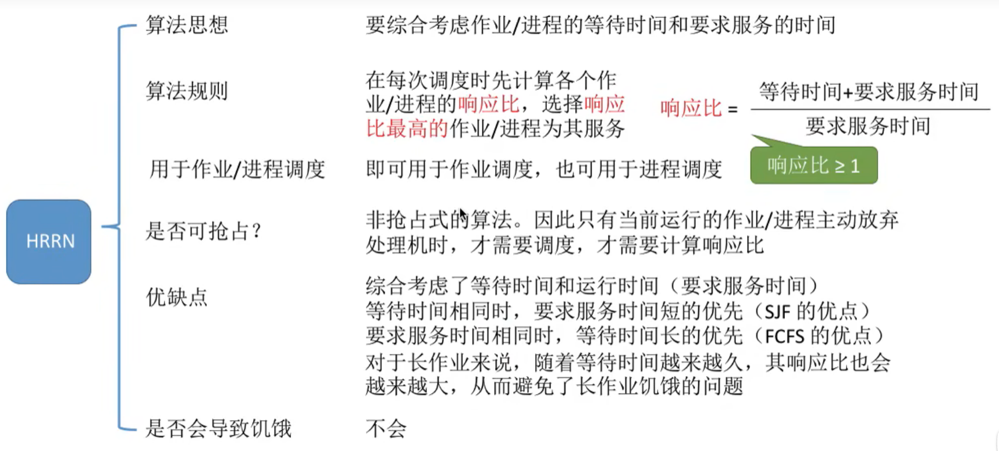
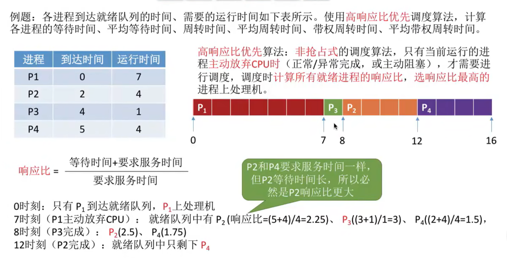

***


***


#### 时间片轮转

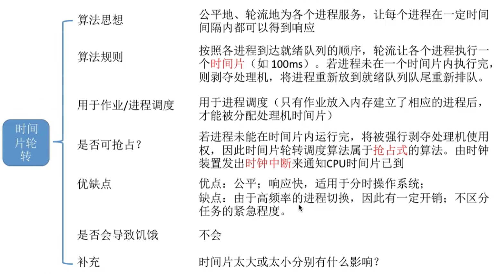

- 时间片大小为2的情况
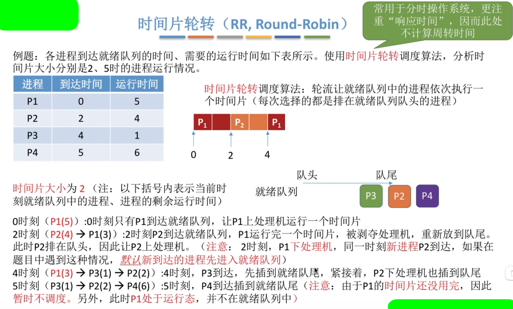
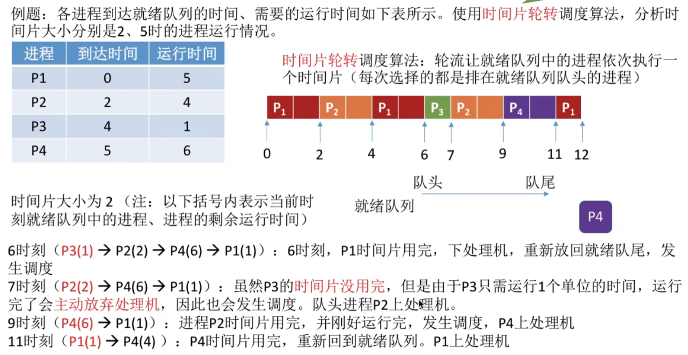
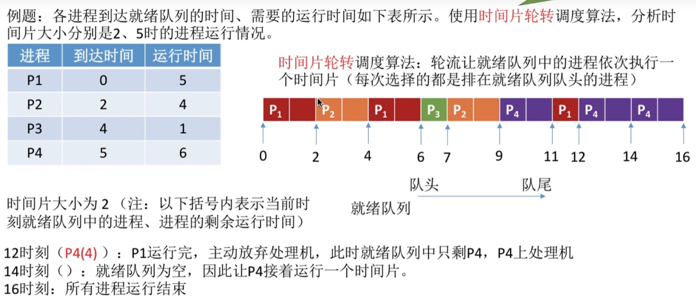

- 时间片大小为5的情况
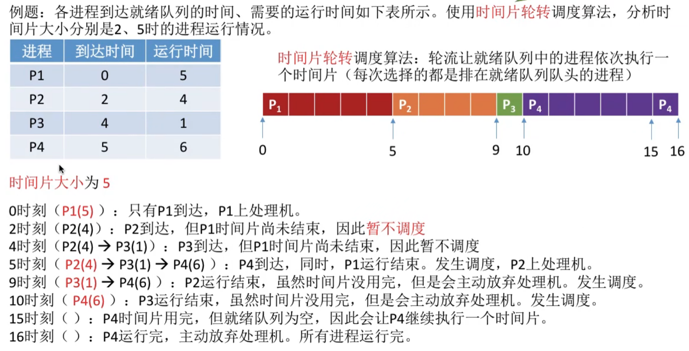

如果```时间片太大```，使得每个进程都可以在一个时间片内就完成，则时间片轮转调度算法```退化为先来先服务```调度算法，并且```会增大进程响应时间```。因此```时间片不能太大```

比如：系统中有10个进程在并发执行，如果时间片为1秒，则一个进程被响应可能需要等9秒。。。也就是说，如果用户在自己进程的时间片外通过键盘发出调试命令，可能需要等待9秒才能被系统响应

另一方面，进程调度、切换是有时间代价的(保存、恢复运行环境)，因此如果```时间片太小```，会导致```进程切换过于频繁```，系统会花大量的时间来处理进程切换，从而导致实际用于进程控制执行的时间比例减少。可见```时间片也不能太小```

#### 优先级调度算法

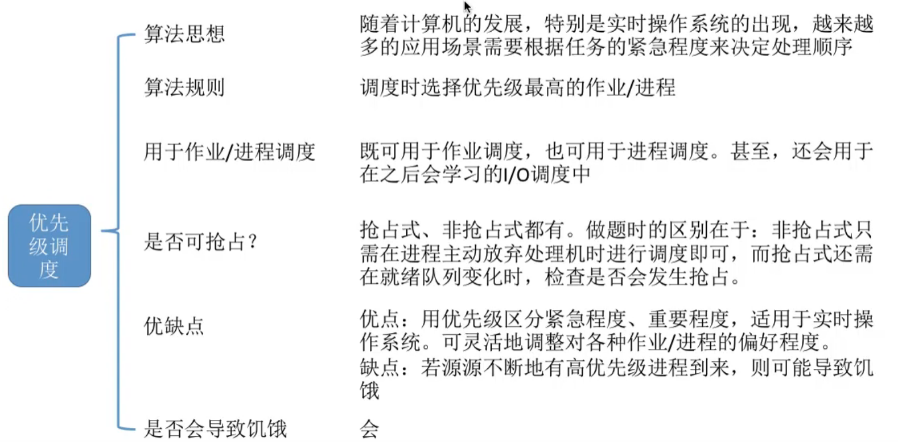

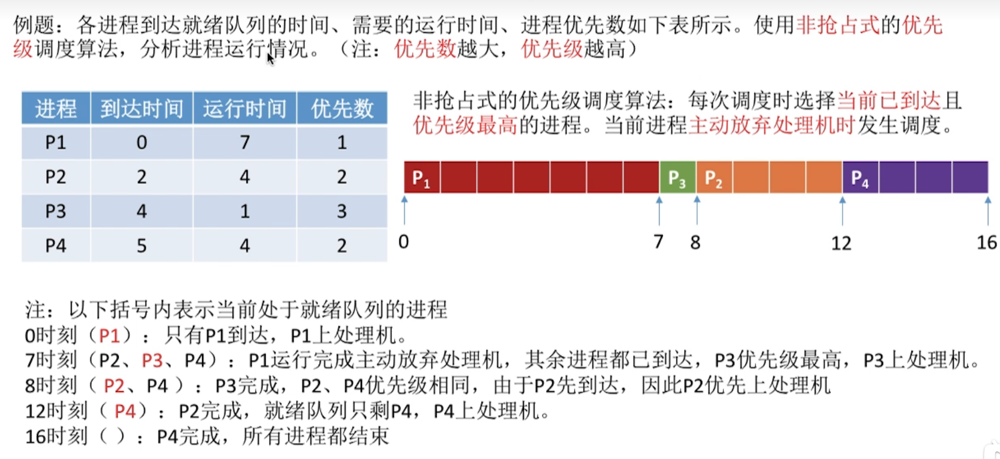
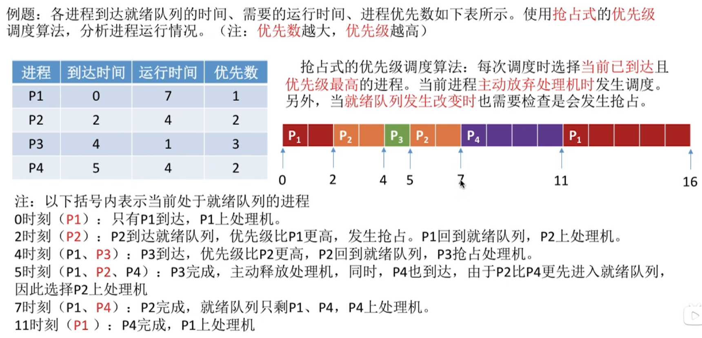

优先级调度算法补充：

就绪队列可以有多个，可以按照不同优先级来组织。另外，也可以把优先级高的进程排在更靠近队列头的位置

根据优先级是否可以动态改变，可将优先级分为```静态优先级```和```动态优先级```两种

静态优先级：创建进程时确定，之后一直不变

动态优先级：创建进程时有一个初始值，之后会根据情况动态地调整优先级

***

如何合理地设置各类进程的优先级？

通常，系统进程优先级```高于```用户进程，前台进程优先级```高于```后台进程，OS更```偏好IO型进程(或称IO繁忙型进程)```.与IO型进程相对的是```计算型进程(或称CPU繁忙型进程)```

IO设备和CPU可以*并行*工作。如果优先让IO繁忙型进程优先运行的花，则越有可能让IO设备尽早地投入工作，则资源利用率、系统吞吐量都会得到提升

如果采用的动态优先极，什么时候应该调整？

可以从追求公平、提升资源利用率等角度考虑。

如果某进程在就绪队列中等待了很长时间，则可以适当提示其优先级，如果某进程占用处理机运行了很长时间，则可适当降低其优先级，如果发现一个进程频繁地进行IO操作，则可适当提升其优先级


#### 多极反馈队列

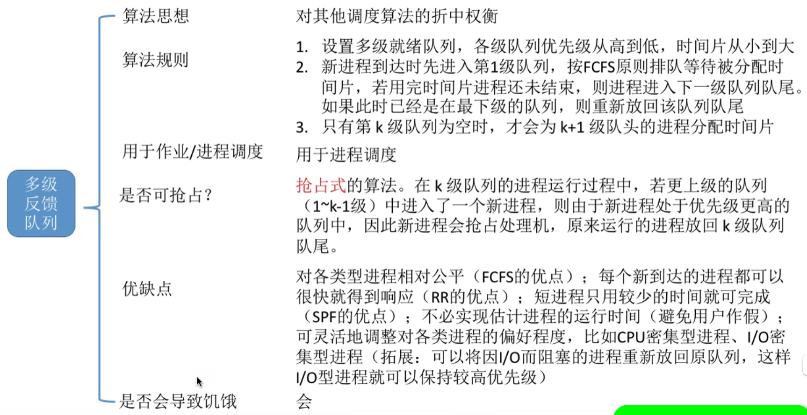
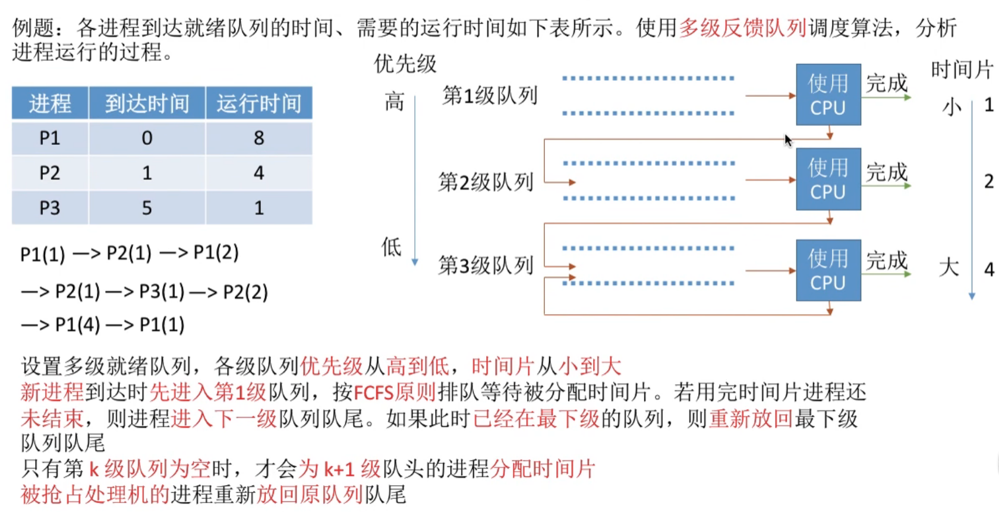

***

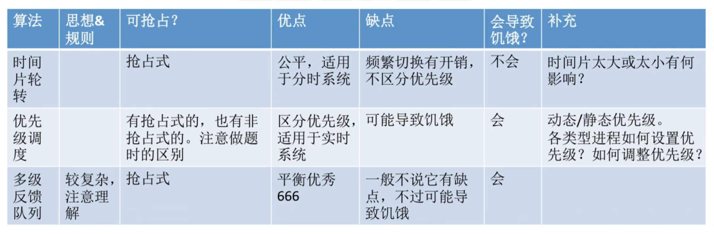

## 进程同步互斥

进程具有```异步性```的特征。异步性指，各并发执行的进程以各自独立的、不可预知的速度向前推进

```同步```亦称```直接制约关系```，它是指为完成某种任务而建立的两个或多个进程，这些进程因为需要在某些位置上```协调```它们的```工作次序```而产生的制约关系。进程间的直接制约关系就是源于它们之间的相互合作

***

我们把```一个时间段内只允许一个进程使用```的资源称为```临界资源```。许多物理设备(如打印机、摄像头)都属于临界资源。此外还有许多变量、数据、内存缓冲区等都属于临界资源

对临界资源的访问，必须```互斥```地进行。互斥，亦称```间接制约关系```。```进程互斥```指当一个进程访问某临界资源时，另一个想要访问该临界资源的进程必须等待。当前访问临界资源的进程访问结束，释放该资源之后，另一个进程才能去访问临界资源

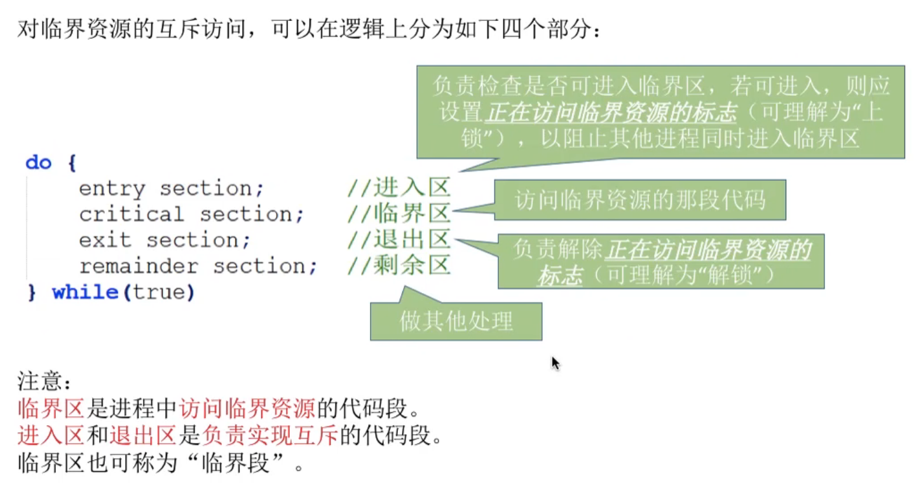

如果一个进程暂时不能进入临界区，那么该进程是否应该一直占着处理机？该进程有无可能一直进不去临界区？

为了实现对临界资源的互斥访问，同时保证系统整体性能，需要遵循以下原则

1. 空闲让进。临界区空闲时，可以允许一个请求进入临界区的进程立即进入临界区
2. 忙则等待。当已有进程进入临界区时，其他试图进入临界区的进程必须等待
3. 有限等待。对请求访问的进程，应保证能在有限时间内进入临界区(保证不会饥饿)
4. 让权等待。当进程不能进入临界区时，应立即释放处理机，防止进程忙等待


#### 进程互斥实现


#### 单标志法

算法思想：两个进程在```访问完临界区后```会把使用临界区的权限转交给另一个进程。也就是说```每个进程进入临界区的权限只能被另一个进程赋予```
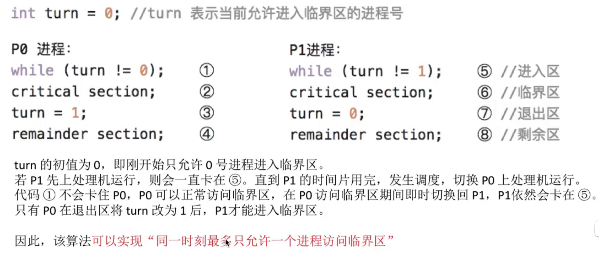

tuen表示当前允许进入临界区的进程号，而只有当前允许进入临界区的进程在访问了临界区之后，才会修改turn的值。也就是说，对于临界区的访问，一定是按P0->P1->P0->P1...这样轮流访问

这种必须*轮流访问*带来的问题是，如果此时允许进入临界区的进程是P0,而P0一直不访问临界区，那么虽然此时临界区空闲，但是并不允许P1访问

因此，```单标志法```存在的*主要问题*是：```违背“空闲让进”原则```

#### 双标志先检查法

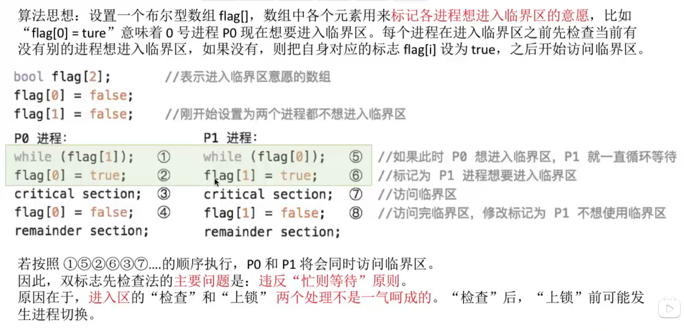

#### 双标志后检查法

算法思想：双标志先检查法的改版。前一个算法的问题是先*检查*后*上锁*，但是这两个操作又无法一气呵成，因此导致了两个进程同时进入临界区的问题。因此，人们又想到先*上锁*后*检查*的方法，来避免上述问题

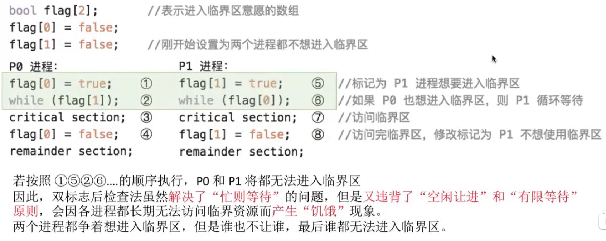

#### Peterson算法

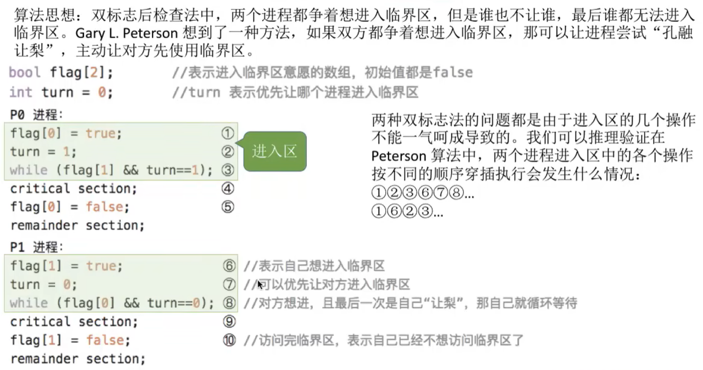

Peterson算法用软件方法解决了进程互斥问题，```遵循了空闲让进、忙则等待、有限等待三个原则```，但是依然```未遵循让权等待```的原则

Peterson算法相较于前3种软件解决方案来说，是最好的，但是依然不够好

***

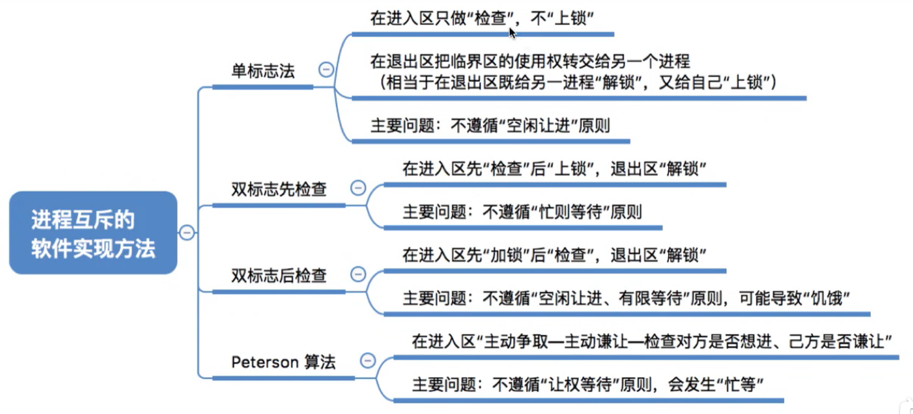

#### 硬件实现进程互斥


#### 中断屏蔽方法

利用*开/关中断指令*实现(与原语的实现思想相同，即在某进程开始访问临界区到结束访问为止都不允许被中断，也就不能发生进程切换，因此也不可能发生两个同时访问临界区的情况)


#### TestAndSet指令

TestAndSet指令简称TS指令，也有地方成为TestAndSetLock指令，或TSL指令

TSL指令是```用硬件实现的```，执行的过程不允许被中断，只能一气呵成。下面图片中用C描述逻辑

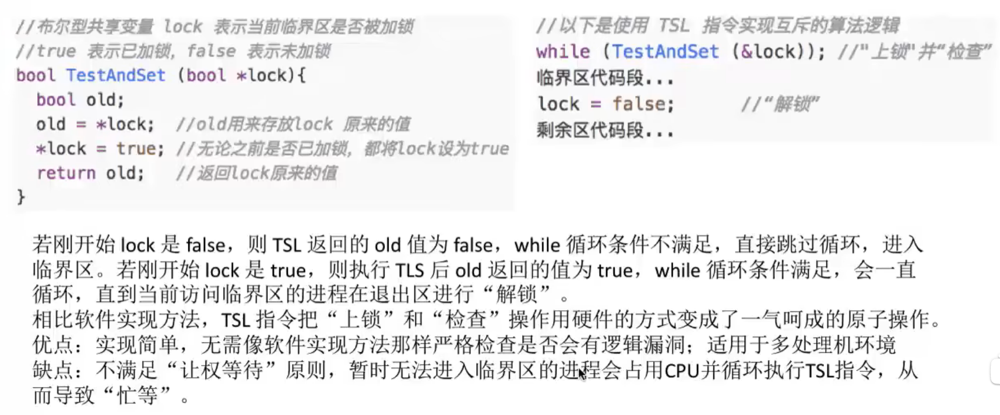

#### Swap指令

有的地方也叫Exchange指令，或建成XCHG指令

Swap指令是```用硬件实现```的，执行的过程不允许被打断，只能一气呵成。下图为C描述逻辑

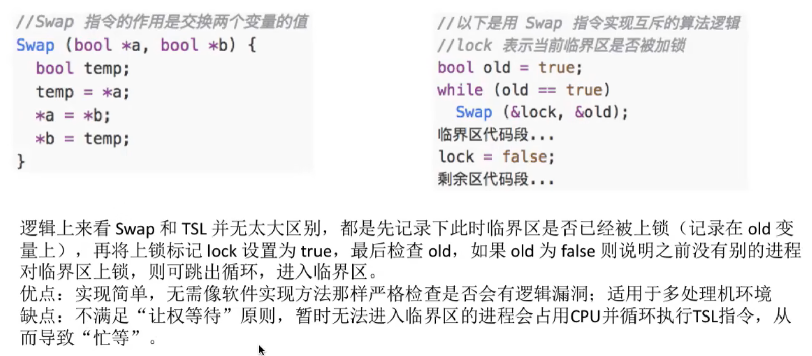

***

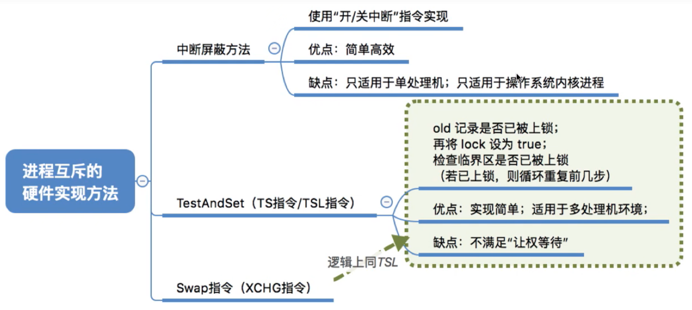

## 信号量机制

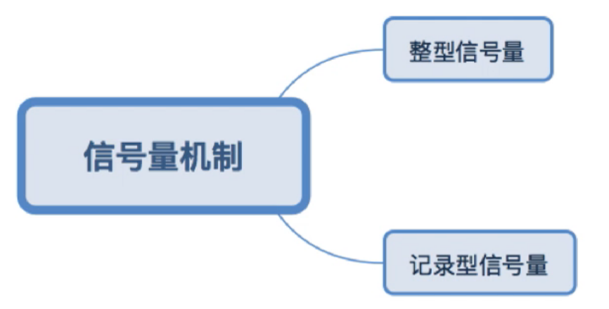

进程互斥的四种软件实现方法(单标志法，双标志先检查法，双标志后检查法，Peterson算法)

进程互斥的三种硬件实现方式(中断屏蔽法，TS/TSL指令、Swap/XCHG指令)

在双标志先检查法中，```进入去的“检查”、“上锁”操作无法一气呵成```，从而导致两个进程有可能同时进入临界区的问题

所有的解决方案都```无法实现“让权等待”```

1965年，荷兰学者Dijkstra提出了一种实现进程互斥、同步的方法--```信号量机制```

用户进程可以通过使用OS提供的```一对原语```来对```信号量```进行操作，从而方便实现进程互斥、进程同步

```信号量```其实就是一个*变量*(*可以是一个证书，也可以是更复杂的记录型变量*)，可以用一个信号量来```表示系统中某种资源的数量```，如比：系统中只有一台打印机，就可以设置一个初值为1的信号量

```原语```是一种特殊的程序端，其```执行只能一气呵成，不可被中断```。原语是由```关/开中断指令```实现的。软件解决方案的主要问题是由*进入去的各种操作无法一气呵成*，因此如果能把进入区、退出区的操作都用*原语*实现，使这些操作能*一气呵成*就能避免问题

```一对原语```：wait(S)原语和signal(S)原语。wait、signal原语常```简称为P、V操作```(来自荷兰语proberen和verhogen)。因此，做题的时候常把wait(S),signal(S)两个操作分别写为P(S),V(S)

#### 整型进号量

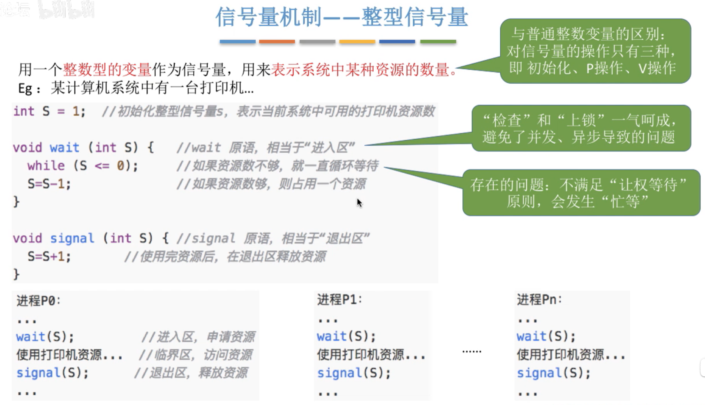

#### 记录型进号量

整型信号量的缺陷是存在*忙等*问题，因此人们又提出了*记录型信号量*，即用记录型数据结构表示的信号量

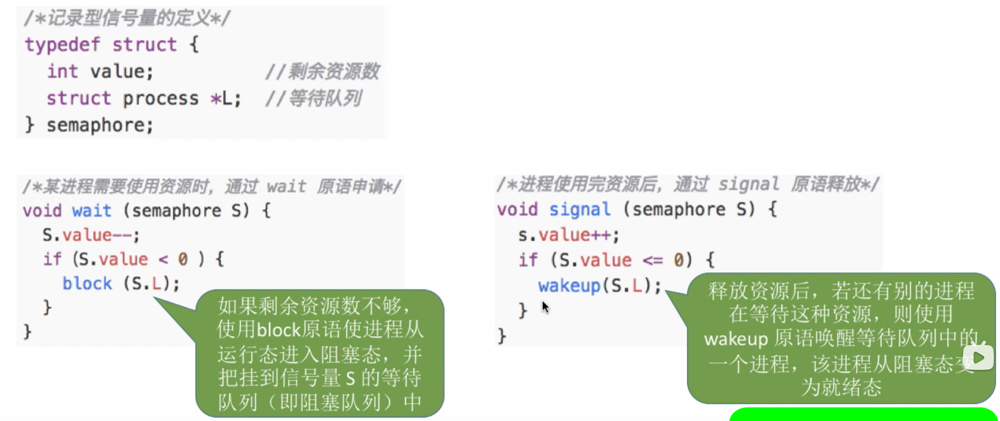
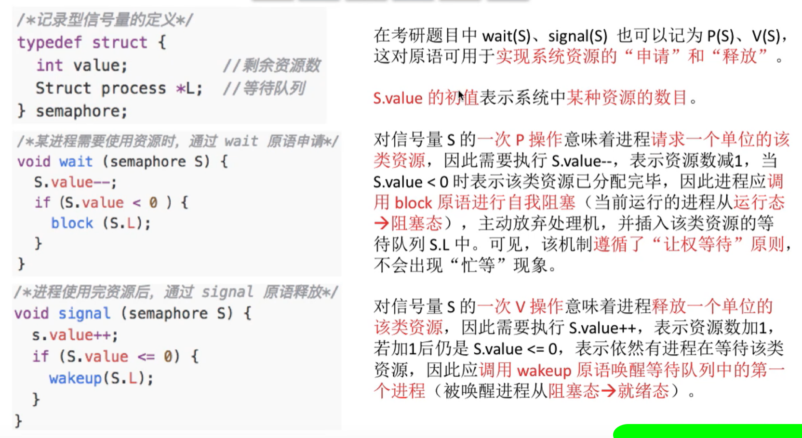
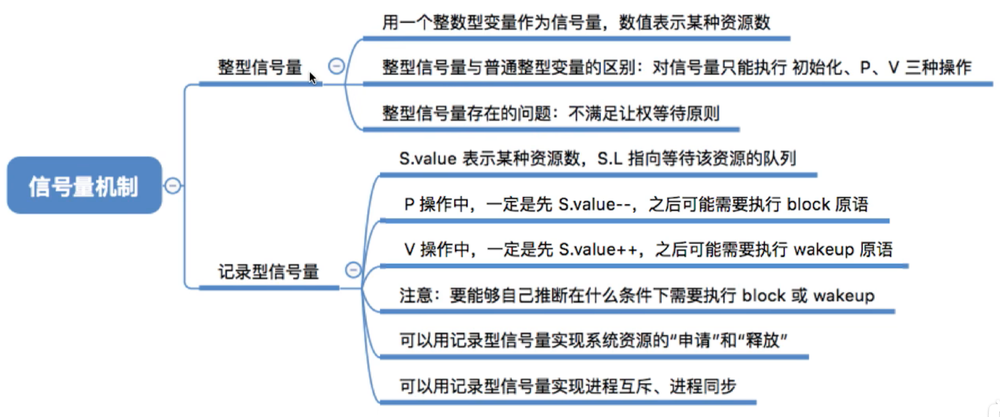

#### 信号量机制实现进程互斥

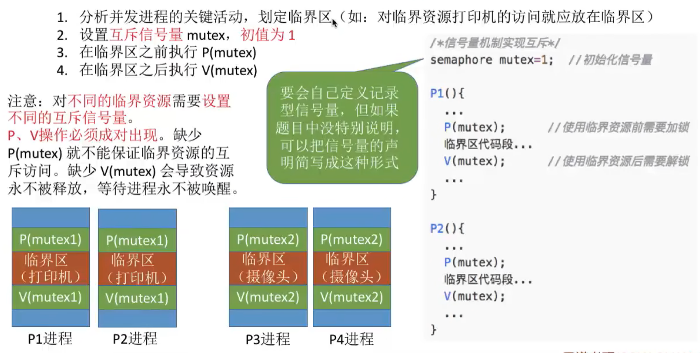

#### 信号量机制实现进程同步


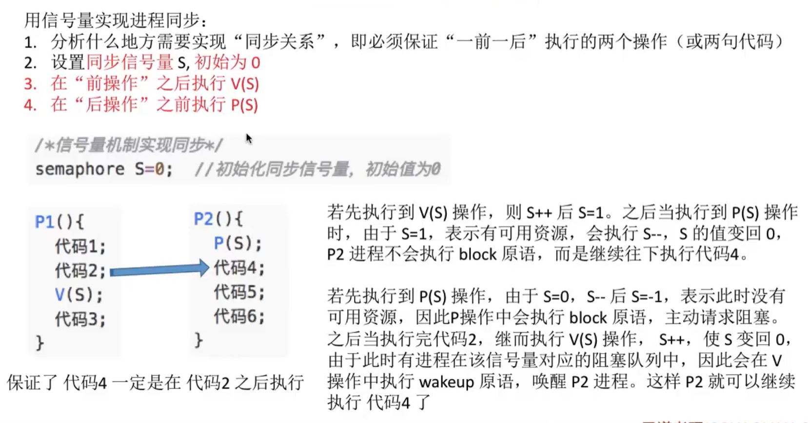

***

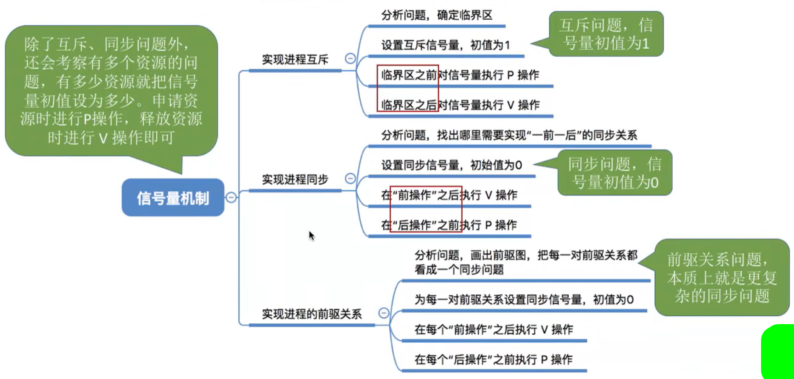


