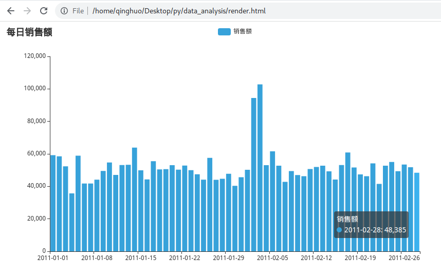

# 数据分析案例
[本案例数据位于](./material_py/data_analysis/)

本案例共创建3个文件(main.py,data_define.py,file_define.py)，使用oop解决

#### main.py

```python
"""
面向对象，数据分析案例，主业务逻辑代码
步骤实现
1. 设计一个类，可以完成数据的封装
2. 设计一个抽象类，定义文件读取的相关功能，并使用子类实现具体功能
3. 读取文件，生产数据对象
4. 进行数据需求的逻辑计算（计算每天的销售额）
4. 通过pyecharts进行图形绘制
"""
from data_define import Record
from file_define import FileReader,TextFileReader,JSONFileReader
from pyecharts.charts import *
from pyecharts.options import *
from pyecharts.globals import ThemeType

text = TextFileReader("./data/2011年1月销售数据.txt")
json_list = JSONFileReader("./data/2011年2月销售数据JSON.txt")

text_data: list[Record] = text.read_data()
json_data: list[Record] = json_list.read_data()

# 合并两个list
all_data: list[Record] = text_data + json_data
data_dict = {}
# 计算每天的总销售额，保存为list,key为date,value为总money
for o in all_data:
    if o.date in data_dict:
        """data_dict中已有当前日期"""
        data_dict[o.date] += o.money
    else:
        """data_dict中没有当前日期"""
        data_dict[o.date] = o.money

# print(data_dict.values())
# print(data_dict.keys())
# print(type(data_dict.keys()))   # <class 'dict_keys'>，其返回并非列表
bar: Bar = Bar(init_opts=InitOpts(theme=ThemeType.LIGHT))
# 这里需要通过list()将字典的keys()和values()转为列表
bar.add_xaxis(list(data_dict.keys()))
bar.add_yaxis("销售额",list(data_dict.values()),label_opts=LabelOpts(is_show=False))
bar.set_global_opts(
    title_opts=TitleOpts(title="每日销售额")
)
bar.render()
```

#### data_define.py

```python
"""定义文件类"""
class Record:

    def __str__(self):
        return f"{self.date},{self.order_id},{self.money},{self.province}"

    def __init__(self,date,order_id,money,province):
        self.date = date
        self.order_id = order_id
        self.money = money
        self.province = province
```

#### file_define.py

```python
"""
和文件相关的类定义
读取两个不同格式的文件，返回list
"""
from data_define import Record
import json
# 先定义一个抽象类用来做顶层设计，确定有哪些功能需要实现
class FileReader:
    def read_data(self):
        """读取文件的数据，读到每一条数据都转为Record对象，将其封装到list并返回"""
        pass

class TextFileReader(FileReader):
    def __init__(self,path):
        self.path = path

    def read_data(self) -> list[Record]:
        f = open(self.path,"r",encoding="UTF-8")
        data_list = []
        for line in f.readlines():
            line = line.strip()
            line_list = line.split(",")
            record = Record(line_list[0],line_list[1],int(line_list[2]),line_list[3])
            data_list.append(record)

        # for data in data_list:
        #     print(data)
        f.close()
        return data_list
class JSONFileReader(FileReader):
    def __init__(self,path):
        self.path = path
    def read_data(self) -> list[Record]:
        f = open(self.path,"r",encoding="UTF-8")
        data_list = []
        for line in f.readlines():
            line_dict = json.loads(line)
            record = Record(line_dict["date"],line_dict["order_id"],line_dict["money"],line_dict["province"])
            data_list.append(record)

        # for v in data_list:
        #     print(v)
        f.close()
        return data_list

if __name__ == '__main__':
    # text_data = TextFileReader("./data/2011年1月销售数据.txt")
    # text_data.read_data()
    json_data = JSONFileReader("./data/2011年2月销售数据JSON.txt")
    json_data.read_data()
```
- 最终效果图如下



