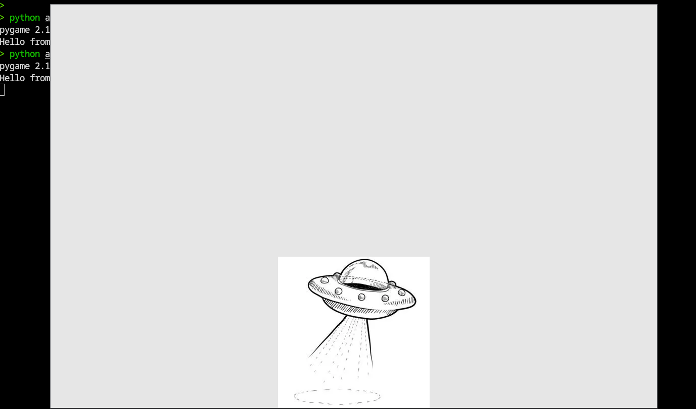

# 外星人入侵

使用`pygame`开发的一个 2d 游戏

`pygame`可用于管理图形、动画乃至声音，可让开发者轻松开发复杂的游戏。通过使用 pygame 来处理在屏幕上绘制图像等任务，不用考虑容多繁琐而艰难的编码工作，而是将重点放在程序的高级逻辑上

## 创建游戏窗口

首先创建一个空的 pygame 窗口，供后面用来绘制游戏元素

```py
> cat alien_invasion.py
import sys
import pygame

def run_game():
    """初始化游戏并创建一个屏幕对象"""
    pygame.init() # 初始化背景设置,让 pygame 能正确工作
    screen = pygame.display.set_mode((1200,800))
    pygame.display.set_caption("Alien Invasion")

    #开始游戏的主循环
    while True:
        #监听键盘和鼠标事件
        for event in pygame.event.get():
            if event.type == pygame.QUIT:
                sys.exit()

        #让最近绘制的屏幕可见
        pygame.display.flip()

run_game()
```

玩家退出时，使用模块 `sys` 来退出游戏。

对象 screen 是一个 `surface`。在 pygame 中，`surface` 是屏幕的一部分，用于显示游戏元素。在这个游戏游戏中，每个元素(eg：外星人或飞船) 都是一个 `surface`。`display.set_mode()`返回的 surface 表示整个游戏窗口。每次循环都会重绘这个 surface


while 循环内包含一个`事件循环以及管理屏幕更新的代码`。事件由用户触发(eg：案件或移动鼠标)。为了让程序响应时就爱你，我们编写一个事件循环，以监听事件，并根据发生的事件执行相应的任务

`pygame.event.get()`会监听键盘或鼠标的事件，事件会促使 for 循环执行。

`pygame.display.flip()` 命令 Pygame 让最近绘制的屏幕可见。在这里，它在每次执行 while 循环时都绘制一个空屏幕，并擦除旧屏幕，使得只有新屏幕可见。后续在移动游戏元素时，`pygame.display.flip() 将不断更新屏幕，以显示元素的新位置，并在原来的位置隐藏元素，从而营造平滑移动的效果`

### 设置背景色

pygame 默认创建一个黑色屏幕，现在来设置背景色

```py
> cat alien_invasion.py
import sys
import pygame

def run_game():
    """初始化游戏并创建一个屏幕对象"""
    pygame.init()
    screen = pygame.display.set_mode((1200,800))
    pygame.display.set_caption("Alien Invasion")

    #设置背景色
    bg_color = (230,230,230) #---------新增

    #开始游戏的主循环
    while True:
        #监听键盘和鼠标事件
        for event in pygame.event.get():
            if event.type == pygame.QUIT:
                sys.exit()

        #每次循环时都重绘屏幕
        screen.fill(bg_color) #---------新增
        #让最近绘制的屏幕可见
        pygame.display.flip()

run_game()
```

在 pygame 中，颜色以 RGB 指定，取值为 0～255

通过调用 `screen.fill()`，用背景色填充屏幕，这个方法只接收一个实参：一种颜色

### 创建设置类

每次给游戏添加新功能时，通常也将引入一些新设置。现在来编写一个名为 `settings` 的模块，其中包含一个名为 `Settings` 的类，用于将所有设置存储在一个地方。

```py
> cat settings.py
class Settings():
    """存储《外星人入侵》的所有设置的类"""
    def __init__(self):
        """初始化游戏的设置"""
        #屏幕设置
        self.screen_width = 1200
        self.screen_height = 800
        self.bg_color = (230,230,230)
```

为创建 `Settings` 实例并使用它来访问设置，将 `alien_invasion.py` 修改

```py
> cat alien_invasion.py
import sys
import pygame

from settings import Settings

def run_game():
    """初始化游戏并创建一个屏幕对象"""
    pygame.init()
    ai_settings = Settings() #------------新增
    screen = pygame.display.set_mode(
        (ai_settings.screen_width,ai_settings.screen_height)
    ) #------------新增
    pygame.display.set_caption("Alien Invasion")

    #开始游戏的主循环
    while True:
        #监听键盘和鼠标事件
        for event in pygame.event.get():
            if event.type == pygame.QUIT:
                sys.exit()

        #每次循环时都重绘屏幕
        screen.fill(ai_settings.bg_color)
        #让最近绘制的屏幕可见
        pygame.display.flip()

run_game()
```

## 添加飞船图像

为了在屏幕上绘制玩家的飞船，需要加载一副图像，再使用 pygame 的方法 `blit()` 绘制它

在游戏中几乎可以使用任何类型的图像文件，但使用`位图(.bmp)`文件最简单，因为 pygame 默认加载位图

我们将飞船的图片移动到 ./images 下，并重命名为 ship.bmp

### 创建 Ship 类

选择飞船图像后，需要将其显示到屏幕上。我们创建一个名为 ship 的模块，其中包含 Ship 类，它负责管理飞船的大部分行为

```py
> cat ship.py
import pygame

class Ship():
    def __init__(self, screen):
        """初始化飞船并设置其初始位置"""
        self.screen = screen

        # 加载飞船图像并获取其外接矩形
        self.image = pygame.image.load("images/ship.bmp") #加载图像
        self.rect = self.image.get_rect()
        self.screen_rect = screen.get_rect()

        # 将每艘新飞船放在屏幕底部中央
        self.rect.centerx = self.screen_rect.centerx
        self.rect.bottom = self.screen_rect.bottom

    def blitme(self):
        """在指定位置绘制飞船"""
        self.screen.blit(self.image,self.rect)
```

`Ship 的方法 __init__` 接收的 screen 参数表示：要将飞船绘制到什么地方

`pygame.image.load()` 方法返回一个表示飞船的 `surface`，我们将这个 surface 存储到了 `self.image` 中

`get_rect()` 获取相应 surface 的属性 `rect`。pygame 效率之所以高，一个原因是它让你能处理矩形(rect 对象)一样处理游戏元素，即便他们的形状并非举行

处理 `rect` 对象时，可设置相应 rect 对象的属性 `center, centerx 和 centery`。要让游戏元素与屏幕边缘对齐，可使用属性 `top, bottom, left 和 right`。要调整游戏元素的水平或垂直距离，可使用属性 x 和 y。他们分别是`相应矩形左上角的 x 和 y 坐标`

目前我们将飞船放在了屏幕底部中央。而我们定义的方法`Ship.blitme()` 会根据 `self.rect` 指定的位置将图像绘制到屏幕上

### 在屏幕上绘制飞船

现在更新 alien_invasion.py，使其创建一艘飞船并显示在屏幕上

```py
> cat alien_invasion.py
import sys
import pygame

from settings import Settings
from ship import Ship

def run_game():
    """初始化游戏并创建一个屏幕对象"""
    pygame.init()
    ai_settings = Settings()
    screen = pygame.display.set_mode(
        (ai_settings.screen_width,ai_settings.screen_height)
    )
    pygame.display.set_caption("Alien Invasion")

    #创建一艘飞船
    ship = Ship(screen) #-------------新增

    #开始游戏的主循环
    while True:
        #监听键盘和鼠标事件
        for event in pygame.event.get():
            if event.type == pygame.QUIT:
                sys.exit()

        #每次循环时都重绘屏幕
        screen.fill(ai_settings.bg_color)
        ship.blitme()   #-------------新增
        #让最近绘制的屏幕可见
        pygame.display.flip()

run_game()
```

现在运行 alien_invasion.py。可以看到飞船位于空游戏屏幕底部中央 

 

## 重构

重构旨在简化既有代码的结构，使其更容易扩展

现在让我们创建一个名为 game_functions 的新模块，它将存储大量让游戏 《外星人入侵》运行的函数。通过创建 game_functions，可避免 alien_invasion.py 文件太常

### 函数 check_events()

首先把管理时间的代码移到一个名为 `check_events()` 的函数中，以简化 `run_game()`，并隔离事件管理循环。通过隔离事件循环，可将时间管理与游戏的其他方面(eg：更新屏幕) 分离。

将 `check_events()` 放在一个名为 `game_functions` 的模块中

```py
> cat game_functions.py
import sys

import pygame

def check_events():
    """响应按键和鼠标事件"""
    for event in pygame.event.get():
        if event.type == pygame.QUIT:
            sys.exit()
```

现在修改 alien_invasion.py，使其导入模块 game_functions，并将时间循环替换为对函数 check_events 的调用

```py
> cat alien_invasion.py
import pygame

from settings import Settings
from ship import Ship
import game_functions as gf

def run_game():
    """初始化游戏并创建一个屏幕对象"""
    pygame.init()
    ai_settings = Settings()
    screen = pygame.display.set_mode(
        (ai_settings.screen_width,ai_settings.screen_height)
    )
    pygame.display.set_caption("Alien Invasion")

    #创建一艘飞船
    ship = Ship(screen)

    #开始游戏的主循环
    while True:
        #监听键盘和鼠标事件
        gf.check_events() #-------------新增

        #每次循环时都重绘屏幕
        screen.fill(ai_settings.bg_color)
        ship.blitme()
        #让最近绘制的屏幕可见
        pygame.display.flip()

run_game()
```

现在，主程序文件中，不需要再导入 sys 模块了

### 函数 update_screen()

为了进一步简化 `run_game()`，下面将更新屏幕的代码移动到另一个名为 `update_screen()` 的函数中，并将这个函数放在模块 game_functions 中

```py
> cat game_functions.py
import sys

import pygame

def check_events():
    """响应按键和鼠标事件"""
    for event in pygame.event.get():
        if event.type == pygame.QUIT:
            sys.exit()

def update_screen(ai_settings,screen,ship): #--------新增
    """更新屏幕的图像，并切换到新屏幕"""
    # 每次循环时都重绘屏幕
    screen.fill(ai_settings.bg_color)
    ship.blitme()

    #让最近重绘的屏幕可见
    pygame.display.flip()
```

`update_screen()` 接收三个参数：`ai_settings, screen, ship`。现在将 alien_invasion.py 的 while 循环中更新屏幕的代码替换为对函数 `update_screen()` 的调用

```py
> cat alien_invasion.py
import sys
import pygame

from settings import Settings
from ship import Ship
import game_functions as gf

def run_game():
    """初始化游戏并创建一个屏幕对象"""
    pygame.init()
    ai_settings = Settings()
    screen = pygame.display.set_mode(
        (ai_settings.screen_width,ai_settings.screen_height)
    )
    pygame.display.set_caption("Alien Invasion")

    #创建一艘飞船
    ship = Ship(screen)

    #开始游戏的主循环
    while True:
        #监听键盘和鼠标事件
        gf.check_events()
        gf.update_screen(ai_settings,screen,ship) #-------------新增

run_game()
```
## 驾驶飞船

在用户按左箭头或右箭头时，应做出响应。

### 响应按键

每当用户按键时，都会在 pygame 中注册一个时间。事件都是通过方法 `pygame.event.get()` 获取的，因此在 `check_events()` 函数中，我们需要指定：要检查哪些类型的事件。每次按键都被注册为一个 `KEYDOWN` 事件

检测到`KEYDOWN`事件时，我们需要检查按下的是否是特定的键。eg：如果按下的是右箭头键，我们就增大飞船的 `rect.centerx` 值，让飞船向右移动

```py
> cat game_functions.py
--snip--

def check_events(ship):
    """响应按键和鼠标事件"""
    for event in pygame.event.get():
        if event.type == pygame.QUIT:
            sys.exit()
        elif event.type == pygame.KEYDOWN: #-------新增
            if event.key == pygame.K_RIGHT:
                #向右移动飞船
                ship.rect.centerx += 1

def update_screen(ai_settings,screen,ship):
--snip--
```

在函数 `check_events()`中传入实参 `ship`，因为玩家按右箭头时，需要将飞船向右移动。在 `check_events()` 内部，我们在事件循环中添加了一个 `elif` 代码块，以便在 pygame 检测到 `KEYDOWN` 事件时做出响应。通过读取 `event.key`，来检查按下的是否是右箭头键(pygame.K_RIGHT)

在 alien_invasion.py 中，我们需要更新调用的 `check_events()` 代码，将 `ship` 作为实参传递给他

```py
--snip--
#开始游戏的主循环
while True:
│   #监听键盘和鼠标事件
│   gf.check_events(ship) #-------------新增
│   gf.update_screen(ai_settings,screen,ship)

--snip--
```

现在运行 alien_invasion.py，每按下右箭头一次，飞船都将向右移动一个像素。

### 允许不断移动

