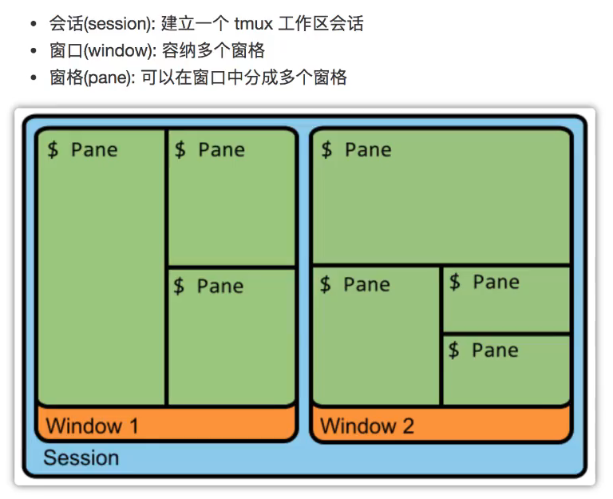

## tmux



### 会话 (Session)

```bash
tmux new -s session_name 新建会话
tmux attach -t session_name 接入会话
tmux kill-session -t session_name kill会话
tmux kill-sever kill全部会话
tmux switch -t session_name 切换会话
tmux rename-session -t session_name 重命名会话

Ctrl+b d: 分离当前会话
tmux detach

Ctrl+b s: 列出所有会话
tmux ls

Ctrl+b $: 重命名当前会话
```

### 窗口 (Window)

```bash
Ctrl+b c: 创建一个新窗口，状态栏会现实多个窗口的信息
Ctrl+b p: 切换到上一个窗口(按照状态栏上的顺序)
Ctrl+b n: 切换到下一个窗口
Ctrl+b <number>: 切换到指定编号的窗口
Ctrl+b w: 从列表中选择窗口，按上下键进行选择
Ctrl+b ,: 重命名窗口
```

### 窗格(Pane)

```bash
Ctrl+b %: 划分左右两个窗格
Ctrl+b ": 划分上下两个窗格
Ctrl+b <arrow key>: 光标切换到其他窗格
Ctrl+b ;: 光标切换到上一个窗格
Ctrl+b o: 光标切换到下一个窗格
Ctrl+b x: 关闭当前窗格
Ctrl+b !: 将当前窗格拆分为一个独立窗口
Ctrl+b z: 当前窗格全屏显示，再使用一次会变回原来
Ctrl+b q: 现实窗格编号

tmux split-window 上下划分窗格
tmux split-window -h 左右划分窗格
tmux select-pane -U 光标到上方窗格
tmux select-pane -D 光标到下方窗格
tmux select-pane -L 光标到上方窗格
tmux select-pane -R 光标到下方窗格
tmux swap-pane -U 交换窗格布局(当前窗格上移)
tmux swap-pane -D 交换窗格布局(当前窗格下移)

```
