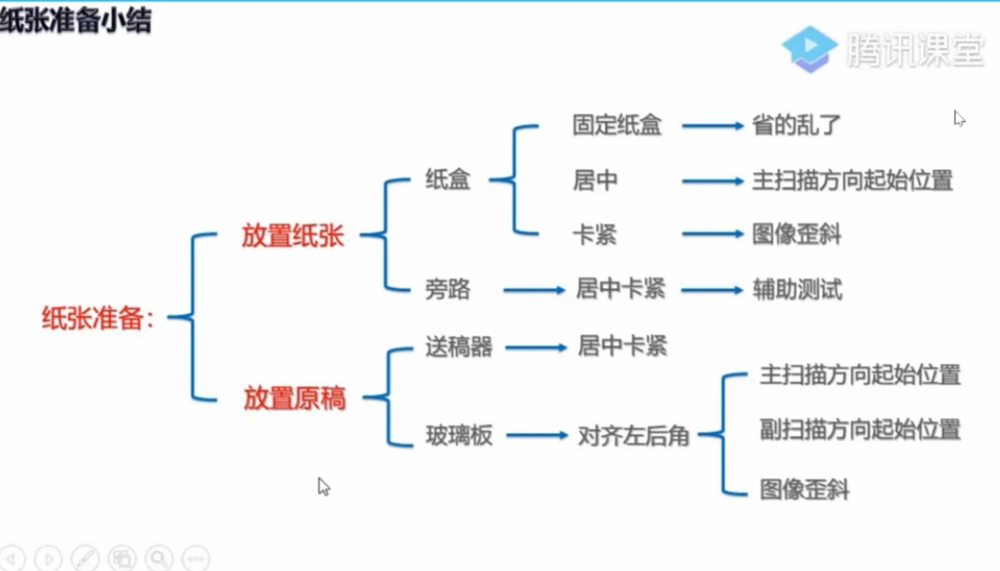

# Toshiba

## 图像偏移

一张竖放 A4 纸，以左下角为原点，竖轴为主扫描方向，横轴为副扫描方向

以 A4 为例，打印网格图为 10mm X 10mm,线宽 0.1 mm。打印网格方法如下



### 龙凤-网格图

05模式：1-模板间，选择纸盒，确定

### EBN(黒壳)-网格图

FS-05模式：1-选择纸盒，测试打印

## 色块图

- FS模式下
    * 05-classic-245-开始-ymck四色五个按钮顺序选择-点击开始后再次点击clear
    * 若色块图出现白色横条，说明显影仓需更换

### 龙凤更换定影

08开机-2002-确定-输入0。之后再05开机-做一个5990-确定(可能要等待)-完成后重启

### 校准套色(色块图)

- FS-31-第一个 打印人脸图
    * 之后 05-4719 做4遍(校准套色)，之后再打印人脸图


## 图像定位

对位量：确定感光鼓(转印带)上的墨粉图像准确的转印到纸张上的正确位置。鼓在旋转，纸张在匀速运行，对位单元就是保证 ```鼓像旋转到转印位置的时候，纸张也同步输送到转印位置```

对位棍的转动通常采用离合器或直接电机驱动，纸张在送至对位棍后，对位棍不转，会等着图像过来，此时对位之前的输送棍多旋转几ms，
将纸张多送一些，此时由于纸前端已经顶到对位棍之下，后端在输送，纸张就会形成一定的拱起量，这被称之为*对位(定位)量* 

纸张在对位棍之间停顿、除对齐图像前端位置外，对位的拱起量也会纠正对位前，由于纸张运行产生的微量歪斜，以避免纸张上的图像歪斜

对位辊是通过摩擦力将纸送进去的，由于惯性的存在，两根辊在启动的瞬间，会出现一定的打滑现象，导致纸张延迟到达，图像在纸张上的位置会左移，
(A4正常走纸时)，且位置不稳定。为了放置此类问题的出现，引入了对位量，让纸张拱起一些，保证足够的冲力准确进入转印区域

对位量过大，纸张在进入对位棍时会刮蹭到两辊前的导纸塑料片，产生较大的噪音，对位量过小，又其不到稳定前端图像位置的作用。对薄纸建议适当减少对位量，放置纸张拱起成 S型引发 Z型折纸现象，对厚纸，应适当增加对位量

若纸张在运行过程中出现折纸/皱纸现象，首先应该检查折纸/皱纸线上位置有无图像，以判断折/皱现象发生在成像前还是成像后

***

什么情况的偏移无法通过调整对位量的代码解决呢？

比如：打印量增大以后逐渐向某一方向偏移(这种问题的故障在离合器)

### EBN系列调整对位(定位)量

EBN(黒壳机)系列调整对位量的代码为：05-4579 (需要选择调整哪个纸盒--调整什么尺寸的纸--调整的普通纸还是厚纸等多个界面待选择)

### 龙凤系列调整对位(定位)量

龙凤系列只能放入普通纸

- 上纸盒定位量调整(普通纸)：05--4100
    * 子代码：0 长尺寸 330mm--
    * 子代码：1 中尺寸 220mm--329mm
    * 子代码：2 短尺寸 --219mm
- 下纸盒定位量调整(普通纸)：05--4101
- 旁路定位量调整
    * 普通纸：05--4103 (子代码 0 1 2)
    * 厚 纸：05--4104 (子代码 0 1 2)
    * 厚纸1：05--4105 (子代码 0 1 2)
    * 厚纸2：05--4106 (子代码 0 1 2)

***

下面两个位置的调整代码不区分系列

ADU 定位量调整(普通纸): 05--4110

RADF/DSDF 定位量调整：单面：05--3040 双面：05--3041

## 图像偏移

调整图像偏移的顺序：打印--玻璃板--送稿器

EBN系列升级至*L6.5*及以上，可以通过```05--315```打印新的偏移测试页(A4纸打印),05--316打印双面偏移测试页 


