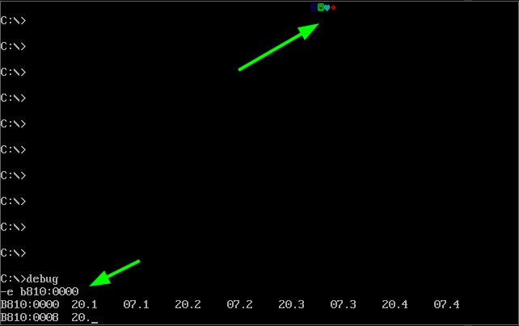
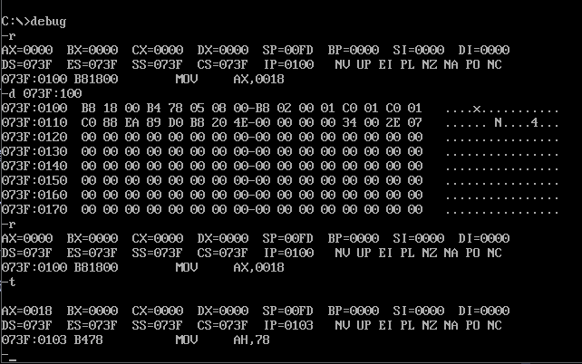

# 汇编基础

## debug

- r 查看、改变CPU寄存器
- d 查看内存中的内容
- e 改写内存中的内容
- u 将内存中的机器指令翻译成汇编指令
- t 从```CS:IP```处开始执行机器指令
- a 以汇编指令的格式在内存中写入机器指令

计算机内的地址可以表示为```段地址:偏移地址```的格式,eg：```1000:0```,然后用```d 1000:0```列出 *1000:0*处的内容

```x86asm
;查看 1000:0 处的机器码(返回的结果为128位)
;其中每16位为一行，共8行
-d 1000:0
...

;查看 1000:0 处的第一行机器码(共16位)
-d 1000:0 f
...

;从特定偏移量开始查看
;从 1000:5 的位置查看前两行机器码
-d 1000:5 2f
```

```x86asm
;查看 1000:0 处的汇编,机器码翻译而来
-u 1000:0
...
```

通过修改```B810:0000```(显存)处的内容来在屏幕上显示符号


## 基础指令

```x86asm
add 加法
sub 减法
mul 乘法
div 除法
shl 左移
shr 右移
rol 循环左移(左移后的数字会补在最后)
ror 循环右移(右移后的数字会补在最前)
inc ax 等于 ax++
dec ax 等于 ax--
nop 空指令
xchg 交换指令
neg 取反
int n 中断(除零会触发int 0 这个中断)
jmp 跳转(改变CS:IP的值)
sdd 带借位减法指令
cmp 比较指令，相当于减法指令，且不保存结果
```

```x86asm
mov 寄存器，数据    eg：mov ax,8
mov 寄存器，寄存器  eg：mov ax,bx
mov 寄存器，内存单元  eg：mov ax,[0]
mov 内存单元，寄存器  eg：mov [0],ax
mov 段寄存器，寄存器  eg：mov ds,ax

add 寄存器，数据    eg：add ax,8
add 寄存器，寄存器  eg：add ax,bx
add 寄存器，内存单元  eg：add ax,[0]
add 内存单元，寄存器  eg：add [0],ax

sub 寄存器，数据    eg：sub ax,8
sub 寄存器，寄存器  eg：sub ax,bx
sub 寄存器，内存单元  eg：sub ax,[0]
sub 内存单元，寄存器  eg：sub [0],ax
```

## 地址

8086CPU中，段地址 * 16 + 偏移地址 = 物理地址

8086CPU 不支持将数据直接送入```段寄存器```(电路实现时未设计),解决方法： 数据 -> 通用寄存器 -> 段寄存器

## 寄存器

- 通用寄存器,
    * AX BX CX DX,取值范围为```2byte(16bit)```,*0~FFFFH*,```0~65535```,共表示65536种状态
    * 8086CPU中，这4种通用寄存器又可以各自拆分为2个互相独立的8位寄存器,取值为```1byte(8bit)```,```0~255```

```x86asm
DS(Data Segment) 数据段寄存器 通常存放要访问数据的段地址
SS(Stack Segment) 堆栈寄存器 ```SS:SP```指向栈顶元素
SP(Stack Pointer) 堆栈指针寄存器
AH&AL = AX(Accumulator) 累加寄存器
BH&BL = BX(Base) 基址寄存器,也可当作偏移地址寄存器
CH&CL = CS(Count) 计数寄存器
DH&DL = DX(Data) 数据寄存器
BP(Base Pointer) 基址指针寄存器
SI(Source Index) 源变址寄存器
DI(Destination Index) 目的变址寄存器
IP(Instruction Pointer) 指令指针寄存器
CS(Code Segment) 代码段寄存器
ES(Extra Segment) 附加段寄存器
```

| 段地址寄存器    |  偏移寄存器   |
|---------------- | --------------- |
| ds | sp | 
| es | bp | 
| ss | si | 
| cs | ip | 
|  | di | 
|  | bx | 

```在任意时刻，8086CPU都会将 段地址寄存器 CS 和 偏移地址寄存器 IP 所组合的地址中读取内容，全部当作指令来执行```

```指令是有长度的，和 IP 寄存器有关```


### 字型

8086CPU一次可以处理 2 种尺寸的数据

字节型数据  1byte = 8bit = 8位寄存器    1个字节

字型数据    2byte = 16bit = 16位寄存器  2个字节

```一个字节```是这个```字型数据```的```高位字节(AH,BH,CH,DH)```,另一个字节是这个字型数据的低位字节(AL,BL,CL,DL)

### 寻址

8086CPU 拥有20根地址线， 其取值范围在```0～FFFFFH```,由于其寄存器位16位，因此地址的计算方式如下

```x86asm
段地址 * 16 + 偏移地址 = 物理地址 ;此处乘以的16位10进制，16进制应该表示为 10H
段地址 * 16 = 基础地址
基础地址 + 偏移地址 = 物理地址
```

### 指令执行

指令是有```长度```的,一条指令可以由多个```字节```构成

```x86asm
;指令的执行过程
1 CPU从CS:IP 所指向的内存单元读取指令，保存至 指令缓存器 中
2 IP = IP + 所读指令的长度，从而指向 下一条指令
3 执行 指令缓存器 中的内容，回到 1
```



以 debug 中的 d 命令查看 *073F:0100* 处的内容，第一行为 *B8 18 00 B4 78 05 08 00-BB 02 00 01 C0 01 C0 01*,
其中 ```B81800H``` 被翻译为 ```MOV AX,0018```，使用 t 命令执行后，CS:IP 的指向变为了 ```073F:0103```,
由于 ```B81800H``` 正好是3个16进制，占3个字节，所以 IP 寄存器会```+3```，并指向下一条指令，
```B478H```(翻译为指令为```MOV AH,78```)


### 小结

```字```在内存中存储时，要用两个地址连续的内存单元来存放，字的低位字节存放在低地址中，高位
字节存放在高地址单元中

用 mov 指令要访问内存单元，可以在 mov 指令中只给出单元的偏移地址，此时，段地址默认在 DS 寄存器中

[address] 表示一个偏移地址位 address 的内存单元

在内存和寄存器之间传送*字型数据*时，高地址单元和高8位寄存器、低地址单元和低8位寄存器相对应

mov、add、 sub 是具有两个操作对象的指令，访问内存中的数据段(jmp 是具有一个操作对象的指令，对应内存中的代码段)

## 栈

- 8086CPU 中，有两个与栈相关的寄存器
    * SS 栈段寄存器 存放栈顶的*段地址*
    * SP 栈顶指针寄存器 存放栈顶的*偏移地址*
    * 任意时刻，SS:SP 都指向栈顶元素
- push ax 将ax中的数据送入栈中
- pop ax 从栈顶去除数据送入ax


## 编译汇编

汇编程序: 包含```汇编指令```和```伪指令```的文本，以 code.asm 为例

```x86asm
assume cs:codesg    ; 假设
codesg segment  ; 段定义,段的开始
    mov ax, 0123H
    mov bx, 0456H
    add ax, bx
    add ax, bx

    mov ax,4c00H    ; 此处两行为程序返回
    int 21H     ; 将CPU控制权交还(DOS汇编里为DOS系统)
codesg ends ; 段结束
end ; 汇编承接的结束标记
```

其中缩进内容未汇编代码，未缩进的部分属于```伪指令```,没有对应的机器码指令，不被CPU执行，
伪指令由编译器来执行，编译器根据伪指令来进行相关的编译工作

```段定义```：一个有意义的汇编程序至少要有一个段，这个段用来存放代码，每个段需要有段名,eg:```段名segment``` 表示段的开始，
```段名 ends``` 表示段的结束

```end(不是ends)```:汇编程序的结束标识。若程序结尾不加end,编译器在编译程序时，无法知道程序在何处结束

```assume(假设)```假设某一段寄存器和程序汇中的某一个用 *segment ... ends* 定义
的段相关联--assume cs:codesg 指 CS 寄存器与 codesg 关联，将定义的 codesg 当作程序的代码段使用

### [...]与(...)

[...]--汇编语法，表示```一个内存单元```

| 指令    | 段地址    | 偏移地址    | 操作单位    |
|---------------- | --------------- | --------------- | :---------------: |
| mov ax,[0] | 在DS寄存器中 | 在[0]中 | 字 |
| mov al,[0] | 在DS寄存器中 | 在[0]中 | 字节 |
| mov ax,[bx] | 在DS寄存器中 | 在[bx]中 | 字 |
| mov al,[bx] | 在DS寄存器中 | 在[bx]中 | 字节 |

(...)--为了方便学习做出的约定，表示一个```内存单元```或寄存器中的内容

## loop

```loop``` 指令的循环条件为 ```cx```,当 cx 中的值为 0时，则结束循环,继续执行下面的指令

> cx 的值若不小心设为 0，则会产生 0 - 1 = FFFF 的越界

- 8086CPU 执行 loop 时的步骤：
    * (cx) = (cx) - 1
    * cx 不为 0 时才执行循环，若 cx = 0,则执行下一条指令

```x86asm
;计算123 * 236的乘积
assume cs:code 
code segment
    mov ax,0

    mov cx,236
s:  add ax,123
    loop s

    mov ax,4c00H
    int 21H
code ends
end
```

### loop和[bx]的联合应用

```x86asm
;未改进前，无法实现题目要求
;计算ffff:0 ~ ffff:b累加和并存入 dx 中
assume cs:code
code segment
    mov ax,0ffffH
    mov ds,ax   ;设置(ds)=ffffH
    mov dx,0    ;初始化累加寄存器 (dx)=0

    mov al,ds:[0]
    mov ah,0    ;(ax)=((ds)*16+0)=(ffff0H)
    add dx,ax   ;向 dx 中加上ffff:0单元的数值

    mov al,ds:[1]
    mov ah,0    ;(ax)=((ds)*16+0)=(ffff0H)
    add dx,ax   ;向 dx 中加上ffff:0单元的数值

    ...中间的累加省略

    mov al,ds:[0ah]
    mov ah,0    ;(ax)=((ds)*16+0)=(ffff0H)
    add dx,ax   ;向 dx 中加上ffff:0单元的数值

    mov al,ds:[0bh]
    mov ah,0    ;(ax)=((ds)*16+0)=(ffff0H)
    add dx,ax   ;向 dx 中加上ffff:0单元的数值

    mov ax,4c00H
    int 21H
code ends
end
```

```x86asm
;改进后
;计算ffff:0 ~ ffff:b累加和并存入 dx 中
assume cs:code
code segment
    mov ax,0ffffH
    mov ds,ax   ;设置(ds)=ffffH
    mov dx,0    ;初始化累加寄存器 (dx)=0
    mov bx,0    ;初始化 ds:bx 指向 ffff:0,循环变量

    mov cx,12   ;设置循环次数 (cx) = 12

s:  mov al,[bx]
    mov ah,0    ;(ax)=((ds)*16+0)=(ffff0H)
    add dx,ax   ;向 dx 中加上ffff:0单元的数值
    inc bx  ;ds:bx 指向下一个单元，自增(++)
    loop s

    mov ax,4c00H
    int 21H
code ends
end
```

### 段前缀的使用

```x86asm
;将ffff:0~ffff:b中的数据复制到0:200~0:20b中
assume cs:code
code segment
    mov ax,0ffffh
    mov ds,ax   ;ds=0ffffH
    mov ax,0020h
    mov es,ax   ;es=0020H

    mov bx,0    ;中转数据,此时ds:bx指向ffff:0, es:bx指向0020:0
    mov cx,12   ;循环次数12次

s:  mov dl,[bx] ;将ffff:bx的数据送入dl
    mov es:[bx],dl  ;将dl的数据送入 0020:bx
    inc bx  ;bx++
    loop s

    mov ax,4c00h
    int 21h
code ends
end
```

```x86asm
;对上述代码的改进
assume cs:code
code segment
    mov ax,0ffffh
    mov ds,ax   ;ds=0ffffH
    mov ax,0020h
    mov es,ax   ;es=0020H

    mov bx,0    ;中转数据,此时ds:bx指向ffff:0, es:bx指向0020:0
    mov cx,6   ;循环次数6次

s:  push ds:[bx] ;节省寄存器
    pop es:[bx]  
    add bx,2
    loop s

    mov ax,4c00h
    int 21h
code ends
end
```

### 小结(检测点)

向内存0:200~0:23F依次传送数据0~63(3FH)

```x86asm
assume cs:code
code segment
    mov ax,20H
    mov es,ax

    mov cx,64
    mov bx,0

    mov dl,0

s:  mov es:[bx],dl
    inc bx
    inc dl
    loop s

    mov ax,4c00H
    int 21H
code ends
end
```

向内存0:200~0:23F依次传送数据0~63(3FH),只使用9条指令，9条指令包括*mov ax,4c00h* 和 *int 21h* 

```x86asm
assume cs:code
code segment
    mov ax,20H
    mov es,ax

    mov cx,64
    mov bx,0

s:  mov es:[bx],bl
    inc bx
    loop s

    mov ax,4c00H
    int 21H
code ends
end
```

## 多个段的源码

```x86asm
;累加dw定义的8个数据并保存至ax内
assume cs:code
code segment
        dw 0123h,0456h,0789h,0abch,0defh,0fedh,0cbah,0987h
        ;dw -> define word,定义数据

start:  mov bx,0    ;start表明程序入口
        mov ax,0

        mov cx,8
s:      add ax,cs:[bx]
        add bx,2
        loop s

        mov ax,4c00h
        int 21h
code ends
end start   ;end start 表明程序结束
```

```x86asm
;将dw定义的数据存入栈中并逆序输出
assume cs:code
code segment
        dw 0123h,0456h,0789h,0abch,0defh,0fedh,0cbah,0987h
        dw 0,0,0,0,0,0,0,0
        dw 0,0,0,0,0,0,0,0

start:  mov ax,cs   
        mov ss,ax
        mov sp,48

        mov bx,0
        mov cx,8

s:      push cs:[bx]
        add bx,2
        loop s

        mov bx,0
        mov cx,8

s:      pop cs:[bx]
        add bx,2
        loop popData

        mov ax,4c00h
        int 21h
code ends
end start
```

## and or

```x86asm
;and 与运算
mov al,00001010B
and al,00001111B    ;and 将相对应的位，2个为1,运算结果为1
;      00001010B

;or 或运算
mov al,00001111B
or  al,11110000B    ;or 相对应的位有一个为1,结果为1
;      11111111B
```


