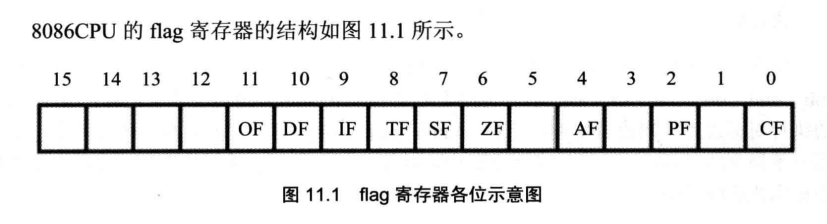
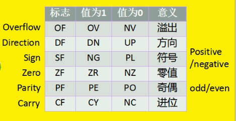
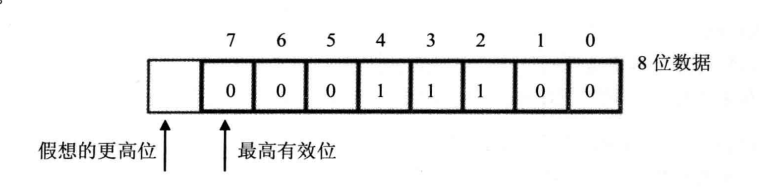
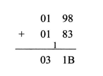
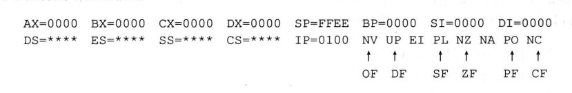
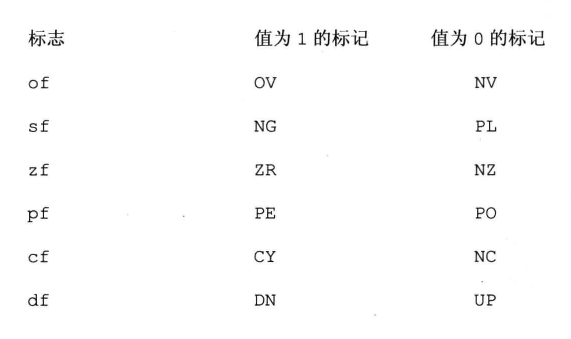

# 标志寄存器

CPU 内部的寄存器中，有一种特殊寄存器，具有以下3种作用

1. 用来存储相关指令的某些执行结果
2. 用来为 CPU 执行相关指令提供行为依据
3. 用来控制 CPU 的相关工作方式

这类特殊的寄存器在 8086CPU 中，叫做*标志寄存器* 。8086CPU 的标志寄存器有16位，其中存储的信息通常被称为 *程序状态字(PSW)*,标志寄存器简称为falg

flag 和其他寄存器不同，其他寄存器用来存放数据，整个寄存器具有一个含义。而 falg 寄存器是```按位起作用的```,它的每一位都有专门的含义，记录特定信息



 

flag 的 1,3,5,12,13,14,15位在 8086CPU 中没有使用，不具有任何含义。而0,2,4，6,7,8,9,10,11 位都具有特殊的含义

## ZF 标志

falg 的第 6 位是 ZF,零标志位。它记录相关指令执行后，其结果是否为 0。如果结果为 0,那么 ZF=1，否则ZF=0

```x86asm
mov ax,1
sub ax,1
;执行后，结果为 0,ZF=1

mov ax,2
sub ax,1
;执行后，结果非 0,ZF=0
```

ZF 标记相关指令的计算结果是否为 0,如果为 0,则 ZF 要记录下 *是0* 这样的肯定信息。在计算机中 1 标识逻辑真，所以当
结果位 0 的时候 ZF=1,表示 *结果是0* 。若结果不为 0,则 ZF 要记录下 *不是0*，计算机中 0标识逻辑假，所以结果不为 0 时，
ZF=0,表示*结果不是0* 

```x86asm
mov ax,1
and ax,0
;执行后，结果为0,ZF=1,表示 结果是0

mov ax,1
or ax,0
;执行后，结果非0,ZF=0,表示 结果非0
```

> NOTE: 在8086CPU 的指令集中，有些指令的执行是影响标志寄存器的，eg:add,sub,mul,div,inc,or,and等，他们大多是运算指令(逻辑或算术运算)。有的指令的执行对 flag 没有影响，eg：mov,push,pop等，他们大多是传送指令。在使用一条指令的时候，要注意这条指令的全部功能，其中包括，执行结果对标志寄存器的哪些标志位造成影响

## PF 标志

flag 的第 2 位是 PF,奇偶标识为。它记录相关指令执行后，其结果的所有 bit 位中1 的个数是否为偶数。如果 1 的个数为偶数，PF=1,否则，PF=0

```x86asm
mov al,1
add al,10
;执行后，结果为 00001011B,有3个1,奇数，PF=0

mov al,1
or al,2
;执行后，结果为 00000011B,有2个1,偶数,PF=1

sub al,al
;执行后，结果为 00000000B,有0个1,偶数，PF=1
```

## SF 标志

flag 的第 7 位是 SF,符号标志位。记录相关指令执行后，结果是否为负。若为负，SF=1,否则，SF=0

计算机中通常用补码来表示有符号数据。计算机中的一个数据可以看作是有符号数，也可以看成无符号数。比如:

00000001B 可以看作无符号数1,或有符号数 +1

10000001B 可以看作无符号数129,或有符号数-127

也就是说，对于同一个二进制数据，计算机可以将其当作无符号数据来运算，也可以当作有符号数据来运算

```x86asm
mov al,10000001B
add al,1
;结果：(al) = 10000010B
```

可以将 add 指令进行的运算当作无符号数的运算，那么 add 指令相当于计算 129+1,结果为 130(10000010B);也可以将 add 指令进行的运算当作有符号数的运算，那么 add 指令相当于计算 -127+1,结果为 -126(10000010B)

不论我们如何看待，CPU 在执行 add 等指令时，就已经包含了两种含义，也将得到用同一种信息来记录的两种结果。关键在于我们需要哪一种结果

SF 标志，就是 CPU 对有符号数运算结果的一种记录，它记录数据的正负。在我们将数据当作有符号数来运算的时候，可以通过它来得知结果的的正负。如果将数据当作无符号数，SF 的值则没有意义，虽然相关的指令影响了它的值

也就是说，CPU 在执行 add 等指令时，是必然要影响到 SF 标志位的值的。至于我们需不需要这种影响，就看我们如何看待指令所进行的运算了

```x86asm
mov al,10000001B
add al,1
;执行后，结果为 10000010B,SF=1,
;如果指令进行的有符号数运算，则结果为负

mov al,10000001B
add al,01111111B
;执行后，结果为0,SF=0
;如果指令进行有符号数运算，则结果为 非负
```

某些指令将影响标识即成年期中的多个标记位，这些被影响的标记位比较全面地记录了指令的执行结果，为相关的处理提供了所需的依据。
比如，*sub al,al* 执行后，*ZF PF SF* 等标志位都要受到影响，它们分别为 *1 1 0* 


## CF 标志

flag 的第 0 位是 CF,进位标志位。一般情况下，进行 *无符号数*运算时，CF 记录了运算结果的最高有效位 向更高位的进位值，或从更高位的借位值

对于为数为 N 的无符号数来说，其对应的二进制信息的最高位，即第 N - 1 位，就是它的最高有效位，而假想存在的第 N 位，就是相对于最高有效位的更高位



当两个数据相加的时候，有可能产生从最高有效位向更高位的进位。比如，两个8位数据 *98H + 98H* 将产生进位。由于这个进位值在 8位数中无法保存，前面的内容中，只是说将这个进位值*丢弃了* 。

其实 CPU 在运算的时候，并不丢弃这个进位值，而是记录在一个特殊寄存器的某一位上。8086CPU 用 flag 的 CF 位来记录这个进位值

```x86asm
mov al,98H
add al,al
;执行后，(al)=30H,CF=1
;CF 记录了从最高有效位向更高有效位的进位值

add al,al
;执行后，(al)=60H,CF=0
```

而当两个数据做减法的时候，有可能向更高位借位。比如，两个8位数据 *97H - 98H*,将产生借位，借位后，相当于计算 *197H - 98H* 。而 flag 的 CF 位也可以用来记录这个借位值

```x86asm
mov al,97H
sub al,98H
;(al)=FFH CF=1  CF记录了向更高位的借位值

sub al,al
;(al)=0 CF=0    CF记录了向更高位的借位值
```

## OF 标志

在进行有符号数运算的时候，若结果超过了机器所能标识的范围称为*溢出*。那么什么是机器所能标识的范围呢？

比如，指令运算的结果用 8 位寄存器或内存单元来存放，比如，*add al,3* ，那么对于8位的有符号数据，机器所能标识的范围就是 *-128～127* 。同理，对于16位有符号数据，机器所能表示的范围是*-32768~32767* 

如果运算结果超出了机器所能表达的范围，将产生溢出。

> NOTE：这里所讲的溢出，只是对 有符号数运算而言。

```x86asm
mov al,98
add al,99
;(al) = (al)+99 = 98+99=197
; 197 超出了机器所能表示的8位有符号数的范围 -128~127

mov al,0F0H ;F0H 为有符号数 -16 的补码
add al,088H ;88H 为有符号数 -120 的补码
;(al) = (al)+(-120) = (-16) + (-120) = -136
; -136 超出了机器所能表示的8位有符号数的范围 -128~127
```
如果在进行有符号数运算时发生溢出，那么运算的结果将不正确。

```x86asm
mov al,98
add al,99
```
上面的 add 运算后，结果为(al)=0C5H,因为进行的是有符号数运算，所以 al 中存储的是有符号数，而 C5H 是有符号数 -59 的补码。
如果用 add 指令进行有符号数运算，则 98+99 = -59。这样的结果无法接受。造成这种情况的原因i能，就是```实际的结果197,作为一个有符号数，在 8位 寄存器 al 中放不下```

```x86asm
同样，对于
mov al,0F0H ;F0H 为有符号数 -16 的补码
add al,088H ;88H 为有符号数 -120 的补码
```

上面 add 指令运算结果为 (al)=78H，因为进行的有符号数运算，所以 al 中存储的是有符号数，而 78H 表示有符号数 120,如果用 add 指令
进行有符号数运算，则 -16 - 120 = 120 这样的结果明显错误。造成这种情况的原因，就是```实际的结果 -136,作为一个有符号数，在 8 位寄存器中放不下```

***

由于在进行有符号数运算时，可能发生溢出而造成结果的错误。则 CPU 需要对指令执行后*是否产生溢出进行记录* 

flag 的第 11 位是 OF，溢出标志位。一般情况下，OF 记录了有符号数运算的结果是否发生了溢出。如果发生溢出，OF=1,否则，OF=0

> NOTE: 注意 CF 和 OF 的区别：CF 是对无符号数运算有意义的标志位，OF 是对有符号数运算有意义的标志位

```x86asm
mov al,98
add al,99
; CF=0  OF=1
```

CPU 在执行 add 等指令时，就包含了两种含义：无符号数运算和有符号数运算。

对于无符号数运算，CPU 用 CF 位来记录是否产生了进位

对于有符号数运算，CPU 用 OF 位来记录是否产生了溢出。当然，还要用 SF 位来记录结果的符号。

对于无符号数运算，98+99 没有进位，CF=0

对于有符号数运算，98+99 发生溢出，OF=1

```x86asm
mov al,0F0H 
add al,88H
```

add 指令执行后，CF=1, OF=1。对于无符号数运算，0F0H + 88H 有进位。CF=1,

对于有符号数运算，0F0H + 88H 发生溢出，OF=1

```x86asm
mov al,0F0H
add al,78H
```

add 指令执行后，CF=1, OF=0。对于无符号运算，0F0H + 78H 有进位，CF=1

对于有符号数运算，0F0H + 78H 不发生溢出，OF=0

CF 和 OF 所表示的进位和溢出，是分别对无符号数和有符号数运算而言的，它们之间没有任何关系

## adc 指令

adc 是带进位加法指令，它利用了 CF 位上记录的进位值

```x86asm
格式    adc 操作对象1, 操作对象2
功能    操作对象1 = 操作对象1 + 操作对象2 + CF
eg：    adc ax,bx   实现了：(ax) = (ax) + (bx) + CF

mov ax,2
mov bx,1
sub bx,ax
adc ax,1
;执行后，(ax)=4。
; adc 执行时，相当于 (ax) + 1 + CF = 2+1+1 = 4

mov ax,1
add ax,ax
adc ax,3
;执行后 (ax)=5
; adc执行时，相当于 (ax) + 3 + CF = 2+3+0 = 5

mov al,98H
add al,al
adc al,3
;执行后，(al)=34H
; adc执行时，相当于 (al) + 3 + CF = 30H+3+1 = 34H
```

通过上述代码可以看出，adc 指令比 add 指令多加了一个 CF 位的值

为什么要加上 CF 的值呢？CPU 为什么要提供这样一条指令呢？

CF 的值的含义：在执行 adc 指令的时候加上 CF 的值的含义，是由 adc 指令前面的指令决定的，关键在于所加上的 CF 值时被什么指令设置的。

显然，如果 CF 的值是被 ```sub``` 指令设置的，那么它的含义就是```借位值```。如果是被 ```add``` 指令设置的，那么它的含义就是```进位值```

下图展示了两个数据 0198H 和 0183H 是如何相加的



上图中可以看出，加法是分为两步进行的。1. 低位相加。2. 高位相加再加上低位相加产生的进位值

下面的指令和 ```add ax,bx``` 具有相同的效果

```x86asm
add al,bl
adc ah,bh
```

看来 CPU 提供 adc 指令的目的，就是来进行加法的第二步运算的。adc 指令和 add 指令相配合就可以对更大的数据进行加法运算

eg：计算 *1EF000H + 201000H* ，结果放在 ax(高16位) 和 bx(低16位)中

解析：由于两个数的位数都大于 16,无法用 add 指令计算。所以将计算分为两步进行，先将低 16位相加，再将高 16位和进位值相加

```x86asm
mov ax,001EH
mov bx,0F000H
add bx,1000H
adc ax,0020H
```

adc 指令执行后，也可能产生进位值，所以也会对 CF 位进行设置。由于有这样的功能，所以可以对任意大的数据进行加法运算

eg:计算 ```1EF0001000H + 2010001EF0H```,结果放在 ax(最高16位) 和 bx(次高 16位),cx(低 16位)中

解析：计算分为3步进行

1. 先将低 16位相加，完成后， CF 中记录本次相加的进位值
2. 再将次高 16位和 CF (来自低16位的进位值)相加，完成后，CF 中记录本次相加的进位值
3. 最后高 16位和 CF (来自次高16位的进位值)相加，完成后，CF 中记录本次相加的进位值

```x86asm
mov ax,001EH
mov bx,0F000H
mov cx,1000H
add cx,1EF0H
adc bx,1000H
adc ax,0020H
```

## sbb 指令

sbb 是带借位减法指令，它利用了 CF 位上记录的借位值

```x86asm
格式    sbb 操作对象1, 操作对象2
功能    操作对象1 = 操作对象1 - 操作对象2 - CF
sbb ax,bx   ; (ax) = (ax) - (bx) - CF
```
sbb 指令执行后，将对 CF 进行设置。利用 sbb 指令可以对任意大的数据进行减法运算

eg：计算 ```003E1000H - 00202000H```，结果放在 ax,bx 中

```x86asm
mov bx,1000H
mov ax,003EH
sub bx,2000H
sbb ax,0020H
```
sbb 和 adc 是基于同样的思想设计的两条指令，在应用思路上和 adc 类似

## cmp 指令

cmp 是比较指令，cmp 的功能相当于减法指令，只是不保存结果。cmp 指令执行后，将对标志寄存器产生影响。其他相关指令通过识别这些被影响的标志寄存器来得知比较结果

```x86asm
格式    cmp 操作对象1, 操作对象2
功能    计算操作对象1 - 操作对象2,但不保存结果，仅根据计算结果对标志寄存器进行设置

eg: cmp ax,ax   ;做 (ax) - (ax) 的运算，结果为0
;但不在 ax 中保存，仅影响 flag 的相关位
;执行后，ZF=1 PF=1 SF=0 CF=0 OF=0

mov ax,8
mov bx,3
cmp ax,bx
;执行后，(ax)=8
;ZF=0 PF=1 SF=0 CF=0 OF=0
```

通过 cmp 指令执行后，相关标志位的值可以看出比较的结果

```x86asm
cmp ax,bx
如果(ax)==(bx)  则(ax)-(bx)==0 所以：ZF=1
如果(ax)!=(bx)  则(ax)-(bx)!=0 所以：ZF=0
如果(ax)<(bx)  则(ax)-(bx)产生借位   所以：CF=1
如果(ax)>=(bx)  则(ax)-(bx)不必借位  所以：CF=0
如果(ax)>(bx)  则(ax)-(bx)既不必借位，结果又非0  所以：CF=0 且 ZF=0
如果(ax)<=(bx)  则(ax)-(bx)既可能借位，结果可能为0   所以：CF=1 或 ZF=1
```

可以看出比较指令的设计思路：```通过做减法运算，影响 flag 寄存器，flag 寄存器的相关位记录了比较的结果```。反过来看上面的例子

指令 ```cmp ax,bx``` 的逻辑含义是比较 ax 和 bx 中的值，如果执行后：

```x86asm
ZF=1    说明(ax) == (bx)
ZF=0    说明(ax) != (bx)
CF=1    说明(ax) < (bx)
CF=0    说明(ax) >= (bx)
CF=0 && ZF=0    说明(ax) > (bx)
CF=1 || ZF=1    说明(ax) <= (bx)
```

***

同 add、sub 指令，CPU 在执行 cmp 指令的时候，也包含两种含义：```进行无符号数运算```和```进行有符号数运算```。所以利用 cmp 指令可以```对无符号数和有符号数进行比较```。上面是用 cmp 进行无符号数比较时，相关标志为对比较结果的记录。下面蓝一下用 cmp 进行有符号数比较时，CPU 用哪些标志为对比较结果进行记录。以 *cmp ah,bh* 为例

```x86asm
cmp ah,bh
如果(ah)==(bh)  则(ah)-(bh)==0  所以:ZF=1
如果(ah)!=(bh)  则(ah)-(bh)!=0  所以:ZF=0
```

所以，根据 cmp 指令执行后 ```ZF的值```，就可以知道```两个数据是否相等```

如果```(ah) < (bh)```，可能发生什么情况呢？

对于有符号数运算，在```(ah) < (bh)```情况下，```(ah)-(bh)```显然可能引起```SF=1```，即```结果为负```

```x86asm
(ah)=1,(bh)=2
;(ah)-(bh)==0FFH,0FFH为 -1 的补码，因为结果为负，所以 SF=1

(ah)=0FEH,(bh)=0FFH
;(ah)-(bh)== -2 - (-1) == 0FFH,因为结果为负，所以 SF=1
```

通过上面的例子，```无法证明 cmp 操作对象1,操作对象2 指令执行后，SF=1,就说明操作对象1 < 操作对象2```,看下面的例子

```x86asm
(ah)=22H, (bh)=0A0H
;则 (ah)-(bh) == 34 - (-96) == 82H
; 82H 是 -126 的补码，所以 SF=1
```

这里虽然 SF=1,但不能说明 (ah) < (bh)。因为显然 34 > -96

两个有符号数 A 和 B 相减，得到的是负数，那么可以肯定 A < B。这个思路没有错误，关键在于我们根据什么来判定得到的是一个负数。

CPU 将 cmp 指令得到的结果记录在 flag 的相关标志位中。我们可以根据指令执行后，相关标志位的值来判断比较的结果。单纯地考察
SF 的值不可能知道结果的正负。因为 ```SF 记录的只是可以在计算机中存放的相应位数的结果的正负```。eg: *add ah,al* 执行后，
SF 记录的是 ah 中的 8位二进制信息所表示的数据的正负。*add ah,bh* 执行后，SF 记录的是 ```(ah) - (bh)``` 所得到的 8 位结果
数据的正负，虽然这个结果没有在我们能够使用的寄存器或内存单元中保存，但是在指令执行的过程中，它*暂存在CPU内部的暂存器中* 

所得到的相应结果的正负，并不能说明，运算所应该得到的结果的正负。这是因为在运算的过程中可能发生溢出。如果有这样的情况发生，
那么，SF 的值就不能说明任何问题。eg:

```x86asm
mov ah,22H
mov bh,0A0H
sub ah,bh
; SF=1，运算结果：(ah)==82H
```

上面代码中，在逻辑上，运算结果应该是 *34 - (-96) == 130* 。就是因为 130 这个结果作为一个有符号数超出了 *-128～127* 的范围，
在 ah 中不能表示，而 ah 中的结果被 CPU 当作有符号数解释为 -126.而 SF 被用来记录这个实际结果的正负，所以 SF=1。
但 SF=1 不能说明在逻辑上，运算所得的正确结果的正负。eg:

```x86asm
mov ah,08AH
mov bh,070H
cmp ah,bh
;SF=0,运算结果：(ah) - (bh) == 1AH
```

上面代码中，在逻辑上，运算结果应该是 *(-118) - 112 = -230* 。SF 记录实际结果的正负，所以 SF=0。但 SF=0 不能说明在逻辑上，运算的到的正确结果

但是逻辑上的结果的正负，才是 cmp 指令所求的真正结果，因为我们就是靠它得到两个操作对象的比较信息。所以 cmp 指令所做的比较结果，并不仅仅靠 SF 就能记录的，因为它只能记录实际结果的正负

那么，两种结果之间的关系，实际结果的正负，和逻辑上真正的正负，他们之间有多大的距离呢？从上面可以看出，```实际结果的正负，之所以不能说明逻辑上真正结果的正负，关键在于发生了溢出```。如果没有溢出，那么实际结果的正负和逻辑上真正的正负就一致了

所以，在```考察 SF(得知实际结果的正负)的同时考察 OF(得知有无溢出)```,就可以得知逻辑上真正结果的正负，同时可以知道比较的结果

以 *cmp ah,bh* 为例，总结一下 CPU 执行 cmp 指令后，SF 和 OF 的值是如何来说明比较的结果的

```x86asm
1. 如果 SF=1,而 OF=0
OF=0 说明没有溢出，逻辑上真正的正负 == 实际结果的正负
因 SF=1,实际结果为负

2.如果 SF=1,而 OF=1
OF=1 说明有溢出，逻辑上真正结果的正负 != 实际结果的正负
因 SF=1,实际结果为负
实际结果为负，又有溢出，说明由于溢出导致了实际结果为负，
乳沟因为溢出导致了实际结果为负，那么逻辑上真正的结果必然为正
SF=1 OF=1 说明 (ah) > (bh)

3.如果 SF=0,而 OF=1
OF=1 说明有溢出，逻辑上真正结果的正负 != 实际结果的正负
因 SF=0,实际结果非负。而 OF=1 说明有溢出，则结果非0,所以，实际结果为正
实际结果为正，而又有溢出，这说明是由于溢出导致了实际结果非负，
如果因为溢出导致了实际结果为正，那么逻辑上真正的结果必然为负
SF=0 OF=1 说明 (ah) < (bh)

4.如果 SF=0,而 OF=0
OF=0 说明没有溢出，逻辑上真正的结果的正负 == 实际结果的正负
因 SF=0,实际结果非负，所以逻辑上真正的结果非负
所以 (ah) >= (bh)
```

上面深入展示了 cmp 指令在进行有符号数和无符号数比较时，对 flag 相关标志位的影响，和 CPU 如何通过相关的标志位来表示比较的结果。8086CPU 这种工作机制的设计思想对于各种处理机来说是很普遍的

下面将学习一些根据 cmp 指令的比较结果进行工作的指令

## 检测比较结果的条件转移指令

```转移```指能修改 IP,而*条件* 指可以根据某种条件，决定是否修改 IP

比如，jcxz 就是一个条件转移指令，它可以检测 CX 中的数值，如果 (cx)=0,就修改 IP,否则什么也不做。所有条件转移指令的转移位移都是 [-128,127]

除了 jcxz 之外， CPU 还提供了其他条件转移指令，大多数条件转移指令都检测 flag 寄存器的相关标志位，根据检测结果决定是否修改 IP。他们检测哪些标志位呢？
就是被 cmp 指令影响的那些，表示比较结果的标志位。这些条件转移指令通常和 cmp 配合使用

因为 cmp 指令可以同时进行两种比较，无符号数比较和有符号数比较，所以根据 cmp 指令的比较结果进行转移的指令也分为两种，即```根据无符号数的比较结果进行转移的条件转移指令(他们检测 ZF CF 的值)``` 和 ```根据有符号数的比较结果进行转移的条件转移指令(他们检测 SF OF 和 ZF 的值)```

下面是常用的根据无符号数的比较结果进行转移的条件转移指令

```x86asm
指令    含义         检测的相关标志位
je      等于则转移   ZF=1
jne     不等于则转移 ZF=0
jb      低于则转移   CF=1
jnb     不低于则转移 CF=0
ja      高于则转移   CF=0 且 ZF=0
jna     不高于则转移 CF=1 或 ZF=1
```

j* 系列指令中，后面的字母含义如下

```x86asm
e   表示 equal
ne  表示 not equal
b   表示 below
nb  表示 not below
a   表示 above
na  表示 not above
```

注意它们所检测的标志位，都是 cmp 指令进行无符号数比较的时候，记录比较结果的标志位。比如 ```je, 检测 ZF 位```,当 ZF=1 时进行转移，如果在 je 前使用了 cmp 指令，那么 je 对 ZF 的检测，实际上就是间接地检测 cmp 的比较结果是否位两数相等。下面看一个例子

### 示例代码

编程实现如下功能：

如果(ah)=(bh),则(ah)=(ab)+(ah),否则(ah)=(ah)+(bh)

```asm
    cmp ah,bh
    je s
    add ah,bh
    jmp short ok
s:  add ah,ah
ok: ...
```

***

演示 cmp 和 je 系列指令配合使用：

data 段中的 8 个字节定义如下：

```asm
data  segment
    db 8,11,8,1,8,5,64,38
data ends
```

(1) 编程：统计 data 段中数值为 8 的字节的个数，用 ax 保存统计结果

```asm
    mov ax,data
    mov ds,ax
    mov bx,0  ;ds:bx 指向第一个字节
    mov ax,0  ;累加器

    mov cx,8

s:  cmp byte ptr ds:[bx],8  ;和 8 进行比较
    jne next  ;不相等就跳转
    inc ax    ;相等就累加计数器ax
next: inc bx  ;指向下一个数据
    loop s
```

这个程序也可以换个写法：

```asm
    mov ax,data
    mov ds,ax
    mov bx,0  ;ds:bx 指向第一个字节
    mov ax,0  ;累加器

    mov cx,8

    cmp byte ptr ds:[bx],8  ;和 8 进行比较
    je ok           ;相等就跳转至累加器
    jmp short next  ;不等就跳转至 next
ok: inc ax
next: inc bx
    loop s
```

比起第一个程序，它直接遵循了 *等于 8 则计数器加 1*  的原则，用 je 指令检测等于 8 的情况，但是没有第一个程序精简。

***

(2) 编程：统计 data 段中数值大于 8 的字节的个数，用 ax 保存统计结果


```asm
    mov ax,data
    mov ds,ax
    mov bx,0
    mov ax,0

    mov cx,8

s:  cmp byte ptr ds:[bx],8
    jna next
    inc ax
next: inc bx
    loop s
```

***

(3) 编程：统计 data 段中数值小于 8 的字节的个数，用 ax 保存统计结果

```asm
    mov ax,data
    mov ds,ax
    mov bx,0
    mov ax,0
    
    mov cx,8

    cmp byte ptr ds:[bx],8
    jnb next
    inc ax
next: inc bx
    loop s
```


## DF 标志和串传送指令

flag 的第10位是 DF,方向标志位。在串处理指令中，控制每次操作后 si、di 的增减

```x86asm
DF=0    每次操作后 si、di 递增
DF=1    每次操作后 si、di 递减
```

### movsb,movsw,rep

下面看一个串传送指令

```x86asm
格式    movsb
功能    执行 movsb 相当于进行下面几步操作
(1) ((es)*16+(di)) = ((ds)*16+(si))
(2) 如果 DF=0,则    (si)=(si)+1
                    (di)=(di)+1
    如果 DF=1,则    (si)=(si)-1
                    (di)=(di)-1
```

用汇编语法描述 movsb 的功能如下

```x86asm
mov es:[di],byte ptr ds:[si]    ;8086并不支持这样的指令，这里只是描述
如果 DF=0
inc si
inc di

如果 DF=1
dec si
dec di
```

可以看出，movsb 的功能是将 ds:si 指向的内存单元中的字节送入 es:di 中，然后根据标志寄存器 DF  位的值，将 si 和 di 递增或递减

当然，也可以传送一个字，```movsw```

movsw 的功能是将 ds:si 指向的内存字单元中的字送入 es:di 中，然后根据 flag 寄存器标志位 DF 的值，将 si 和 di 递增2或递减2

用汇编语法描述 movsw 的功能如下

```x86asm
mov es:[di],word ptr ds:[si]    ;8086并不支持这样的指令，这里只是描述

如果 DF=0
add si,2
add di,2

如果DF=1
sub si,2
sub di,2
```

movsb 和 movsw 进行的串传送操作中的一个步骤，一般来说，movsb 和 movsw 都和 rep 配合使用，```rep movsb```

用汇编语法描述 rep movsb 的功能如下

```x86asm
s:movsb
  loop s
```

可见，rep 的作用是根据 cx 的值，重复执行后面的串传送指令。由于每执行一次 movsb 指令 si 和 di 都会递增或递减指向后一个单元或前一个单元，
则 rep movsb 就可以循环实现 (cx) 个字符的传送

同理，也可以使用这样的指令：```rep movsw```

```x86asm
rep movsw 
;相当于
s:movsw
  loop s
```

### cld,std

由于 flag 的 DF 位决定着串传送指令执行后，si 和 di 改变的方向，所以 CPU 应该提供相应的指令来对 DF 位进行设置，从而使开发者能够决定传送的方向

8086CPU 提供下面两条指令对 DF 位进行设置

```x86asm
cld 指令：将 flag 寄存器的 DF 位置 0
std 指令：将 flag 寄存器的 DF 位置 1
```

下面看两个程序

1. 编程，用串传送指令，将data段中的第一个字符串复制到它后面的空间中


```x86asm
data segment
    db 'Welcome to masm!'
    db 16 dup (0)
data ends

code segment
    mov ax,data
    mov ds,ax
    mov si,0    ;ds:si 指向 data:0
    mov es,ax
    mov di,16   ;es:di 指向 data:0010

    mov cx,16   ; rep 循环 16次
    cld         ;设置 DF=0,正向传送
    rep movsb

;下面为 loop 写法
;s:  mov al,ds:[si]
;    mov es:[di],al
;    inc si
;    inc di
;    loop s

    mov ax,4c00H
    int 21H
code ends
```

2. 编程，用串传送指令，将 F000H 段中的最后 16 个字符复制到 data 段中

```x86asm
data segment
    db 16 dup (0)
data ends

code segment
    mov ax,0F000H
    mov ds,ax

    mov si,0FFFFH   ;ds:si 指向 F000:FFFF
    mov ax,data
    mov es,ax

    mov di,15   ;es:di 指向 data:000F
    mov cx,16   ;(cx)=16,rep 循环16次
    std         ;设置 DF=1,逆向传送
    rep movsb
code ends
```

## pushf 和 popf

pushf 的功能是将标志寄存器的值压栈，而 popf 是从栈中弹出数据，送入标志寄存器中

pushf 和 popf 为直接访问 flag 寄存器提供了一种方法

## flag 寄存器在 Debug 中的表示

在 Debug 中，flag 寄存器是按照有意义的各个标志位单独表示的。具体如下



下图是 Debug 对我们已知的标志位的表示




## 实验11 编写子程序

编写子程序,将包含任意字符，以 0 结尾的字符串中的小写字母转变为大写字母。描述如下

```asm
名称：letterc
功能：将以 0 结尾的字符串中的小写字母转为大写字母
参数：ds:si 指向字符串首地址
注意：需要转化的是小写字母a～z,不是其他字符
```


