# 使用 BIOS 进行键盘输入和磁盘读写

大多数有用的程序都需要处理用户的输入，键盘输入是最基本的输入。程序和数据通常需要长期存储，磁盘是最长用的存储设备。BIOS 为这两种外设的 IO 提供了最基本的中断里层

## int 9 中断例程对键盘输入的处理

前面讲过，键盘输入将引发 9 号中断，BIOS 提供了 int 9 中断例程。CPU 在 9 号中断发生后，执行 int 9 中断例程，从 60H 端口读出扫描码，并将其转化为相应的 ASCII 码或状态信息，存储在内存的指令空间(*键盘缓冲区或状态字节* )中

一般的键盘输入，在 CPU 执行完 int 9 中断例程后，都放到了键盘缓冲区中。键盘缓冲区中有 16 个字单元，可以存储 15 个按键的扫描码和对应的 ASCII 码

下面按照键盘缓冲区的逻辑结构，来看一下键盘输入的扫描码和对应的 ASCII 码是如何写入键盘缓冲区的

> 当前所进行的，仅在逻辑结构的基础上，讨论 BIOS 键盘缓冲区的读写问题。其实键盘缓冲区是用环形队列结构管理的内存区

下面，我们通过下面几个按键

A, B, C, D, E, Shift_A, A 

的输入过程，简要地看一下 int 9 中断例程对键盘输入的处理方法

1. 初始状态下，没有键盘输入，键盘缓冲区空，此时没有任何元素

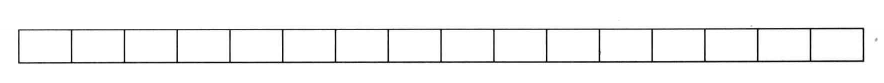 

2. `按下 A 键，引发键盘中断。CPU 执行 int 9 中断例程，从 60H 端口读出 A 键的通码。然后检测状态字节，查看是否有 Shift、Ctrl 等切换键按下。发现没有切换键按下，则将 A 键的扫描码 1eH 和对应的 ASCII 码，即字母 "a" 的 ASCII 码 61H，写入键盘缓冲区`。`缓冲区的字单元中，高位字节存储扫描码，低位字节存储 ASCII 码`。此时缓冲区的内容如下

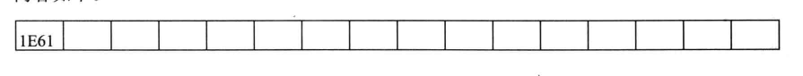 

3. 按下 B 键，引发键盘中断。CPU 执行 int 9 中断例程，从 60H 端口读出 B 键的通码。然后检测状态字节，看看是否有切换键按下。发现没有切换键按下，将 B 键的扫描码 30H 和 对应的 ASCII 码，即字母 "b" 的ASCII 码 62H,写入键盘缓冲区。此时缓冲区的内容如下

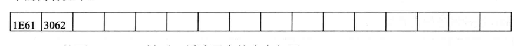 

4. 按下 C、D、E 键后，缓冲区中的内容如下

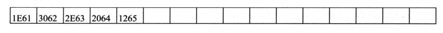 

5. 按下左 Shift 键，引发键盘中断。int 9 中断例程接收左 Shift 键的通码，*设置 0040:17 处的状态字节的第 1 位为 1，表示左 shift 键按下* 
6. 按下 A 键，引发键盘中断，CPU 执行 int 9 中断例程，从 60H 端口读取 A 键的通码。检测状态字节，`发现左 Shift 键按下，将 A 键的扫描码 1EH 和 Shift_A 对应的 ASCII 码，即 字母 "A" 的 ASCII 码 41H,写入键盘缓冲区`。此时键盘缓冲区的内容如下

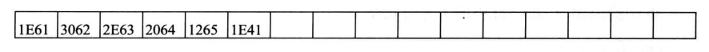 

7. `松开左 Shift 键，引发键盘中断。int 9 中断例程接收左 Shift 键的断码，*设置 0040:17* 处的状态字节的第 1 位为0,表示左 Shift 键松开`
8. 按下 A 键，引发键盘中断。CPU 执行 int 9 中断例程，从 60H 端口读取 A 键的通码，然后检测状态字节，看看是否有切换键按下。发现没有切换键按下，则将 A 键的扫描码 1EH 和 A 对应的 ASCII 码，即字母 "a" 的ASCII 码 61H ，写入键盘缓冲区。此时键盘缓冲区的内容如下

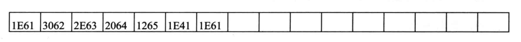 

## 使用 int 16H 读取键盘缓冲区

BIOS 提供了 int 16H 中断例程。int 16H 中断例程中包含的一个最重要的功能是`从键盘缓冲区中读取一个键盘输入、该功能的编号为0`。下面的指令从键盘缓冲区中读取一个键盘输入，并且将其从缓冲区中删除

```asm
mov ah,0
int 16H
;结果：(ah)=扫描码 , (al)=ASCII 码
```
***

我们接着刚才的键盘输入过程，看一下 int 16H 如何读取键盘缓冲区

1. 执行

```asm
mov ah,0
int 16H
```

后，缓冲区的内容如下

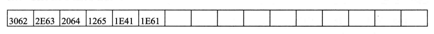 

ah 中的内容为 1Eh，al中的内容为 61H

2. 执行

```asm
mov ah,0
int 16H
```

后，缓冲区的内容如下

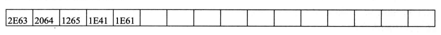 

ah 中的内容为 30H,al 中的内容为 62H

3. 执行

```asm
mov ah,0
int 16H
```

后，缓冲区的内容如下

 

ah 中的内容为 2EH,al 中的内容为 63H

4. 执行 4 次

```asm
mov ah,0
int 16H
```

后，缓冲区空

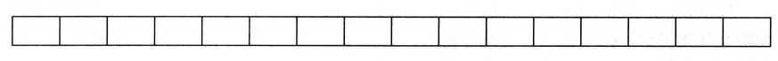 

ah 中的内容为 1EH, al 中的内容为 61H

5. 执行

```asm
mov ah,0
int 16H
```

*int 16H 中断例程检测键盘缓冲区，发现缓冲区空，则循环等待，直到缓冲区有数据* 

6. 按下 A 键后，缓冲区中的内容如下

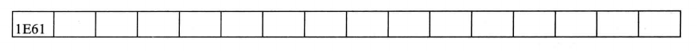 

7. 循环等待的 int 16H 中断例程检测到键盘缓冲区中有数据，将其读出，缓冲区又为空

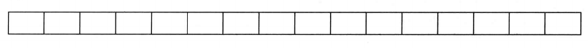 

ah 中的内容为 1Eh, al 中的内容为 61H

***

从上面的内容可以看出，int 16H 中断例程的 0 号功能，进行如下的工作

1. 检测键盘缓冲区中是否有数据
2. 没有则继续做第 1 步
3. 读取缓冲区第一个字单元中的键盘输入
4. 将读取的扫描码送入 ah,ASCII 码送入 al
5. 将已读取的键盘输入从缓冲区中删除

可见，BIOS 的 int 9 中断例程和 int 16H 中断例程是一对相互配合的程序，`int 9 中断例程向键盘缓冲区中写入，int 16H 中断例程从缓冲区中读取`。

他们写入和读取的时机不同，int 9 中断例程是在有键按下的时候向键盘缓冲区中写入数据。而 int 16H 中断例程是在应用程序对其调用的时候，将数据从键盘缓冲区中读出

我们在编写一般的处理键盘输入的程序的时候，*可以调用 int 16H 从键盘缓冲区中读取键盘的输入* 

### 练习

编程：

接受用户的键盘输入，输入 "r"，将屏幕上的字符设置为红色。

输入 "g"，将屏幕上的字符设置为绿色。

输入 "b"，将屏幕上的字符设置为蓝色

```asm
; 3处有 # 符注释的行，实现比较巧妙
assume cs:code
code segment
start:
    mov ah,0
    int 16h

    mov ah,1    ;#
    cmp al,'r'
    je red
    cmp al,'g'
    je green
    cmp al,'b'
    je blue
    jmp short sret

red:
    shl ah,1    ;#

green:
    shl ah,1    ;#

blue: 
    mov bx,0B800H
    mov es,bx
    mov bx,1
    mov cx,2000

s:  and byte ptr es:[bx],11111000B
    or es:[bx],ah
    add bx,2
    loop s

sret:
    mov ax,4c00H
    int 21H

code ends
end start
```
## 字符串的输入

用户通过键盘输入的通常不仅仅是单个字符而是字符串。下面我们讨论字符串输入中的问题和简单的解决方法

最基本的字符串输入程序，需要具备下面的功能

1. 在输入的同时需要显示这个字符串
2. 一般在输入回车后，字符串结束输入
3. 能够删除已经输入的字符

对于这 3 个功能，我们可以想象在 DOS 中，输入命令行时的情况

编写一个接收字符串输入的子程序，实现上面 3 个基本功能。因为在输入的过程中需要显示，子程序的参数如下

(dh),(dl) = 字符串在屏幕上显示的行、列的位置

ds:si 指向字符串的存储空间，字符串以 0 为结尾符

***

下面进行分析

1. 字符的输入和删除

每个新输入的字符都存储在前一个输入的字符之后，而删除是从最后面的字符进行的，我们看下面的过程

```asm
空字符串：

输入 "a" : a
输入 "b" : ab
输入 "c" : abc
输入 "d" : abcd
删除一个字符： abc
删除一个字符： ab
删除一个字符： a
删除一个字符： 
```

可以看出在字符串输入的过程中，字符的输入和输出是按照 stack 的访问规则进行的，即后进先出。这样，我们可以用 stack 的方式来管理字符串的存储空间，也就是说，字符串的存储空间实际上是一个字符栈。*字符栈中的所有字符，从栈顶到栈底，组成一个字符串* 

2. 输入回车后，字符串结束输入

输入回车后，可以在字符串中加入 0,表示字符串结束

3. 在输入的同时需要显示这个字符串

每次有新的字符串输入和删除一个字符的时候，都应该重新显示字符串，即从字符串的栈底到栈顶，显示所有的字符

4. 程序的处理过程

现在我们可以简单地确定程序的过程如下

- 调用 int 16H 读取键盘输入
- 如果是字符，进入字符栈，吸纳是字符栈中的所有字符，继续执行第一条
- 如果是退格键，从字符栈中弹出一个字符，显示字符栈中的所有字符。继续执行第一部
- 如果是 Enter 键，向字符栈中压入 0,返回

从程序的处理过程中可以看出，字符栈的入栈、出栈和显示栈中的内容，是需要在多出使用的功能，应该将它们写为子程序

```asm
子程序：字符串的入栈、出栈和显示
参数说明：
(ah) = 功能号，0 表示入栈，1 表示出栈，2 表示显示
ds:si 指向字符栈空间
对于 0 号功能：(al) = 入栈字符
对于 1 号功能：(al) = 返回的字符
对于 2 号功能：(dh),(dl) = 字符串在屏幕上显示的行、列的位置
```

```asm
assume cs:code
code segment
start:
; 测试代码(需要加上下面的接受字符输入的子程序)
;    call getStr
;    mov ax,4c00H
;    int 21H

charStack:
    jmp short charStart
    table dw  charPush,charPop,charShow
    top dw  0 ;栈顶

charStart:
    push bx
    push dx
    push di
    push es

    cmp ah,2
    ja sret
    mov bl,ah
    mov bh,0
    add bx,bx
    jmp word ptr table[bx]

charPush:
    mov bx,top
    mov [si][bx],al
    inc top
    jmp sret

charPop:
    cmp top,0
    je sret
    dec top
    mov bx,top
    mov al,[si][bx]
    jmp sret

charShow:
    mov bx,0B800H
    mov es,bx
    mov al,160
    mov ah,0
    mul dh
    mov di,ax
    add dl,dl
    mov dh,0
    add di,dx

    mov bx,0

charShows:
    cmp bx,top
    jne noempty
    mov byte ptr es:[si],' '
    jmp sret
noempty:
    mov al,[si][bx]
    mov es:[di],al
    mov byte ptr es:[di+2],' '
    inc bx
    add di,2
    jmp charShows

sret:
    pop es
    pop di
    pop dx
    pop bx
    ret


code ends
end start
```

上面的子程序中，字符栈的访问规则如下

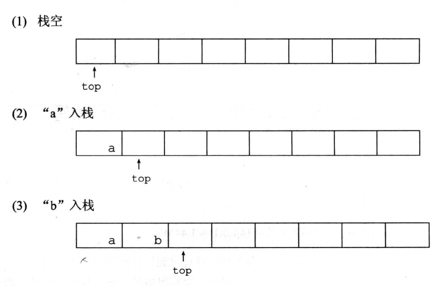 

另一个要注意的问题是：显示栈中字符的时候，要清除屏幕中上一次显示的内容

现在写出完整的接受字符串输入的子程序，如下所示

```asm
getStr:
    push ax
getStrs:
    mov ah,0
    int 16H
    cmp al,20H
    jb nochar ;ASCII 码小于20H,说明不是字符
    mov ah,0
    call charStack  ;字符入栈
    mov ah,2
    call charStack  ;显示stack中的字符
    jmp getStrs

nochar:
    cmp ah,0EH  ;退格键的扫描码
    je backspace
    cmp ah,1ch  ;Enter键的扫描码
    je enter
    jmp getStrs

backspace:
    mov ah,1
    call charStack  ;字符出栈
    mov ah,2
    call charStack  ;显示栈中的字符
    jmp getStrs

enter:
    mov al,0
    mov ah,0
    call charStack  ; 0入栈
    mov ah,2
    call charStack  ;显示栈中的字符
    pop ax
    ret
```

## int 13H 读写磁盘

本章主要以 3.5 英寸软盘为例

3.5 英寸软盘分为上下两面，每面有 80 个磁道，每个磁道又分为 18 个扇区，每个扇区的大小为 512 个字节

则：*2面 * 80磁道 * 18扇区 * 512字节 = 1440KB 约等于 1.44MB* 

磁盘的实际访问由*磁盘控制器进行* ，我们可以通过控制磁盘控制器来访问磁盘。只能`以扇区为单位对磁盘进行读写`。*在读写扇区的时候，要给出面号、磁道号和扇区号* 。面号和磁道号从 0 开始，扇区号从 1 开始

如果我们直接控制磁盘控制器来访问磁盘，会涉及很多硬件细节。BIOS 提供了对扇区进行读写的中断例程，这些中断例程完成了许多复杂的和硬件相关的工作。我们可以通过调用 BIOS 中断例程来访问磁盘

BIOS 提供的访问磁盘的中断例程为 int 13h，。读取 0 面 0 道 1 扇区的内容到 0:200 的程序如下

```asm
mov ax,0
mov es,ax
mov bx,200H

mov al,1    ; 读取的扇区数
mov ch,0    ; 磁道号
mov cl,1    ; 扇区号
mov dl,0    ; 驱动器号 软驱从 0 开始，0：软驱 A, 1：软驱 B
            ;          硬盘从80H开始  80H：硬盘C, 81H：硬盘D
mov dh,0    ; 磁头号(对于软盘，即面号。因为一个面用一个磁头来读写)
mov ah,2    ; int 13H 的功能号 (2 表示读扇区)
int 13H

; es:bx 指向将写入磁盘的数据
返回参数：
操作成功：(ah)=0,(al)=写入的扇区数
操作失败：(ah)=出错代码
```

将 0:200 中的内容写入 0 面 0 道 1 扇区

```asm
mov ax,0
mov es,ax
mov bx,200H

mov al,1    ; 写入的扇区数
mov ch,0    ; 磁道号
mov cl,1    ; 扇区号
mov dl,0    ;驱动器号  软驱从 0 开始， 0：软驱A, 1：软驱B
            ;          硬盘从80H 开始 80H：硬盘C,81H：硬盘D
mov dh,0    ;磁头号(面)

mov ah,3    ; int 13H 的功能号(3 表示写扇区)
int 13H
; es:bx 指向写入磁盘的数据
返回参数：
操作成功：(ah)=0,(al)=写入的扇区数
操作失败：(ah)=出错代码
```

> 下面要使用 int 13H 中断例程对软盘进行读写。直接向磁盘扇区写入数据是很危险的，有可能覆盖掉重要的数据。如果向软盘的 0 面 0 道 1 扇区中写入了数据，要使软盘在现有的 OS 下可以使用，必须要重新格式化。

编程：将当前屏幕的内容保存在磁盘上

分析：1 屏的内容占 4000 个字节，需要 8 个扇区，用 0 面 0 道的 1～8 扇区存储显存中的内容。程序如下：

```asm
assume cs:code
code segment
start:
    mov ax,0B800H
    mov es,ax
    mov bx,0

    mov al,8
    mov ch,1
    mov dl,0
    mov dh,0
    mov ah,3
    int 13H

    mov ax,4c00H
    int 21H

code ends
end start
```
## 实验17

用面号、磁道号、扇区号来访问磁盘不太方便。可以考虑对位于不同的磁道、面上的所有扇区进行统一编号。编号从 0 开始，一直到 2879，我们称这个编号为*逻辑扇区编号* 

编号的方法如下所示：

```asm
物理扇区号            逻辑扇区号
0 面 0 道 1 扇区          0
0 面 0 道 2 扇区          1
0 面 0 道 3 扇区          2
...
0 面 0 道 18 扇区         17
0 面 1 道 1 扇区          18
0 面 1 道 2 扇区          19
0 面 1 道 3 扇区          20
...
0 面 1 道 18 扇区         35
0 面 2 道 1 扇区          36
0 面 2 道 2 扇区          37
0 面 2 道 3 扇区          38
...
0 面 79 道 18 扇区        1439
1 面 0 道 1 扇区        1440
1 面 0 道 2 扇区        1441
1 面 0 道 3 扇区        1442
```

可以看出，逻辑扇区号和物理扇区号的关系如下：

*逻辑扇区号 = (面号*80 + 磁道号)*18 + 扇区号 - 1* 

那么如何根据逻辑扇区号计算物理编号呢？可以用下面的算法：

```asm
int():      描述性运算符，取商
rem():      描述性运算符，取余数
逻辑扇区号 = (面号*80 + 磁道号)*18 + 扇区号 - 1     
面号 = int(逻辑扇区号 / 1440)
磁道号 = int(rem(逻辑扇区号 / 1440) / 18)
扇区号 = rem(rem(逻辑扇区号 / 1440) / 18) + 1
```

***

安装一个新的 int 7CH 中断例程，实现通过逻辑扇区号对软盘进行读写

参数说明：

```asm
用 ah 寄存器传递功能号：
    0 表示读 
    1 表示写
用 dx 寄存器传递要读写的扇区的逻辑扇区号
用 es:bx 指向存储读出数据或写入数据的内存区
tips: 用逻辑扇区号计算出 面号、磁道号、扇区号后，调用 int 13H 中断例程进行实际的读写
```

## 如何让计算机唱歌

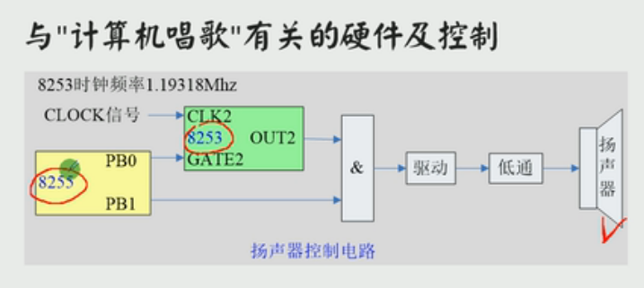 

让扬声器发出声音，是由 8253 和 8255 两个芯片来控制。对于声音来说有两个要素需要提供:`音高(声音的频率有多大)` 和 `音长(声音持续多长时间)`，不同音高和不同音长的组合，形成了一首歌

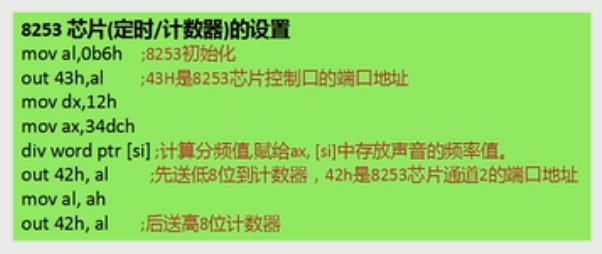 

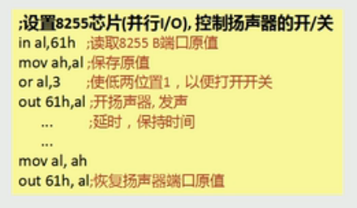 

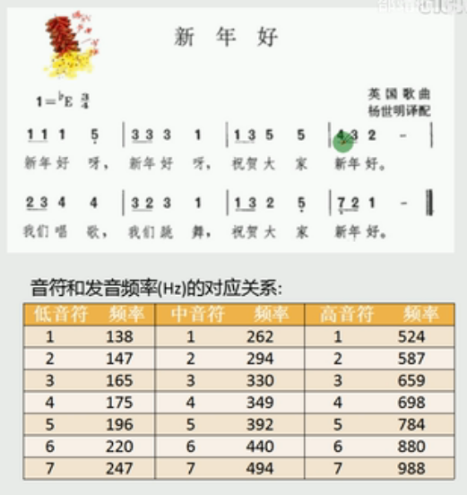 

音符与数字的对应

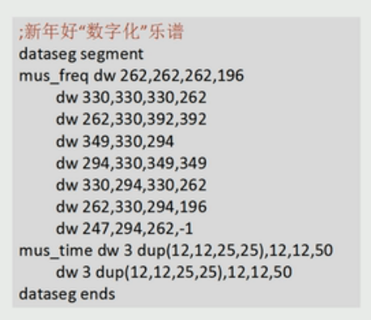 

完整代码如下：

```asm
assume cs:code,ds:dataseg,ss:stackseg
dataseg segment
    mus_freq  dw  262,262,262,196,330,330,330,262
            dw 262,330,392,392,349,330,294
            dw 294,330,349,349,330,294,330,262
            dw 262,330,294,196,247,294,262,-1

    mus_time  dw  3 dup(12,12,25,25),12,12,50
            dw 3 dup (12,12,25,25),12,12,50
dataseg ends
stackseg segment
    db 100H dup (0)
stackseg ends
code segment

start:
    ;主程序
    mov ax,stackseg
    mov ss,ax
    mov sp,100H
    mov ax,dataseg
    mov ds,ax
    lea si,mus_freq   ;si -> 音符的频率的地址
    lea di,mus_time   ;di -> 音符的音长的地址

play:
    mov dx,[si]
    cmp dx,-1
    je end_play
    call sound
    add si,2
    add di,2
    jmp play
end_play:
    mov ax,4c00H
    int 21H

;===============================================
sound:
    push ax
    push dx
    push cx

    ;8253芯片(定时/计数器)的设置
    mov al,0B6H
    out 43H,al
    mov dx,12H
    mov ax,34DCh
    div word ptr [si]
    out 42H,al
    mov al,ah
    out 42H,al

    ;设置8253芯片，控制扬声器的开/关
    in al,61H
    mov ah,al
    or al,3
    out 61H,al

    ;延时一定的时长
    mov dx,[di]
wait1:
    mov cx,28000
delay:
    nop
    loop delay
    dec dx
    jnz wait1

    ;恢复扬声器端口原值
    mov al,ah
    out 61H,al

    pop cx
    pop dx
    pop ax
    ret

code ends
end start
```


## 课程设计2 

开机后，CPU 自动进入到 FFFF:0 单元处执行，此处有一条跳转指令。CPU 执行该指令后，转去执行 BIOS 中的硬件系统检测和初始化程序

初始化程序将建立 BIOS 所支持的中断向量，即将 BIOS 提供的中断例程的入口地址登记在中断向量表中

硬件系统检测和初始化完成后，调用 int 19H 进行操作系统的引导

如果设为从软盘启动 OS，则 int 19H 将主要完成以下工作：

1. 控制 0 号软驱，读取软盘 0 道 0 面 1 扇区的内容到 0：7C00
2. 将 CS：IP 指向 0:7C00

软盘的 0 道 0 面 1 扇区中装有 OS 引导程序。int 19H 将其撞到 0:7C00 处后，设置 CPU 从 0:7C00 开始执行此处的引导程序，OS 被激活，控制计算机

如果 0 号软驱中没有软盘，或发生 IO 错误，则 int 19H 将主要完成以下工作

1. 读取硬盘 C 的 0 道 0 面 1 扇区的内容到 0：7C00
2. 将 CS：IP 指向 0:7C00

***

这次课程设计的任务是编写一个可以自行启动计算机，不需要在现有操作系统环境中运行的程序

该程序的功能如下：

1. 列出功能选项，让用户通过键盘进行选择，界面如下
    - 1\) reset pc        ;重新启动计算机
    - 2\) start system    ;引导现有的操作系统
    - 3\) clock           ;进入时钟程序
    - 4\) set clock       ;设置时间
2. 用户输入 ”1“ 后，重新启动计算机(考虑 ffff:0 单元)
3. 用户输入 ”2“ 后，引导现有的OS (考虑硬盘 C 的 0 道 0 面 1 扇区)
4. 用户输入 ”3“ 后，执行动态显示当前日期、时间的程序

显示格式如下 "年/月/日 时：分：秒"

进入此项功能后，一直动态显示当前时间，在屏幕上将出现时间按秒变化的效果(循环读取 CMOS)

当按下 F1 键后，可改变显示颜色。按下 Esc 键后，返回道主选菜单((利用键盘中断))

5. 用户输入 ”4“ 后，可更改当前的日期、时间，更改后返回到主选单(输入字符串)

***

下面给出几点建议

1. 在 DOS 下编写安装程序，在安装程序中包含任务程序
2. 运行安装程序，将任务程序写到软盘上
3. 若要任务程序可以在开机后自行执行，要将它写到软盘的 0 道 0 面 1 扇区上。如果程序长度大于 512 个字节，则需要用多个扇区存放，这种情况下，处于软盘 0 道 0 面 1 扇区中的程序就必须负责将其他扇区中的内容读入内存


