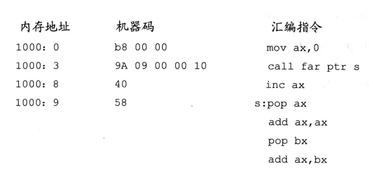

# 汇编进阶

## 数据处理的2个基本问题

计算机是进行数据处理、运算的机器，那么有两个基本的问题就包含在其中
1. 处理的数据在什么地方？
2. 要处理的数据有多长？

```x86asm
;bx si di bp 都是可以表示内存地址
;这4个寄存器可以单个出现，或只能以4种组合出现

;下面两行指令是错误的
mov ax,[bx + bp]
mov ax,[si + di]
```

> 只要在 [...] 中使用寄存器```bp```,而指令中没有显性给出段地址，则段地址默认在```ss```中

?> 在没有寄存器名存在的情况下，用操作符```X ptr```指明内存单元的长度，X 在汇编指令中可以为 word 或 byte。
在没有寄存器参与的内存单元访问指令中，用 word ptr 或 byte ptr *显性地指令要访问的内存单元的长度是必要* 
```x86asm
;下面的指令中，用 word ptr 指明了指令访问的内存单元是一个字单元
mov word ptr ds:[0],1
inc word ptr [bx]
inc word ptr ds:[0]
add word ptr [bx],2

;下面的指令，用 byte ptr 指令了指令访问的内存单元是一个字节单元
mov byte ptr ds:[0],1
inc byte ptr [bx]
inc byte ptr ds:[0]
add byte ptr [bx],2
```
## div 指令

div 是除法指令，用div做除法时应注意几个问题

1. 除数：有8位和16位两种
2. 被除数：默认放在 ax 或 dx和ax 中，如果除数为 8 位，被除数为16位，结果在ax中存放。如果除数为16位，被除数则为32位，在 dx 和 ax 中存放，dx 存放高16位，ax存放低16位
3. 结果：如果除数为 8 位，则 al 存储除法操作的商， ah 存储除法操作的余数。如果除数位 16 位，则 ax 存储除法操作的商， dx 存储除法操作的余数

```x86asm
div reg ; reg 表示一个普通寄存器(ax,bx,cx,dx等)
div 内存单元

div byte ptr ds:[0]
;(al) = (ax) / ((ds) * 16 + 0)的商
;(ah) = (ax) / ((ds) * 16 + 0)的余数

div word ptr es:[0]
;(ax) = [ (dx) * 10000H + (ax)] / ((es) * 16 + 0)的商
;(dx) = [ (dx) * 10000H + (ax)] / ((es) * 16 + 0)的余数

div byte ptr [bx + si + 8]
;(al) = (ax) / ((ds) * 16 + (bx) + (si) + 8)的商
;(ah) = (ax) / ((ds) * 16 + (bx) + (si) + 8)的余数

div word ptr [bx + si + 8]
;(ax) = [ (dx) * 10000H + (ax)] / ((ds) * 16 + (bx) + (si) + 8) 的商
;(dx) = [ (dx) * 10000H + (ax)] / ((ds) * 16 + (bx) + (si) + 8) 的余数 
```

- 用div 指令计算 100001 / 100

被除数 100001 大于 65535,只能用 ax 和 dx 联合存放 100001。即要进行 16 位的除法,除数100小于255,可以在
一个8位寄存器中存放，但是，因为被除数是 32 位的，除数应为16位，所以要用一个 16 位寄存器来存放除数 100

要分别位 dx 和 ax 赋值 100001 的高16位和低16位，所以应先将 100001 表示为 16进制形式：186A1H。程序如下

```x86asm
mov dx,1
mov ax,86A1H    ;(dx) * 10000H + (ax) = 100001
mov bx,64H  ; 64H = 100(ten)
div bx

;结果
;(ax) = 03e8H 即1000
;(dx) = 1   即余数1
```

- 用 div 计算 1001 / 100

```x86asm
mov ax,03e9H    ;03e9H == 10001
mov bl,64H   ;64H == 100
div bl

;结果
;(al) = 0AH 即10
;(ah) = 1   余数为1
```

### dd 伪指令

db 和 dw 定义字节型数据和字型数据。dd 用来定义 dword(double word,双字)型数据的。比如

```x86asm
data segment
    db 1    ;db 1 为01H,在data:0处，占1个字节
    dw 1    ;dw 1 为0001H,在data:1处，占1个字
    dd 1    ;dd 1 为00000001H,在data:3处，占2个字
data ends
```

用div 计算data 段中第一个数据除以第二个数据后的结果，商存储在第三个数据的存储单元内

```x86asm
assume cs:code,ds:data
data segment
	dd 100001
	dw 100
	dw 0
data ends

code segment
start:	mov ax,data
	mov ds,ax

	mov ax,ds:[0]	;ds:0 字单元中的低16位存储在 ax 中
	mov dx,ds:[2]	;ds:2 字单元中的高16位存储在 dx 中
	div word ptr ds:[4]	;用dx:ax 中的32位数据除以 ds:4 字单元中的数据
	mov ds:[6],ax	; 将商存储在 ds:6 字单元中

	mov ax,4c00H
	int 21H
code ends
end start
```

一组信息记录形式如下：

```x86asm
公司名称： DEC
总裁姓名：Ken Olsen
排    名：137
收    入：40
著名产品：PDP(小型机)
```
现在信息有了如下变化

```
Ken Olsen 的排名已上升至38
DEC 的收入增加至 70
该公司的著名产品已变为 VAX 系列计算机
```

修改内存中的过时数据

```x86asm
assume cs:codesg,ds:datasg
datasg segment
;为了在 debug 中直观显示，排名和收入写为了16进制
;以下4行数据在同一段，最后一行产品数据在第二段
	db 'DEC'	;公司名
	db 'Ken Olsen'	;总裁名
	dw 137H		;排名	=> 38
	dw 40H		;收入	=> 70
	db 'PDP'	;著名产品	=> 'VAX'
datasg ends

codesg segment
start:	mov ax,datasg
	mov ds,ax
	mov bx,0

	mov word ptr ds:[bx+12],38H 
	mov word ptr ds:[bx+14],70H

	mov si,0
	mov byte ptr ds:[bx+si+10H],'V'
	inc si
	mov byte ptr ds:[bx+si+10H],'A'
	inc si
	mov byte ptr ds:[bx+si+10H],'V'

	mov ax,4c00H
	int 21H
codesg ends
end start
```

### dup 

dup 是一个操作符，同 db、dw、dd 一样，也是由编译器处理的。他是和db、dw、dd等数据定义位指令配合使用，用来进行数据的重复

```x86asm
db 重复次数 dup (重复的字节型数据)
dw 重复次数 dup (重复的字型数据)
dd 重复次数 dup (重复的双字型数据)

db 3 dup (0)
;定义了3个字节，他们的值都是0，相当于 db 0,0,0

db 3 dup (0,1,2)
;定义了9个字节，他们是0,1,2,0,1,2,0,1,2 相当于 db 0,1,2,0,1,2,0,1,2

db 3 dup ('abc','ABC')
;定义了18个字节，他们是‘abcABCabcABCabcABC'

stack segment
    db 200 dup (0)
stack ends
;定义一个容量为200个字节的栈空间
```

### 实验7 结构化数据寻址

[struct](../images/x86asm/struct_seven_7.png)

```x86asm
assume cs:codesg
data segment
    db '1975', '1976', '1977', '1978', '1979', '1980', '1981', '1982', '1983' 
    db '1984', '1985', '1986', '1987', '1988', '1989', '1990', '1991', '1992'
    db '1993', '1994', '1995'
    ;表示21个年的21个字符串

    dd 16,22,382,1356,2390,8000,16000,24486,50065,97479,140417,197514
    dd 345980,590827,803530,1183000,1843000,2759000,3753000,4649000,5937000
    ;表示21个年公司总收入的21个dword型数据

    dw 3,7,9,13,28,38,130,220,476,778,1001,1442,2258,2793,4037,5635,8226
    dw 11542,14430,15257,17800
    ; 以上是表示21年公司雇员人数的21个word型数据
data ends

table segment
    db 21 dup ('year summ ne ?? ')
    ;div的余数不要，
table ends

codesg segment
start:  mov ax,data ;指向数据段
        mov ds,ax
        mov ax,table    ;指向结果段
        mov es,ax
        mov dx,0
        mov ax,0

        mov di,0
        ;循环时指向年份的指针
        mov si,21*4
        ;指向收入的指针
        mov bp,21*8
        ;指向人数的指针
        mov bx,0
        ;指向table段的指针

        mov cx,21
s:      push ds:[di]
        pop es:[bx]
        push ds:[di+2]
        pop es:[bx+2]
        ;将年份写入table段中的year处

        mov ax,ds:[si]
        mov es:[bx+5],ax
        mov dx,ds:[si+2]
        mov es:[bx+7],dx
        ;将收入写入table段中的summ处

        push ds:[bp]
        pop es:[bx+10]
        ;将人数写入 table 段的 ne 处

        div word ptr es:[bx+10] ;计算人均薪资
        mov es:[bx+13],ax   ; 将人均薪资赋值至 ?? 处

        add di,4    
        add si,4
        add bp,2
        add bx,16
        ;指向下一次循环的位置
        loop s

        mov ax,4c00H
        int 21H
codesg ends
end start
```

## 转移指令

```可以修改IP,或同时修改CS和IP的指令统称为转移指令```,转移指令就是可以控制CPU执行内存中某处代码的指令

- 8086CPU的转移行为有两类
    1. 只修改IP，时，称为段内转移，如：jmp ax
    2. 同时修改CS和IP时，称为段间转移，如：jmp 1000:0
- 由于转移指令对IP的修改范围的不同，段内转移又分为：短转移和近转移
    1. 短转移IP的修改范围为 -128～127
    2. 近转移IP的修改范围为-32768~32767
- 8086CPU的转移指令分为一下几类
    1. 无条件转移指令(jmp)
    2. 条件转移指令
    3. 循环指令(loop)
    4. 过程
    5. 中断

### offset 操作符

操作符 offset 在汇编中是由编译器处理的符号，它的功能是取得*标号*的偏移地址

```x86asm
assume cs:codesg
codesg segment
    start:	mov ax,offset start	;相当于 mov ax,0
   	    s:  mov bx,offset s		;相当于 mov bx,3
codesg ends
end start
```

### jmp

jmp 为无条件转移指令，可以只修改IP,也可以同时修改 CS 和 IP;jmp 要给出两种信息

1. 转移的目的地址
2. 转移的距离(段间转移、段内短转移，段内近转移)

#### 依据位移进行转移的jmp

```jmp short 标号```(转到标号处执行指令) ,这种格式的jmp 指令实现的是段内短转移，对IP 的修改范围为*-128～127* ,
向前时最多128个字节，向后转移时最多127个字节。其中```short```符号，说明指令进行的是短转移。

```x86asm
assume cs:codesg
codesg segment
start:  mov ax,0
        jmp short s
        add ax,1
s:      inc ax
codesg ends
end start
;最后ax 为1,执行 jmp short s 后，直接执行了 inc ax
```

```jmp short 标号```的功能为：(ip) = (ip) + 8位位移
1. 8位位移 = 标号处的地址 - jmp指令后的第一个字节的地址
2. short 指名此处的位移为8位位移
3. 8位位移的范围为*-128-127*,用补码表示 
4. 8位位移由编译程序在编译时计算

还有一种和```jmp short 标号```功能相近的指令格式，```jmp near ptr 标号```,他实现的是段内近转移

```jmp near ptr 标号```的功能为：(ip) = (ip) + 16位位移
1. 16位位移 = 标号处的地址 - jmp指令后的第一个字节的地址
2. near ptr 指名此处的位移为16位位移，进行的是段内近转移
3. 16位位移的范围为*-32768-32767* ,用补码表示
4. 16位位移由编译程序在编译时计算

#### jmp 段间转移

上面 jmp 指令，其对应的机器码中并没有转移的目的地址，而是相对于当前IP 的转移位移

```jmp far ptr 标号``` 实现的是段间转移，又称为远转移。功能如下：

```(CS) = 标号所在段的段地址; (IP) = 标号所在段中的偏移地址```; ```fat ptr``` 指令了指令用标号的段地址和偏移地址修改CS 和 IP

#### jmp 段内转移(内存地址)

转移地址在内存中的 jmp 指令有两种格式：

1. ```jmp word ptr 内存单元地址(段内转移)```; 从内存地址处开始存放着一个字，是转移的目的偏移地址
    * 内存单元地址可用寻址方式的任一格式给出
    ```
    mov ax,0123H
    mov ds:[0],ax
    jmp word ptr ds:[0]
    ;执行后，(IP) = 0123H

    mov ax,0123H
    mov [bx],ax
    jmp word ptr [bx]
    ;执行后，(IP) = 0123H
    ```
2. ```jmp dword ptr 内存单元地址(段间转移)```; 从内存地址开始处存放着2个字，高地址处的字是转移的目的段地址，低地址处是转移的目的偏移地址
    * (CS) = (内存地址 + 2)
    * (IP) = (内存地址)

    ```x86asm
    mov ax,0123H
    mov ds:[0],ax
    mov word ptr ds:[2],0
    jmp dword ptr ds:[0]
    ;(CS) = 0,(IP)= 0123H,CS:IP指向0000:0123

    mov ax,0123H
    mov [bx],ax
    mov word ptr [bx+2],0
    jmp dword ptr [bx]
    ;(CS) = 0,(IP) = 0123H,CS:IP指向 0000:0123H
    ```

- 定义data 段中的数据，使得 jmp 指令执行后，CS:IP 指向程序的第一条指令

```x86asm
assume cs:codesg

data segment
        db 0
        dw offset start ;也可写 0
data ends

codesg segment
start:  mov ax,data
        mov ds,ax
        mov bx,0
        jmp word ptr [bx+1]
codesg ends
end start
```

- 使用 Debug 查看内存，结果如下

```
2000:1000   BE 00 06 00 00 00 ...
```

则此时，CPU执行如下指令后，CS 和 IP 的值为？

```
mov ax,2000H
mov es,ax
jmp dword ptr es:[1000H]

; CS = 0006
; IP = 00BE
```

### jcxz 指令

jcxz 指令为有条件转移指令，```所有的有条件转移指令都是短转移，在机器码中包含转移的唯一，而不是目的地址```; 对 IP 的修改范围都为*-128-127* 

```jcxz 标号``` 如果 (CX) = 0,转移到标号处执行。当 (CX) = 0时，(IP) = (IP) + 8位位移
1. 8位位移 = 标号处的地址 - jcxz 指令后的第一个字节的地址
2. 8位位移的范围为 *-128～127*,用补码表示
3. 8位位移由编译程序在编译时计算
4. 当 (CX) != 0 时，什么也不做

```jcxz 标号``` 相当于 ```if ((cx) == 0) jmp short 标号```

- 利用 jcxz 指令，实现在内存 2000H 段中查找第一个值为 0 的字节，找到后，将其偏移地址存储在 dx 中

```x86asm
assume cs:codesg
codesg segment
start:  mov ax,2000H
        mov ds,ax
        mov bx,0

s:      mov ch,0    ;从这里开始往下的4行都是补全的程序
        mov cl,ds:[bx]
        jcxz ok
        inc bx

        jmp short s
ok:     mov dx,bx   ;此处的 ok标号没有意义,同下

        mov ax,4c00H
        int 21H

codesg ends
end start
```

### loop 指令

loop 指令为循环指令，```所有的循环指令都是短转移```,在对应的机器码中包含转移的位移，而不是目的地址，对IP的修改范围都是：*-128~127* 

```loop 标号``` ((CX) = (CX) - 1,如果(CX) != 0,转移到标号处执行)

```loop 标号``` 的功能相当于 ```(CX) --; if((CX) != 0) jmp short 标号;```

- 利用 loop 指令，实现在内存 2000H 段中查找第一个值为 0 的字节，找到后，将其偏移地址存储在 dx 中

```x86asm
assume cs:codesg
codesg segment
start:  mov ax,2000H
        mov ds,ax
        mov bx,0

s:      mov cl,ds:[bx]
        mov ch,0
        inc cx  ;避免cx-- 为FFFF 后产生的误差
        inc bx
        loop s

ok:     dec bx  ;dec 和 inc 相反,相当于 bx --
        mov dx,bx

        mov ax,4c00H
        int 21H
codesg ends
end start
```

#### 向显存写入三行字符串(实验9)

```x86asm
assume cs:code
data segment
        db 'welcome to linux'
        ; 0000 0000
        ;  rgb  rgb
        ;  背景 前景
        ;闪烁  高亮
        db 00000010b    ;绿色
        db 00100100b    ;绿底红色
        db 01110001b    ;白底蓝色
data ends

code segment

start:  mov ax,data
        mov ds,ax
        mov bx,0    ;指向显存的字单元
        mov di,0    ;指向下一行显存的字单元
        mov bp,0    ;指向data定义数据的字符

        mov ax,0B810H
        mov es,ax   ;es 指向显存(屏幕)
        mov si,16   ;指向字符属性(共定义了3个字符属性)

        mov cx,3
showcol: mov ax,0    ;临时保存显存字符和字符属性
        push cx
        mov ah,ds:[si]  ;给高位赋值字符属性

        mov cx,16
showrow: mov al,ds:[bp]  ;低位赋值字符的ASCII码
        mov es:[bx+di],ax  ;向显存写入ASCII码及属性
        inc bp  ;指向下一个定义字符
        add bx,2    ;指向下一个显存的字单元

        loop showrow
        mov bp,0
        inc si
        mov bx,0
        add di,160
        pop cx

        loop showcol

        mov ax,4c00H
        int 21H
code ends
end start
```

## call & ret 

call & ret 都是*转移指令*,他们都*修改 IP*,或```同时修改 CS 和 IP```

### ret 和 retf

ret 指令用栈中的数据，修改 IP 的内容，从而实现```近转移```
retf 指令用栈中的数据，修改 CS 和 IP 的内容，从而实现```远转移```

CPU 执行 ret 指令时，进行两步操作

```x86asm
(IP) = ((ss) * 16 + (sp))
(sp) = (sp) + 2
;用汇编指令描述 ret 
;CPU 执行 ret 指令时，相当于
;pop IP
```

CPU 执行 retf 指令时，进行4步操作

```x86asm
(IP) = ((ss) * 16 + (sp))
(sp) = (sp) + 2
(CS) = ((ss) * 16 + (sp))
(sp) = (sp) + 2
;用汇编指令描述 retf
;CPU 执行 retf 指令时，相当于
;pop IP
;pop CS
```
- 下面的程序，ret 执行后，IP = 0, CS:IP 指向代码段的第一条指令

```x86asm
assume cs:code
stack segment
        db 16 dup (0)
stack ends
code segment
        mov ax,4c00H
        int 21H
start:  mov ax,stack
        mov ss,ax
        mov sp,16
        mov ax,0
        push ax
        mov bx,0
        ret

code ends
end start
```

- 下面的程序，retf 执行后, CS:IP 指向代码段的第一条指令

```x86asm
assume cs:code
stack segment
        db 16 dup (0)
stack ends
code segment
        mov ax,4c00H
        int 21H
start:  mov ax,stack
        mov ss,ax
        mov sp,16
        mov ax,0
        push cs
        push ax
        mov bx,0
        retf
code ends
end start
```

### call 指令

CPU 执行 call 指令时，进行2步操作

```x86asm
将当前的 IP 或 CS & IP 入栈
转移
```

call 指令不能实现短转移，除此之外，call 指令实现转移的方法和 jmp 指令的原理相同

### 依据位移进行转移的 call

call 标号(将当前的 IP 入栈后，转到标号处执行指令)

CPU 执行这种格式的 call 指令时，进行如下操作

```x86asm
(sp) = (sp) - 2
    ((ss) * 16 + (sp)) = (IP)
(IP) = (IP) + 16位位移

16位位移 = 标号处的地址 - call指令后的第一个字节的地址
16位位移的范围为 -32768～32767,用补码表示
16位位移由编译程序在编译时算出
```

如果用汇编语法来解释这种格式的 call 指令，则CPU 执行 *call 标号* 时，相当于如下

```x86asm
push IP
jmp near ptr 标号
```

- 下图的指令执行后，ax 中的数值为多少？


```x86asm
ax = 0
;call s == push IP && jmp near ptr s
执行 call s 后，IP 指向 inc ax,前两条指令字节长度为6
在 IP = 6后，被 push
之后 jmp near ptr 至 s 处，执行 pop ax
ax = 6
```

### 转移的目的地址在指令中的 call

前面的 call 指令，其对应的机器指令中并没有转移的目的地址，而是相对于当前 IP 的转移位移

```call far ptr 标号```实现的是*段间转移* ,CPU 执行这种格式的 call 指令时，进行如下操作

```x86asm
(sp) = (sp) -2
    ((ss) * 16 + (sp)) = (CS)
    (sp) = (sp) - 2
    ((ss) * 16 + (sp)) = (IP)
(CS) = 标号所在段的段地址
(IP) = 标号所在段的偏移地址 
```

用汇编语法来解释这种格式的 call 指令，则 CPU 执行 *call fat ptr 标号* 时，相当于：

```x86asm
push CS
push IP
jmp fat ptr 标号
```
- 下图的指令执行后，ax 中的数值为多少？



推导过程和上题相同，直接写结果：*ax = 1010H* 

### 转移地址在寄存器中的 call 指令

```x86asm
;指令格式
call 16位reg

(sp) = (sp) - 2
((ss) * 16 + (sp)) = (IP)
(IP) = (16位reg)
```

用汇编语法来解释这种格式的 call 指令，CPU 执行 *call 16位reg* 时，相当于

```x86asm
push IP
jmp 16位reg
```

- 下图的指令执行后，ax 中的数值为多少？


```x86asm
需要注意的是 [bp]
[bp] 的表示在本章开头有写明
单纯的 [bp] 中，是用 ss 来做段地址的
ax = 000BH
```

### 转移地址在内存中的 call

转移地址在内存中的 call 指令有2种格式

```x86asm
;1
call word ptr 内存单元地址
;用汇编语法解释这种格式的 call 指令，CPU 执行 call word ptr 内存地址 相当于进行
push IP
jmp word ptr 内存单元地址

;比如下面的指令
mov sp,10H
mov ax,0123H
mov ds:[0],ax
call word ptr ds:[0]
;执行后，IP = 0123H, SP = 0EH
```

```x86asm
;2
call dword ptr 内存地址单元
;用汇编语法来解释这种格式的call 指令，CPU 执行 call dword ptr 内存地址 详单与进行
push CS
push IP
jmp dowrd ptr 内存单元地址

;比如，下面的指令
mov sp,10H
mov ax,0123H
mov ds:[0],ax
mov word ptr ds:[2],0
call dword ptr ds:[0]
;执行后，CS = 0,IP = 0123H,sp = 0cH
```

