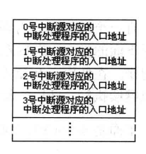
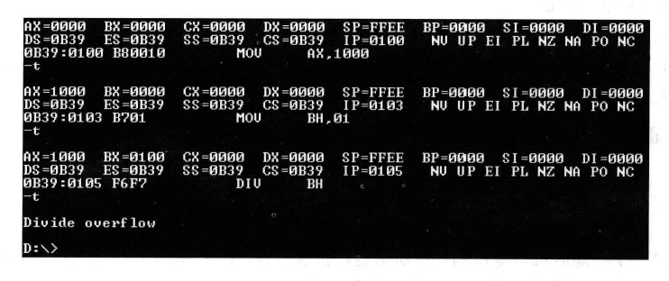

# 内中断

任何一种 CPU 都具备一种能力，可以```在执行完当前正在执行的指令之后，检测到从 CPU 外部发送过来的或内部产生的一种特殊信息，并且可以立即对所接受到的信息进行处理```。这种特殊的信息，一般称为```中断信息```。中断的意思是指：*CPU 不再接着(刚执行完的指令)向下执行，而是转去处理这个特殊信息* 

>通知信息 这里的中断信息，是为了便于理解采用的一种逻辑上的说法。它是对几个具有先后顺序的硬件操作所产生的事件的统一描述。中断信息是要求 CPU 马上进行某种处理，并想所要进行的该种处理提供了必备的通知信息

## 内中断的产生

当 CPU 的内部有什么事情发生的时候，将产生需要马上处理的中断信息。对于 8086CPU，当 CPU 内部有下面的情况发生的时候，将产生相应的的中断信息

1. 除法错误，eg：执行 div 产生的除法溢出
2. 单步执行
3. 执行 into 指令
4. 执行 int 指令

这 4 种是不同的信息,需要进行不同的处理。CPU 首先要知道，所接收到的中断信息的来源。所以中断信息中必须```包含识别来源的编码```。8086CPU 用称为 ```中断类型码```的数据来标识中断信息的来源。中断类型码为一个字节行数据，可以标识 256 种中断信息的来源。以后，我们将产生中断信息的事件、即中断信息的来源，简称为```中断源```。以上 4 种中断源，在 8086CPU 中的中断类型码如下：

1. 除法错误：0
2. 单步执行：1
3. 执行 into 指令：4
4. 执行 int 指令，该指令的格式为 int n,指令中的 n 为字节型立即数,是提供给 CPU 的中断类型码

## 中断处理程序

CPU 收到中断信息后，需要对中断信息进行处理。而如何对中断信息进行处理，可以由开发者决定。用来处理中断信息的程序被称为```中断处理程序```,一般来说，需要对不同的中断信息编写不同的处理程序

CPU 在收到中断信息后，应该转去执行该中断信息的处理程序。若要 8086CPU 执行某处的程序，就要将 CS:IP 指向它的入口(即程序第一条指令的地址)。可见，首要问题是，CPU 在收到中断信息后，如何根据中断信息确定其处理程序的入口

CPU 的设计者必须在中断信息和其处理程序的入口地址之间建立某种联系，使得 CPU 根据中断信息可以找到要执行的处理程序

中断信息中包含识别中断源的类型码。根据 CPU 的设计，中断类型码的作用就是用来定位中断处理程序。比如 CPU 根据中断类型码 4,就可以找到 4 号中断的处理程序。而若要定位中断处理程序，需要知道它的段地址和偏移地址，如果根据 8 位的中断类型码得到中断处理程序的段地址和偏移地址呢？

## 中断向量表

CPU 用 8 位的中断类型码通过中断向量表找到相应的中断处理程序的入口地址。那么什么是中断向量表呢？

```中断向量表就是中断向量的列表```。那么什么又是中断向量呢？其实就是```中断处理程序的入口地址```。

中断向量表，就是中断处理程序入口地址的列表

中断向量表在内存中保存，其中存放着 256 个中断源所对应的中断处理程序的入口，如下图



CPU 只要知道了中断类型码，就可以将中断类型码作为中断向量表的下标，定位相应的表项,从而得到中断处理程序的入口地址

CPU 用中断类型码，通过查找中断向量表，就可以得到中断处理程序的入口地址。在这个方案中，一个首要问题是，CPU 如何找到中断向量表？现在，找到中断向量表成了通过中断类型码找到中断处理程序入口地址的先决条件

中断向量表在内存中存放，对于 8086CPU，中断向量表指令放在内存地址 0 处。从内存 0000:0000 到 0000:03FF 的1024 个单元中存放着中断向量表。

能不能放在别处呢？并不能！！！如果使用 8086CPU，中断向量表就必须放在 0000:0000~0000:03FF 单元中，这是规定，规定了 8086CPU 就从这个地方读取中断向量表

那么在中断向量表中，一个表项占多达的空间呢？一个表项存放一个中断向量，即一个中断处理程序的入口地址。对于 8086CPU ，这个入口地址包括段地址和偏移地址，所以```一个表项占两个字，高地址字存放段地址，低地址字存放偏移地址```

### 检测点 12.1 

1. 用 Debug 查看内存，情况如下

`0000:0000  68 10 A7 00 8B 01 70 00-16 00 9D 03 8B 01 70 00` 

则 3 号中断源对应的中断处理程序的入口地址为：`0070:018B` 

2. 存储 N 号中断处理程序入口的偏移地址的内存单元的地址为 `N * 4`

存储 N 号中断处理程序入口的段地址的内存单元的地址为 `N * 4 + 2`

## 中断过程

从上面可以看出，可以用中断类型码，在中断向量表中找到中断处理程序的入口。找到这个入口地址的最终目的是```用它设置 CS 和 IP```,使 CPU 执行中断处理程序。用中断类型码找到中断向量，并用它设置 CS 和 IP,这个工作是由 CPU 的硬件自动完成的。CPU 硬件完成这个工作的过程被称为```中断过程```

CPU 收到中断信息后，要对中断信息进行处理，首先将引发中断过程。硬件在完成中断过程后，CS:IP 将指向中断处理程序的入口，CPU 开始执行中断处理程序

但是，有一个问题需要考虑，CPU 在执行玩中断处理程序后，应该返回原来的执行点继续执行下面的指令。所以在中断过程中，在设置 CS:IP 之前，还要将原来的 CS 和 IP 的值保存起来。在使用 call 指令调用子程序时有同样的问题，子程序执行后，还要返回到原来的执行点继续执行，所以，call 指令先保存当前 CS 和 IP 的值，然后再设置 CS 和 IP

下面是 8086CPU 在收到中断信息后，所引发的中断过程。

1. (从中断信息中)取得中断类型码
2. flag 寄存器的值入栈(因为在中断过程中要改变 flag 寄存器的值，所以先将其保存在栈中)
3. 设置 flag 寄存器的第 8 位 TF 和第 9 位 IF 的值为0(这一步的目的在下面)
4. CS 的内容入栈
5. IP 的内容入栈
6. 从内存地址为中断类型码*4 和中断类型码*4+2 的两个字单元中读取中断处理程序的入口地址设置 IP 和 CS

CPU 在收到中断信息后，如果处理该中断信息，就完成一个由硬件自动执行的中断过程(开发者无法改变这个过程中所要做的工作)。中断过程的主要任务就是用中断类型码在中断向量表中找到
中断处理程序的入口地址，设置 CS 和 IP。因为中断处理程序执行完成后，CPU 还要回过头来继续执行被中断的程序，所以要在设置 CS、IP 之前，先将它们保存起来。

在中断过程中还要做的一个工作就是```设置 flag 寄存器的 TF、IF 位```，这样做的目的在下一章会写明。因为在执行完中断处理程序后，需要恢复在进入中断处理程序之前的 CPU 现场(某一时刻，CPU 中各个寄存器的值)。所以应该在修改 flag 寄存器之前，将其入栈保存

下面是对中断过程的简洁描述

```x86asm
取得中断类型码N
pushf
TF=0,IF=0
push CS
push IP
(IP)=(N*4),(CS)=(N*4)+2
;这里执行中断处理程序
```

## 中断处理程序和 iret 指令

由于 CPU 随时可能检测到中断信息，所以中断处理程序必须一直存储在内存某段空间中。而中断处理程序的入口地址，即中断向量，必须存储在对应的中断向量表表项中

中断处理程序的编写方法和子程序比较相似，下面是常规步骤

```x86asm
保存用到的寄存器
处理中断
恢复用到的寄存器
用 iret 指令返回
```

iret 指令的功能用汇编语法描述为

```x86asm
pop IP
pop CS
popf
```

iret 通常和硬件自动完成的中断过程配合使用。在中断过程中，寄存器入栈的顺序是标志寄存器、CS、IP,而 iret 的出栈顺序是 IP、CS、标志寄存器，
刚好和其相对应，实现了用执行中断处理程序前的 CPU 现场恢复标志寄存器和 CS、IP 的工作。iret 指令执行后，CPU 回到执行中断处理程序前的执行点继续执行程序

## 除法错误中断的处理

下面会通过对 0 号中断，即```除法错误中断的处理```,来体会前面的内容

当 CPU 执行 div 指令时，如果发生了除法溢出错误，将产生中断类型码为 0 的中断信息，CPU 会检测到这个信息，然后引发中断过程，转去执行 0 号中断所对应的中断处理程序。

在 Debug 的 a 模式下写入如下代码

```x86asm
mov ax,1000H
mov bh,1
div bh
```



可以看到，当 CPU 执行 div bh 时，发生了除法溢出错误，产生 0 号中断信息，从而引发中断过程，CPU 执行 0 号中断处理程序。从图中可以看出操作系统中的 0 号中断处理程序的功能：显示提示信息 "Divide overflow"后，返回到操作系统中

## 编程处理 0 号中断

改变一下 0 号中断处理程序的功能，重新编写一个 0 号中断处理程序，它的功能是在屏幕中间显示 "overflow",然后返回操作系统

分析：当发生中断 0 时，向屏幕中间显示 "overflow!",可以分为3步，1：中断的相关处理，2：向显示缓冲区送入字符串"overflow!"，3：返回 DOS。现在将这段程序称为 do0

那么 do0 应该放在内存的什么位置呢？

这里直接对硬件编程，不去理会操作系统，只要找到一块其他程序不会用到的内存去，将 do0 传送其中即可

内存 0000:0000~0000:03FF，大小为 1KB 的空间是系统存放中断处理程序入口地址的中断向量表。8086 支持 256 个中断，但是，系统中要处理的中断事件远没有 256 个，所以在中断向量表中，有许多单元是空的

中断向量表是 PC 系统中最重要的内存区，只用来存放中断处理程序的入口地址。DOS 系统和其他应用程序都不会随便使用这段空间。可以利用中断向量表中的空闲单元来存放 do0 程序。

一般情况下，从 0000:0200～0000:02FF 的256 个字节的空间所对应的中断向量表项都是空间，操作系统和其他用用程序都不占用。根据经验，do0 的长度不可能超过 256 个字节，可以将 do0 传送到 内存 0000:0200处

将 do0 放入 0000:0200 后，若要使得除法溢出发生的时候，CPU 转去执行 do0，需要将 do0 的入口地址，即 0000:0200 登记在中断向量表的对应表项中。因为除法溢出对应的中断类型码为 0,它的中断处理程序的入口地址应该从 0*4 地址单元开始存放，段地址存放在 0*4 + 2 字单元中，偏移地址存放在 0*4 字单元中。

所以要将 do0 的段地址 0 存放在 0000:0002 字单元中，将偏移地址 200H 存放在 0000:0000 字单元中

总结：需要做下面3件事

1. 编写 do0
2. 将 do0 送入内存 0000:0200 处
3. 将 do0 的入口地址 0000:0200 存储在中断向量表 0 号表项中

程序大体框架如下：

```x86asm
assume cs:code
code segment
start:  do0 安装程序
        设置中断向量表
        mov ax,4c00H
        int 21H

do0:    显示字符串 "overflow!"
        mov ax,4c00H
        int 21H
code ends
end start
```

上面的程序可以分为两部分

1. 安装 do0,设置中断向量的程序
2. do0

上面程序执行时，do0 的代码是不执行的，他只是作为 do0 安装程序所要传送的数据。代码执行时，首先执行 do0 安装程序，将 do0 的代码复制到内存 0:200 处，
然后设置中断向量表，将 do0 的入口地址 (即偏移地址 200H 和段地址 0,保存在 0 号表项中)

这两部分工作完成后，程序就返回了。程序的目的就是在内存 0:200 处安装 do0 的代码，将 0 号中断处理程序的入口地址设置为 0:200。 do0 的代码虽然在程序中，却不在程序执行的时候执行。他是在除法溢出发生的时候才得以执行的中断处理程序

do0 部分代码的最后两条指令是依照编程要求，用来返回 DOS 的。显然，反过来从 CPU 的角度看一下，什么是中断处理程序？do0 是如何变成 0 号中断的中断处理程序的

1. 程序执行时，被加载到内存中,此时 do0 的代码在程序所在的内存空间中，它只是存放在代码段中的一段要被传送到其他单元的数据,此时不能说它是 0 号中断的中断程序
2. 在安装 do0 的代码执行完成后，do0 的代码从代码段复制到 0:200 处。此时，也不能说它是 0 号中断的中断处理程序，它是不过是放在 0:200 处的一些数据
3. 程序中设置中断向量表的代码执行后，在 0 号表项中填入了 do0 的入口地址 0:200，此时 0:200 处的信息，即 do0的代码，就变成了 0 号中断的中断处理程序。当除法溢出时，CPU 将执行 0:200 处的代码

### 小结

如何让一个内存单元成为栈顶？    ```将它的地址放入 SS、SP中```

如何让一个内存单元中的信息被 CPU 当作指令来执行？       ```将它的地址放入 CS、IP中```

如何让一段程序成为 N 号中断的中断处理程序？     ```将它的入口地址放入中断向量表的 N 号表项中```

## 安装

可以使用 movsb 指令，将 do0 的代码送入 0:200 处。具体如下

```x86asm
assume cs:code
code segment
start:  设置 es:di 指向目的地址
        设置 ds:si 指向源地址
        设置 cx 为传输长度
        设置传输方向为正
        rep movsb

        设置中断向量表

        mov ax,4c00H
        int 21H

do0:    显示字符串 "overflow!"
        mov ax,4c00H
        int 21H
code ends
end start
```

用 rep movsb 指令的时候要确定的信息

1. 传送的原始位置: 段地址: code, 偏移地址: offset do0
2. 传送的目的位置: 0:200
3. 传送的长度: do0部分代码的长度
4. 传送的方向: 正向

更明确的程序如下

```x86asm
assume cs:code
code segment
start:  mov ax,cs
        mov ds,ax
        mov si,offset do0   ;设置 ds:si 指向源地址

        mov ax,0
        mov es,ax
        mov di,200H     ;设置 es:di 指向目的地址

        mov cx,do0 部分代码的长度   ;设置 cx 为传输长度

        cld     ;设置传输方向为正

        rep movsb

        设置中断向量表

        mov ax,4c00H
        int 21H

do0:    显示字符串 "overflow!"
        mov ax,4c00H
        int 21H

code ends
end start
```

现在的问题是：如何获得 do0 代码的长度？

可以利用编译器来计算 do0 的长度，具体如下


```x86asm
assume cs:code
code segment
start:  mov ax,cs
        mov ds,ax
        mov si,offset do0   ;设置 ds:si 指向源地址
        mov ax,0
        mov es,ax
        mov di,200H     ;设置 es:di 指向目的地址

        mov cx,offset do0end - offset do0   ;设置 cx 为传输长度

        cld     ;设置传输方向为正
        rep movsb

        设置中断向量表

        mov ax,4c00H
        int 21H

do0:    显示字符串 "overflow!"
        mov ax,4c00H
        int 21H

do0end: nop

code ends
end start
```

上面的 ``` - ``` 是编译器识别的运算符号，编译器可以用它来进行两个常数的减法

比如，*mov ax,8-4* ,被编译器处理为 *mov ax,4* 

比如，```mov ax,(5+3)*5/10```,被编译器处理为 ```mov ax,4```

## do0

do0 程序的主要任务是显示字符串，程序如下

```x86asm
do0: 设置 ds:si 指向字符串
        mov ax,0B800H
        mov es,ax
        mov di,12*160 + 36 * 2  ;设置 es:di 指向显存空间的中间位置

        mov cx,9    ;设置 cx 为字符串长度
s:      mov al,[si]
        mov es:[di],al
        inc si
        add di,2
        loop s

        mov ax,4c00H
        int 21H

do0end: nop
```

上面程序只需要放入字符串就好了，可是，却不能在 data segment 中定义。

加入在 data segment 中定义了字符串，那么当上面的代码执行完，其所占用的内存空间会被系统释放，而 data segment 中的字符串也很可能
被其他数据覆盖。而 do0 程序被放到了 0:200 处，随时都会因发生了出发溢出而被 CPU 执行，很难保证 do0 程序从原来程序的 data segment中
所取得的是要显示的字符串 "overflow!"

因为 do0 程序随时可能会被执行，而它要用到字符串 "overflow!"，所以该字符串也应该存放在一段不会被覆盖的空间中，如下

```x86asm
assume cs:code
code segment
start:  mov ax,cs
        mov ds,ax
        mov si,offset do0   ;设置 ds:si 指向源地址
        mov ax,0
        mov es,ax
        mov di,200H ;设置 es:di 指向目的地址
        mov cx,offset do0end - offset do0   ;设置 cx 为传输长度
        cld     ;设置传输方向为正
        rep movsb

        设置中断向量表

        mov ax,4c00H
        int 21H

do0:    jmp short do0start
        db 'overflow!'

do0start:   
        mov ax,cs
        mov ds,ax
        mov si,202H ;设置 ds:si 指向字符串

        mov ax,0B800H
        mov es,ax
        mov di,12*160+36*2  ;设置 es:di 指向显存空间的中间位置

        mov cx,9    ;设置 cx 为字符串长度
s:      mov al,[si]
        mov es:[di],al
        inc si
        add di,2
        loop s

        mov ax,4c00H
        int 21H
do0end: nop

code ends
end start
```

上面的程序中，将 "overflow!" 放到 do0 程序中，代码执行时，将标号 do0 到标号 do0end 之间的内容送到 0000:0200 处

> 因为在 do0 程序开始处的 "overflow!" 不是可以执行的代码，所以在 "overflow!" 之前加上一条 jmp 指令，转移到正式的 do0 程序。当除法溢出时，CPU 执行 0:200 处的jmp 指令，跳过后面的字符串，转到正式的 do0 程序执行

do0 程序执行过程中必须找到 "overflow!"，那么它在哪里呢？

首先来看段地址,"overflow!" 和 do0 的代码处于同一个段中，而除法溢出发生时，CS 中必然存放 do0 的段地址，也就是 "overflow!" 的段地址。

在来看偏移地址，0:200 处的指令为 jmp short do0start，这条指令占两个字节，所以 "overflow!" 的偏移地址为 202H

## 设置中断向量

下面，将 do0 的入口地址 0:200,写入中断向量表的 0 号表项中，使 do0 成为 0 号中断的中断处理程序。

0 号表项的地址为 0:0,其中 0:0 字单元存放偏移地址，0:2 字单元存放段地址。程序如下

```x86asm
mov ax,0
mov es,ax
mov word ptr es:[0*4],200H
mov word ptr es:[0*4+2],0
```

## 单步中断

基本上，CPU 在执行完一条指令后，如果检测 flag 寄存器的 TF 位为 1,则产生```单步中断```，引发中断过程。单步中断的中断类型码为 1,则它所引发的中断过程如下

1. 取得中断类型码 1
2. flag 寄存器入栈，TF、IF 设置为0
3. CS、IP 入栈
4. (IP)=(1*4),(CS)=(1*4+2)

如上，如果 TF=1,则执行一条指令后，CPU 就要转去执行 1 号中断处理程序。CPU 为什么要提供这样的功能呢？

在使用 Debug 的 t 命令的时候，Debug 如何能让 CPU 在执行一条指令后，就显示各个寄存器的状态？

CPU 在执行程序的时候是从 CS:IP 指向的某个地址开始，自动向下读取指令执行。如果 CPU 不提供其他功能的话，就按这种方式工作，只要 CPU 通电，它就从预设的地址
开始一直执行下去，不可能有任何程序能控制它在执行完一条指令后停止，去做其他事情。可这个现象和 Debug 的功能完全不同，Debug 可以控制 CPU 执行被加载程序中的一条指令，然后
让它停下来，显示寄存器的状态

Debug 有特殊的能力吗？

只能说 Debug 利用了 CPU 提供的一种功能。只有 CPU 提供了在执行一条指令后就转去做其他事情的功能，Debug 或是其他的程序才能利用 CPU 提供的这种功能做出 T 命令时的效果

现在考虑一下 Debug 是如何利用 CPU 所提供的```单步中断``` 的功能的。

首先，Debug 提供了单步中断的中断处理程序，功能为```显示所有寄存器中的内容后等待输入命令。然后，在使用 T 命令执行执行时，Debug 将 TF 设置为 1,使得 CPU 工作与单步中断方式下，则在 CPU 执行完这条指令后就引发单步中断，执行单步中断的中断处理程序，所有寄存器中的内容被显示在屏幕上，并且等待输入命令```

接下来的问题是：当 TF=1 时，CPU 在执行完一条指令后将引发单步中断，转去执行中断处理处理程序。注意：中断处理程序也是由一条条指令组成的，如果在执行
中断处理程序之前，TF=1，则 CPU 在执行完中断处理程序的第一条指令后，又要产生单步中断，又要转去执行单步中断的中断处理程序。。。

上面的过程似乎陷入了循环，CPU 永远执行单步中断处理程序的第一条指令

CPU 当然不能让这种情况发生，解决办法就是：在进入中断处理程序之前，设置 TF=0。从而避免 CPU 在执行中断处理程序的时候发生单步中断。这也就是为什么在中断过程中又 TF=0 这个步骤。再回顾一下中断过程

```x86asm
取得中断类型码 N
flag 寄存器入栈，TF=0,IF=0
CS、IP 入栈
(IP)=(N*4),(CS)=(N*4+2)
```

CPU 提供单步中断功能的原因是：```为单步跟踪程序的执行过程，提供了实现机制```

## 响应中断的特殊情况

一般情况下， CPU 在执行完当前指令后，如果检测到中断信息，就相应中断，引发中断过程。但在某些情况下，CPU 在执行完当前指令后，即便发生中断，也不会响应。对于这些情况，不一一列举，只用一种情况来进行说明

在执行完向 ss 寄存器传送数据的指令后，即便发生中断，CPU 也不会响应。这样做的原因是：*ss:sp 联合指向栈顶，而对他们的设置应该连续完成。如果在执行完设置 ss 的指令后，CPU 响应中断，引发中断过程，要在栈顶中压入 flag 寄存器、CS 和 IP 的值。而 ss 改变，sp 并未改变，ss:sp 指向的不是正确的栈顶，将引起错误。所以 CPU 在执行完设置 ss 的指令后，不响应中断。这给连续设置 ss 和 sp 指向正确的栈顶提供了一个时机* 。即：```应该利用这个特性，将设置 ss 和 sp 的指令连续存放，使得设置 sp 的指令紧接着设置 ss 的指令执行，而在此之间，CPU 不会引发中断过程```。eg:将栈顶设置为 1000:0,应该如下：

```x86asm
mov ax,1000H
mov ss,ax
mov sp,0

;下面是错误代码
mov ax,1000H
mov ss,ax
mov ax,0
mov sp,0
```

Debug 利用单步中断来实现 T 命令的功能，用 T 命令执行一条指令后，CPU 响应单步中断，执行 Debug 设置好的程序，才能在屏幕上显示寄存器的状态，并等待命令的输入。
而在 mov ss,ax 指令后，CPU 根本就不响应任何中断，其中也包括单步中断，所以 Debug 设置好的用来显示寄存器状态和等待输入命令的中断处理程序根本没有得到执行，所以看不到预期效果。
CPU 接着向下执行后面的指令 *mov sp,10H*，然后响应单步中断，才能看到正常的结果


