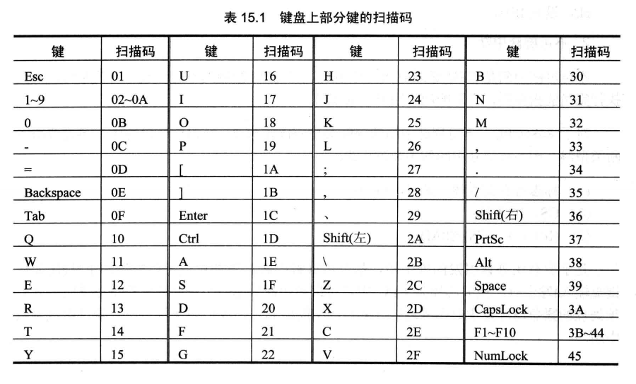

# 外中断

前面的内容都是 CPU 对指令的执行。

CPU 在计算机系统中，除了能执行指令，进行运算外，还能够对外部设备进行控制，接收它们的输入，向他们进行输出

CPU 除了有运算能力之外，还要有 I/O 能力。eg：按下键盘上的一个键，CPU 最终能够处理这个键。在文本编辑器中，按下 a 键后，可以在屏幕上出现 a,是 CPU 将从键盘上输入的键所对应的字符送到显示器上的

要及时处理外设的输入，需要解决两个问题：

1. 外设的输入随时可能发生，CPU 如何得知？
2. CPU 从何处得到外设的输入？

这里以键盘输入为例，解释这两个问题

## 接口芯片和端口

PC 系统的接口卡和主板上，装有各种接口芯片。这些外设接口芯片的内部有若干寄存器，CPU 将这些寄存器当作端口来访问

外设的输入不直接送入内存和 CPU,`而是送入相关的接口芯片的端口中` 。CPU 向外设的输出也不是直接送入外设，`而是先送入端口中，再由相关的芯片送到外设`。CPU 还可以向外设输出控制命令，`而这些控制命令也是先送到相关芯片的端口中，然后再由相关的芯片根据命令对外设实施控制` 

可见，`CPU 通过端口和外部设备进行进行联系`

## 外中断信息

现在，我们知道外设的输入被存放在端口中，可是外设的输入随时都有可能到达，CPU 如何及时地知道，并进行处理呢？

CPU 提供中断机制来满足这种需要。当 CPU 的内部有需要处理的事情发生的时候，将产生中断信息，引发中断过程。这种中断信息来自 CPU 的内部

还有一种中断信息，来自 CPU 的外部。当 CPU 外部有需要处理的事情发生的时候，eg：外设的输入到达，`相关芯片将向 CPU 发出相应的中断信息。CPU 在执行完当前指令后，可以检测到发送过来的中断信息，引发中断过程，处理外设的输入`

在 PC 系统中，外部中断源共有两类：

1. 可屏蔽中断
2. 不可屏蔽中断

***

### 可屏蔽中断

`可屏蔽中断是 CPU 可以不响应的外中断。CPU 是否响应可屏蔽中断，要看 flag 寄存器的 IF 位的设置`。当 CPU 检测到可屏蔽中断信息时，如果 IF=1,则 CPU 在执行完当前指令后响应中断，引发中断过程，如果 IF=0，则不响应可屏蔽中断

回忆一下内中断所引发的中断过程：

```asm
取中断类型码 n
flag 寄存器入栈，IF=0,TF=0
CS,IP 入栈
(IP)=(n*4),(CS)=(n*4+2)
```
由此转去执行中断处理程序

可屏蔽中断所引发的中断过程，除在第 1 步的实现上有所不同外，基本上和内中断的中断过程相同。因为可屏蔽中断信息来自 CPU 外部，中断类型码是通过数据总线送入 CPU 的，而内中断的中断类型码是在 CPU 内部产生的

现在，我们可以解释中断过程中将 IF 置为 0 的原因了。将 IF 置 0 的原因就是：`在进入中断处理程序后，禁止其他的可屏蔽中断` 

#### cli、sti
当然，如果在中断处理程序中需要处理可屏蔽中断，可以用指令将 IF 置为 1。8086CPU 提供的设置 IF 的指令如下

```asm
sti, 设置 IF=1  允许可屏蔽中断触发
cli, 设置 IF=0  屏蔽其他的可屏蔽中断
```

***

### 不可屏蔽中断

不可屏蔽中断是 CPU 必须响应的中断。当 CPU 检测到不可屏蔽中断信息时，则在执行完当前指令后，立即相应，引发中断过程

对于 8086CPU,不可屏蔽中断的中断类型码固定为 2,所以中断过程中，不需要取中断类型码。不可屏蔽中断的中断过程如下：

```asm
flag 寄存器入栈，IF=0, TF=0
CS,IP 入栈
(IP)=8, (CS)=0AH
```

`几乎所有由外设引发的外中断，都是可屏蔽中断`。当外设有需要处理的事件(eg：键盘输入)发生时，相关芯片向 CPU 发出可屏蔽中断信息。不可屏蔽中断是在系统中有必须处理的紧急情况发生时用来通知 CPU 的中断信息。

## PC 机键盘的处理过程

1. 键盘输入

键盘上的每个键相当于一个开关，键盘中有一个芯片对键盘上的每一个键的开关状态进行扫描。

按下一个键时，开关接通，该芯片就产生一个扫描码，扫描码说明了按下的键在键盘上的位置。扫描码被送入主板上的相关接口芯片的寄存器中，该寄存器的端口地址为 60H

松开按下的键时，也产生一个扫描码，扫描码说明了松开的键在键盘上的位置。松开按键时产生的扫描码也被送入 60H 端口中

一般将按下一个键时产生的扫描码称为`通码`，松开一个键产生的扫描码称为`断码`。扫描码长度为一个字节，通码的第 7 位是0,断码的第 7 位是 1。即：`断码 = 通码+ 80H`(eg：g 键的通过为 22H,断码为 a2H)


 

2. 引发 9 号中断

键盘的输入到达 60H 端口时，相关的芯片就会向 CPU 发出中断类型码为 9 的可屏蔽中断信息。CPU 检测到该中断信息后，如果 IF=1,则响应中断，引发中断过程，转去执行 int 9 的中断例程

3. 执行 int 9 中断例程

BIOS 提供了 int 9 中断例程，用来进行基本的键盘输入处理，主要工作如下：

- 读出 60H 端口中的扫描码
- 如果是字符键的扫描码，将该扫描码和它所对应的字符码(ASCII码)送入内存中的 BIOS 键盘缓冲区。如果是控制键(Ctrl)和切换键(CapsLock)的扫描码，则将其转变为`状态字节(用二进制位记录控制键和切换键状态的字节)`写入内存中存储状态字节的单元
- 对键盘系统进行相关的控制，eg：向相关芯片发出应答信息

`BIOS 键盘缓冲区是系统启动后，BIOS 用于存放 int 9 中断例程所接收的键盘输入的内存区`。该内存区可以存储 `15个键盘输入`，因为 int 9 中断例程除了接收扫描码外，还要产生和扫描码对应的字符码，所以`在 BIOS 键盘缓冲区中，一个键盘输入用一个字单元存放`，高位字节存放扫描码，低位字节存放字符码

0040:17 单元存储键盘状态字节，该字节`记录了控制键和切换键的状态`。键盘状态字节各位记录的信息如下

```asm
0: 右 shift 状态，置 1 表示按下右 shift 键
1: 左 shift 状态，置 1 表示按下左 shift 键
2: Ctrl 状态，置 1 表示按下 Ctrl 键
3: Alt 状态，置 1 表示按下 Alt 键
4: ScrollLock 状态，置 1 表示按下 Scroll 指示灯亮
5: NumLock 状态，置 1 表示小键盘输入的是数字
6: CapsLock 状态，置 1 表示输入大写字母
7: Insert 状态，置 1 表示处于删除状态
```

## 编写 int 9 中断例程

从上面的内容中，可以看出键盘输入的处理过程：

1. 键盘产生扫描码
2. 扫描码送入 60H 端口
3. 引发 9 号中断
4. CPU 执行 int 9 中断例程处理键盘输入

上面的过程汇总，1、2、3步都是由硬件系统完成的。我们能改变的只有 int 9 中断处理程序。我们可以重新编写 int 9 中断例程，按照自己的意图来处理键盘的输入(本章不会写一个完整的键盘中断例程，因为要涉及到一些硬件细节)。

但是，我们需要编写新的键盘中断处理程序，来进行一些特殊的工作，那么这些硬件细节如何处理？

这个比较简单，因为 BIOS 提供的 int 9 中断例程已经对这些硬件细节进行了处理。我们只要在自己编写的中断例程中调用 BIOS 的 int 9 中断例程就可以了

***

### 在同一块显存顺序显示 "a"~"z"

编程：在屏幕中间依次显示 "a"~"z"，并可以让人看清。在显示的过程中，按下 Esc 键后，改变显示的颜色

首先看一下如何显示 "a"~"z":

```asm
assume cs:code
code segment
start: 
    mov ax,0B800H
    mov es,ax
    mov ah,'a'
s:  mov es:[160*12+40*2],ah
    inc ah
    cmp ah,'z'
    jna s
    mov ax,4c00H
    int 21H
code ends
end start
```

### 延时显示 "a"~"z"

上面的程序执行后，我们无法看清屏幕上的显示。因为一个字母刚显示到屏幕上，CPU 执行几条指令后，就又变成了另一个字母，字母之间切换的太快，无法看清

应该在每显示一个字母后，延时一段时间，让人看清后，再显示下一个字母。

那么如何延时呢？

我们让 CPU 执行一段时间的空循环。由于 CPU 的速度非常快，所以循环的次数一定要很大，用两个 16 位寄存器来存放 32 位的循环次数，如下：

```asm
    mov dx,10H  ;循环 10W 次
    mov ax,0
s:  sub ax,1
    sbb dx,0
    cmp ax,0
    jne s
    cmp dx,0
    jne s
```

上面的程序，循环 10W 次。我们将循环延迟的程序段写为一个子程序

现在，我们的程序如下：

```asm
assume cs:code
stack segment
    db 128 dup (0)
stack ends
code segment
start: 
    mov ax,stack
    mov ss,ax
    mov sp,128

    mov ax,0B800H
    mov es,ax
    mov ah,'a'
s:  mov es:[160*12+40*2],ah
    call delay
    inc ah
    cmp ah,'z'
    jna s

    mov ax,4c00H
    int 21H

delay:
    push dx
    push ax

    mov dx,10H  ;循环 10W 次
    mov ax,0
s1: sub ax,1
    sbb dx,0
    cmp ax,0
    jne s1
    cmp dx,0
    jne s1

    pop ax
    pop dx
    ret

code ends
end start
```

### 通过按键改变显示字符的颜色

显示 "a"~"z"，并可以让人看清，这个任务已经实现。那么如何实现按下 Esc 键后，改变显示的颜色呢？

键盘输入到达 60H 端口后，就会引发 9 号中断，CPU 转去执行 int 9 中断例程。我们可以编写 int 9 中断例程，功能如下

1. 从 60H 端口读出键盘的输入
2. 调用 BIOS 的 int 9 中断例程，处理其他硬件细节
3. 判断是否为 Esc 的扫描码，如果是，改变显示的颜色。否则直接返回

***

下面对这些功能的实现一一分析

#### 从端口 60H 读取键盘输入

`in al,60H`

#### 调用 BIOS 的 int 9 中断例程

> 我们写的中断处理程序要成为新的 int 9 中断例程，主程序必须将中断向量表中的 int 9 中断例程的入口地址改为我们写的中断处理程序的入口地址。则在新的中断处理程序中调用原来的 int 9 中断例程时，中断向量表中的 int 9 中断例程的入口地址却不是原来的 int 9 中断例程的地址。所以不能使用 int 指令直接调用

要能在我们写的新中断例程中调用原来的中断例程，就必须在将中断向量表中的中断例程的入口地址改为新地址之前，将原来的入口地址保存起来。这样，在需要调用的时候，才能找到原来的中断例程的入口

现在的问题：假设将原来 int 9 中断例程的偏移地址和段地址保存在 `ds:[0] 和 ds:[2]`单元中。那么我们在需要调用原来的 int 9 中断例程的时候，就可以在 `ds:[0] ds:[2]`单元中找到它的入口地址

那么，有了入口地址后，如何进行调用呢？

当然不能使用 int 9 来调用。我们可以用其他指令来模拟 int 指令，从而实现对中断例程的调用

int 指令在执行的时候，CPU 进行下面的工作：

1. 取中断类型码 N
2. flag 寄存器入栈
3. IF=0, TF=0
4. CS,IP 入栈
5. (IP)=(N*4), (CS)=(N*4+2)

取中断类型码是为了定位中断例程的入口地址。在我们的问题中，中断例程的入口地址已经知道。所以，我们用其他指令模拟 int 指令时，不需要做第一步。在假设要调用的中断例程的入口地址在 ds:0 和 ds:2 单元中的前提下，我们将 int 过程用下面几步模拟

1. flag寄存器入栈
2. IF=0, TF=0
3. CS,IP 入栈
4. (IP)=((ds)*16+0), (CS)=((ds)*16+2)

可以注意到第3、4步和 `call dword ptr ds:[0]`的功能一样，`call dword ptr ds:[0]`的功能也是 *CS,IP入栈，(IP)=((ds)*16+0), (CS)=((ds)*16+2)*(`call dword ptr ds:[0]`  [可以查看 10.6 的内容](https://qing-huo.github.io//#/x86asm/masm_advanced?id=%E8%BD%AC%E7%A7%BB%E5%9C%B0%E5%9D%80%E5%9C%A8%E5%86%85%E5%AD%98%E4%B8%AD%E7%9A%84-call))

***

所以，int 指令的模拟过程变为：

1. flag寄存器入栈
2. IF=0, TF=0
3. `call dword ptr ds:[0]`

对于 1,可用 pushf 实现

对于 2,可用下面的指令实现

```asm
pushf
pop ax
and ah,11111100B ; IF 和 TF 为flag寄存器的第 9 位和第 8 位
push ax
popf
```

则模拟 int 指令的调用功能，调用入口地址在 ds:0,ds:2 中的中断例程的程序为：

```asm
pushf  ;flag 寄存器入栈
pushf
pop ax
and ah,11111100B
push ax
popf  ; IF=0,TF=0

call dword ptr ds:[0] ;CS,IP 入栈，(IP)=((ds)*16+0),(CS)=((ds)*16+2)
```

#### 按下Esc后，改变显示字符的颜色

如何改变显示的颜色？

显示的位置是屏幕的中断，即第 12 行 40 列，显存中的偏移地址为：`160*12+40*2` 。所以字符的 ASCII 码要送入段地址 B800H,偏移地址`160*12+40*2`处。

而段地址 B800H,偏移地址 `160*12+40*2+1` 处是字符的属性，只要改变此处数据就可以改变字符的颜色了

***

该程序的最后一个问题是，要在程序返回前，将中断向量表中的 int 9 中断例程的入口地址恢复为原来的地址。否则程序返回后，其他程序无法使用键盘

完整的程序如下

```asm
assume cs:code
stack segment
    db 128 dup (0)
stack ends
data segment
    dw 0,0        ;存放原 int 9 的中断例程
data ends
code segment
start: 
    mov ax,stack  ;设置栈
    mov ss,ax
    mov sp,128

    mov ax,data   ; ds 保存原本的 int 9 中断例程入口地址
    mov ds,ax

    mov ax,0
    mov es,ax     ; es 指向中断向量表
    cli

    ;将原本 int 9 中断例程的入口地址保存在 ds:0,ds:2 单元中
    push es:[9*4]
    pop ds:[0]
    push es:[9*4+2]
    pop ds:[2]

    ;在中断向量表中设置新的 int 9 中断例程的入口地址
    mov word ptr es:[9*4],offset Int9
    mov es:[9*4+2],cs
    sti

    mov ax,0B800H
    mov es,ax
    mov ah,'a'
s:  mov es:[160*12+40*2],ah
    call delay   ;调用延时程序
    inc ah
    cmp ah,'z'
    jna s

    ;将中断向量表中 int 9 中断例程的入口恢复为原来的地址
    mov ax,0
    mov es,ax
    cli   ;cli 和 sti 为检测点 15.1 的第二问，在设置 int 9 中断例程时屏蔽外中断
    push ds:[0]
    pop es:[9*4]
    push ds:[2]
    pop es:[9*4+2]
    sti

    mov ax,4c00H
    int 21H

;============================================
delay:
    push dx
    push ax
    mov dx,10H
    mov ax,0
s1: sub ax,1
    sbb dx,0
    cmp ax,0
    jne s1
    cmp dx,0
    jne s1
    pop ax
    pop dx
    ret

;============================================
Int9:
    push ax
    push bx
    push es

    in al,60H
    pushf
;    pushf          ;此处向下5行，为检测点15.1的第一问，这5行可注释，不影响题目要求
;    pop bx
;    and bh,11111100B
;    push bx
;    popf
    call dword ptr ds:[0] ;模拟 int 指令，调用原本的 int 9 中断例程

    cmp al,1
    jne Int9Ret

    mov ax,0B800H
    mov es,ax
    inc byte ptr es:[160*12+40*2+1] ;字符属性 +1,改变颜色

Int9Ret:
    pop es
    pop bx
    pop ax
    iret

code ends
end start
```

> 本章中所有关于键盘的程序，因要直接访问真是的硬件，必须在 DOS 实模式下运行。在 DOSBOX 下运行，可能会出现一些和硬件工作原理不符合的现象

## 安装新的 int 9 中断例程

下面，我们安装一个新的 int 9 中断例程，使得原 int 9 中断例程的功能得到扩展

任务：安装一个新的 int 9 中断例程

功能：在 DOS 下，按 F1 键后改变当前屏幕的显示颜色，其他键照常处理

***

现在分析一下：

(1) 改变屏幕的颜色

改变从 B8000H 开始的 4000 个字节中所有奇数地址单元中的内容，当前屏幕的显示颜色即发生改变。程序如下：

```asm
    mov ax,0B800H
    mov es,ax
    mov bx,1
    mov cx,2000
s:  inc byte ptr es:[bx]
    add bx,2
    loop s
```
***

(2) 其他键照常处理

可以调用原 int 9 中断处理程序，来处理其他的键盘输入

***

(3) 原 int 9 中断例程入口地址的保存

因为在编写新的 int 9 中断例程中要调用原 int 9 中断例程，所以，要保存原 int 9 中断例程的入口地址。

保存在哪里？显然不能保存在安装程序中，因为安装程序返回后地址将丢失。我们将地址保存在 0:200 单元处

***

(4) 新 int 9 中断例程的安装

这个问题前面有讨论，可以将新的 int 9 中断例程安装在 0:204 处

完整的程序如下：


```asm
assume cs:code
stack segment
    db 128 dup (0)
stack ends
code segment
start: 
    mov ax,stack  ;设置栈
    mov ss,ax
    mov sp,128
    push cs       ; ds 指向程序段

    pop ds

    mov ax,0
    mov es,ax     ; es 指向中断向量表

    mov si,offset new_int9  ; ds:si 指向原地址
    mov di,204H   ; es:di 指向中断向量表（目标地址）
    mov cx,offset new_int9_end - offset new_int9  ; cx 为传输的长度
    cld           ;传输方向为正
    rep movsb

    ; 保存原 int 9 中断例程的入口地址至 0:200 处
    push es:[9*4]
    pop es:[200H]
    push es:[9*4+2]
    pop es:[202H]

    ; 写入 int 9 中断例程的地址至中断向量表
    cli
    mov word ptr es:[9*4],204H
    mov word ptr es:[9*4+2],0
    sti

    mov ax,4c00H
    int 21H

new_int9:
    push ax
    push bx
    push cx
    push es

    in al,60H
    
    pushf
    call dword ptr cs:[200H]  ;当此中断例程执行时 (CS)=0

    cmp al,3BH  ;F1 的扫描码为 3BH
    jne int9Ret

    ;改变显存属性
    mov ax,0B800H
    mov es,ax
    mov bx,1
    mov cx,2000
s:  inc byte ptr es:[bx]
    add bx,2
    loop s

int9Ret:
    pop es
    pop cx
    pop bx 
    pop ax
    iret

new_int9_end:
    nop

code ends
end start
```

## 小结

本章通过对键盘输入的处理，了解了 CPU 对外设输入的通常处理方法。即：

1. 外设的输入送入端口
2. 向 CPU 发出外中断(可屏蔽中断)信息
3. CPU 检测到可屏蔽中断信息，如果 IF=1,CPU 在执行完当前指令后响应中断，执行相应的中断例程
4. 可在中断例程中实现对外设输入的处理

`端口和中断机制，是 CPU 进行 I/O 的基础`


