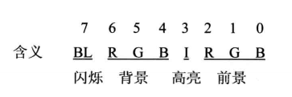

# int 指令

中断信息可以来自 CPU 内部和外部，当 CPU 的内部有需要处理的事情发生的时候，将产生需要马上处理的中断信息，引发中断过程。

下面是另一种重要的内中断，由 int 指令引发的中断

## int 简介

int 指令的格式为：int n,n 为中断类型码，它的功能是引发中断过程

CPU 执行 int n 指令，相当于引发一个 n 号中断的中断过程，执行过程如下

```x86asm
取中断类型码
flag 寄存器入栈，IF=0,TF=0
CS、IP 入栈
(IP)=(n*4),(CS)=(n*4+2)
```

从此处转去执行 n 号中断的中断处理程序

可以在程序中使用 int 指令调用任何一个中断的中断处理程序。

```x86asm
assume cs:code
code segment
start:  mov ax,0B800H
        mov es,ax
        mov byte ptr es:[12*160+40*2],'!'
        int 0
code edns
end start
```

这个程序在 Windows 2000 中的 DOS 方式下执行时，将在屏幕中间显示一个 "!",然后显示 "Divide overflow" 后返回到系统中。"!" 是编程实现的，而 "Divide overflow" 是哪里来的呢？程序中没有进行除零，不会产生产生除法溢出

代码上确实没有除零，但是结尾使用了 int 0 指令。CPU 执行 int 0 指令时，将引发中断过程，执行 0 号中断处理程序，而系统设置的 0 号处理程序的功能是显示 "Divide overflow"，然后返回到系统

可见，int 指令的最终功能和 call 指令相似，都是调用一段程序

一般，系统将一些具有一定功能的子程序，以中断处理程序的方式提供给应用程序调用。在编程时，可以用 int 指令调用这些子程序。当然，也可以自己编写一些中断处理程序供他人使用。以后，可以*将中断处理程序简称为中断例程* 

## 编写供应用程序调用的中断例程

现在讨论可以供应用程序调用的中断例程的编写方法。通过两个问题来讨论

1. 编写、安装中断 7ch 的中断例程

功能：求一 word 型数据的平方
参数：(ax)=要计算的数据
返回值：dx、ax 中存放结果的高16位和低16位
举例：求 2 * 3456^2

```x86asm
assume cs:code
code segment
start:  mov ax,3456 ;(ax)=3456
        int 7ch     ;调用中断 7ch 的中断例程，计算 ax 中的数据的平方

        add ax,ax
        adc dx,ax   ;dx:ax 存放结果，将结果乘以2

        mov ax,4c00H
        int 21H
code ends
end start
```

现在分异一下，要做的3部分工作：

（1）编写实现求平方功能的程序

（2）安装程序，将其安装在 0:200 处

（3）设置中断向量表，将程序的入口地址保存在 7ch 表项中，使其成为中断 7ch 的中断例程

安装程序如下：

```x86asm
assume cs:code 
code segment
start:  mov ax,cs
        mov ds,ax
        mov si,offset sqr   ;设置 ds:si 指向源地址
        mov ax,0
        mov es,ax
        mov di,200H     ;设置 es:di 指向目的地址
        mov cx,offset sqrend - offset sqr   ;设置 cx 为传输长度
        cld     ;设置传输方向为正
        rep movsb

        mov ax,0
        mov es,ax
        mov word ptr es:[7ch*4],200H
        mov word ptr es:[7ch*4+2],0

        mov ax,4c00H
        int 21H

sqr:    mul ax
        iret

sqrend: nop

code ends
end start
```

> 在中断例程 sqr 的最后，要使用 iret 指令。用汇编语法描述 iret 指令的功能如下：

```x86asm
;用汇编语法描述 iret 指令
pop IP
pop CS
popf
```

CPU 执行 int 7ch 指令进入中断例程之前，flag 寄存器、当前的 CS 和 IP 都入栈，在执行完中断例程后，应该用 iret 指令恢复 int 7ch 执行前的 flag 寄存器和 CS 和 IP 的值，从而接着执行应用程序

int 指令和 iret 指令的配合使用与 call 指令和 ret 指令的配合使用具有相似的思路

***

2. 编写、安装中断 7ch 的中断例程

功能：将一个全是字母、以 0 借位的字符串，转化为大写

参数：ds:si 指向字符串的首地址

举例：将 data 段中的字符串转化为大写

```x86asm
assume cs:code
data segment
    db 'conversation',0
data ends
code segment
start:  mov ax,data
        mov ds,ax
        mov si,0
        int 7ch

        mov ax,4c00H
        int 21H
code ends
end start
```

安装程序如下：

```x86asm
assume cs:code
code segment
start:  mov ax,cs
        mov ds,ax
        mov si,offset capital
        mov ax,0
        mov es,ax
        mov di,200H
        mov ax,offset capitalend - offset capital
        cld
        rep movsb

        mov ax,0
        mov es,ax
        mov word ptr es:[7ch*4],200H
        mov word ptr es:[7ch*4+2],0
        mov ax 4c00H
        int 21H

capital:push cx
        push si
change: mov cl,[si]
        mov ch,0
        jcxz ok
        and byte ptr [si],11011111B
        inc si
        jmp short change
ok:     pop si
        pop cx
        iret

capitalend: nop

code ends
end start
```

### 优化后的 int 7cH 练习

功能：将一个全是字母、以 0 借位的字符串，转化为大写

参数：ds:si 指向字符串的首地址

举例：将 data 段中的字符串转化为大写

```asm
assume cs:code
data segment
    db 'conversation',0
data ends
code segment
start:
    ; capital 的安装程序
    mov ax,cs
    mov ds,ax
    mov si,offset capital   ;ds:si 指向源程序地址
    mov ax,0
    mov es,ax
    mov di,200H   ;es:di 指向传输的目的地址
    mov cx,offset capitalEnd - offset capital ;传输长度
    cld     ;传输方向为正
    rep movsb 

    ; 设置中断向量表
    mov ax,0
    mov es,ax
    mov word ptr es:[7cH*4],200H  ;设置偏移地址
    mov word ptr es:[7cH*4+2],0   ;设置段地址

    mov bx,160*2+40   ;设置显示位置(改变前)
    call show_string  

    ;执行 int 7ch 
    mov ax,data
    mov ds,ax
    mov si,0
    int 7ch

    ; 再次设置显示位置(改变后)
    mov bx,160*4+40
    call show_string

    ; 程序正常返回
    mov ax,4c00H
    int 21H
    ; 改变字符串

capital:
    mov ax,data
    mov ds,ax
    mov si,0
    mov ch,0
    
cg: mov cl,ds:[si]
    and cl,11011111B
    jcxz cgEnd
    mov ds:[si],cl
    inc si
    jmp short cg

cgEnd:
    iret
capitalEnd:
    nop

; 显示字符串
show_string:
    mov ax,data
    mov ds,ax
    mov si,0
    mov ax,0B800H
    mov es,ax
    mov di,0

    mov ah,00010100B
    mov cx,12
s:  mov al,ds:[si]
    mov es:[di+bx],ax
    add di,2
    inc si
    loop s

    ret
code ends
end start
```

## 对 int、iret 和 栈的深入理解

问题：用 7ch 中断例程完成 loop 指令的功能

loop s 的执行需要两个信息，循环次数和到 s 的位移，所以，7ch 中断例程 要完成 loop 指令的功能，也需要这两个信息作为参数。用 cx 存放循环次数，用 bx 存放位移

举例：在屏幕中间显示 80 个 "!"

```x86asm
assume cs:code
code segment
start:  mov ax,0B800H
        mov es,ax
        mov di,160*12

        mov bx,offset s - offset se ;设置从标号 se 到标号 s 的转移位移
        mov cx,80
s:      mov byte ptr es:[di],'!'
        add di,2
        int 7ch ;如果(cx)!=0,转移到标号 s 处

se:     nop

        mov ax,4c00H
        int 21H

code ends
end start
```

上面的程序中，用 int 7ch 调用 7ch 中断例程进行转移，用 bx 传送转移的位移

分析：为了模拟 loop 指令，7ch 中断例程应具备下面的功能

1. dec cx
2. 如果(cx)!=0,转到标号 s 处执行，否则向下执行

下面分析 7ch 中断例程如何实现到目的地址的转移

1. 转到标号 s 显然应设置(CS)=标号 s 的段地址,(IP)=标号 s 的偏移地址
2. 那么，中断例程如何取得标号 s 的段地址和偏移地址呢？

int 7ch 引发中断过程后，进入 7ch 中断例程，在中断过程中，当前的 flag 标志寄存器、CS 和 IP 都要入栈，此时压入的 CS 和 IP 中的内容，分别是调用程序的段地址(可以认为是标号 s 的段地址)和 int 7ch 后一条指令的偏移地址(即标号 se 的偏移地址)

可见，在中断例程中，```可以从栈里取得标号 s 的段地址和标号 se 的偏移地址```，而用标号 se 的偏移地址加上 bx 中存放的转移位移就可以取得标号 s 的偏移地址

3. 现在，可以用栈中直接和间接地得到标号 s 的段地址和偏移地址。那么如何用他们设置 CS:IP 呢？

现在就用到 iret 指令了，将栈中的 se 的偏移地址在上 bx 中的转移位移，则栈中的 se 的偏移地址就变为了 s 的偏移地址。再使用iret 指令，用栈中的内容设置 CS、IP,从而实现转移到标号 s 处

7ch 中断例程如下

```x86asm
lp:     push bp
        mov bp,sp
        dec cx
        jcxz lpret
        add [bp+2],bx
lpret:  pop bp
        iret
```

因为要访问栈，使用了 bp,在程序开始处将 bp 入栈保存，结束时出栈恢复。当要修改栈中 se 的偏移地址的时候，栈中的情况为：*栈顶处是 bp 原来的数值，下面是 se 的偏移地址，在下面是 s 的段地址，再下面是 flag 寄存器的值* 。而此时，bp 中为栈顶的偏移地址，所以 ((ss)*16+(bp)+2) 处为 se 的偏移地址，将它加上 bx 中的转移位移就变为 s 的偏移地址。最后用 iret 出栈返回，CS:IP 即从标号 s 处开始执行指令

如果 (CX)=0,则不需要修改栈中 se 的偏移地址，直接返回即可。CPU 从标号 se 处向下执行命令

## BIOS 和 DOS 提供的中断例程

在系统板 ROM 中存放着一套程序，称为 BIOS,BIOS 主要包含以下几部分内容

1. 硬件系统的检测和初始化程序
2. 外部中断和内部中断的中断例程
3. 用于对硬件设备进行 I/O 操作的中断例程
4. 其他和硬件系统相关的中断例程

操作系统 DOS 也提供了中断例程，从 OS 的角度看，DOS 的中断例程就是操作系统向开发者提供的编程资源

BIOS 和 DOS 在所提供的中断例程中包含了许多子程序，这些子程序实现了开发者在编程的时候经常需要用到的功能。开发者在编程时，可以用 int 指令直接调用 BIOS 和 DOS 提供的中断例程，完成某些工作

和硬件设备相关的 DOS 中断例程中，一般都调用了 BIOS 的中断例程

## BIOS 和 DOS 中断例程的安装过程

前面的内容都是自己编写中断例程，将他们放到安装程序中，然后运行安装程序，将他们安装到指定的内存区中。此后，别的应用程序才可以调用

而 BIOS 和 DOS 提供的中断例程是如何安装到内存中的呢？

1. 开机后，CPU 一加电，初始化 (CS)=0FFFFH,(IP)=0,自动去 FFFF:0 单元开始执行程序。FFFF:0 处有一条跳转指令，CPU 执行该指令后，转去执行 BIOS 中的硬件系统检测和初始化程序
2. 初始化程序将建立 BIOS 所支持的中断向量，即将 BIOS 提供的中断例程的入口地址登记在中断向量表中。NOTE：对于 BIOS 所提供的中断例程，只需将入口地址登记在中断向量表中即可，因为他们是固化到 ROM 中的程序，一直在内存中存在
3. 硬件系统检测和初始化完成后 ，调用 int 19H 进行操作系统的引导。从此将计算机交由操作系统控制
4. DOS 启动后，除完成其他工作外，还将它所提供的中断例程装入内存，并建立相应的中断向量

## BIOS 中断例程应用

int 10H 中断例程是 BIOS 提供的中断例程，其中包含了多个和屏幕输出相关的子程序

一般来说，一个供开发者调用的中断例程中往往包含多个子程序，中断例程内部用传递进来的参数来决定执行哪一个子程序。```BIOS 和 DOS 提供的中断例程，都用 ah 来传递内部子程序的编号```

下面是 int 10H 中断例程的设置光标位置功能

```x86asm
mov ah,2    ;置光标
mov bh,0    ;第 0 页
mov dh,5    ;dh 中放行号
mov dl,12   ;dl 中放列号
int 10H
```

(ah)=2 表示调用第 10H 号中断例程的 2 号子程序，功能为设置光标位置，可以提供光标所在的行号(80 * 25字符模式下：0~24)、列号(80*25 字符模式下：0～79),和页号作为参数

(bh)=0,(dh)=5,(dl)=12,设置光标到第 0 页，第 5 行，第 12 列

bh 中页号的含义: ```内存地址空间中，B8000H~BFFFFH 共 32kB 空间，为 80 * 25 彩色字符模式的显示缓冲区。一屏的内容在显示缓冲区中共占 4000 个字节```

显示缓冲区分为 8 页，每页 4KB(约4000B)，显示器可以显示任意一页的内容。一般，显示第 0 页的内容。也就是说，通常情况下，B8000H~B8F9FH 中的 4000 个字节的内容将出现在显示器上

***

再看一下 int 10H 中断例程的在光标位置显示字符功能

```x86asm
mov ah,9    ;在光标位置显示字符
mov al,'a'  ;字符
mov bl,7    ;颜色属性
mov bh,0    ;第 0 页
mov cx,3    ;字符重复个数
int 10H
```

(ah)=9 表示调用第 10H 号中断例程的 9 号子程序，功能为在光标位置显示字符，可以提供要显示的字符、颜色属性、页号、字符重复个数作为参数

bl 中的颜色属性的格式如下(和显存中的属性字节的格式相同)



编程：在屏幕的 5 行 12 列显示 3 个红底高亮闪烁绿色的 'a'

```x86asm
assume cs:code
code segment
         mov ah,2   ;置光标
         mov bh,0   ;第 0 页
         mov dh,5   ;dh 中放行号
         mov dl,12  ;dl 中放列号
         int 10H

         mov ah,9   ;在光标位置显示字符
         mov al,'a' ;字符
         mov bl,11001010B   ;颜色属性
         mov bh,0   ;第 0 页
         mov cx,3   ;字符重复个数
         int 10H

         mov ax,4c00H
         int 21H
code ends
end 
```

## DOS 中断例程应用

int 21H 中断例程是 DOS 提供的中断例程，其中包含了 DOS 提供给开发者在编程时调用的子程序

我们前面一直使用的是 int 21H 中断例程的 4ch 号功能，即```程序返回功能```，如下

```x86asm
mov ah,4ch  ;程序返回
mov al,0    ;返回值
int 21H
```

(ah)=4ch 表示调用第 21H 号中断例程的 4ch 号子程序，功能为程序返回，可以提供返回值作为参数.

我们前面使用这个功能的时候经常采用下面的写法

```x86asm
mov ax,4c00H
int 21H
```

现在看一下 int 21H 中断例程在光标位置显示字符串的功能：

```x86asm
ds:dx 指向字符串    ;要显示的字符串需用 "$" 作为结束符
mov ah,9    ;功能号 9,表示要在光标位置显示字符串
int 21H
```

(ah)=9 表示调用第 21H 号中断例程的 9 号子程序，功能为在光标位置显示字符串，可以提供要显示字符串的地址作为参数

编程：在屏幕的 5 行 12 列显示字符串 "Welcome to masm!"

```x86asm
assume cs:code
data segment
    db 'Welcome to masm!','$'
data ends
code segment
start:  mov ah,2    ;置光标
        mov bh,0    ;第 0 页
        mov dh,5    ;dh 中放行号
        mov dl,12   ;dl 中放列号
        int 10H

        mov ax,data
        mov ds,ax
        mov dx,0    ;ds:dx 指向字符和窜的首地址 data:0
        mov ah,9

        int 21H

        mov ax,4c00H
        int 21H
code ends
end start
```

上述程序在屏幕的 5 行 12 列显示字符串 "Welcome to masm!",直到遇到 "$"('$'本身并不显示，只起到边界的作用)

如果字符串比较长，遇到行尾，程序会自动转到下一行开头处继续显示。如果到了最后一行，还能自动上卷一行

DOS 为开发者提供了许多可以调用的子程序，都包含在 int 21H 中断例程中，这里只对原理解释

