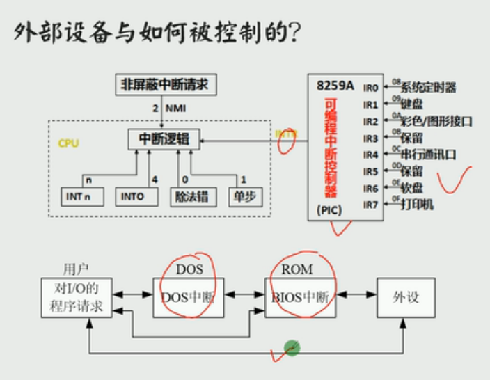

# 端口

各种存储器都和 CPU 的地址线、数据线、控制线相连。CPU 在操控他们的时候，把他们都当作内存来对待，把他们总地看作一个由若干存储单元组成的逻辑存储器，这个逻辑存储器我们称其为```内存地址空间```

在 PC 机系统中，和 CPU 通过总线相连的芯片除各种存储器外，还有以下 3 种芯片

1. 各种接口卡(比如网卡、显卡)撒谎那个的接口芯片，他们控制接口卡进行工作
2. 主板上的接口芯片，CPU 通过他们对部分外设进行访问
3. 其他芯片，用来存储相关的系统信息，或进行吸纳公关的输入输出处理

在这些芯片中，都有一组可以由 CPU 读写的寄存器。这些寄存器，他们在物理上可能处于不同的芯片中，但是他们在以下两点上相同

1. 都和 CPU 的总线相连 (当然这种连接是通过他们所在的芯片进行的)
2. CPU 对他们进行读写的时候都通过控制线向他们所在的芯片发出端口读写命令

可见，从 CPU 的角度，将这些寄存器都当作端口，对他们进行统一编址，从而建立了一个统一的端口地址空间。```每一个端口在地址空间中都有一个地址```

CPU 可以直接读写以下 3 个地方的数据

1. CPU 内部的寄存器
2. 内存单元
3. 端口

 

## 端口的读写

在访问端口的时候，CPU 通过```端口地址来定位端口```。因为端口所在的芯片和 CPU 通过总线相连，所以，端口地址和内存地址一样，通过地址总线来传送。在 PC 系统中，CPU 最多可以定位 64KB 个不同的端口。则端口地址的范围为 0~65535

对端口的读写不能用 mov、push、pop 等内存读写指令。端口的读写指令只有两条:```in 和  out```,分别用于从端口读取数据和写入数据

我们看一下 CPU 执行内存访问指令和端口访问指令时候，总线上的信息:

1. 访问内存:
    - `mov ax,ds:[8]` ;假设执行前(ds)=0, 执行时与总线相关的操作如下所示
        * CPU 通过地址线将地址信息 8 发出
        * CPU 通过控制线发出内存读命令，选中存储器芯片，并通知他，将要从中读取数据
        * 存储器将 8 号单元中的数据通过数据线送入 CPU
2. 访问端口：
    - `in al,60H` ;从 60H 号端口读入一个字节,执行时与总线相关的操作如下
        * CPU 通过地址线将地址信息 60H 发出
        * CPU 通过控制线发出端口读命令，选中端口所在的芯片，并通知它，将要从中读取数据
        * 端口所在的芯片将 60H 端口中的数据通过数据线送入 CPU

> 在 in 和 out 指令中，只能使用 ax 或 al 来存放从端口中读入的数据或要发送到端口中的数据。访问 8 位端口时使用 al,访问 16 位端口时使用 ax

对 0～255 以内的端口进行读写时：

```asm
out 20H,al  ;往 20H 端口写入一个字节
in al,20H   ;从 20H 端口读取一个字节
```

对 256～65535 的端口进行读写时，端口号放在 dx 中

```asm
mov dx,3f8H ;将端口号 3f8H 送入 dx
out dx,al    ;向 3f8H 端口写入一个字节
in al,dx    ;从 3f8H 端口读取一个字节
```
## CMOS RAM 芯片

下面的内容中，我们通过对 CMOS RAM 的读写来体会一下对端口的访问

PC 机中，有一个 CMOS RAM 芯片，一般简称为 *CMOS* 。此芯片特征如下

1. 包含一个实时钟和一个有 128 个存储单元的 RAM 存储器(早期的PC为64个字节)
2. 该芯片靠电池供电。所以，关机后其内部的实时钟仍可正常工作，RAM 中的信息不丢失
3. 128 个字节的 RAM 中，内部实时钟占用 0～0DH 单元来保存时间信息，其余大部分单元用于保存系统配置信息，供系统启动时 BIOS 程序读取。BIOS 也提供了相关的程序，使我们可以在开机的时候配置 CMOS RAM 中的系统信息
4. 该芯片内部有 2 个端口，端口地址为 70H 和 71H.CPU 通过这两个端口来读写 CMOS RAM
5. 70H 为地址端口，存放要访问的 CMOS RAM 单元的地址，71H 为数据端口，存放从选定的 CMOS RAM 单元中读取的数据，或要写入其中的数据。可见，CPU 对 CMOS RAM 的读写分为两步进行，比如：读 CMOS RAM 的 2 号单元:
    - 将 2 送入端口 70H
    - 从端口 71H 读出 2 号单元的内容

### 检测点 14.1

1. 编程：读取 CMOS RAM 的 2 号单元的内容

```asm
mov al,2
out 70H,al
in al,71H
```

2. 编程：向 CMOS RAM 的 2 号单元写入 0

```asm
mov al,2
out 70H,al
mov al,0
out 71H,al
```

## shl 和 shr 指令

shl 和 shr 是逻辑移位指令。

shl 是逻辑左移指令，它的功能如下

1. 将一个寄存器或内存单元中的数据向左移位
2. 将最后移除的一位写入 CF 中
3. 最低位用 0 补充

```asm
mov al,01001000B
shl al,1  ;将 al 中的数据左移一位
```

shl al,1 的操作过程

```asm
左移
原数据：  01001000B

左移后： 01001000B
将最后移位出的一位写入 CF 中
原数据：  01001000B
左移后：  1001000   CF=0

最低位用 0 补充
原数据：  01001000B
左移后：  10010000B
```

如果接着上面，继续执行 shl al,1,则执行后：(al)=00100000B,CF=1。shl 指令的操作过程如下

```asm
左移
原数据：  10010000B
左移后： 10010000B

将最后移出的一位写入 CF 中
原数据：  10010000B
左移后：  0010000 CF=1

最低位用 0 补充
原数据：  10010000
左移后：  00100000
```

如果移动位数大于 1 时，必须将移动位数放在 cl 中。如下：

```asm
mov al,01010001B
mov cl,3
shl al,cl
;执行后 (al)=10001000B,因为最后移出的一位是0,所以 CF=0
```
可以看出，将 X 逻辑左移一位，相当于执行 X=X*2。如下：

```asm
mov al,00000001B  ;执行后 (al)=00000001B = 1
shl al,1          ;执行后 (al)=00000010B = 2
shl al,1          ;执行后 (al)=00000100B = 4
shl al,1          ;执行后 (al)=00001000B = 8
mov cl,3
shl al,cl         ;执行后 (al)=01000000B = 64
```

***

shr 是逻辑右移指令，他和 shl 正好相反

1. 将一个寄存器或内存单元中的数据向右移
2. 将最后移出的一位写入 CF 中
3. 最高位用 0 补充

```asm
mov al,10000001B
shr al,1    ;将 al 中的数据右移一位
;执行后 (al)=01000000B,CF=1
```

如果接着上面，继续执行一条 shr al,1，则执行后：(al)=00100000B,CF=0

如果移动位数大于 1 时，必须将移动位数放在 cl 中

```asm
mov al,01010001B
mov cl,3
shr al,cl
;执行后 (al)=00001010B
;因为最后移出的一位是0,所以 CF=0

```

可以将 X 逻辑右移一位，看作执行了 X=X/2

## CMOS RAM 中存储的时间信息

在 CMOS RAM 中，存放着当前的时间：年、月、日、时、分、秒。这 6 个信息的长度都为 1 个字节，存放单元如下：

秒：0   分：2    时：4     日：7    月：8     年：9

这些数据以 BCD 码的方式存放

BCD 码是以 4 位 二进制数表示十进制数码的编码方法，如下图:

 

可见，一个字节可表示两个 BCD 码。则 CMOS RAM 存储时间信息的单元中，存储了用两个 BCD 码表示的两位十进制数，高 4 位的 BCD 码表示十位，低 4 位的 BCD 码表示个位。eg: `00010100B 表示 14` 

编程：在屏幕中间显示当前的月份

分析：这个程序主要做以下两部分工作

1. 从 CMOS RAM 的 8 号单元读取当前月份的 BCD 码
2. 将用 BCD 码表示的月份以十进制的形式显示到屏幕上

```asm
assume cs:code
code segment
start:  mov al,8
        out 70H,al
        in al,71H

        mov ah,al
        mov cl,4
        shr ah,cl
        and al,00001111B

        add ah,30H
        add al,30H

        mov bx,0B800H
        mov es,bx
        mov byte ptr es:[160*12+40*2],ah  ;显示月份的十位数码
        mov byte ptr es:[160*12+40*2+2],al  ;接着显示月份的个位数码

        mov ax,4c00H
        int 21H
code ends
end start
```

### 实验14,访问 CMOS RAM 显示时间

以 *年/月/日 时：分：秒* 的格式，显示当前的日期、时间 

```asm
;该代码可无限显示时间
assume cs:code
code segment
; 年 月 日 时 分 秒
; 9  8  7  4  2  0
    s1:   db 9,8,7,4,2,0
    s2:   db 'YY/MM/DD hh:mm:ss'

start:

interval:
    call showTimeStyle
    jmp interval

    mov ax,4c00H
    int 21H

;===================================
showTimeStyle:
    push ax
    push bx
    push cx
    push dx
    push si
    push di
    push bp
    push ds
    push es

    mov ax,cs
    mov ds,ax
    mov si,offset s1
    mov bp,offset s2
    mov di,offset s2
    mov bx,0
    mov cx,6

s:  mov al,ds:[si]
    call get_CMOS_data
    call handle_CMOS_data
    call write_data_segment
    call show_date_time
    add bx,2
    inc si
    loop s

    mov cx,11
s5: call show_date_time
    add bx,2
    loop s5

    pop ax
    pop bx
    pop cx
    pop dx
    pop si
    pop di
    pop bp
    pop ds
    pop es
    ret

;===================================
get_CMOS_data:
        out 70H,al
        in al,71H
        ret

;===================================
handle_CMOS_data:
        push cx
        mov ah,al
        mov cl,4
        shr ah,cl
        and al,00001111B

        add ah,30H
        add al,30H
        pop cx
        ret

;===================================
write_data_segment:
        mov ds:[bp],ah
        mov ds:[bp+1],al
        add bp,3
        ret
;===================================
show_date_time:
        mov dx,0B800H
        mov es,dx
        mov al,ds:[di]
        mov ah,00000001B
        inc di
        mov es:[160*12+40*2+bx],ax  ;显示月份的十位数码
        ret

code ends
end start
```
