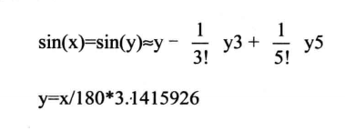

# 直接定址表

本章讨论如何有效合理地组织数据，及相关技巧

## 描述单元长度的标号

前面的章节，我们一直在代码段中使用标号来标记指令、数据、段的起始地址。比如：下面的程序将 code 段中的 a 标号处的 8 个数据累加，结果存储到 b 标号处的字中

```asm
assume cs:code
code segment
    a:  db 1,2,3,4,5,6,7,8
    b:  dw 0

start:
    mov si,offset a
    mov bx,offset b
    mov cx,8

s:  mov al,cs:[si]
    mov ah,0
    add cs:[bx],ax
    inc si
    loop s

    mov ax,4c00H
    int 21H
code ends
end start
```

上面程序中，code、a、b、start、s 都是标号。这些标号仅仅表示了内存单元的地址

但是，我们还可以使用一种标号，这种标号*不但表示内存单元的地址* ，还`表示了内存单元的长度`，即`表示在此标号处的单元，是字单元、字节单元还是双字单元`。上面的程序还可以写成这样：

```asm
assume cs:code
code segment
    a  db 1,2,3,4,5,6,7,8
    b  dw 0

start:
    mov si,0
    mov cx,8

s:  mov al,a[si]
    mov ah,0
    add b,ax
    inc si
    loop s

    mov ax,4c00H
    int 21H
code ends
end start
```

在 code 段中使用的标号 a、b 后面没有 *:* ,他们是`同时描述内存地址和单元长度的标号`。`标号 a,描述了地址 code:0，和从这个地址开始，以后的内存单元都是字节单元`。`而标号 b 描述了地址 code:8，从这个地址开始，以后的内存单元都是字单元`

因为这种标号包含了对单元长度的描述，所以在指令中，它可以代表一个段中的内存单元。比如：对于程序中的 `b dw 0` 

```asm
指令：  mov ax,b
相当于：mov ax,cs:[8]

指令：  mov b,2
相当于：mov word ptr cs:[8],2

指令：  inc b
相当于：inc word ptr cs:[8]
```

在这些指令中，标号 b 代表了一个内存单元，地址为 code:8，长度为两个字节

下面的指令会引发编译错误

`mov al,b`

因为 b 代表的是内存单元，是字单元，而 al 是 8 位寄存器

如果我们将程序中的指令 `add b,ax`,写为 `add b,al` ,将出现同样的编译错误

对于程序中的 `a db 1,2,3,4,5,6,7,8`

```asm
指令：  mov al,a[si]
相当于：mov al,cs:0[si]

指令：  mov al,a[3]
相当于：mov al,cs:0[3]

指令：  mov al,a[bx+si+3]
相当于：mov al,cs:0[bx+si+3]
```

可见，使用这种包含单元长度的标号，可以让我们以简洁的形式访问内存中的数据。以后，我们将这种标号称为`数据标号`，`它标记了存储数据的单元的地址和长度，不同于仅仅表示地址的地址标号`


### 检测点 16

将下面程序 code 段中 a 处的8个数据累加，结果保存在 b 处的双字中

```asm
assume cs:code
code segment
	a dw 1, 2, 3, 4, 5, 6, 7, 8
	b dd 0
start:	
    mov si, 0
    mov cx, 8
s:	
    mov ax, ____
    add ____, ax
    adc ____, 0
    add si, ____
    loop s

    mov ax, 4c00h
    int 21h

code ends
end start
```

答案如下：

```asm
    a[si]
    word ptr b[0]
    word ptr b[2]
    2
```

## 在其他段使用数据标号

一般来说，我们不在代码段中定义数据，而是将数据定义到其他段中。在其他段中，我们也可以用数据标号来描述存储数据的单元的地址和长度

> 在后面加有 ： 的地址标号，只能在代码段中使用，不能再其他段中使用

下面的程序将 data 段中标号 a 处的8个数据累加，结果存储到 b 标号处

```asm
assume cs:code,ds:data
data segment
    a db 1,2,3,4,5,6,7,8
    b dw 0
data ends
code segment
start:
    mov ax,data
    mov ds,ax

    mov si,0
    mov cx,8

s:  mov al,a[si]
    mov ah,0
    add b,ax
    inc si
    loop s

    mov ax,4c00H
    int 21H
code ends
end start
```

> 如果想在代码段中直接使用数据标号访问数据，需要用伪指令 assume 将标号所在的段和一个段寄存器关联。否则编译时，无法确定标号的段地址在哪个寄存器中。这种联系是编译器需要的，但绝对不是说，我们会因为编译器的需要，用 assume 将段寄存器和某个段关联后，段寄存器就会真的存放该段的地址。我们在程序中还需要使用指令对段寄存器进行设置

比如，上面的程序中，在代码段中用 data 段中的数据标号 a、b 访问数据，则必须用 assume 将一个寄存器和 data 段关联。在程序中，我们用 ds 寄存器和 data 段关联。编译器对相关指令的编译如下：

```asm
指令：  mov al,a[si]
编译为：mov al,[si+0]

指令：  add b,ax
编译为：add [8],ax
```

因为这些实际编译出的指令，都默认所访问单元的段地址在 ds 中，而实际要访问的段为 data,所以若要正确访问：在这些指令执行前，ds 中必须为 data 段的段地址。则我们在程序中使用指令：

```asm
mov ax,data
mov ds,ax
```

设置 ds 指向 data 段

可以将标号当作数据来定义，此时，编译器将标号所表示的地址当作数据的值。eg:

```asm
data segment
    a db 1,2,3,4,5,6,7,8
    b dw 0
    c dw a,b
data ends
```

数据标号 c 处存储的两个字型数据为标号 a、b 的偏移地址。相当于：

```asm
data segment
    a db 1,2,3,4,5,6,7,8
    b dw 0
    c dw offset a,offset b
data ends
```

再比如：

```asm
data segment
    a db 1,2,3,4,5,6,7,8
    b dw 0
    c dd a,b
data ends
```
数据标号 c 处存储的两个双字型数据为标号 a、b 的偏移地址和段地址。相当于

```asm
data segment
    a db 1,2,3,4,5,6,7,8
    b dw 0
    c dw offset a,seg a,offset b,seg b
data ends
```

`seg 操作符：功能为取得某一标号的段地址`

## 直接定址表

现在，下面将描述用`查表`的方法编写相关程序的技巧

编写子程序：以16进制的形式在屏幕中间显示给定的字节型数据

分析：一个字节需要用两个十六进制来表示，所以，子程序需要在屏幕上显示两个 ASCII 码。我们用 "0~F" 这 16 个字符来显示十六进制数

我们可以将一个字节的高 4 位和低 4 位分开，分别用它们的值得到对应的数码字符。比如 2BH,可以得到高 4 位的值为 2,低 4 位的值为 11,那么如何用这两个数值得到对应的数码字符 "2" 和 "B" 呢

最简单的办法就是一个一个地比较，eg：

```asm
如果数值为 0,则显示 "0"
如果数值为 1,则显示 "1"
...
如果数值为 11,则显示 "B"
...
```

显然，我们希望能够在数值 0～15 和字符 "0"～"F" 之间找到一种映射关系。这样用 0～15 间的任何数值，都可以通过这种映射关系直接得到 "0"～"F" 中对应的字符

数值 0～9 和字符 "0"～"9" 之间的映射关系是很明显的

```asm
数值 + 30H = 对应字符的 ASCII 值
0 + 30H = "0" 的ASCII 值
1 + 30H = "1" 的ASCII 值
...
```

但是 10～15 和 "A"~"F" 之间的映射关系是：

```asm
数值 + 37H = 对应字符的 ASCII 值
10 + 37H = "A" 的ASCII 值
11 + 37H = "B" 的ASCII 值
12 + 37H = "C" 的ASCII 值
...
```

可见，我们可以利用数值和字符之间原本存在的映射关系，通过高 4 位和低 4 位值得到对应的字符码。但是由于映射关系的不同，我们在程序汇总必须进行一些比较，对于大于 9 的数值，我们要用不同的计算方法

***

这样做，虽然简化了程序。但是，我们希望用更简洁的算法，就要考虑用同一种映射关系从数值得到字符码。所以，我们就不能用他们原本存在的映射关系

由于数值 0～15 和 "0"～"F" 之间没有一直的映射关系存在，所以，我们应该建立心得映射关系

具体的做法是，建立一张表，表中依次序存储字符 "0"～"F"，我们可以通过数值 0～15 直接查找对应的字符。程序如下:

```asm
; 用 al 传送要显示的数据
show_byte:
    jmp short show
    table db '0123456789ABCDEF' ;字符表
show:
    push bx
    push es

    mov ah,al
    shr ah,1
    shr ah,1
    shr ah,1
    shr ah,1 ;右移4位，ah 中得到高4位的值
    and al,00001111B ; al 中为低 4 位的值

    mov bl,ah
    mov bh,0
    mov ah,table[bx] ; 用高 4 位的值作为相对于 table 的偏移，取得对应的字符

    mov bx,0B800H
    mov es,bx
    mov es:[160*12+40*2],ah

    mov bl,al
    mov bh,0
    mov al,table[bx] ; 用低 4 位的值作为相对于 table 的偏移，取得对应的字符

    mov es:[160*12+40*2],al

    pop es
    pop bx
    ret
```

可以看出，在子程序汇总，我们在数值 0～15 和字符 "0"～"F" 之间建立的映射关系为：`以数值 N 为 table 表中的偏移，可以找到对应的字符`

利用表，在*两个数据集合之间建立一种映射关系，使得我们可以用查表的方法依据给出的数据得到其在另一集合中的对应数据*。这样做的目的一般来说有以下 3 个

1. 为了算法的清晰和简洁
2. 为了加快运算速度
3. 为了使程序易于扩充

在上面的子程序汇总，我们更多的是为了算法的清晰和简洁，而采用了查表的方法。下面我们来看一下，为了加快运算速度而采用查表的方法的情况

编写子程序：计算 sin(x),x 属于 {0,30,60,90,120,150,180},并在屏幕中间显示计算结果。eg：sin(30) 的结果显示为 "0.5"

我们可以利用麦克劳林公式来计算 sin(x)。x 为角度，麦克劳林公式中需要带入弧度，则：

 

可以看出，计算 sin(x) 需要进行多次乘除法。乘除是非常费时的运算，他们的*执行时间大约是加法、比较等指令的 5 倍*。如何才能不乘除而计算 sin(x) 呢？我们看一下需要计算的 sin(x) 的结果

```asm
sin(0) = 0
sin(30) = 0.5
sin(60) = 0.866
sin(90) = 1
sin(120) = 0.866
sin(150) = 0.5
sin(180) = 0
```

可以看出，可以不用计算，可以占用一些内存空间来换取运算的速度。将要计算的 sin(x) 的结果都存储到一张表中，然后用角度值来查表，找到对应的 sin(x) 的值

```asm
;用 ax 向子程序传递角度
show_sin: jmp short show
    table dw ag0,ag30,ag60,ag90,ag120,ag150,ag180 ;字符串偏移地址表
    ag0 db '0',0        ; sin(0) 对应的字符串 "0"
    ag30 db '0.5',0     ; sin(30) 对应的字符串 "0.5"
    ag60 db '0.866',0   ; sin(60) 对应的字符串 "0.866"
    ag90 db '1',0       ; sin(90) 对应的字符串 "1"
    ag120 db '0.866',0  ; sin(120) 对应的字符串 "0.866"
    ag150 db '0.5',0    ; sin(150) 对应的字符串 "0.5"
    ag180 db '0',0      ; sin(180) 对应的字符串 "0"
show:
    push bx
    push es
    push si
    mov bx,0B800H
    mov es,bx

;一下用角度值/30 作为相对于 table 的偏移，取得对应的字符串的偏移地址，放在 bx 中
    mov ah,0
    mov bl,30
    div bl
    mov bl,al
    mov bh,0
    add bx,bx
    mov bx,table[bx]

;以下显示 sin(x) 对应的字符串
    mov si,160*12+40*2
shows:
    mov ah,cs:[bx]
    cmp ah,0
    je show_ret
    mov es:[si],ah
    inc bx
    add si,2
    jmp short shows
show_ret:
    pop si
    pop es
    pop bx
    ret
```

上面的程序中，我们在角度值 X 和表示 sin(x) 的字符串集合 table 之间建立的映射关系为：*以角度值/30 为 table 表中的偏移，可以找到对应的字符串的首地址*

编程时要注意程序的容错性，即对于错误的输入要有处理能力。在上面的子程序中，还应该再加上对提供而角度值是否超出范围的检测。如果提供的角度值不再合法的集合中，程序将定位不到正确的字符串

---

上面 2 个子程序，我们将通过给出的数据进行计算或比较而得到结果的问题，转化为用给出的数据作为查表的依据，通过查表得到结果的问题。具体的查表方法，是`用查表的依据数据,直接计算出所要查找的元素在表中的位置`。像这种可以通过依据数据，直接计算出所要找的元素的位置的表，称为`直接定址表`

## 程序入口地址的直接定址表

`可以在直接定址表中存储子程序的地址，从而方便地实现不同子程序的调用`

实现一个子程序 setscreen，为显示输出提供如下功能

1. 清屏
2. 设置前景色
3. 设置背景色
4. 向上滚动一行

参数说明：

1. 用 ah 传递功能号：0 表示清屏，1 表示设置前景色，2 表示设置背景色， 3 表示向上滚动一行
2. 对于 1、2 号功能，用 al 传送颜色值，(al) = {0,1,2,3,4,5,6,7}

下面讨论一下各种功能如何实现：

1. 清屏：将显存中当前屏幕中的字符设为空格符
2. 设置前景色：设置显存中当前屏幕中处于奇数地址的属性字节的第 0、1、2 位
3. 设置背景色：设置显存中当前屏幕中处于奇数地址的属性字节的第 4、5、6 位
4. 向上滚动一行：依次将第 n+1 行的内容复制到第 n 行，最后一行为空


我们将这 4 个功能分别写为 4 个子程序。

```asm
sub1:
    push bx
    push cx
    push es
    mov bx,0B800H
    mov es,bx
    mov bx,0
    mov cx,2000

sub1s:
    mov byte ptr es:[bx],' '
    add bx,2
    loop sub1s

    pop es
    pop cx
    pop bx
    ret

sub2:
    push bx
    push cx
    push es

    mov bx,0B800H
    mov es,bx
    mov bx,1
    mov cx,2000

sub2s:
    and byte ptr es:[bx],11111000B
    or es:[bx],al
    add bx,2
    loop sub2s

    pop es
    pop cx
    pop bx
    ret

sub3:
    push bx
    push cx
    push es

    mov cl,4
    shl al,cl
    mov bx,0B800H
    mov es,bx
    mov bx,1
    mov cx,2000

sub3s:
    and byte ptr es:[bx],1000111B
    or es:[bx],al
    add bx,2
    loop sub3s

    pop es
    pop cx
    pop bx
    ret


sub4:
    push cx
    push si
    push di
    push es
    push ds

    mov si,0B800H
    mov es,si
    mov ds,si
    mov si,160 ; ds:di 指向第 n + 1 行
    mov di,0   ; es:di 指向第 n 行
    cld
    mov cx,24  ;共复制24行

sub4s:
    push cx
    mov cx,160
    rep movsb  ;复制
    pop cx
    loop sub4s

    mov cx,80
    mov si,0
sub4s1:
    mov byte ptr [160*12+si],' ' ;清空最后一行
    add si,2
    loop sub4s1

    pop ds
    pop es
    pop di
    pop si
    pop cx
    ret
```

我们可以将这些子程序的入口地址存储在一个表中，他们在表中的位置和功能号相对应。对应关系为：`功能号 * 2 = 对应的功能子程序在地址表中的偏移`

```asm
setscreen:
    jmp short set
    table dw sub1, sub2, sub3, sub4

set:
    push bx

    cmp ah,3   ; 判断功能号是否大于 3
    ja sret
    mov bl,ah
    mov bh,0
    add bx,bx  ;根据 ah 中的功能号计算对应子程序在 table 表中的偏移

    call word ptr table[bx] ;调用对应的功能子程序

sret:
    pop bx
    ret
```
